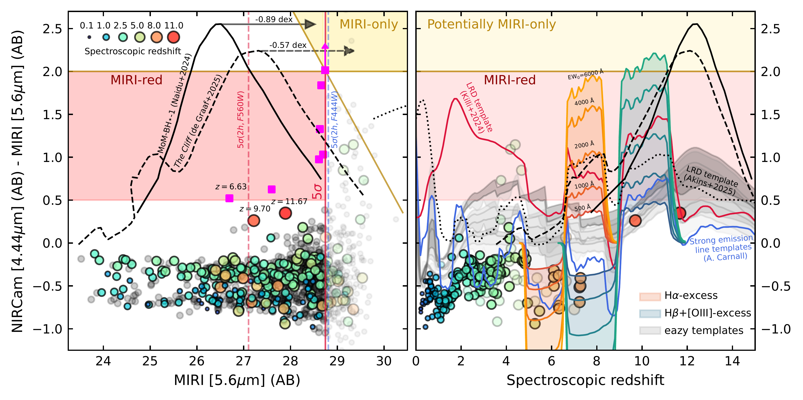
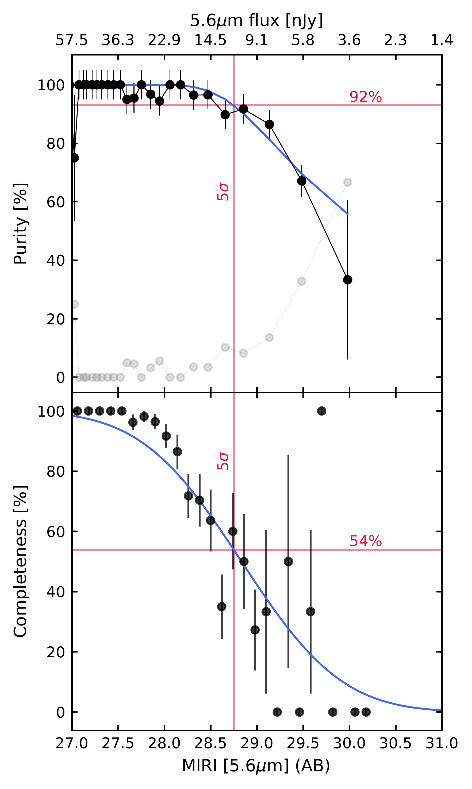

$\newcommand{\ensuremath}{}$
$\newcommand{\xspace}{}$
$\newcommand{\object}[1]{\texttt{#1}}$
$\newcommand{\farcs}{{.}''}$
$\newcommand{\farcm}{{.}'}$
$\newcommand{\arcsec}{''}$
$\newcommand{\arcmin}{'}$
$\newcommand{\ion}[2]{#1#2}$
$\newcommand{\textsc}[1]{\textrm{#1}}$
$\newcommand{\hl}[1]{\textrm{#1}}$
$\newcommand{\footnote}[1]{}$
$\newcommand{\red}[1]{{\color{red}#1}}$
$\newcommand{\blue}[1]{{\color{blue}#1}}$
$\newcommand{\purple}[1]{{\color{purple}#1}}$
$\newcommand{\pink}[1]{{\color{pink}#1}}$
$\newcommand{\green}[1]{{\color{green}#1}}$
$\newcommand{\arcsecs}{\mbox{^{\prime\prime}}}$
$\newcommand{\Msolar}{\mbox{\rm M_{\odot} }}$
$\newcommand{\orcid}[1]{\includegraphics[scale=0.06]{Figures/ORCID-iD_icon-128x128.png} \href{https://orcid.org/#1}{#1}}$
$\newcommand{\gs}{\mathrel{\raise0.35ex\hbox{\scriptstyle >}\kern-0.6em \lower0.40ex\hbox{{\scriptstyle \sim}}}}$
$\newcommand{\ls}{\mathrel{\raise0.35ex\hbox{\scriptstyle <}\kern-0.6em \lower0.40ex\hbox{{\scriptstyle \sim}}}}$

# MIDIS: The identification of deep MIRI-red sources as candidates for extreme Balmer-break and line emitting galaxies at high-$z$

<mark>Appeared on: 2026-02-20</mark> -  _19 pages, 23 figures, submitted to A&A_

I. Jermann, et al. -- incl., <mark>F. Walter</mark>, <mark>T. Henning</mark>

**Abstract:** We investigate the detection and nature of 5.6 $\mu$ m MIRI-red sources in the MIRI Deep Imaging Survey (MIDIS), covering 2.4 arcmin $^2$ in the Hubble Ultra Deep Field. MIDIS is the deepest _JWST_ /MIRI survey to date, probing the faintest limits and enabling the study of rare galaxy populations at high redshift. We define MIRI-red sources as detected at $5\sigma$ significance in MIRI/F560W with red colors: $m_{\rm F444W}-m_{\rm F560W} \geq 0.5$ . We characterize the MIDIS background to assess the effective depth and noise properties of faint MIRI detections, finding that pipeline uncertainties lead to a systematic overestimation of the signal-to-noise ratio by a factor of $\sim 3$ . Using an empirical methodology, we estimate the purity and completeness of MIRI detections and find that a $5\sigma$ detection at 28.75 mag has a purity of 92 \% and a completeness of 54 \% . We identify seven MIRI-red galaxy candidates, including an F115W dropout consistent with a high-redshift galaxy candidate. We explore possible physical origins for the MIRI-red population, including active galactic nuclei, dust-obscured galaxies, extreme emission-line galaxies, evolved stellar populations, and Little Red Dots (LRDs). Given the proximity of the F444W and F560W filters and the depth of MIDIS, we find that MIRI-red galaxy candidates are consistent with either emission-line galaxies with $EW_0({\rm H\alpha})\geq 750$ Å or $EW_0{(\rm H\beta+[OIII])}\geq 600$ Å, or high-redshift Balmer breaks of at least 1.6. We additionally discuss the extreme case of a MIRI-red galaxy candidates undetected in F444W, a potential MIRI-only source, for which we derive extreme line strengths of $EW_0({\rm H\alpha})\sim6000$ Å and $EW_0({\rm H\beta+[OIII]}) \sim 4000$ Å, or high- $z$ LRD analogs exhibiting Balmer breaks of 6.3. Finally, we find fewer MIRI-red detections than expected from extrapolations of the H $\alpha$ or H $\beta$ + [ OIII ] emitter line luminosity functions, consistent with previous deep searches, while the absence of $z>10$ LRD candidates is consistent with theoretical expectations for the MIDIS survey volume.

**Figure 11. -** NIRCam/F444W$-$MIRI/F560W colors of MIRI detections in the MIDIS Deep survey with F560W magnitudes $>23.5$ mag, shown as a function of F560W magnitude in the left panel and spectroscopic redshift in the right panel. The red and golden shaded region indicates the color space occupied by MIRI-red and potential MIRI-only sources. (*fig:ColorPlot*)

**Figure 10. -**  Eazy SED fit of the MIRI-red galaxy candidates sample including the deep F770W and F1000W data from MIDIS-red. In Appendix \ref{sec:AppendixD_SED}, we show the same figure without MIDIS-red data. Interestingly, without the MIDIS-red data, MIRI-red candidate with ID=205 shows H$\alpha$ emission line in F560W instead of F770W, as it is not constrained without the MIDIS-red observations. In Appendix \ref{sec:AppendixD_SED} are the photometric redshift probability distribution corresponding to all the fits.  (*fig:MIRIonly_red_SED*)

**Figure 4. -**  Purity and completeness of the MIDIS Deep survey (excluding detection brighter than 23.5 mag) as a function of MIRI 5.6 $\mu$m magnitude and flux. At a $5\sigma$ detection threshold, the survey reaches 92\% purity and 54\% completeness.
    (*fig:MIRIpurity*)

