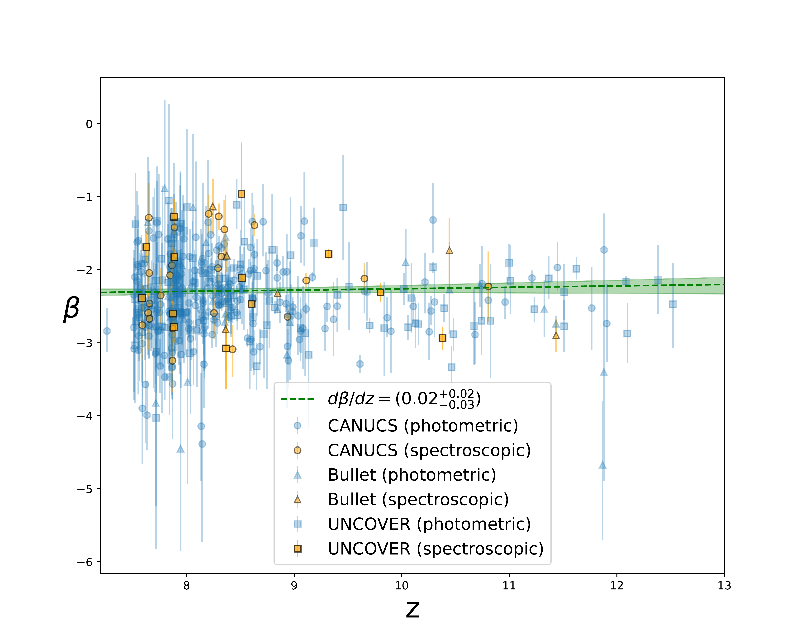
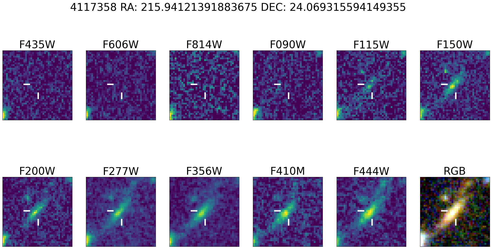
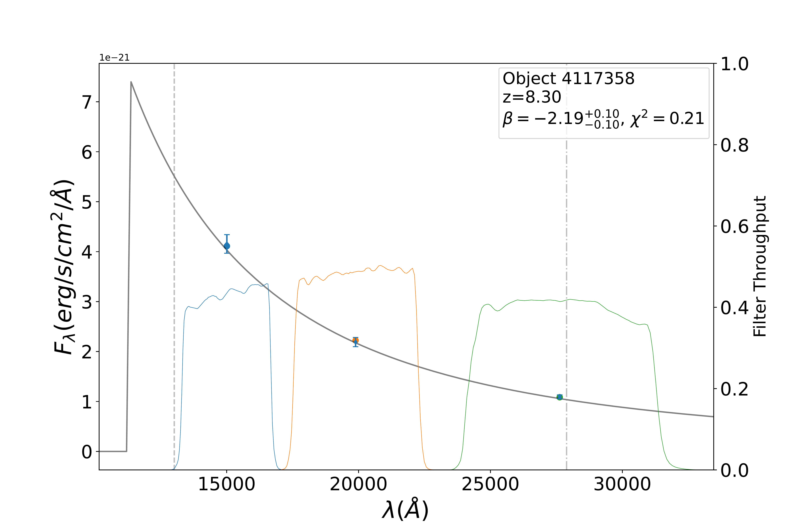
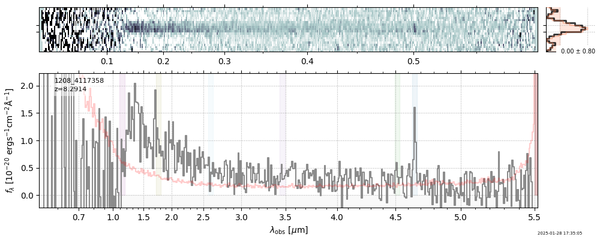
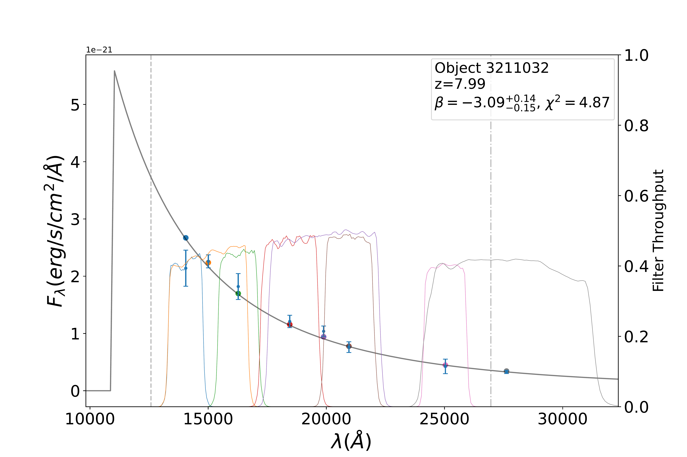

$\newcommand{\ensuremath}{}$
$\newcommand{\xspace}{}$
$\newcommand{\object}[1]{\texttt{#1}}$
$\newcommand{\farcs}{{.}''}$
$\newcommand{\farcm}{{.}'}$
$\newcommand{\arcsec}{''}$
$\newcommand{\arcmin}{'}$
$\newcommand{\ion}[2]{#1#2}$
$\newcommand{\textsc}[1]{\textrm{#1}}$
$\newcommand{\hl}[1]{\textrm{#1}}$
$\newcommand{\footnote}[1]{}$
$\newcommand{\angstrom}{\textup{Å}}$

# UV slopes of Starforming Galaxies in Strong Lensing fields at the Epoch of Reionization with JWST

<mark>Appeared on: 2026-02-20</mark> -  _9 pages, 6 figures, 2 tables, submitted to A&A_

G. Felicioni, et al. -- incl., <mark>J. Matharu</mark>

**Abstract:** UV slopes ( $\beta$ ) are a powerful diagnostics for galaxies at the epoch of reionization, tracing star formation, ISM ionization, and the escape fraction $f_{esc}$ of ionizing photons. Studies at low and intermediate $z$ find suggest a gradual reddening of the UV slope with time and steeper slopes for fainter galaxies. With the James Webb Space Telescope ( _JWST_ ), it has been possible to measure the UV slope for statistically significant samples of galaxies deep into the EoR, up to redshift $z\gtrsim10$ and for increasingly faint galaxies. Recent studies of $\beta$ with JWST at $z>7$ reveal a flattening of the trend of the UV slope with respect to redshift and UV magnitude. We want to measure $\beta$ at $z>7.5$ using the strong lensing around massive galaxy clusters to observe high-redshift and faint galaxies. The low-brightness regime is of particular interest for reionization, as most of the recent models of this process posit that numerous faint galaxies are the prime drivers of reionization We use NIRCam and NIRSpec observations from CANUCS, Technicolor, JUMPS, Silver Bullet, UNCOVER and MEGASCIENCE across 7 strong lensing fields in order to find galaxies down to $M_{UV}\sim-16$ and $7.5<z\lesssim12.5$ . We measure their $\beta$ with a forward-modelling procedure. We estimate the $f_{esc}$ of a subsample with emission line data using a relation with UV slope, galaxy size and H $\beta$ equivalent width (EWH $\beta$ ) calibrated from a low-redshift sample. We find 378 visually confirmed galaxies, including 45 with a spectrum. We obtain an average UV slope $<\beta>=-2.3\pm0.4$ , an average redshift $<z>=8.5\pm1.0$ , and an average AB magnitude $M_{UV}=-18\pm1$ . We find no significant evolution of $\beta$ across our redshift range, suggesting a flattening of the $\beta-z$ trend above $z\sim7.5$ . We find a weak trend between $\beta$ and $M_{UV}$ . For a subsample of 14 galaxies with emission line data we estimate an average $f_{esc}=0.26\pm0.22$ The flat trend of $\beta$ at $z>7.5$ indicates a  similarity in average galaxy properties between $300$ and $600 Myr$ after the Big Bang. The weak trend between $\beta$ and $M_{UV}$ suggests an analogous composition for low- and high-mass galaxies' ISM, likely due to a lack of time to build up a dust reservoir. The average $f_{esc}$ is high for what is necessary to achieve an ionized IGM by $z\sim6$ , but the extrapolation model from a low-redshift sample may be overestimating its value.

**Figure 4. -** $\beta-z$ diagram for our high-redshift sample. Objects for which only photometric estimates of $\beta$ are available are plotted in blue, and spectral estimates of $\beta$ are in orange; for objects that have both we only plot spectral estimates. A linear fit of the trend and its shaded 1-$\sigma$ confidence level, obtained via a bootstrap method, is also represented. (*fig:beta-z*)

**Figure 1. -** _Top panel_: NIRCam and ACS images of an example object (CANUCS ID 4117358) in the MACS1423 cluster in the CLU pointing, in all of the filters available for this pointing.\ _Middle_: NIRCam photometry overlaid with the throughput of each NIRCam filter, with the fitted $\beta$ slope in yellow. The JWST filters' throughput functions are also overlaid in different colours. Vertical dashed (dotted) lines represent the lower (upper) limit for the filters to be used. A hard limit for the lower wavelength threshold, and a soft limit, only limiting the filter's pivot wavelength, for the upper threshold, were applied; in this case, the F150W, F200W and F277W filters were used to fit the UV slope.\ _Bottom panel:_ 2D and 1D spectrum for the same object. In the 1D spectrum, the gray line represents the signal, while the red line represents the noise at each wavelength of the spectrum. (*fig:placeholder*)

**Figure 2. -** Example of a galaxy at $z=7.87$ from the NCF pointing of the MACS0416 field, whose $\beta$ was calculated from 8 NIRCam filters: F140M, F150W, F162M, F182M, F200W, F210M, and F250M (*fig:8_filters*)

