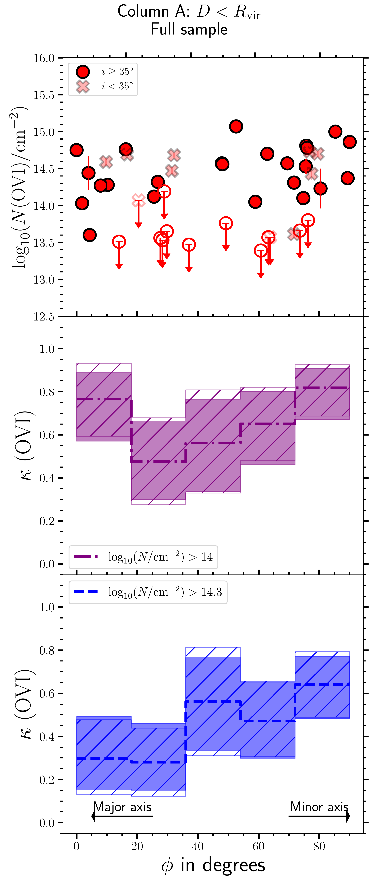
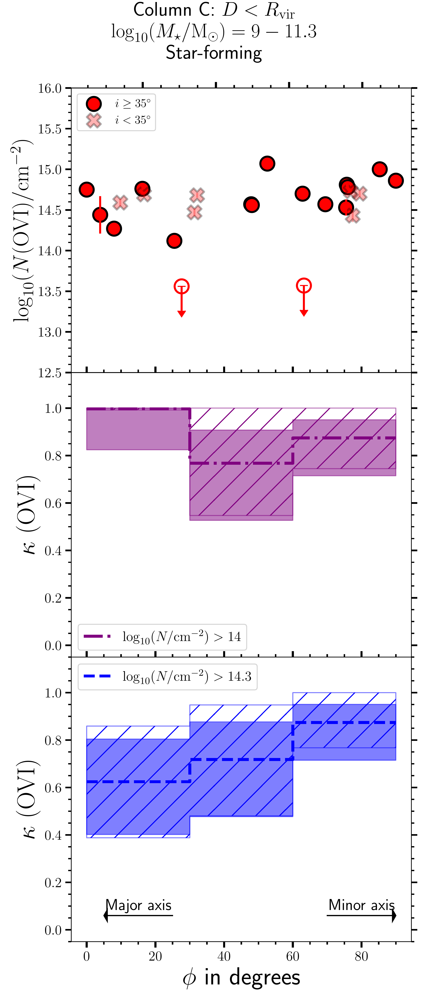
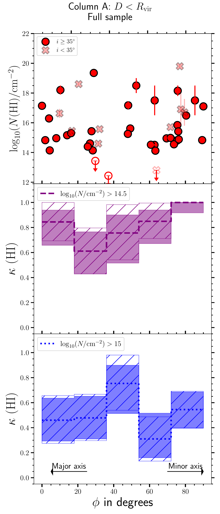
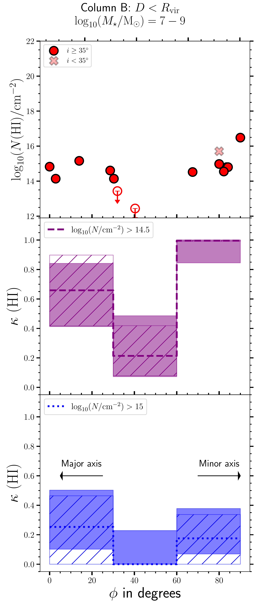
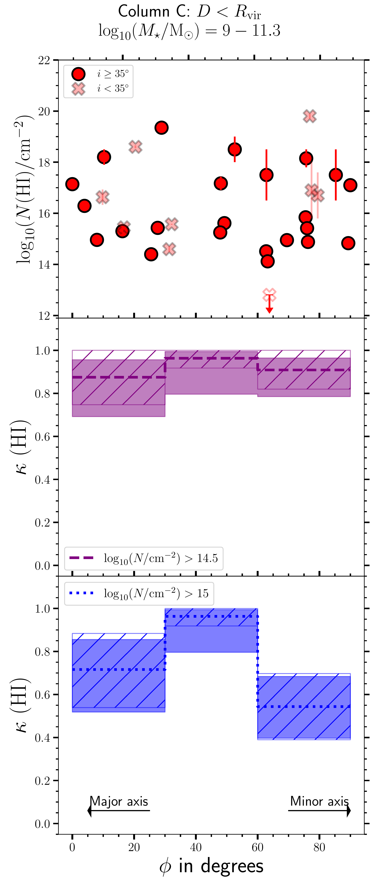
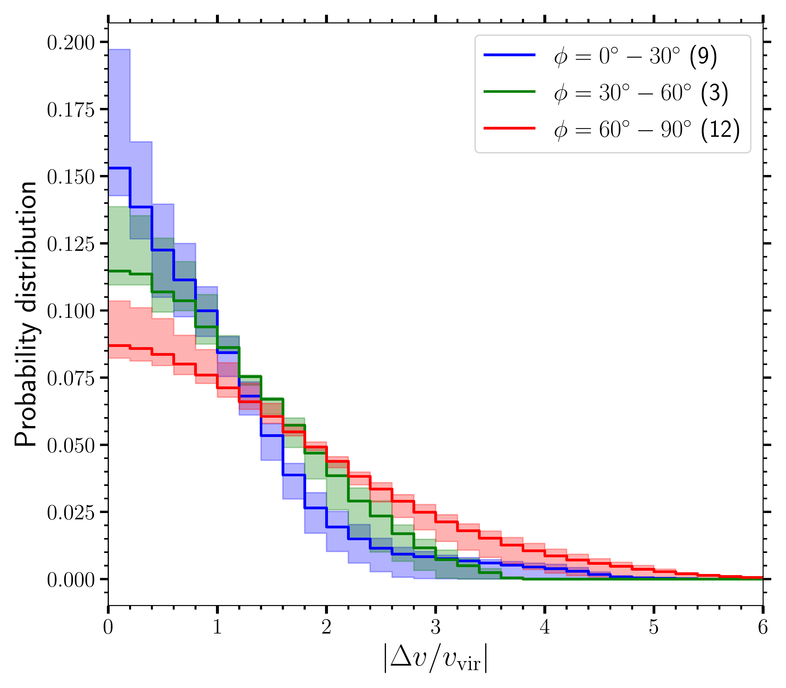

$\newcommand{\ensuremath}{}$
$\newcommand{\xspace}{}$
$\newcommand{\object}[1]{\texttt{#1}}$
$\newcommand{\farcs}{{.}''}$
$\newcommand{\farcm}{{.}'}$
$\newcommand{\arcsec}{''}$
$\newcommand{\arcmin}{'}$
$\newcommand{\ion}[2]{#1#2}$
$\newcommand{\textsc}[1]{\textrm{#1}}$
$\newcommand{\hl}[1]{\textrm{#1}}$
$\newcommand{\footnote}[1]{}$
$\newcommand{\vdag}{(v)^\dagger}$
$\newcommand$
$\newcommand$
$\newcommand{\sqcm}{cm^{-2}}$
$\newcommand{\kms}{\rm km~s^{-1}}$
$\newcommand{\lya}{Ly\alpha}$
$\newcommand{\lyb}{Ly\beta}$
$\newcommand{\lyg}{Ly\gamma}$
$\newcommand{\lyd}{Ly\delta}$
$\newcommand{\HeI}{\mbox{He {\sc i}}}$
$\newcommand{\HeII}{\mbox{He {\sc ii}}}$
$\newcommand{\HI}{\mbox{H {\sc i}}}$
$\newcommand{\Nhi}{N_{\footnotesize{\HI}}}$
$\newcommand{\Nhic}{N_{\footnotesize{\HI}}^{c}}$
$\newcommand{\logNhic}{{\rm log}_{10}(\Nhic/{\rm cm}^{-2})}$
$\newcommand{\logNhi}{{\rm log}_{10}(\Nhi/{\rm cm}^{-2})}$
$\newcommand{\Nhisys}{N_{\footnotesize{\HI}}^{\rm sys}}$
$\newcommand{\HII}{\mbox{H {\sc ii}}}$
$\newcommand{\HH}{\mbox{H{_2}}}$
$\newcommand{\hh}{\mbox{\tiny H{_2}}}$
$\newcommand{\hi}{\mbox{\tiny H{\sc i}}}$
$\newcommand{\OI}{\mbox{O {\sc i}}}$
$\newcommand{\OII}{\mbox{O {\sc ii}}}$
$\newcommand{\OIII}{\mbox{O {\sc iii}}}$
$\newcommand{\OIV}{\mbox{O {\sc iv}}}$
$\newcommand{\OV}{\mbox{O {\sc v}}}$
$\newcommand{\OVI}{\mbox{O {\sc vi}}}$
$\newcommand{\OVII}{\mbox{O {\sc vii}}}$
$\newcommand{\OVIII}{\mbox{O {\sc viii}}}$
$\newcommand{\CaVIII}{\mbox{Ca {\sc viii}}}$
$\newcommand{\CaVII}{\mbox{Ca {\sc vii}}}$
$\newcommand{\CaVI}{\mbox{Ca {\sc vi}}}$
$\newcommand{\CaV}{\mbox{Ca {\sc v}}}$
$\newcommand{\CIV}{\mbox{C {\sc iv}}}$
$\newcommand{\CV}{\mbox{C {\sc v}}}$
$\newcommand{\CVI}{\mbox{C {\sc vi}}}$
$\newcommand{\CII}{\mbox{C {\sc ii}}}$
$\newcommand{\CI}{\mbox{C {\sc i}}}$
$\newcommand{\CIIs}{\mbox{C {\sc ii}}^\ast}$
$\newcommand{\CIII}{\mbox{C {\sc iii}}}$
$\newcommand{\SiI}{\mbox{Si {\sc i}}}$
$\newcommand{\SiII}{\mbox{Si {\sc ii}}}$
$\newcommand{\SiIII}{\mbox{Si {\sc iii}}}$
$\newcommand{\SiIV}{\mbox{Si {\sc iv}}}$
$\newcommand{\SiXII}{\mbox{Si {\sc xii}}}$
$\newcommand{\SV}{\mbox{S {\sc v}}}$
$\newcommand{\SIV}{\mbox{S {\sc iv}}}$
$\newcommand{\SIII}{\mbox{S {\sc iii}}}$
$\newcommand{\SII}{\mbox{S {\sc ii}}}$
$\newcommand{\SI}{\mbox{S {\sc i}}}$
$\newcommand{\ClI}{\mbox{Cl {\sc i}}}$
$\newcommand{\ArI}{\mbox{Ar {\sc i}}}$
$\newcommand{\NI}{\mbox{N {\sc i}}}$
$\newcommand{\NII}{\mbox{N {\sc ii}}}$
$\newcommand{\NIII}{\mbox{N {\sc iii}}}$
$\newcommand{\NIV}{\mbox{N {\sc iv}}}$
$\newcommand{\NV}{\mbox{N {\sc v}}}$
$\newcommand{\PV}{\mbox{P {\sc v}}}$
$\newcommand{\PII}{\mbox{P {\sc ii}}}$
$\newcommand{\PIII}{\mbox{P {\sc iii}}}$
$\newcommand{\PIV}{\mbox{P {\sc iv}}}$
$\newcommand{\NeVIII}{\mbox{Ne {\sc viii}}}$
$\newcommand{\ArVIII}{\mbox{Ar {\sc viii}}}$
$\newcommand{\NeV}{\mbox{Ne {\sc v}}}$
$\newcommand{\NeVI}{\mbox{Ne {\sc vi}}}$
$\newcommand{\NeX}{\mbox{Ne {\sc x}}}$
$\newcommand{\NaIX}{\mbox{Na {\sc ix}}}$
$\newcommand{\MgII}{\mbox{Mg {\sc ii}}}$
$\newcommand{\FeII}{\mbox{Fe {\sc ii}}}$
$\newcommand{\MgX}{\mbox{Mg {\sc x}}}$
$\newcommand{\AlXI}{\mbox{Al {\sc xi}}}$
$\newcommand{\FeIII}{\mbox{Fe {\sc iii}}}$
$\newcommand{\NaI}{\mbox{Na {\sc i}}}$
$\newcommand{\CaII}{\mbox{Ca {\sc ii}}}$
$\newcommand{\zabs}{z_{\rm abs}}$
$\newcommand{\zmin}{z_{\rm min}}$
$\newcommand{\zmax}{z_{\rm max}}$
$\newcommand{\zqso}{z_{\rm qso}}$
$\newcommand{\zlae}{z_{\rm peak}}$
$\newcommand{\zcorr}{z_{\rm corr}}$
$\newcommand{\voff}{V_{\rm offset}}$
$\newcommand{\rew}{W_{r}}$
$\newcommand{\rewf}{W_{r,500}}$
$\newcommand{\rewt}{W_{r,300}}$
$\newcommand{\logm}{{\rm log}_{10}(M_{\star}/\rm M_{\odot})}$
$\newcommand{\Msun}{\rm M_{\odot}}$
$\newcommand{\logn}{{\rm log}_{10}(N/\rm cm^{-2})}$
$\newcommand{\lognovi}{\rm log_{10}(N_{OVI}/cm^{-2})}$
$\newcommand{\loghi}{{\rm log}_{10}(N(\HI)/{\rm cm}^{-2})}$
$\newcommand{\novi}{N_{O\mbox{\sc vi}}}$
$\newcommand{\novie}{N_{O\mbox{\sc vi}}}$
$\newcommand{\movi}{M_{O\mbox{\sc vi}}}$
$\newcommand{\movie}{M_{O\mbox{\sc vi}}}$
$\newcommand{\kHI}{\mbox{\kappa_{\tt H I}}}$
$\newcommand{\kOVI}{\mbox{\kappa_{\tt O VI}}}$
$\newcommand{\blue}{\color{blue}}$
$\newcommand$
$\newcommand$
$\newcommand$
$\newcommand$

# MUSEQuBES: Probing Anisotropies in Gas and Metal Distributions in the Circumgalactic Medium

<mark>Appeared on: 2026-02-20</mark> -  _Submitted to ApJ. Comments are welcome_

S. Dutta, et al. -- incl., <mark>J. Braspenning</mark>

**Abstract:** $\noindent$ We investigate the azimuthal dependence of $\HI$ and $\OVI$ -bearing gas in the circumgalactic medium (CGM) of 113 isolated galaxies in the redshift range $0.12<z<0.75$ , including 91 new measurements from the MUSE Quasar-fields Blind Emitters Survey (MUSEQuBES).The $\HI$ covering fraction ( $\kHI$ ) within the virial radius ( $R_{\rm vir}$ ) of low-mass ( $7<$ $\logm$  $\leq 9$ ) galaxies, for a threshold column density of ${\rm log}_{10}(N(\HI)/{\rm cm}^{-2})=14.5$ , exhibits an enhancement along both the disk plane (azimuthal angle $\phi\lesssim20^{\circ}$ ) and in the polar direction ( $\phi\gtrsim70^{\circ}$ ). In contrast, such a bimodal distribution is not observed for higher mass galaxies ( $9<$ $\logm$  $\leq 11.3$ ).Similarly, the $\OVI$ covering fraction ( $\kOVI$ ), for a threshold of ${\rm log}_{10}(N(\OVI)/{\rm cm}^{-2})=14.0$ , shows a tentative enhancement along both the projected major and minor axes for low-mass galaxies. In contrast, $\OVI$ -bearing gas around higher-mass galaxies appears more uniformly distributed, with no significant azimuthal dependence.Finally, using the halo circular-velocity-normalized pixel-velocity two-point correlation function (TPCF), we find that $\OVI$ absorbers are kinematically narrower along the disk plane compared to the polar directions of the host galaxies with similar stellar mass distributions.The observed isotropic distribution of $\OVI$ in high-mass halos suggests that its spatial distribution is governed by global halo properties; however, the $\OVI$ kinematics retain memory of the site of origin.

**Figure 15. -** Same as Fig. \ref{fig:hi_all} but for $\OV$I. The column density thresholds are $N($\OV$I)=10^{14} {\rm cm}^{-2}$ and $N($\OV$I)=10^{14.3} {\rm cm}^{-2}$ in the {\tt middle} and {\tt bottom} panels, respectively. In {\tt Columns B} and {\tt C}, only star-forming galaxies are selected.  (*fig:ovi_all*)

**Figure 14. -** {\tt Column A, Top:} The red solid and open circles show the detected $N($\HI$)$ and $3\sigma$ upper limits for non-detections, respectively, plotted against the most probable $\phi$ for galaxies with $D<R_{\rm vir}$. The red crosses indicate the discarded face-on galaxies with most probable $i<35^{\circ}$. {\tt Column A, Middle:} The $\HI$ covering fraction ($\kHI$) for a threshold $N($\HI$)=10^{14.5} {\rm cm}^{-2}$ plotted against $\phi$ for the galaxy sample shown in the left panel (discarding the face-on galaxies). The shaded and hatched regions represent the 68\% Wilson score interval and 68\% confidence interval obtained from 10000 bootstrap realizations of the galaxy sample, respectively. {\tt Column A, Bottom:} Same as {\tt middle}, but for a threshold $N($\HI$)=10^{15} {\rm cm}^{-2}$. No significant $\phi$ dependence is seen in any of these panels. {\tt Columns B} and {\tt C} is same as {\tt Column A} but for dwarf ($\logm$$\approx7-9$) and massive ($\logm$$\approx 9-11.3$) galaxies, respectively. A marginal reduction in $\kHI$ is seen for the intermediate $\phi$ bin for the dwarf galaxies ({\tt Column B}). However, the $\kHI$ for more massive galaxies does not exhibit any significant azimuthal dependence ({\tt Column C}).  (*fig:hi_all*)

**Figure 3. -** The $v_{\rm vir}-$normalized pixel-velocity two-point correlation functions (TPCFs) for $\OV$I absorbers associated with $D<R_{\rm vir}$ galaxies
    for three bins of azimuthal angle as indicated by the legends. The shaded regions represent the 1$\sigma$ confidence intervals obtained from 200 bootstrap realizations. The numbers in the parentheses indicate the number of galaxies contributing to the plot.
    Face-on galaxies with $i<35^{\circ}$ are excluded. (*fig:ovi_kin*)

