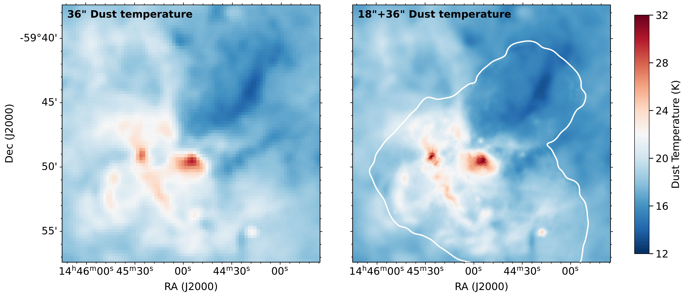
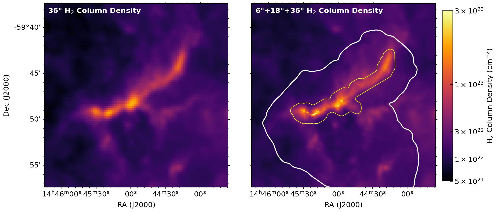
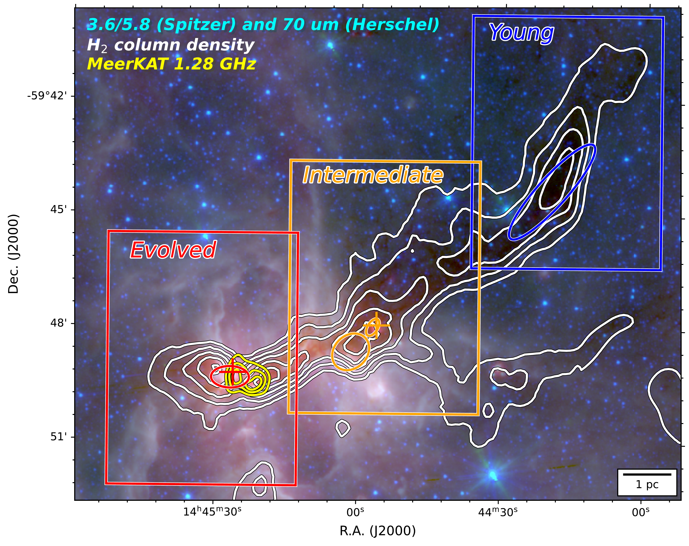
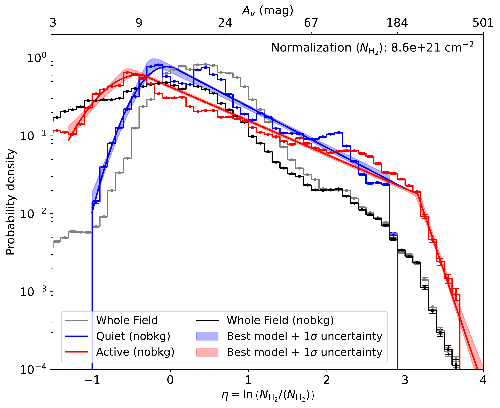

$\newcommand{\ensuremath}{}$
$\newcommand{\xspace}{}$
$\newcommand{\object}[1]{\texttt{#1}}$
$\newcommand{\farcs}{{.}''}$
$\newcommand{\farcm}{{.}'}$
$\newcommand{\arcsec}{''}$
$\newcommand{\arcmin}{'}$
$\newcommand{\ion}[2]{#1#2}$
$\newcommand{\textsc}[1]{\textrm{#1}}$
$\newcommand{\hl}[1]{\textrm{#1}}$
$\newcommand{\footnote}[1]{}$
$\newcommand$
$\newcommand$
$\newcommand{\micron}{\mbox{\mum}}$
$\newcommand$
$\newcommand{\gpsc}{\mbox{g~cm^{-2}}}$
$\newcommand{\massrate}{\mbox{M_{\odot} \mathrm{yr}^{-1}}}$
$\newcommand{\kms}{\mbox{km s^{-1}}}$
$\newcommand{ç}{\mbox{cm^{-3}}}$
$\newcommand{\lsun}{\mbox{L_\odot}}$
$\newcommand{\msun}{\mbox{M_\odot}}$
$\newcommand{\lmsun}{\mbox{L_\odot/M_\odot}}$
$\newcommand{\jybeam}{\mbox{Jy beam^{-1}}}$
$\newcommand{\mjybeam}{\mbox{mJy beam^{-1}}}$
$\newcommand{\ujybeam}{\mbox{\muJy beam^{-1}}}$
$\newcommand{\sqc}{\mbox{cm^{-2}}}$
$\newcommand{\um}{\mbox{\mum}}$
$\newcommand{\vlsr}{\mbox{V_\text{lsr}}}$
$\newcommand{\meth}{\mbox{CH_3OH}}$
$\newcommand{\clt}{\mbox{class {\sc ii}}}$
$\newcommand{\co}{\mbox{^{12}CO}}$
$\newcommand{\coto}{\mbox{^{12}CO 2--1}}$
$\newcommand{\tco}{\mbox{^{13}CO}}$
$\newcommand{\ceo}{\mbox{C^{18}O}}$
$\newcommand{\fmh}{\mbox{H_2CO}}$
$\newcommand{\httco}{\mbox{H_2^{13}CO}}$
$\newcommand{\mthc}{\mbox{CH_3CN}}$
$\newcommand{\cyacet}{\mbox{HC_3N}}$
$\newcommand{çtht}{\mbox{c-C_3H_2}}$
$\newcommand{\water}{\mbox{H_2O}}$
$\newcommand{\amm}{\mbox{NH_3}}$
$\newcommand{\ammone}{\mbox{\amm  (1, 1)}}$
$\newcommand{\ammtwo}{\mbox{\amm  (2, 2)}}$
$\newcommand{\ammthree}{\mbox{\amm  (3, 3)}}$
$\newcommand{\nthp}{\mbox{N_2H^+}}$
$\newcommand{\ntdp}{\mbox{N_2D^+}}$
$\newcommand{\htcop}{\mbox{H^{13}CO^+}}$
$\newcommand{\hcop}{\mbox{HCO^+}}$
$\newcommand{\hta}{\mbox{H30\alpha}}$
$\newcommand{\sectionautorefname}{Section}$
$\newcommand{\subsectionautorefname}{Section}$
$\newcommand{\subsubsectionautorefname}{Section}$
$\newcommand{\figureautorefname}{Figure}$
$\newcommand{\tableautorefname}{Table}$
$\newcommand{\arraystretch}{1.2}$

# Linear filament and nested cluster evolution tomography (LANCET): I. Capture the evolution of dense gas in 14-parsec filament G316.8

<mark>Appeared on: 2026-02-23</mark> -  _12 pages, 8 figures. Accepted for publication in A&A_

<mark>F. Xu</mark>, et al. -- incl., <mark>S. Jiao</mark>

**Abstract:** A dynamic view of mass assembly is essential for understanding the formation of massive stars and clusters. However, interpreting evolutionary diagnostics from Galactic-wide surveys requires careful consideration of distance and environmental variations. The G316.8 filament provides an excellent controlled case: a 14-parsec, nearly linear structure comprising three contiguous subregions with comparable molecular gas reservoirs (each $\sim\!10{,}000$  $\msun$ ), yet spanning a clear evolutionary sequence from a northern infrared dark cloud (young) through a central massive young stellar object (intermediate), to a southern H ${\sc ii}$ region (evolved). The $_ Linear filament and nested cluster evolution tomography_$ (LANCET) project mapped the entire G316.8 filament with the Atacama Compact Array (ACA) at 1.3 mm, achieving $6\arcsec$ (0.08 pc) resolution over $26.7$ arcmin $^2$ (17.1 pc $^2$ ). By combining ACA 7m data with _Herschel_ and APEX/ArTéMiS observations, we produced high-resolution temperature and column-density maps. We quantified subregional differences using (i) dense-fragment statistics, (ii) column-density probability distribution functions (N-PDFs), and (iii) the scale-dependent structural diagnostic, the $\Delta$ -variance. From young to intermediate to evolved, the maximum fragment mass increases from 8 to 160 to 490 $M_\odot$ , while the dense-gas mass fraction ( $>0.5$ g cm $^{-2}$ ) rises from $0.4\%$ to $2.3\%$ to $9.6\%$ . Along this sequence, the N-PDF develops a slightly flatter primary power-law tail and an additional, steeper secondary tail; the $\Delta$ -variance slope becomes progressively shallower. Across G316.8, the subregional differences consistently indicate a coherent evolutionary trend of massive star formation, in which gas is continuously assembled into sub-parsec dense structures. The forthcoming 12m array observations are about to extend this dynamic picture by resolving dense core formation and probing gas kinematics and magnetic fields.

**Figure 7. -** Comparison between low-resolution and multi-resolution maps of dust temperature (upper) and $H_2$ column density (lower). The white and yellow polygons indicate the fields of view of the APEX and our ACA 7m observations, respectively. For the temperature image, the resolution is 18$\farcs$2 inside and 36$\farcs$3 outside the white closed polygon. For the column density image, the resolution outside the yellow closed polygon is the same as the temperature map but as high as $6$\arcsec$$ within the yellow closed polygon. (*fig:multires*)

**Figure 6. -** Background color map composites of _Spitzer_ 3.6 and 5.8 $\mu$m and _Herschel_ 70 $\mu$m images. The overlaid white contours show the high-resolution $H_2$ column density map obtained from Sect. \ref{result:sed} with levels of 3.0, 5.0, 8.0, 12.6, and $20.0 \times 10^{22}$ cm$^{-2}$.
The blue, orange, and red boxes outline the young, intermediate, and evolved parts, respectively. Massive clumps embedded in each part are shown with color ellipses. The yellow contours show MeerKAT 1.28 GHz continuum emission at levels of 100, 180, and 260 $\mjybeam$(8$\arcsec$). The orange cross shows the G316.763$-$0.011 maser spot for OH and $H_2$O, while the red cross shows the G316.812$-$0.057 maser spot for OH, $CH_3$OH, and $H_2$O. (*fig:overview*)

**Figure 2. -** N-PDFs for the entire region before and after background subtraction shown in gray and black. N-PDFs for the northern quiet and southern active parts are shown in blue and red. The best-fitting models and their posterior $1\sigma$ confidence intervals are shown with lines and shading. Visual extinction is also shown on the top axis. (*fig:npdf*)

