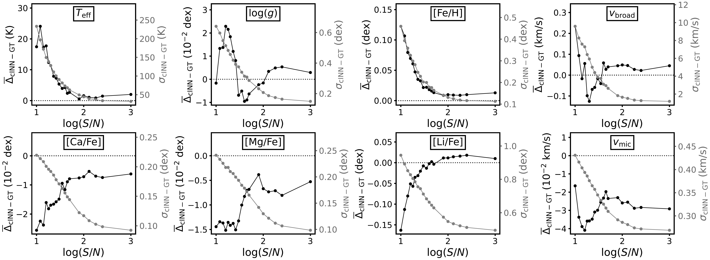

$\newcommand{\ensuremath}{}$
$\newcommand{\xspace}{}$
$\newcommand{\object}[1]{\texttt{#1}}$
$\newcommand{\farcs}{{.}''}$
$\newcommand{\farcm}{{.}'}$
$\newcommand{\arcsec}{''}$
$\newcommand{\arcmin}{'}$
$\newcommand{\ion}[2]{#1#2}$
$\newcommand{\textsc}[1]{\textrm{#1}}$
$\newcommand{\hl}[1]{\textrm{#1}}$
$\newcommand{\footnote}[1]{}$
$\newcommand{\teff}{T_{\rm eff}}$
$\newcommand{\logteff}{\log(T_\mathrm{eff}/\mathrm{K})}$
$\newcommand{\logg}{\log(g)}$
$\newcommand{\vmic}{v_{\rm mic}}$
$\newcommand{\vmac}{v_{\rm mac}}$
$\newcommand{\vbroad}{v_\mathrm{broad}}$
$\newcommand{\logvbroad}{\log(v_\mathrm{broad}/\mathrm{km s}^{-1})}$
$\newcommand{\feh}{[Fe/H]}$

# A method to derive self-consistent NLTE astrophysical parameters for 4 million high-resolution 4MOST stellar spectra in half a day with invertible neural networks

<mark>Appeared on: 2026-02-23</mark> -  _25 pages, 14 figures, 7 tables, accepted for publication in Astronomy & Astrophysics_

V. F. Ksoll, et al. -- incl., <mark>N. Storm</mark>, <mark>M. Bergemann</mark>, <mark>G. Guiglion</mark>

**Abstract:** Modern spectroscopic surveys obtain spectra for millions of stars. However, classical spectroscopic methods can often be computationally expensive, rendering them impractical for the analysis of large datasets. We introduce a novel simulation-based deep-learning approach for the efficient analysis of high-resolution stellar spectra to be obtained with the upcoming high-resolution 4MOST spectrograph. We used a suite of synthetic non-local thermodynamic equilibrium (NLTE) spectra generated with Turbospectrum to mimic 4MOST observations and trained a conditional invertible neural network (cINN) for the purpose of predicting self-consistently stellar surface parameters and chemical abundances. The cINN is a neural network architecture that estimates full posterior distributions for the target stellar properties, providing an intrinsic uncertainty estimate.   We evaluated the predictive performance of the trained cINN model on both synthetic data and observed spectra of stars. We found that our new cINN trained on NLTE synthetic spectra is capable of recovering stellar parameters with average errors ( $\sigma$ ) of $33$ K for $\teff$ , $0.16$ dex for $\logg$ , and $0.12$ dex for [ Fe/H ] , $0.1$ dex for [ Ca/Fe ] , $0.11$ for [ Mg/Fe ] , and $0.51$ dex for [ Li/Fe ] , respectively, at a signal to noise ratio of 250 per Angstrom. From the analysis of the observed spectra of Gaia-ESO / 4MOST / PLATO benchmark stars, we verified that our NLTE estimates for stellar parameters and abundances are consistent with results obtained with the independent code TSFitPy. We conclude that the NLTE cINN is robust and can, theoretically, evaluate 4 million high-resolution 4MOST spectra in less than a day, using GPU acceleration.

**Figure 4. -** Summary of cINN performance on synthetic spectra as a function of S/N. In each panel, the mean residual $\overline{\Delta}_\mathrm{cINN-GT}$ is plotted in black on the left y-axis scale, while the standard deviation $\sigma_\mathrm{cINN-GT}$ is indicated in grey and plotted on the right y-axis scale. The black dotted line indicates, where $\overline{\Delta}_\mathrm{cINN-GT} = 0$ for reference. For more details see Table \ref{tab:me_summary} and Fig. \ref{fig:Synth_ME_SIGMA_vs_SNR_DETAILED} in the Appendix. (*fig:Synth_ME_SIGMA_vs_SNR*)

**Figure 7. -** Comparison of the 4MOST-ified input spectra to model spectra corresponding to the cINN MAP estimates for four low-metallicity stars, focusing on prominent absorption lines of Mg, Ca, Li and Fe. We note that the resimulation employed all 13 stellar parameters predicted by the cINN, but used the bias correction from Sect. \ref{sec:results_benchmark} only for the abundances of Ca, Mg, Li and Fe (see also Table \ref{tab:calib_coeff}). (*fig:resim_Mg_Ca_Li*)

**Figure 9. -** Overview of the median width of the 68\% confidence interval for the individual components of the predicted posterior distributions as a function of the S/N ratio. The grey shaded region indicates the 68\% confidence interval. (*fig:u68_vs_snr*)

