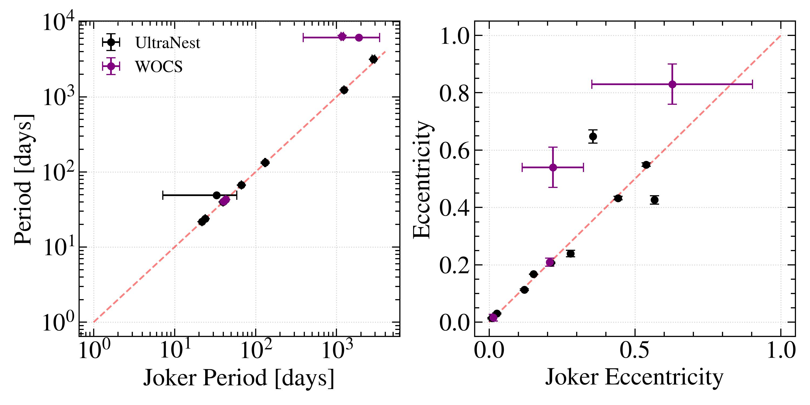
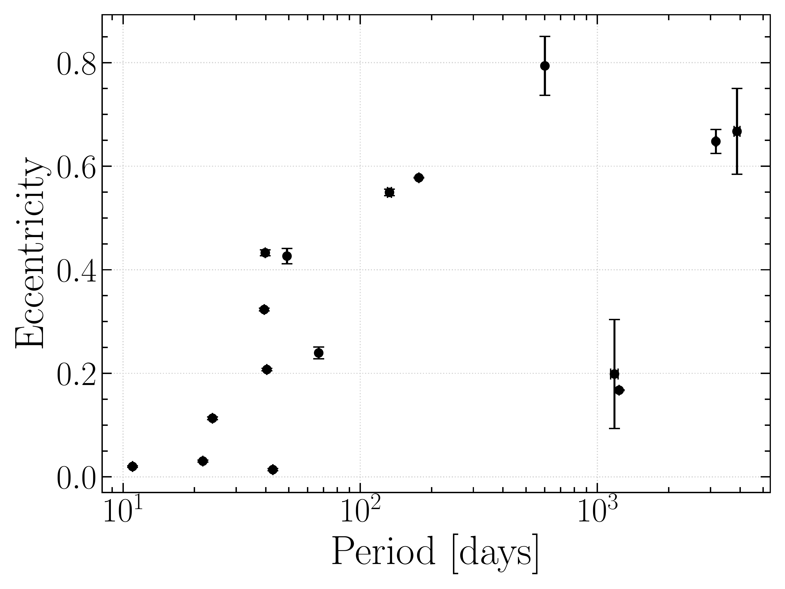
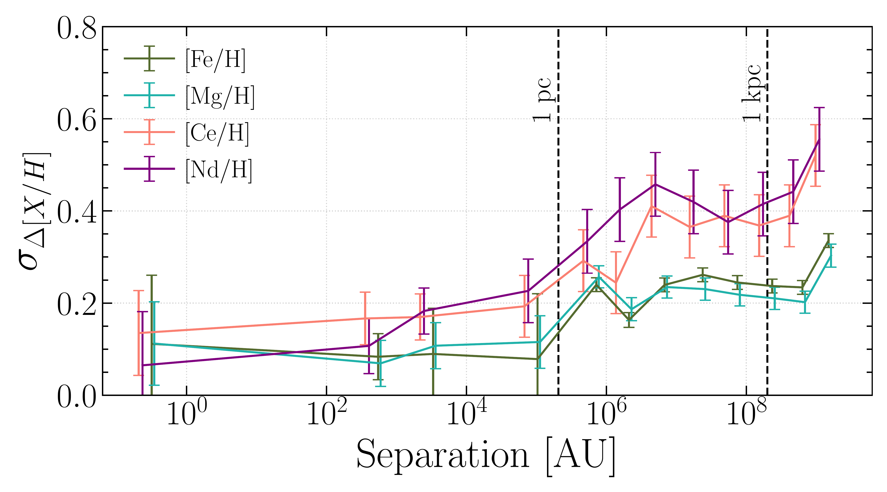
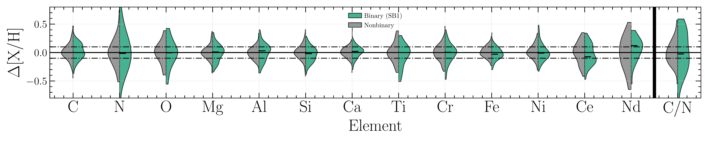

$\newcommand{\ensuremath}{}$
$\newcommand{\xspace}{}$
$\newcommand{\object}[1]{\texttt{#1}}$
$\newcommand{\farcs}{{.}''}$
$\newcommand{\farcm}{{.}'}$
$\newcommand{\arcsec}{''}$
$\newcommand{\arcmin}{'}$
$\newcommand{\ion}[2]{#1#2}$
$\newcommand{\textsc}[1]{\textrm{#1}}$
$\newcommand{\hl}[1]{\textrm{#1}}$
$\newcommand{\footnote}[1]{}$
$\newcommand{\thebibliography}{\DeclareRobustCommand{\VAN}[3]{##3}\VANthebibliography}$

# The Chemical Homogeneity of Single-Lined Spectroscopic Binaries in Open Clusters

<mark>Appeared on: 2026-02-24</mark> -  _17 pages, 10 figures_

A. Sinha, et al. -- incl., <mark>J. Müller-Horn</mark>

**Abstract:** Using SDSS-V DR19 Milky Way Mapper APOGEE data, we measure the impact that close binarity has on surface chemistry across the Hertzsprung-Russell diagram in a broad set of abundances by studying single-lined spectroscopic binaries (SB1s) in open clusters. We derive binary membership and orbital parameters for 103 SB1s by analysing APOGEE radial velocities with The Joker and UltraNest . We perform a detailed abundance analysis with BACCHUS to derive abundances in fourteen chemical species:  Si, Fe, C, N, O, Na, Mg, Al, Ca, Ti, Cr, Ni, Ce, and Nd. Leveraging the assumptions of chemical homogeneity in open clusters, we compare the surface abundances of SB1s to non-binary stars at similar evolutionary states. We find that a subset of binaries with significant UV excess have a $\Delta$ [ C/N ] that is 0.2--0.5 dex higher than expected, resulting in overestimated [ C/N ] -based ages for those stars. This points to pollution from an evolved companion and has implications for [ C/N ] -based age studies of the broader Milky Way. At the population level, we find that SB1s in our sample can be treated as statistically chemically homogeneous with their single-star counterparts, and we find no connection between orbital separation and chemical enrichment or depletion. We show that at separations up to  5 pc, co-eval stars can be considered chemically homogeneous with one another within current abundance precisions, regardless of multiplicity.

**Figure 1. -** _Top:_ A comparison between the orbital solutions for unimodal stars analysed by the Joker,  UltraNest, and WOCS. It is clear that while both codes exhibit reasonable agreement in period, there is significantly less agreement in eccentricity. This is likely due to the different priors used in the two codes. It is also clear that the Joker/UltraNest parameters broadly agree with those derived independently by WOCS. _Bottom:_ The period-eccentricity distribution of all binaries in our sample with confident orbital solutions, as solved for by  UltraNest. (*fig:orbital_distribution*)

**Figure 4. -** _Top:_ Here we compare the $\Delta$[X/H] distributions for the binary-nonbinary co-eval stars at increasing separations across four elements: Fe, Mg, Ce, and Nd. We note that the plot for $\Delta$[Ce/H] does not include any wide binaries or co-moving pairs as [Hawkins, et. al (2020)](https://ui.adsabs.harvard.edu/abs/2020MNRAS.492.1164H) and [Nelson, et. al (2021)](https://ui.adsabs.harvard.edu/abs/2021ApJ...921..118N) did not measure Ce in their analyses. _Bottom:_ We find that below separations of 1 pc, stars can be considered chemically homogeneous across all nucleosynthetic channels. Beyond one pc but within one kpc, there is a sudden increase in $\sigma_{\Delta\mathrm{[X/H]}}$, with the light and heavy elements separating into two different tracks. Lastly, at separations beyond one kpc, $\sigma_{\Delta\mathrm{[X/H]}}$ steadily increases. We show contours for the 5th, 25th, 34th, 50th, 68th, 75th, and 95th percentiles for the top four panels. (*fig:stellar_pop_comparison*)

**Figure 8. -** _Top_: Here we compare the $\Delta$[X/H] and $\Delta$[C/N] distributions for the SB1-nonbinary (_green_) and nonbinary-nonbinary (_grey_) pairs in all the elements we measure. The black lines indicate a $\Delta$[X/H] of $\pm$0.1 dex. _Bottom_: Here we compare the elemental $\chi^2$ distributions for the SB1-nonbinary (_green_) and nonbinary-nonbinary (_grey_) pairs in all the elements we measure. The black lines and green lines indicate the median nonbinary-nonbinary and median SB1-nonbinary $\chi^2$, respectively. (*fig:apo_abund_comparison*)

