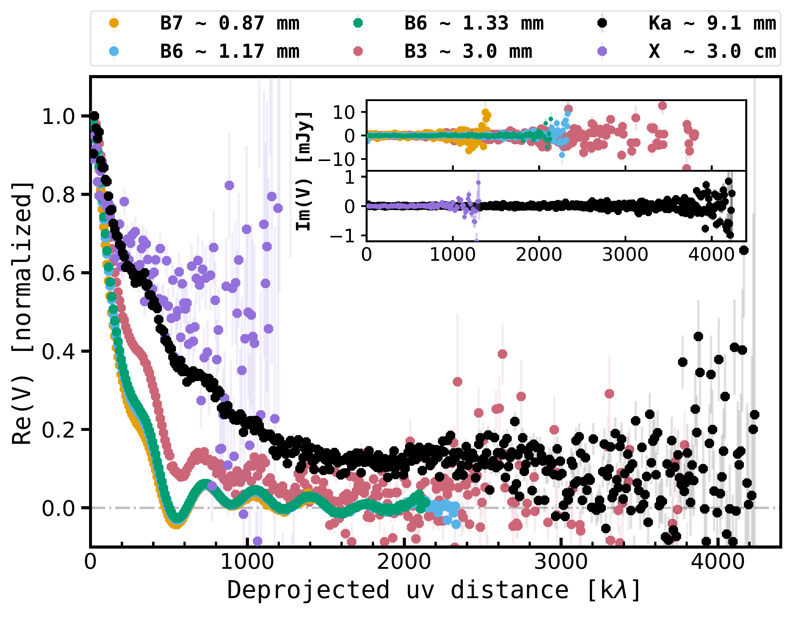
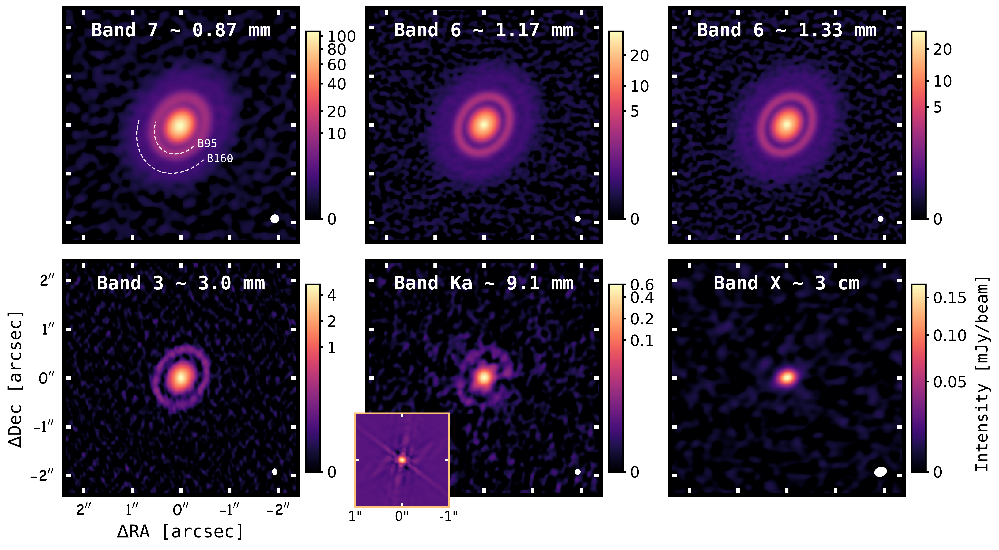

$\newcommand{\ensuremath}{}$
$\newcommand{\xspace}{}$
$\newcommand{\object}[1]{\texttt{#1}}$
$\newcommand{\farcs}{{.}''}$
$\newcommand{\farcm}{{.}'}$
$\newcommand{\arcsec}{''}$
$\newcommand{\arcmin}{'}$
$\newcommand{\ion}[2]{#1#2}$
$\newcommand{\textsc}[1]{\textrm{#1}}$
$\newcommand{\hl}[1]{\textrm{#1}}$
$\newcommand{\footnote}[1]{}$
$\newcommand{\diskname}{MWC 480}$
$\newcommand{\vdag}{(v)^\dagger}$
$\newcommand$
$\newcommand$
$\newcommand{\uat}[2]{\href{http://astrothesaurus.org/uat/#1}{#2 (#1)}}$

# Probing Dust in the MWC 480 Disk from Millimeter to Centimeter Wavelengths

<mark>Appeared on: 2026-02-24</mark> -  _29 pages, 18 figures, 4 tables. Accepted for publication in ApJ_

Y. Shi (施杨帆), et al.

**Abstract:** We present deep, high-resolution ( $\sim$ 100 mas) Karl G. Jansky Very Large Array (VLA) Ka-band (9.1 mm) observations of the disk around MWC 480, and infer dust properties through a combined analysis with archival Atacama Large Millimeter/submillimeter Array (ALMA) data at 0.87, 1.17, 1.33, and 3.0 mm.The prominent dust ring at 95 au (B95) is detected at 9.1 mm for the first time, while the faint outer ring at 160 au is not revealed.Through non-parametric visibility modeling, we identified two new annular features: a plateau within 20-50 au across all wavelengths, and a shoulder exterior to the B95 ring at 0.87, 1.17 and 1.33 mm, consistent with signatures of planet-disk interaction.We find that the width of the B95 ring remains constant across wavelengths, suggesting that fragmentation dominates over radial diffusion or that unresolved substructure is present within the ring.Resolved spectral modeling yields two families of dust solutions that reproduce the observations equally well: compact grains or highly porous (90 \% ) grains, with carbonaceous components dominated by refractory organics or amorphous carbon, respectively.The inferred maximum grain sizes peak at the locations of the two rings and reach centimeter within the B95 ring.The total dust masses are $860^{+95}_{-78}\rm M_\oplus$ / $1500^{+440}_{-330}\rm M_\oplus$ (large/small-grain solution in inner disk) and $230^{+14}_{-13}\rm M_\oplus$ for the two dust mixtures.The B95 ring alone contains $100^{+5}_{-5}\rm M_\oplus$ and $43^{+2}_{-2}\rm M_\oplus$ , respectively, sufficient to assemble the cores of giant planets.Finally, we highlight the power of broadband, multi-wavelength observations in placing better constraints on dust composition and porosity in protoplanetary disks.

**Figure 7. -** Results of visibility fitting using FRANK, ALMA Band 7/6/3 and VLA Ka from top to bottom.
    From left to right:
    _Leftmost_: Deprojected visibility profiles. Black dots for observation and pink lines for FRANK models.
    _Middle left_: Intensity profiles for observations and FRANK models, right axis also shows the converted brightness temperature.
    Dashed black lines represent the B95 and B160 rings with the radial locations from Band 7.
    Pink downward arrows denote the new structures found by FRANK fitting, and dashed pink lines label their approximate radial positions.
    _Middle right_: FRANK model images convolved with observational beams of $0.18"$.
    _Rightmost_: Residual images displayed in terms of signal-to-noise ratio. The B95 ring is shown as dashed gray ellipse. Disk minor axis is marked by black dotted line.
     (*fig:frank_result*)

**Figure 1. -** Deprojected visibility profiles for both real and imaginary (shown in the inset) parts.
    The real parts are normalized to the flux at shortest baselines.
    The imaginary parts for ALMA and VLA Band are shown separately in the inset, and are not normalized.
     (*fig:profiles_vis*)

**Figure 5. -** Continuum images of disk around MWC 480 at ALMA Band 7/6/3 and VLA Ka/X Band.
    The white dashed arcs mark the two rings and their names used in this paper.
    The color scales are in units of mJy/beam, and power or arcsinh stretches are applied to display the ring substructures and the faint outer disk.
    The inset at the lower left of Ka panel shows the point spread function (PSF) image before smoothing to a circular beam, the apparent fainter regions along the B95 ring at Ka coincide with the PSF arms.
    Beam sizes of images for each wavelength: Band 7 ($0.18"$), Band 6 ($0.12"$), Band 3 ($0.14"\times0.10"$), Ka ($0.12"$), X ($0.26"\times0.20"$).
     (*fig:multi_wave_image*)

