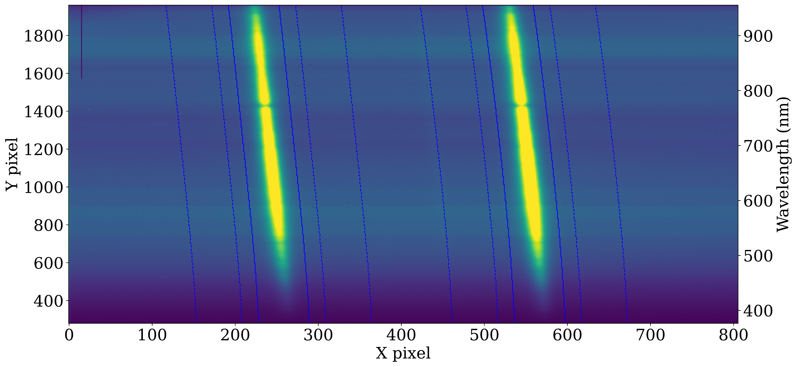
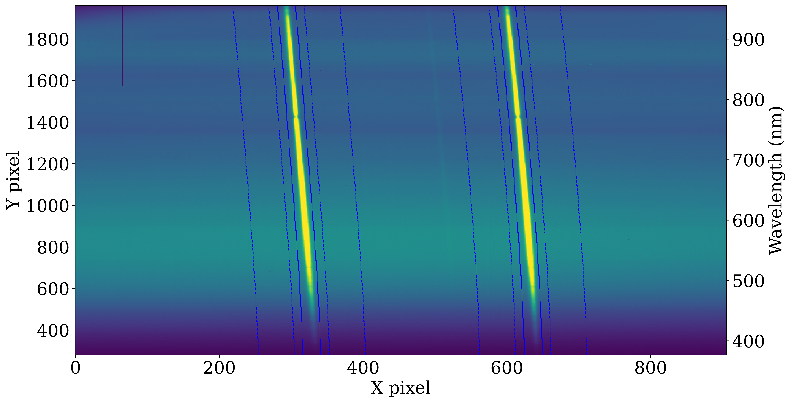
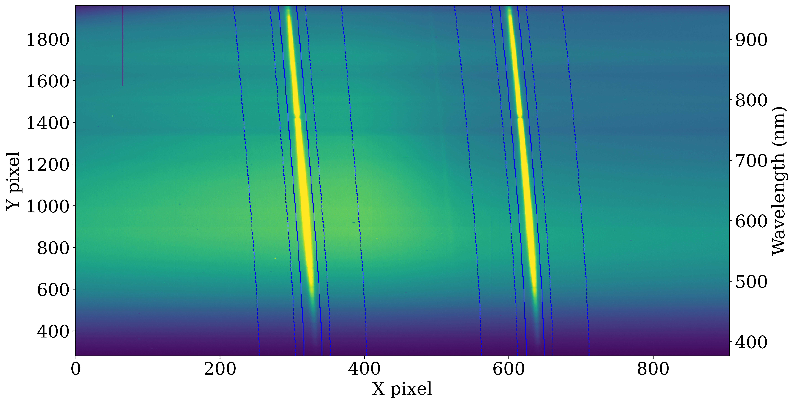
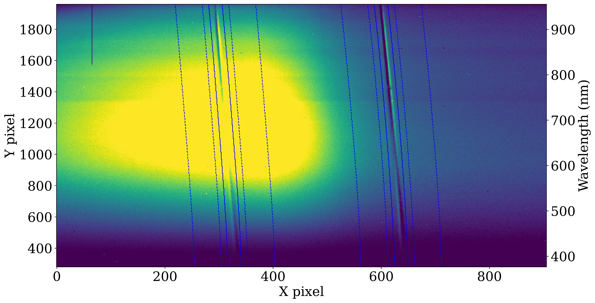
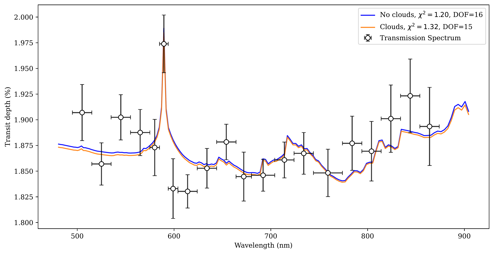
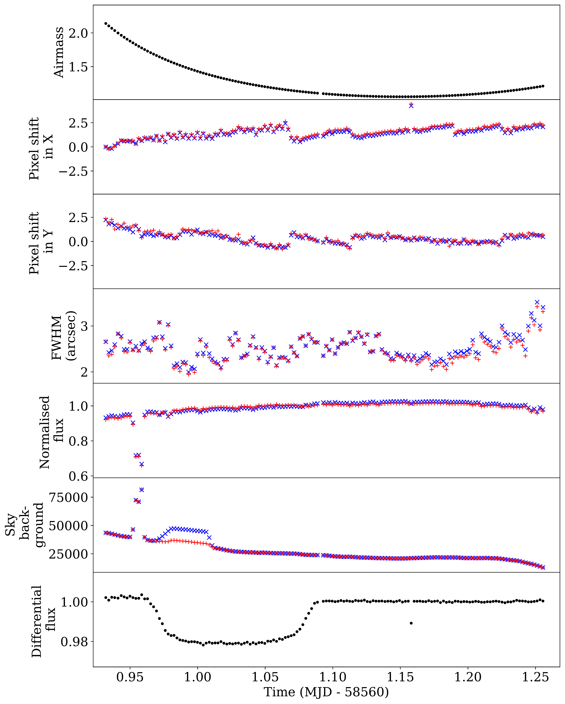

$\newcommand{\ensuremath}{}$
$\newcommand{\xspace}{}$
$\newcommand{\object}[1]{\texttt{#1}}$
$\newcommand{\farcs}{{.}''}$
$\newcommand{\farcm}{{.}'}$
$\newcommand{\arcsec}{''}$
$\newcommand{\arcmin}{'}$
$\newcommand{\ion}[2]{#1#2}$
$\newcommand{\textsc}[1]{\textrm{#1}}$
$\newcommand{\hl}[1]{\textrm{#1}}$
$\newcommand{\footnote}[1]{}$
$\newcommand{\new}[1]{#1}$
$\newcommand{\newer}[1]{#1}$
$\newcommand{\newest}[1]{#1}$
$\newcommand{\newerer}[1]{#1}$
$\newcommand{\thebibliography}{\DeclareRobustCommand{\VAN}[3]{##3}\VANthebibliography}$

# LRG-BEASTS: Detection of sodium and evidence for water absorption in the hot Saturn HAT-P-44b

<mark>Appeared on: 2026-02-24</mark> -  _21 pages, 22 figures, accepted for publication in Monthly Notices of the Royal Astronomical Society_

A. B. Claringbold, et al. -- incl., <mark>E.-M. Ahrer</mark>

**Abstract:** $\noindent$ We present the low-resolution optical transmission spectrum of $\newer{the inflated hot Saturn HAT-P-44b}$ . The planet is a close sibling in radius (1.24 $\mathrm{R_{Jup}}$ ), temperature (1100 K), and mass (0.35 $\mathrm{M_{Jup}}$ ) to the exceedingly well-characterized WASP-39b.Using the ACAM instrument on the William Herschel Telescope (WHT), we obtain a $\new{transmission spectrum}$ with sub-scale height precision of $\new{246}$ ppm, with a wavelength range of 495 -- 874 nm and a 20 nm resolution, despite a relatively faint host star ( $V\mathrm{_{mag} = 13.2}$ ). We detect absorption due to sodium with $\new{ 3.9$\sigma$ confidence. Atmospheric retrieval of the transmission spectrum also reveals \newer{evidence for} \ch{H2O} absorption and Rayleigh scattering from \ch{H2} gas consistent with a cool 800 K atmosphere and a super-solar metallicity of $7${\raisebox{0.5ex}{\tiny$\substack{+16 \ -5}$}}$\times$solar. Comparison of retrieval models disfavour the inclusion of a \newer{super-Rayleigh scattering slope or high-altitude clouds (at $<1$ mbar) while being agnostic towards the presence of mid-altitude clouds}. Our transmission spectrum \newer{of HAT-P-44b shows strong similarity} to that of its sibling WASP-39b.}$ This is the tenth planet in the LRG-BEASTS (Low-Resolution Ground-Based Exoplanet Atmosphere Survey using Transmission Spectroscopy) survey.

**Figure 1. -** $\new${Example ACAM frames demonstrating the used extraction (solid blue lines) and background (dashed blue lines) regions from the first night (first panel) and second night (second panel). We also observed a strong 2D enhancement on the detector in the second night for some of the transit, depicted in the third panel, and highlighted with a difference frame between without-scattering and with-scattering frames with similar FWHM for the second night in the final panel. $\new$erer{The approximate wavelength of each Y pixel is indicated.} Each X pixel spans 0.25 arcseconds.} (*fig:extraction-frames*)

**Figure 12. -** Transmission spectrum from the first night with (black data points) and the best-fitting {\tt petitRADTRANS} model from the highest evidence atmospheric retrieval (blue). The spectrum demonstrates absorption due to sodium (the sharp winged feature at 589 nm), Rayleigh scattering without haze-enhancement (the downwards slope at the blue end of the spectrum), and \ch{H2O} and \ch{CH4} absorption (the upwards slope at the red end of the spectrum, and the small feature at 730 nm). We also plot the best-fitting model from the second highest evidence atmospheric retrieval (orange), which also includes a grey cloud layer as a free parameter, with the $2 \sigma$ minimum cloud-top pressure at $\sim$ 1 mbar. (*fig:spectrum_best_fit*)

**Figure 3. -** Ancillary data for the second night of observation of HAT-P-44b. The blue crosses correspond to HAT-P-44b and the red crosses correspond to the comparison star. From top to bottom: target airmass, the shift in trace centroid across the slit, the full width half maximum (FWHM) of the stellar lines, the total sky background counts, and the white-light light-curve differential flux. The minimum in normalized flux immediately before transit is due to clouds, while we believe differential enhancement in background to be indirect scattered moonlight due to its abrupt appearance and disappearance. (*fig:ancillary_plots2*)

