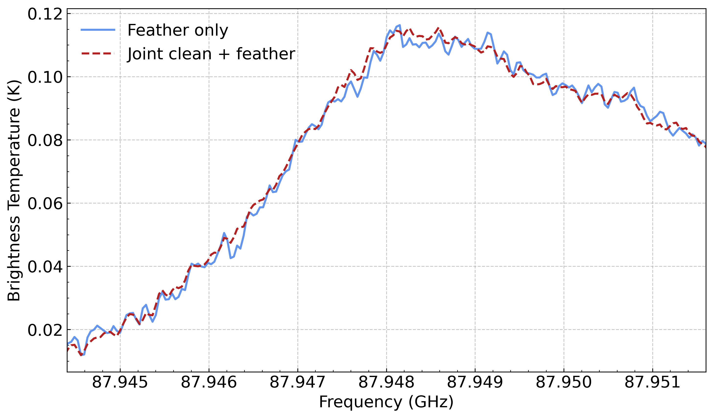
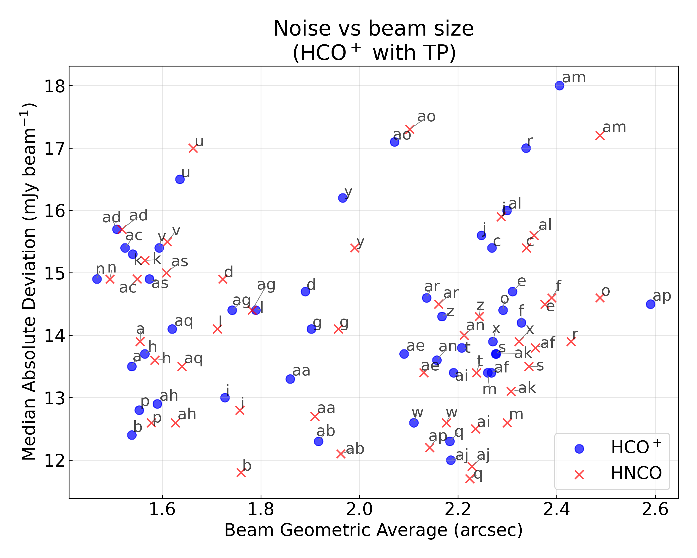
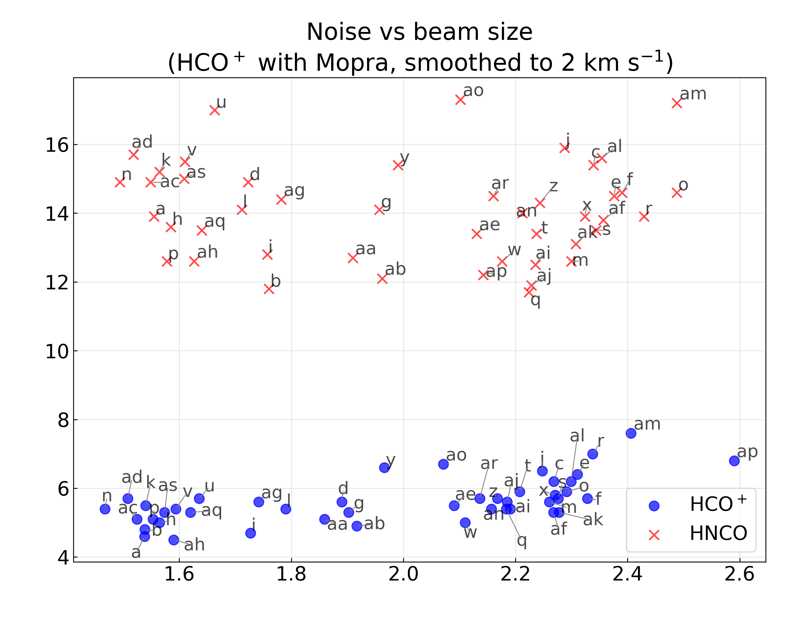
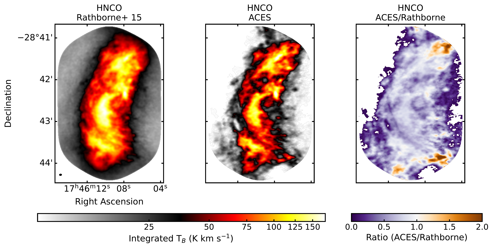
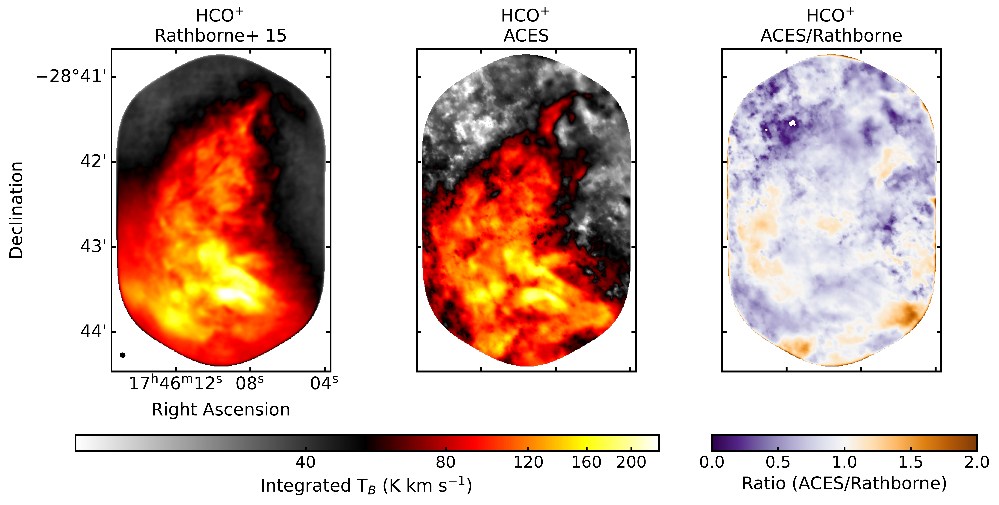

$\newcommand{\ensuremath}{}$
$\newcommand{\xspace}{}$
$\newcommand{\object}[1]{\texttt{#1}}$
$\newcommand{\farcs}{{.}''}$
$\newcommand{\farcm}{{.}'}$
$\newcommand{\arcsec}{''}$
$\newcommand{\arcmin}{'}$
$\newcommand{\ion}[2]{#1#2}$
$\newcommand{\textsc}[1]{\textrm{#1}}$
$\newcommand{\hl}[1]{\textrm{#1}}$
$\newcommand{\footnote}[1]{}$
$\newcommand{\kms}{\ensuremath{\mathrm{km s}^{-1}}\xspace}$
$\newcommand{\hcop}{HCO^{+}\xspace}$
$\newcommand{\app}{\sim\xspace}$
$\newcommand{\msun}{M_{\odot}\xspace}$
$\newcommand{\cms}{cm^{-2}\xspace}$
$\newcommand{\cmq}{cm^{-3}\xspace}$
$\newcommand{\updates}[1]{\textcolor{black}{#1}}$
$\newcommand{\newcommandaffiliationlabel}[1]{$
$  \refstepcounter{affcounter}$
$  \expandafter\xnewcommand\csname #1\endcsname{\theaffcounter}$
$}$
$\newcommand{\affref}[1]{^{\csname #1\endcsname}}$
$\newcommand{\affrefs}[1]{$
$  ^{$
$    \@for\@ref:=#1\do{$
$      \@ref\@ifnextchar\@nil {,}$
$    }$
$  }$
$}$
$\newcommand{\affrefTwo}[2]{^{\csname #1\endcsname,\csname #2\endcsname}}$
$\newcommand{\affrefThree}[3]{^{\csname #1\endcsname,\csname #2\endcsname,\csname #3\endcsname}}$
$\newcommand{\affrefFour}[4]{^{\csname #1\endcsname,\csname #2\endcsname,\csname #3\endcsname,\csname #4\endcsname}}$
$\newcommand{\printaffiliation}[2]{$
$  ^{\csname #1\endcsname}#2\\%$
$}$

# ALMA Central molecular zone Exploration Survey (ACES) III:\ Molecular line data reduction and HNCO and $\hcop$ data

<mark>Appeared on: 2026-02-25</mark> -  _Accepted for publication in MNRAS. Website is this https URL and data release is linked from there. Pipeline code is at this https URL_

D. L. Walker, et al. -- incl., <mark>F. Xu</mark>

**Abstract:** The ALMA Central molecular zone Exploration Survey (ACES) large program has observed the inner $\app$ 200 pc of the Milky Way at 3 mm (Band 3) using ALMA's 12m, 7m, and Total Power arrays. With an angular resolution of $\app$ 2 $\arcsec$ ACES provides a contiguous, multi-scale view of the Central Molecular Zone (CMZ) via the dust continuum and a suite of molecular lines. We present an overview of the molecular line data processing for ACES and describe the first data release. We showcase the HNCO (4-3) and $\hcop$ (1-0) data, which were targeted at high spectral resolution (0.2 $\kms$ ) to trace the kinematics of the molecular gas in the CMZ. The HNCO and $\hcop$ maps are compared with previous single-dish CMZ surveys and discrete ALMA observations of CMZ clouds to demonstrate the quality of the data. $\updates{We highlight the ubiquity of parsec-scale, linear absorption features traced by \hcop. Their origin is unknown, and ACES provides the first opportunity to study these enigmatic features throughout the CMZ. We release the HNCO and \hcop cubes for all 45 ACES fields, along with the full cube mosaics which combine all fields into a contiguous mosaic of the CMZ. We additionally provide advanced products of these full mosaics, including integrated and peak intensity, noise, and position-velocity maps. These products provide substantial legacy value for the community, offering an unparalleled view of the physical and kinematic structure of the dense gas in the CMZ.}$

**Figure 1. -** Comparison for field \texttt{t} between the two different array combination methods presented in Section \ref{sec:comb}. Shown are the mean spectra for two HNCO cubes, resulting from the different methods. The dashed red line shows the mean spectrum of the jointly imaging and feathered cube (Sec. \ref{sec:joint_decon_feather}). The solid blue line shows the mean spectrum of the feather-only cube (Sec. \ref{sec:feather_only}). Note that these tests were performed on a small subset of the channels, hence the restricted frequency coverage in the figure. (*fig:HNCO_imaging_comparison+meanspec*)

**Figure 7. -** Noise vs. beam size for all 45 ACES fields, for both $\hcop$ and HNCO. Blue circle markers correspond to $\hcop$ and red cross markers to HNCO. The corresponding region name (\texttt{a}--\texttt{as}) is given for each marker, with grey lines connecting labels and markers in crowded locations. The beam size is the geometric average of the major and minor axes. The noise is estimated as the median absolute deviation of the full spectrum. The left figure shows the statistics when measured using the 12m7mTP cubes for both HNCO and $\hcop$. The right figure shows the same, but instead using the 12m7mMopra cubes for the $\hcop$ data (see Section \ref{sec:tp_hcop}). The noise is significantly lower in this case as the $\hcop$ data are spectrally regridded and smoothed to match the Mopra data, resulting in a channel spacing of $\app$ 2 $\kms$, vs. 0.1 $\kms$ for the ALMA data. Note that the left and right plots have different y-axis ranges, for improved clarity. (*fig:cube_stats*)

**Figure 15. -** Comparison between \citet{Rathborne2015} and ACES data. The top row shows the HNCO (4-3) integrated emission, while the bottom row shows $\hcop$(1-0). Shown for each is the integrated intensity of the \citet{Rathborne2015} data (_left_) and the ACES data (_centre_), as well as the ratio image (ACES/Rathborne; _right_). The ACES data have been reprojected onto the same grid as the Rathborne data, and the Rathborne data have been smoothed to match the slightly coarser beam of the ACES data. The beam is shown in the lower left of the first panel. Both datasets were integrated over the same velocity range of $-$125 to $+$135 $\kms$. NaN values in the ACES and ratio maps are due to the moment masking discussed in Section \ref{sec:moments}. Note that unlike the majority of figures in this paper, these are shown with Right Ascension and Declination to minimise unnecessary white-space. (*fig:brick_comparison*)

