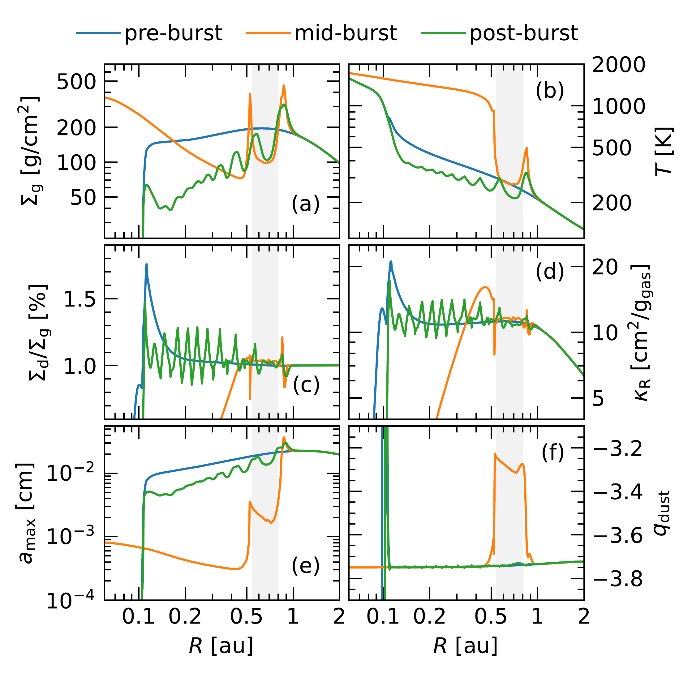
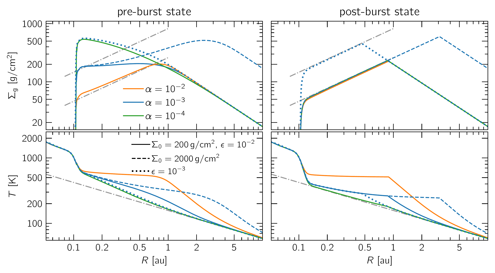
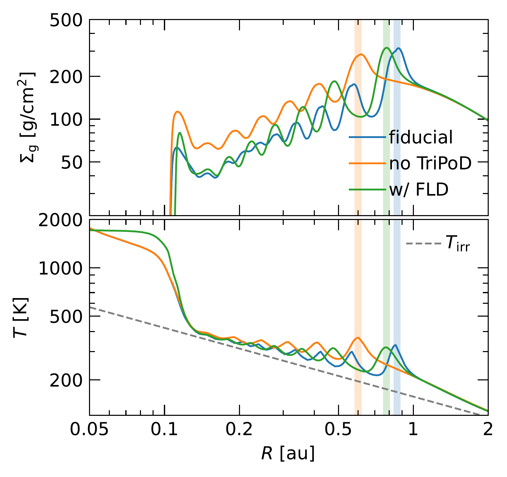

$\newcommand{\ensuremath}{}$
$\newcommand{\xspace}{}$
$\newcommand{\object}[1]{\texttt{#1}}$
$\newcommand{\farcs}{{.}''}$
$\newcommand{\farcm}{{.}'}$
$\newcommand{\arcsec}{''}$
$\newcommand{\arcmin}{'}$
$\newcommand{\ion}[2]{#1#2}$
$\newcommand{\textsc}[1]{\textrm{#1}}$
$\newcommand{\hl}[1]{\textrm{#1}}$
$\newcommand{\footnote}[1]{}$
$\newcommand{\tensor}[1]{\overline{\textbf{#1}}}$
$\newcommand{\tensorGR}[1]{\overline{\bm{{#1}}}}$
$\newcommand{\DP}[2]{\frac{\partial{#1}}{\partial{#2}}}$
$\newcommand{\D}[2]{\frac{\text{d}{#1}}{\text{d}{#2}}}$
$\newcommand{\ep}{e_\mathrm{p}}$
$\newcommand{\ap}{a_\mathrm{p}}$
$\newcommand{\G}{\text{G}}$
$\newcommand{\Mstar}{M_\star}$
$\newcommand{\Lstar}{L_\star}$
$\newcommand{\Rp}{R_\mathrm{p}}$
$\newcommand{\Mp}{M_\mathrm{p}}$
$\newcommand{\hp}{h_\mathrm{p}}$
$\newcommand{\Hp}{H_\mathrm{p}}$
$\newcommand{\Tp}{T_\mathrm{p}}$
$\newcommand{\Pp}{P_\mathrm{p}}$
$\newcommand{\Tb}{T_\mathrm{b}}$
$\newcommand{\Mth}{M_\mathrm{th}}$
$\newcommand{\Mf}{M_\mathrm{f}}$
$\newcommand{\Msun}{\mathrm{M}_\odot}$
$\newcommand{\Lsun}{\mathrm{L}_\odot}$
$\newcommand{\Mjup}{\mathrm{M}_\mathrm{J}}$
$\newcommand{\Mearth}{\mathrm{M}_\oplus}$
$\newcommand{\Rgas}{\mathcal{R}}$
$\newcommand{\cs}{c_\mathrm{s}}$
$\newcommand{\csiso}{c_\mathrm{s,iso}}$
$\newcommand{\csadb}{c_\mathrm{s}^\mathrm{ad}}$
$\newcommand{\OmegaK}{\Omega_\mathrm{K}}$
$\newcommand{\uK}{u_\mathrm{K}}$
$\newcommand{\mean}[1]{\langle{#1} \rangle}$
$\newcommand{\tauR}{\tau_\mathrm{R}}$
$\newcommand{\tauP}{\tau_\mathrm{P}}$
$\newcommand{\tauReff}{\tau_\mathrm{R}^\mathrm{eff}}$
$\newcommand{\tauPeff}{\tau_\mathrm{P}^\mathrm{eff}}$
$\newcommand{\taueff}{\tau_\mathrm{eff}}$
$\newcommand{\kappaR}{\kappa_\mathrm{R}}$
$\newcommand{\kappaP}{\kappa_\mathrm{P}}$
$\newcommand{\cv}{c_\mathrm{v}}$
$\newcommand{\rhomid}{\rho_\mathrm{mid}}$
$\newcommand{\sigmaSB}{\sigma_\mathrm{SB}}$
$\newcommand{\vel}{\bm{u}}$
$\newcommand{\xh}{{x}_\mathrm{h}}$
$\newcommand{\varpih}{{\varpi}_\mathrm{h}}$
$\newcommand{\Pd}{P_\mathrm{2D}}$
$\newcommand{\fdep}{f_\mathrm{dep}}$
$\newcommand{\Rrim}{R_\mathrm{rim}}$
$\newcommand{\tcool}{t_\mathrm{cool}}$
$\newcommand{\bcool}{\beta_\mathrm{cool}}$
$\newcommand{\bsurf}{\beta_\mathrm{surf}}$
$\newcommand{\bmid}{\beta_\mathrm{mid}}$
$\newcommand{\btot}{\beta_\mathrm{tot}}$
$\newcommand{\bcoll}{\beta_\mathrm{coll}}$
$\newcommand{\bbuoy}{\beta_\mathrm{buoy}}$
$\newcommand{\bdiff}{\beta_\text{diff}}$
$\newcommand{\bfld}{\beta_\mathrm{FLD}}$
$\newcommand{\Qvisc}{Q_\mathrm{visc}}$
$\newcommand{\Qcool}{Q_\mathrm{cool}}$
$\newcommand{\Qsurf}{Q_\mathrm{surf}}$
$\newcommand{\Qirr}{Q_\mathrm{irr}}$
$\newcommand{\Qrad}{Q_\mathrm{rad}}$
$\newcommand{\Qmid}{Q_\mathrm{mid}}$
$\newcommand{\Qrelax}{Q_\mathrm{relax}}$
$\newcommand{\Erad}{E_\mathrm{rad}}$
$\newcommand{\aR}{a_\mathrm{R}}$
$\newcommand{\lrad}{l_\mathrm{rad}}$
$\newcommand{\Sigmag}{\Sigma_\mathrm{g}}$
$\newcommand{\Sigmad}{\Sigma_\mathrm{d}}$
$\newcommand{\Sigmadi}{\Sigma_{\mathrm{d},i}}$
$\newcommand{\velg}{\vel_\mathrm{g}}$
$\newcommand{\veld}{\vel_\mathrm{d}}$
$\newcommand{\veldi}{\vel_{\mathrm{d},i}}$
$\newcommand{\epsi}{\epsilon_i}$
$\newcommand{\St}{\mathrm{St}}$
$\newcommand{\Sc}{\mathrm{Sc}}$
$\newcommand{\Rh}{R_\mathrm{H}}$
$\newcommand{\xshock}{x_\mathrm{sh}}$
$\newcommand{\Fdep}{F_\mathrm{dep}}$
$\newcommand{\amin}{a_\mathrm{min}}$
$\newcommand{\aint}{a_\mathrm{int}}$
$\newcommand{\amax}{a_\mathrm{max}}$
$\newcommand{\Sigmasmall}{\Sigma_\mathrm{small}}$
$\newcommand{\Sigmalarge}{\Sigma_\mathrm{large}}$
$\newcommand{\qdust}{q_\mathrm{dust}}$
$\newcommand{\TMRI}{T_\text{MRI}}$
$\newcommand{\alphaMRI}{\alpha_\text{MRI}}$
$\newcommand{\alphaDZ}{\alpha_\text{DZ}}$
$\newcommand{\Tsubl}{T_\text{subl}}$
$\newcommand{\Mdotacc}{\dot{M}_\text{acc}}$
$\newcommand{\Lacc}{L_\text{acc}}$
$\newcommand{\ad}{a_\mathrm{d}}$
$\newcommand{\brhod}{\bar{\rho}_\mathrm{d}}$
$\newcommand{\sd}{s_\mathrm{d}}$
$\newcommand{\md}{m_\mathrm{d}}$
$\newcommand{\pluto}{\texttt{PLUTO}}$
$\newcommand{\fargo}{{\texttt{FARGO3D}}}$
$\newcommand{\optool}{\texttt{optool}}$
$\newcommand{\radmc}{\texttt{RADMC-3D}}$
$\newcommand{\simio}{\texttt{SIMIO-continuum}}$
$\newcommand{\casa}{\texttt{CASA}}$
$\newcommand{\tripod}{\texttt{TriPoD}}$
$\newcommand{\kabs}{\kappa_{\text{abs}}}$
$\newcommand{\ksca}{\kappa_{\text{sca}}}$
$\newcommand{\pfeilt}{\citetalias{pfeil-etal-2024}}$
$\newcommand{\pfeilp}{\citepalias{pfeil-etal-2024}}$
$\newcommand{\cecilt}{\citetalias{cecil-flock-2024}}$
$\newcommand{\cecilp}{\citepalias{cecil-flock-2024}}$

# Planet formation at the inner edge of the dead zone --- I: the interplay between accretion outbursts and dust growth

<mark>Appeared on: 2026-02-25</mark> -  _17 pages, 16 figures; submitted to A&A, uploaded for visibility at the CCA Workshop on Turbulence. Comments and questions welcome!_

A. Ziampras, et al. -- incl., <mark>M. Cecil</mark>

**Abstract:** The inner edge of the dead zone in protoplanetary disks has been shown to periodically go unstable, leading to accretion outbursts and annular substructure within the dead zone. While dust opacities play a key role in this process, the thermal and dynamical effects of dust drift and growth have not been fully explored. We investigate the evolution of accretion outbursts in the inner disk and their impact on the formation of dust-rich substructure with a fully dynamic dust model.	In doing so, we aim to highlight the importance and limitations of dust growth in forming planets in this region. We carry out radiation hydrodynamics simulations of a protoplanetary disk including prescriptions for the structure of the inner edge of the dead zone, viscous and irradiation heating, radiative cooling, dust--gas dynamics, and dust evolution. We find that accretion outbursts at the inner disk edge can lead to the formation of multiple dust rings that extend deep inside the dead zone ( $\sim\!1$ au) and diffuse on viscous timescales ( $\sim\!10^4$ yr for $\alpha_\mathrm{DZ}=10^{-4}$ ). The rings contain dust masses of up to $\sim\!1.6 \Mearth$ , possibly kickstarting planet formation. Dynamic modeling of dust fragmentation enhances the total opacity during the burst, yielding more intense outbursts that penetrate deeper into the dead zone. Our results highlight the thermal and dynamical importance of treating dust dynamics self-consistently in models of accretion outbursts.	Additional modeling is needed to characterize the inevitable non-axisymmetric structures arising from accretion outbursts and their observational prospects.

**Figure 4. -** Radial profiles of various gas- and dust-related quantities during the pre-burst (blue), burst (orange), and post-burst (green) phases for our fiducial model: gas surface density (panel *a*), temperature (*b*), dust-to-gas ratio (*c*), Rosseland mean opacity (*d*), maximum grain size (*e*), and dust size distribution exponent (*f*). The gray-shaded region in the burst phase highlights the area where dust is recondensing and recoagulating after the passage of the heating front. (*fig:fiducial-panels*)

**Figure 15. -** Pre- (left) and post-burst (right) states of the gas surface density (top) and temperature (bottom) for different disk configurations computed using the method described in Sect. \ref{sec:pre-post-constraints}. Here, we assume constant dust opacities of $\kappa_\text{d}=700 \text{cm}^2/\text{g}_\text{dust}$(including $f_\text{subl}$ from Eq. \eqref{eq:fsubl}). The mass accretion rate through the outer boundary is approximately $10^{-9} $\Msun$/\text{yr}\times\nicefrac{$\alphaDZ$}{10^{-3}}\times\nicefrac{{$\Sigmag$}_0}{200 \text{g}/\text{cm}^2}$. Dashed-dotted lines in the top panels have a slope $\propto R^{0.81}$---in good agreement with Eq. \eqref{eq:sigma-min-approx}---and help guide the eye, while in the bottom panels they represent the irradiation temperature. (*fig:pre-post-examples*)

**Figure 5. -** Post-burst gas surface density (top) and temperature (bottom) profiles for models with different thermodynamical prescriptions: our fiducial model with dust evolution but no in-plane radiative diffusion (blue), a model without dust evolution (orange), and a model with in-plane radiative diffusion (green). Vertical lines mark the radial extent of the burst region in each model. A dashed line denotes the irradiation temperature profile. (*fig:thermo-postburst*)

