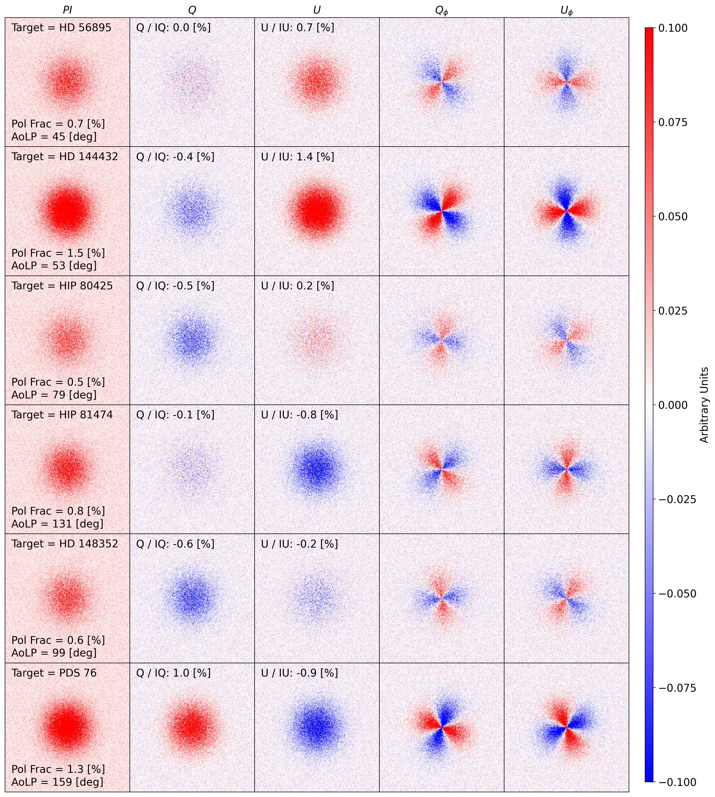
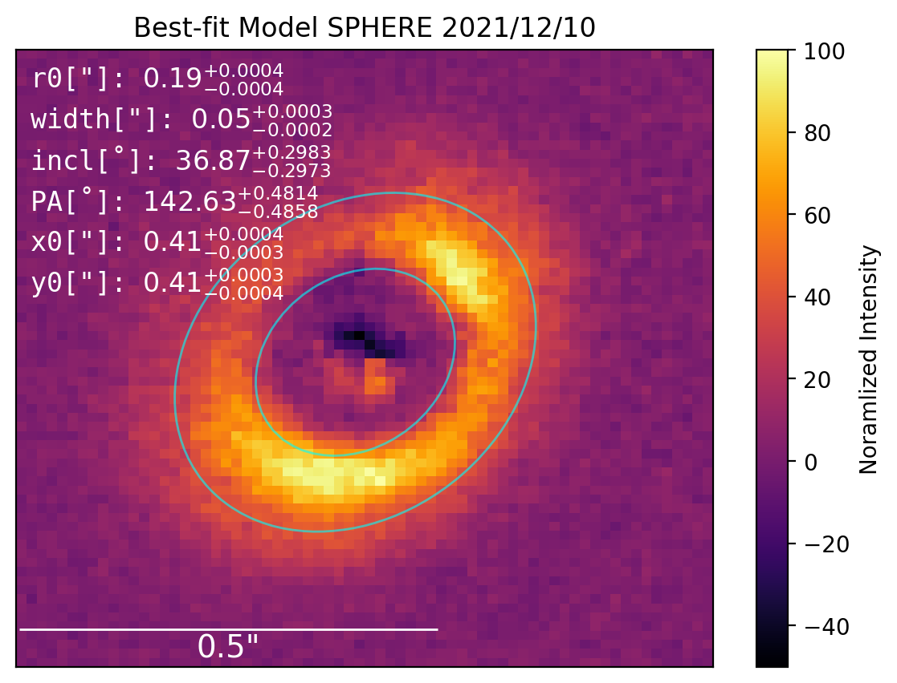
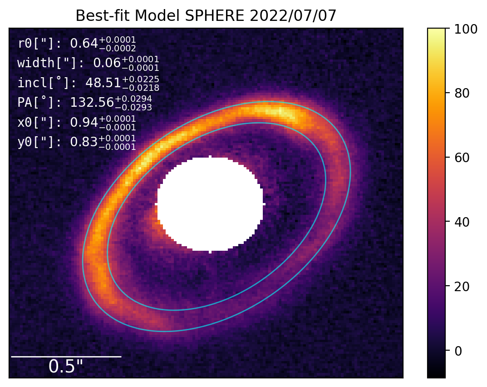
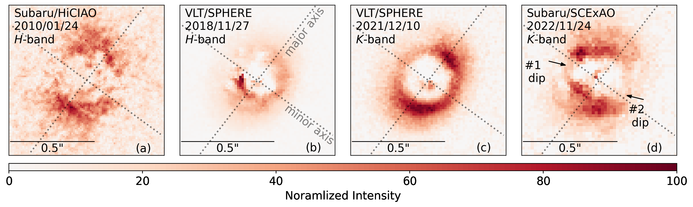

$\newcommand{\ensuremath}{}$
$\newcommand{\xspace}{}$
$\newcommand{\object}[1]{\texttt{#1}}$
$\newcommand{\farcs}{{.}''}$
$\newcommand{\farcm}{{.}'}$
$\newcommand{\arcsec}{''}$
$\newcommand{\arcmin}{'}$
$\newcommand{\ion}[2]{#1#2}$
$\newcommand{\textsc}[1]{\textrm{#1}}$
$\newcommand{\hl}[1]{\textrm{#1}}$
$\newcommand{\footnote}[1]{}$
$\newcommand{\vdag}{(v)^\dagger}$
$\newcommand$
$\newcommand$
$\newcommand{\rdnote}[1]{{\bf \color{purple} [R.D.: #1]}}$
$\newcommand{\rdtext}[1]{{\bf \color{blue} [#1]}}$
$\newcommand{\cmnote}[1]{{\bf \color{red} [C.M.: #1]}}$

# Time-variable Scattered Light in Herbig Disks Observed with Subaru/SCExAO

<mark>Appeared on: 2026-02-25</mark> -  _25 pages, 20 figures, accepted to AAS Astronomical Journal_

C. Mullin, et al. -- incl., <mark>H. Jiang</mark>

**Abstract:** Using the Subaru Coronagraphic Extreme Adaptive Optics (SCExAO) instrument, we present near-infrared $K$ -band polarimetric imaging of nine Herbig stars selected from a volume-limited sample within 200 pc. We detect the disks around MWC 480, HD 163296, and HD 143006 for the first time with SCExAO, and compare these observations with previous VLT/SPHERE datasets to identify surface-brightness variability.In MWC 480, we resolve two azimuthal brightness dips near the disk minor axis and find evidence that one of them shifted between 2021 and 2022.In HD 163296, we identify an apparent linear azimuthal motion of a localized peak in polarized intensity along the outer ring over a 15-month baseline. The rapid motion of these features relative to the local Keplerian velocity suggests that the observed variability is driven by changing illumination rather than physical material motion.Due to uncertainties in the underlying scattering background, however, we cannot determine the precise physical origin of the variability. No significant disk variability is detected in HD 143006 over a 10-month baseline.We also report the first detection of a protoplanetary disk using the fast-PDI mode on SCExAO, illustrating both the promise and current limitations of this observing mode. Finally, we report non-detections toward HD 144432, HD 56895, PDS 76, HIP 80425, HD 148352, and HIP 81474. All non-detections with Meeus classifications belong to Group II systems and are likely self-shadowed. For these six systems, we measure the system-integrated polarization fraction and angle of linear polarization, providing quantitative constraints on their unresolved circumstellar environments.

**Figure 19. -** Each row demonstrates the theoretical double-differential-imaging $PI$, $Q$, $U$, $Q_\phi$ and $U_\phi$ products for a PSF with randomized noise which is polarized to a specific degree (Pol Frac) in a specific direction (AoLP). The polarization fraction and AoLP applied to each model are measured from the calibrated CHAIRS data products and averaged across the 17 $K$-band wavelength channels. For plotting purposes the fractions are scaled up by 10\% to allow for better visibility of the patterns. However, the listed fractions on each plot are the true fractions for each target model.The measured polarization fraction in each stokes vector are listed as Q/IQ and U/IU.
     (*fig:Theoretical Q U AP*)

**Figure 9. -** **Left**: Fit of gaussian disk model using MCMC for MWC 480 SPHERE 2021 epoch. Best fit parameters with 1$\sigma$ errors are listed. The blue ellipses show the radial boundaries of the fitted ellipse.
    **Right**: MCMC fit to HD 163296 SPHERE 2022/07/07 epoch. Best fit parameters with 1$\sigma$ errors are listed. The blue ellipses show the radial boundaries of the fitted ellipse.  (*fig: ring fit MWC 480*)

**Figure 11. -** Four epochs of MWC 480 observations:
    \cite{Kusakabe2012} HiCIAO 2010/01/24; \cite{Garufi2024} SPHERE 2018/11/27; \cite{Ren2023} SPHERE 2021/12/10; this work SCExAO/CHARIS 2022/1/24.
    All images are north-up, east-left. The images are normalized to the peak brightness. The original sign of the pixel values is conserved. The HiCIAO observation has no available $Q_\phi$ data so the $PI$ product is shown. We note two shadow-like brightness dips in our SCExAO observation. Major (\ang{143}) and minor (\ang{53}) axes  -- determined by the disk model fitting (\ref{subsec: mwc480}) -- are indicated by the dotted lines. Note, all angles are measured here with north-up as \ang{0}.
     (*fig: MWC 480 4*)

