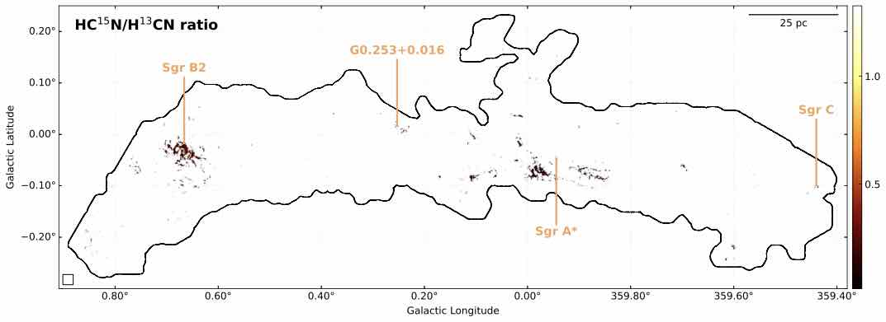
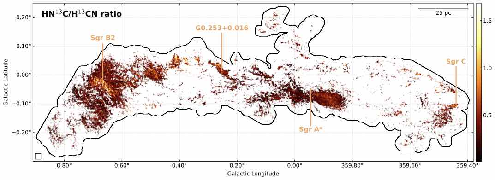
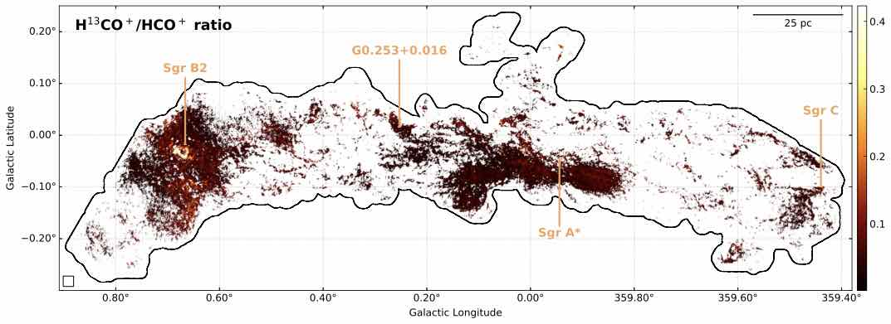
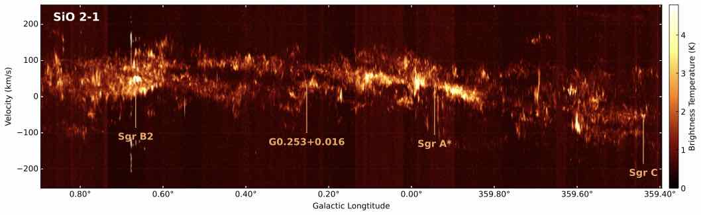
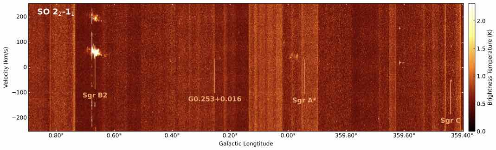
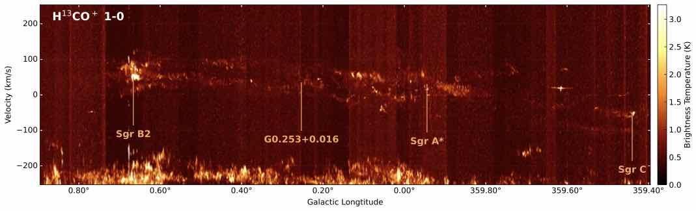
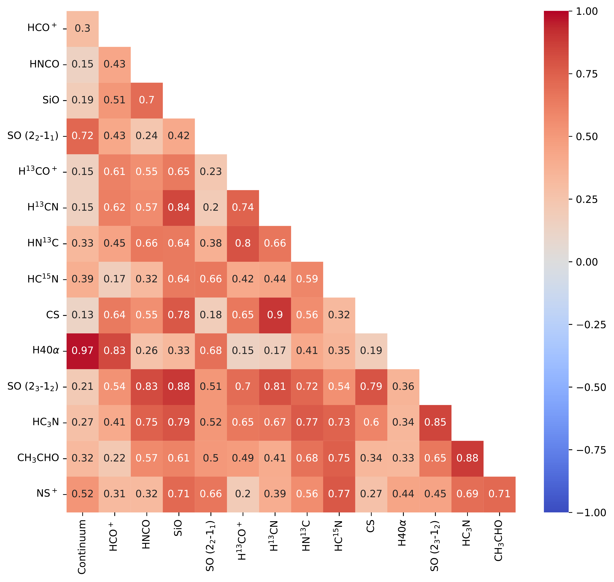
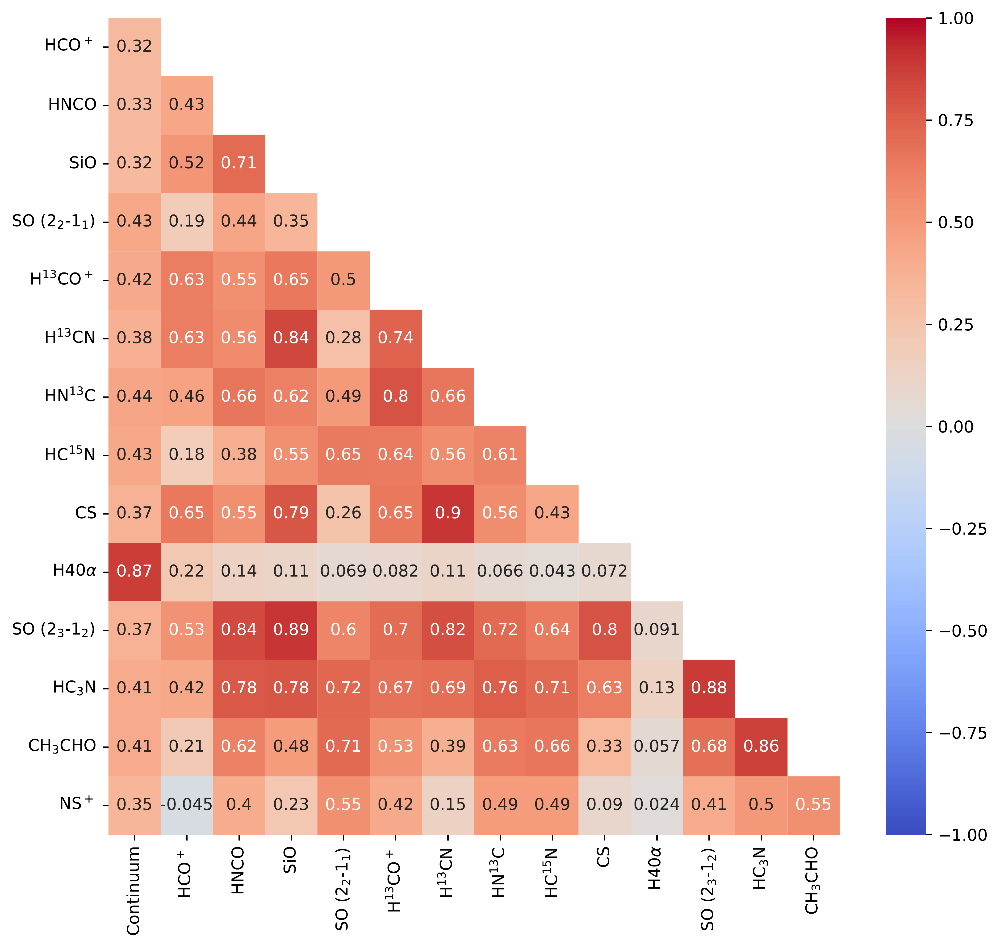

$\newcommand{\ensuremath}{}$
$\newcommand{\xspace}{}$
$\newcommand{\object}[1]{\texttt{#1}}$
$\newcommand{\farcs}{{.}''}$
$\newcommand{\farcm}{{.}'}$
$\newcommand{\arcsec}{''}$
$\newcommand{\arcmin}{'}$
$\newcommand{\ion}[2]{#1#2}$
$\newcommand{\textsc}[1]{\textrm{#1}}$
$\newcommand{\hl}[1]{\textrm{#1}}$
$\newcommand{\footnote}[1]{}$
$\newcommand{\kms}{\mbox{km s^{-1}}}$
$\newcommand{\mjypbm}{\mbox{mJy beam^{-1}}}$
$\newcommand{\msol}{\mbox{M_\odot}}$
$\newcommand{\arcdeg}{\mbox{^\circ}}$
$\newcommand{ç}{\mbox{cm^{-3}}}$
$\newcommand{\sqc}{\mbox{cm^{-2}}}$
$\newcommand{\vlsr}{\mbox{V_\textrm{LSR}}}$
$\newcommand{\hii}{\mbox{H\textsc{ii}}}$
$\newcommand{\htcn}{\mbox{H^{13}CN}}$
$\newcommand{\htcop}{\mbox{H^{13}CO^+}}$
$\newcommand{\hcop}{\mbox{HCO^+}}$
$\newcommand{\hntc}{\mbox{HN^{13}C}}$
$\newcommand{\hcfn}{\mbox{HC^{15}N}}$
$\newcommand{\newcommandaffiliationlabel}[1]{$
$  \refstepcounter{affcounter}$
$  \expandafter\xnewcommand\csname #1\endcsname{\theaffcounter}$
$}$
$\newcommand{\affref}[1]{^{\csname #1\endcsname}}$
$\newcommand{\affrefs}[1]{$
$  ^{$
$    \@for\@ref:=#1\do{$
$      \@ref\@ifnextchar\@nil {,}$
$    }$
$  }$
$}$
$\newcommand{\affrefTwo}[2]{^{\csname #1\endcsname,\csname #2\endcsname}}$
$\newcommand{\affrefThree}[3]{^{\csname #1\endcsname,\csname #2\endcsname,\csname #3\endcsname}}$
$\newcommand{\affrefFour}[4]{^{\csname #1\endcsname,\csname #2\endcsname,\csname #3\endcsname,\csname #4\endcsname}}$
$\newcommand{\printaffiliation}[2]{$
$  ^{\csname #1\endcsname}#2\\%$
$}$

# ALMA Central molecular zone Exploration Survey (ACES) IV:\ Data of the two intermediate-width spectral windows

<mark>Appeared on: 2026-02-25</mark> -  _Accepted to MNRAS. High-resolution figures will be available in the journal paper. Website is this https URL and data release is linked from there. Pipeline code is at this https URL_

X. Lu, et al. -- incl., <mark>P. Garcia</mark>, <mark>F. Xu</mark>

**Abstract:** We release the intermediate-width spectral window data from the ALMA Central Molecular Zone Exploration Survey (ACES) large program, which covers SiO (2--1), SO ($2_2$ --$1_1$ ), $\htcop$ (1--0), $\htcn$ (1--0), $\hntc$ (1--0), and $\hcfn$ (1--0), among other molecular line transitions, with an angular resolution of $\sim$ 2 $\arcsec$ and a velocity resolution of 1.7 $\kms$ . The full cubes of the two spectral windows as well as the key data products will be available to the community. We also present the integrated brightness, peak brightness, centroid velocity, and Galactic longitude-velocity maps of the six lines. We briefly discuss morphological correlations between the continuum and the molecular line emission, and brightness ratios between pairs of isotopologue or isotopomer lines. We highlight features and trends in the data that will be followed up in upcoming ACES science papers.

**Figure 13. -** Ratios of integrated brightness temperatures between $\hcfn$  1--0 and $\htcn$  1--0 (top), $\hntc$  1--0 and $\htcn$  1--0 (middle), and $\htcop$  1--0 and $\hcop$  1--0 (bottom), respectively. The color bars are truncated at the 99.9 percentile of the maximum value. (*fig:lineratio*)

**Figure 11. -** Position-velocity diagrams of SiO (2--1), SO ($2_2$--$1_1$), and $\htcop$(1--0). Here the intensities are the maximum values of the cut along the Galactic latitude, without the $l$-$\vlsr$  mask.
 (*fig:pv_peak*)

**Figure 1. -** Top: 2-D correlation matrix between the continuum and integrated intensities of the six molecular line emission presented in this paper as well as eight lines in the other SPWs \citepalias{Walker2026,Hsieh2026}. All the pixels in the ACES mosaic fields are considered. Bottom: the same correlation matrix but with pixels in Sgr B2 and Sgr A masked out. The rectangular mask towards Sgr B2 is centered at (R.A., Dec.)=(17:47:20.14, $-$28$\arcdeg$ 22$'$54$\farcs${66}), with a height of 26$\farcs${15} and a height of 110$\farcs${08}. The square mask towards Sgr A is centered at (R.A., Dec.)=(17:45:40.14, $-$29$\arcdeg$ 00$'$28$\farcs${24}), with a side length of 48$\farcs${64}.
 (*fig:2dcorr*)

