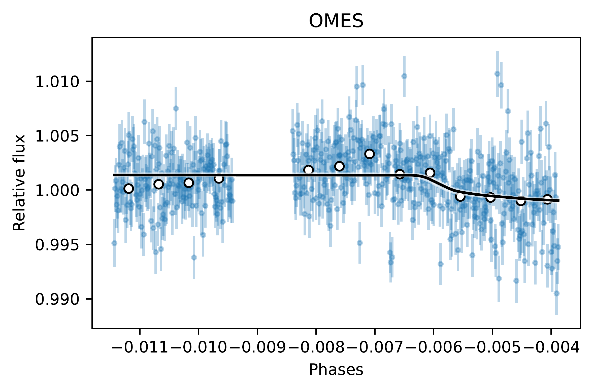
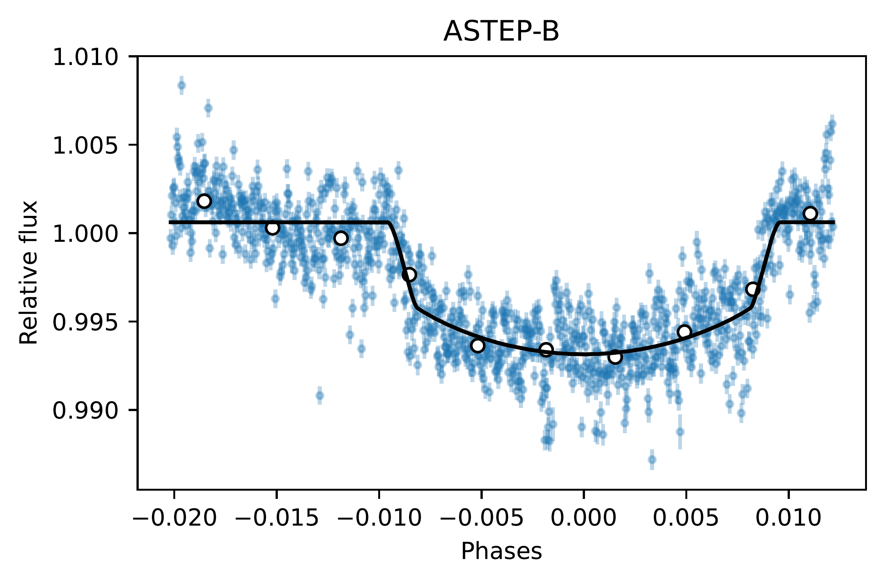
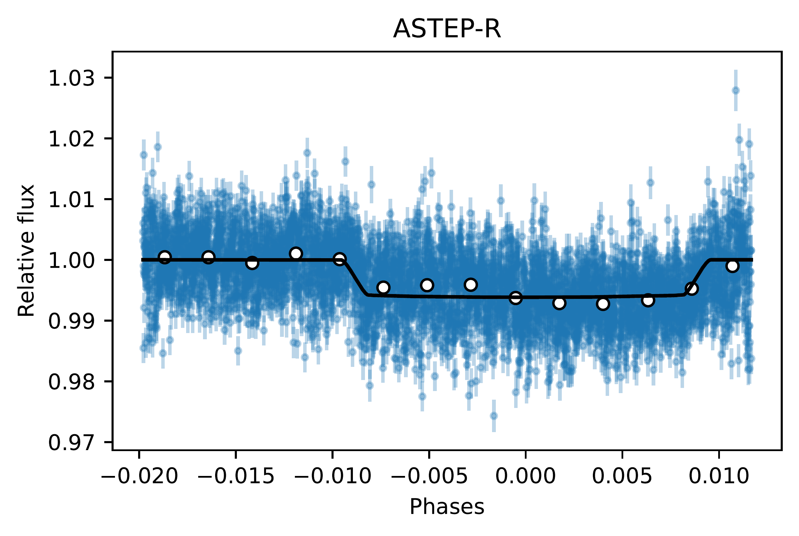
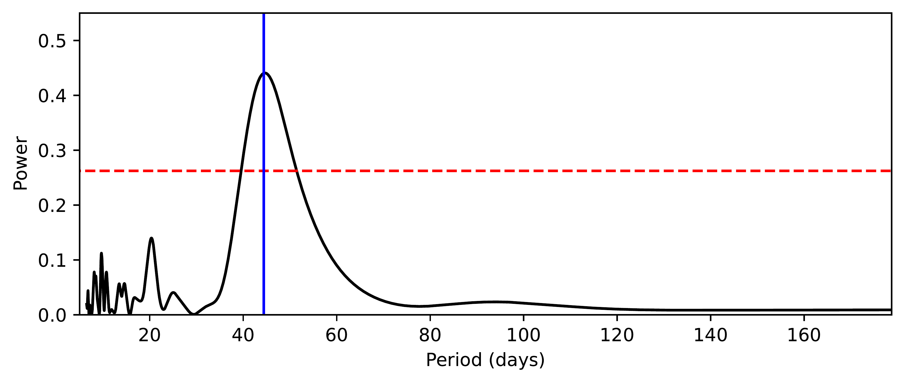
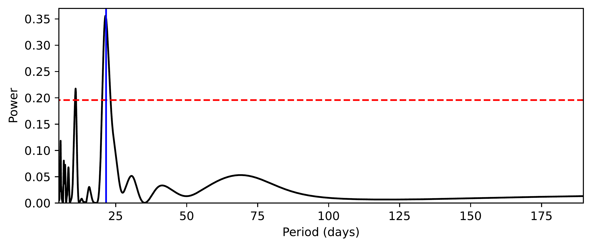
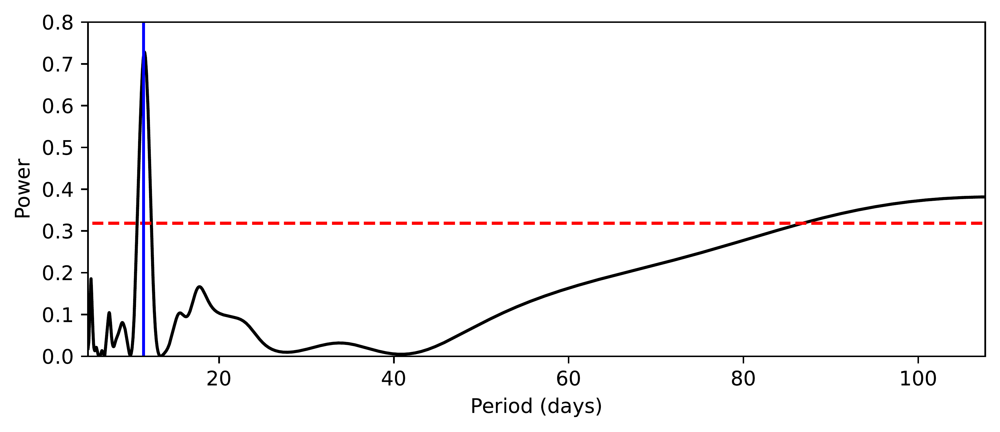
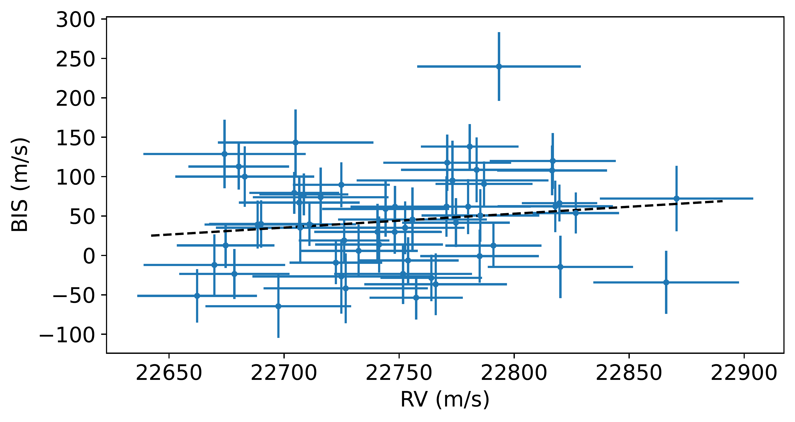
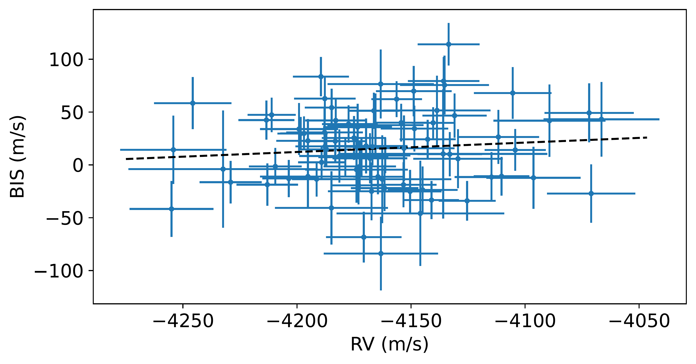
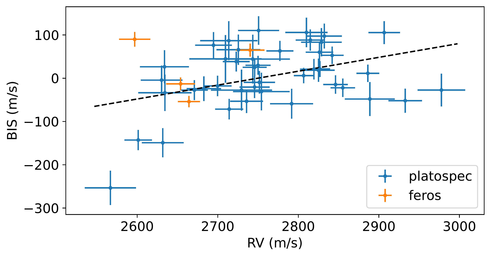

$\newcommand{\ensuremath}{}$
$\newcommand{\xspace}{}$
$\newcommand{\object}[1]{\texttt{#1}}$
$\newcommand{\farcs}{{.}''}$
$\newcommand{\farcm}{{.}'}$
$\newcommand{\arcsec}{''}$
$\newcommand{\arcmin}{'}$
$\newcommand{\ion}[2]{#1#2}$
$\newcommand{\textsc}[1]{\textrm{#1}}$
$\newcommand{\hl}[1]{\textrm{#1}}$
$\newcommand{\footnote}[1]{}$

# PLATOSpec's first results: Three new transiting warm Jupiters from the WINE survey TIC 147027702, TIC 245076932 and TIC 87422071

<mark>Appeared on: 2026-02-25</mark> -  _revision version submitted to A&A_

P. Gajdoš, et al. -- incl., <mark>T. Henning</mark>

**Abstract:** We report the discovery and characterisation of three transiting warm Jupiters: TIC 147027702b, TIC 245076932b and TIC 87422071b. These systems were initially identified as transiting candidates using light curves generated from the full-frame images of the TESS mission. We confirmed the planetary nature of these objects with ground-based spectroscopic follow-up observations using FEROS and the new PLATOSpec spectrograph attached to the ESO 1.52 m telescope at the La Silla Observatory, and with ground-based photometric observations of the Observatoire Moana, Las Cumbres Observatory Global Telescope and ASTEP. From a global fit to the photometry and radial velocities, we determine that the planet TIC 147027702b has a low-eccentric orbit ( $e = 0.13 \pm 0.05$ ) with a period of 44.4 days and has a mass of $1.09^{+0.07}_{-0.13}$ $M_J$ and a radius of $0.98 \pm 0.06$ $R_J$ . TIC 245076932b has a moderately low mass of $0.51 \pm 0.05$ $M_J$ , a radius of $0.97 \pm 0.05$ $R_J$ , and an eccentric orbit ( $e = 0.43 \pm 0.02$ ) with a period of 21.6 days. TIC 87422071b has a mass of $1.29 \pm 0.10$ $M_J$ , a radius of $0.97 \pm 0.08$ $R_J$ , and has a slightly eccentric orbit ( $e = 0.12 \pm 0.07$ ) with a period of 11.3 days. These well-characterised warm Jupiters expand the currently limited sample of similar gas giants and provide valuable benchmarks for testing models of giant-planet formation, migration, and tidal evolution.

**Figure 11. -** Ground-based observation of transit of TIC 147027702 (_1$^{\rm st_$ panel}) and TIC 245076932 in $B$ filter (_2$^{\rm nd_$ panel}) and $R$ filter (_3$^{\rm rd_$ panel}) with the best model (black). White points show the binned light curve. (*fig:tic147_ground*)

**Figure 1. -** Periodograms of RV data of TIC 147027702 (_top_), TIC 245076932 (_middle_) and TIC 87422071 (_bottom_). The horizontal red line corresponds to the 1\% false alarm probability, and the blue line marks the orbital period determined from the photometric data. (*fig:gls*)

**Figure 6. -** Bisector span (BIS) as a function of RV of TIC 147027702 (_top_), TIC 245076932 (_middle_) and TIC 87422071 (_bottom_). The dashed line shows the best linear fit to the data. (*fig:bis*)

