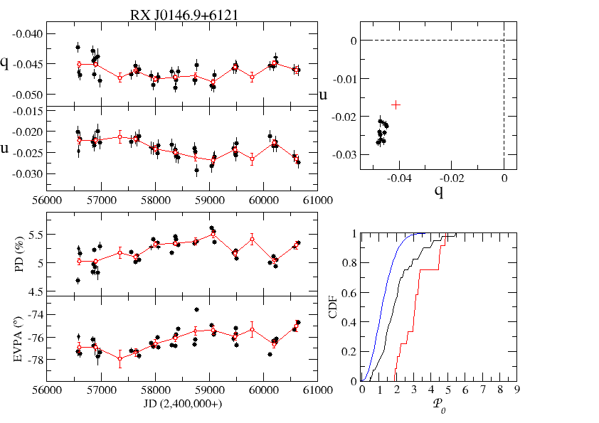
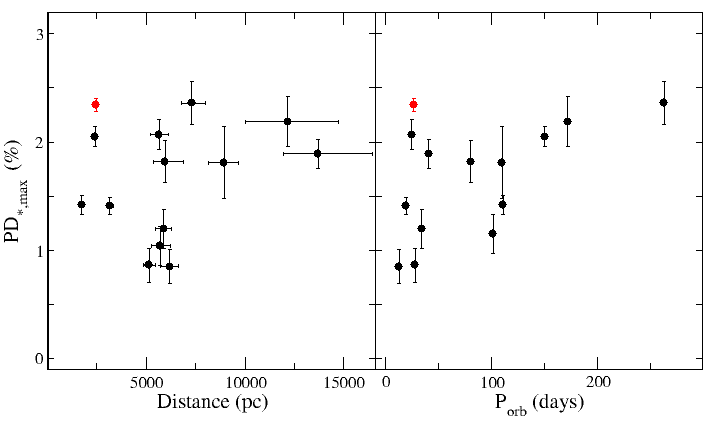
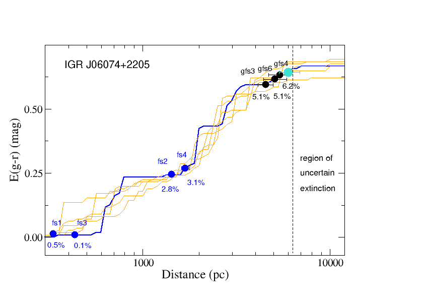
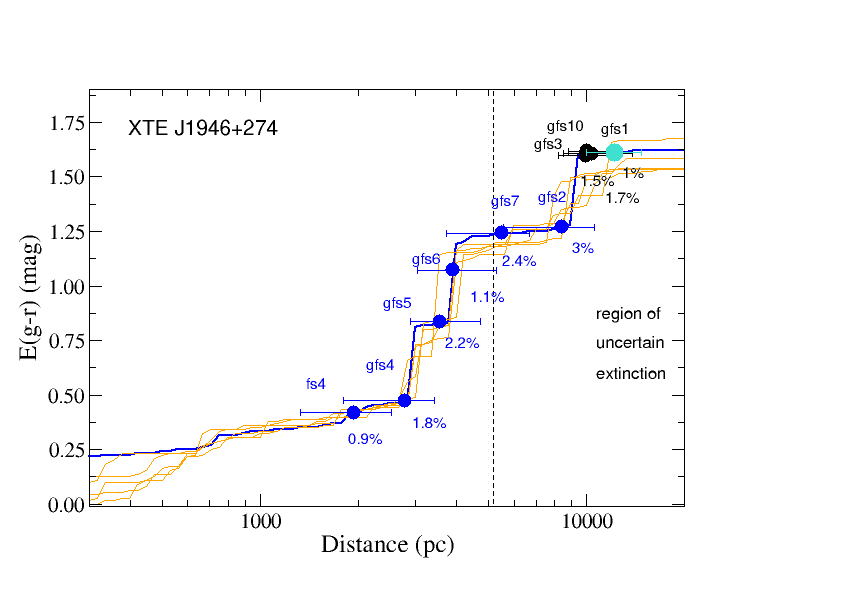

$\newcommand{\ensuremath}{}$
$\newcommand{\xspace}{}$
$\newcommand{\object}[1]{\texttt{#1}}$
$\newcommand{\farcs}{{.}''}$
$\newcommand{\farcm}{{.}'}$
$\newcommand{\arcsec}{''}$
$\newcommand{\arcmin}{'}$
$\newcommand{\ion}[2]{#1#2}$
$\newcommand{\textsc}[1]{\textrm{#1}}$
$\newcommand{\hl}[1]{\textrm{#1}}$
$\newcommand{\footnote}[1]{}$
$\newcommand{\ha}{H\alpha}$
$\newcommand{\ew}{EW(H\alpha)}$
$\newcommand{\PR}[1]{{\color{magenta} #1}}$
$\newcommand\simless{\mathbin{\lower 3pt\hbox{\rlap{\raise 5pt\hbox{\char'074}}\mathchar"7218}}}$
$\newcommand\simmore{\mathbin{\lower 3pt\hbox{\rlap{\raise 5pt\hbox{\char'076}}\mathchar"7218}}}$
$\newcommand{\msun}{~{\rm M}_\odot}$
$\newcommand{\rsun}{~{\rm R}_\odot}$

# Long-term optical variability of high-mass X-ray binaries. \    III. Polarimetry

<mark>Appeared on: 2026-02-25</mark> - 

P. Reig, D. Blinov, <mark>A. Tzouvanou</mark>

**Abstract:** Be/X-ray binaries are the most numerous group of high-mass X-ray binaries.Their long-term optical and infrared variability reflects theevolution of the circumstellar disk around the luminous companion. Thisvariability manifests photometrically as an excess of flux that increaseswith wavelength and spectroscopically as line emission. The disk isalso expected to generate linear polarization. We present a systematic study of the optical long-term polarimetric variabilityof Be/X-ray binaries on data collected over  10 years. Our aim is tocharacterize the polarimetric properties of these systems and to probe thestructure of their circumstellar disks. We have been monitoring Be/X-ray binaries visible from the Northern hemispherewith the RoboPol polarimeter. We performed a careful analysis of the interstellarpolarization in the direction of the sources to estimate their intrinsicpolarization. Stokes parameters for linear polarization were computed by means ofaperture photometry and corrected for instrumental polarization. Optical polarimetric variability is a common trait inBe/X-ray binaries. The variability canbe attributed to the Be star's circumstellar disk. Our polarization analysisconfirms previous claims based on spectroscopic data that the circumstellar disks inBeXBs are, on average, smaller and denser than Be stars in non-binary systems.Our data also confirms the presence of highly distorted disk prior to giantX-ray outbursts, although this result is still affected by the lack ofsimultaneous and well-sampled observations during major X-ray outbursts.

**Figure 3. -** * Left*: Evolution of the Stokes parameters, polarization degree
and angle; * Top-right*: $q-u$ plane. Weighted mean of the source observations
(black circles) calculated yearly and of the field stars (red cross); * Bottom-right*:
EDF of measured polarization using all data points (black line) or the weighted
averaged points (red line) compared with expected CDF of polarization
measurements (blue line). See Sect. \ref{res:var} for the meaning of these
terms. The data shown correspond to the BeXBs RX J0146.9+6121. (*var*)

**Figure 1. -** Maximum intrinsic polarization degree as a function of distance
(left) and orbital period (right), excluding the outlier EXO 2030+375. The red point
corresponds to the Be/$\gamma$-ray binary RX J0240.4+6112/LS I +61303 (*PDmax-Porb*)

**Figure 4. -** Two representative examples of the extinction as a function of
distance  \citep[data from][]{green19}. The data points simply mark the assumed location
of the stars on the extinction curve, based on their distance but they do not
imply any extinction value.  Distances are from \citet{bailer-jones21}. The
turquoise circle represents the BeXB, the black circles are the field stars used
for the ISM correction, and the blue circles correspond to other field stars. We also
indicate the PD of the field stars. The vertical dashed line marks the region
of uncertain extinction.  (*extdist*)

