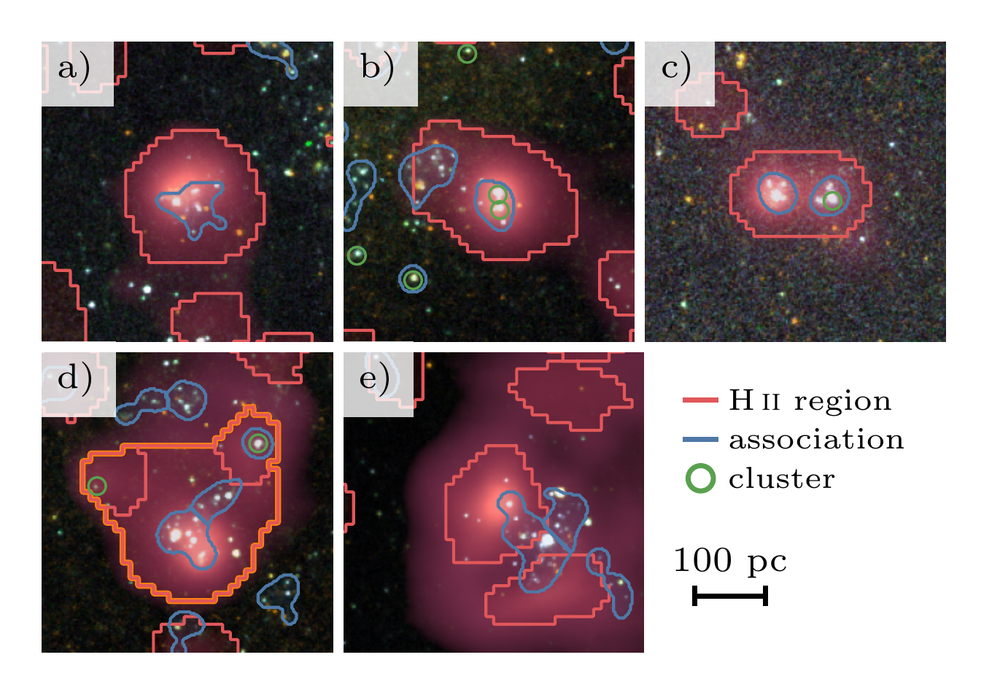
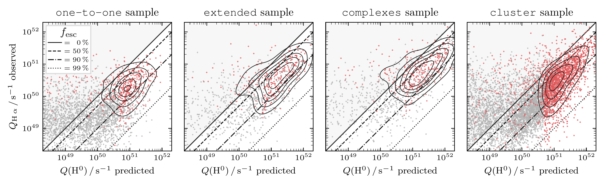
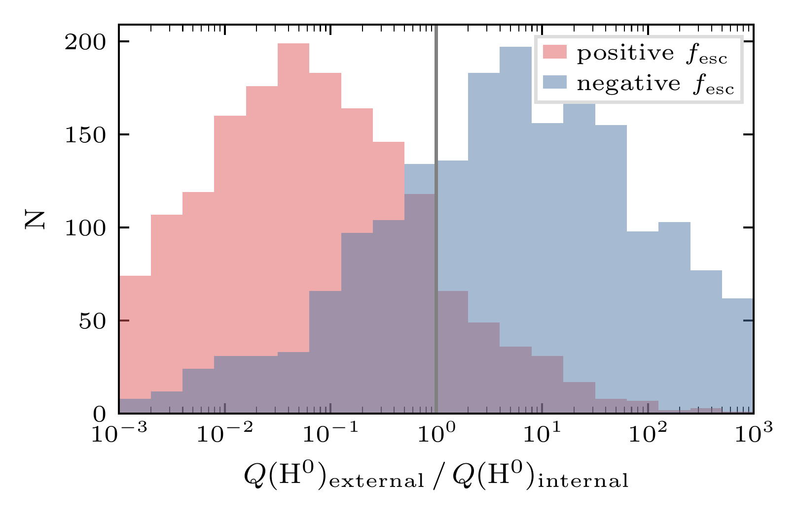

$\newcommand{\ensuremath}{}$
$\newcommand{\xspace}{}$
$\newcommand{\object}[1]{\texttt{#1}}$
$\newcommand{\farcs}{{.}''}$
$\newcommand{\farcm}{{.}'}$
$\newcommand{\arcsec}{''}$
$\newcommand{\arcmin}{'}$
$\newcommand{\ion}[2]{#1#2}$
$\newcommand{\textsc}[1]{\textrm{#1}}$
$\newcommand{\hl}[1]{\textrm{#1}}$
$\newcommand{\footnote}[1]{}$
$\newcommand{\uncertainty}[3]{#1 ^{+ #2}_{- #3}}$
$\newcommand$
$\newcommand$
$\newcommand$
$\newcommand$
$\newcommand$
$\newcommand$
$\newcommand$
$\newcommand$
$\newcommand$
$\newcommand$
$\newcommand$
$\newcommand$
$\newcommand$
$\newcommand$

# Stellar associations powering $\HII$ regions: II. Escape fraction of ionizing photons

<mark>Appeared on: 2026-02-26</mark> -  _15 pages, 12 figures. Accepted for publication in A&A_

F. Scheuermann, et al. -- incl., <mark>K. Kreckel</mark>, <mark>J. Neumann</mark>, <mark>E. Schinnerer</mark>

**Abstract:** Newly formed stars have a profound impact on their environment by depositing energy and momentum into the surrounding gas.    However, only a fraction of the stellar feedback is retained in the cloud and observational constraints are needed to further our understanding of this process.    In a sample of 19 nearby galaxies, we match $\HII$ regions from PHANGS--MUSE to their ionizing stellar source from PHANGS-- _HST_ and measure the percentage of ionizing radiation that is leaking into the surrounding diffuse ionized gas (DIG).    Based on a catalogue, where each $\HII$ region is powered by a single young and massive stellar association, we measure a photon escape fraction of $\fesc=82^{+12}_{-24}\;\si{\percent}$ .    Comparable results are obtained when different procedures are used to match the ionized gas to its source.    All samples we study contain a substantial fraction of objects (up to $\SI{20}{\percent}$ ), where the stellar source is not sufficient to produce the $\HA$ flux observed from the nebula.    Many of them are probably related to uncertain age estimates, but we also find numerous regions, where a significant fraction of the ionizing photon budget is contributed by stars that reside outside the boundaries of the $\HII$ region.    This motivates the use of an alternative galaxy-wide approach, in which we include all $\HII$ regions and stellar sources, not just the ones that show a clear overlap.    When summing up the ionization budget over entire galaxies, we measure slightly lower, but consistent values.

**Figure 2. -** Overlap postage stamps.Examples for the overlap between \HII regions and their ionizing sources.
    Each cutout shows three-colour composite images, based on the five available _HST_ bands, overlaid with the $\HA$ line emission of MUSE in red.
    a) an \HII region with a fully contained association; b) an \HII region with a fully and a partially contained association and two compact clusters; c) an \HII region with two fully contained associations and a compact cluster; d) multiple \HII regions that form a single \HII region complex with multiple associations and clusters; e) an association that overlaps with two \HII regions. (*fig:matched_catalogue_cutouts*)

**Figure 10. -** Comparison between the predicted ionizing photon flux $\Qpred$ and the observed value $\Qobs$ for individual objects.We compare the predicted ionizing photon flux $\Qpred$ to the observed values from the \HII region $\Qobs$.
    The full samples are shown in grey and the robust subsamples in red.
    The contours indicate the distribution of the robust sample and the diagonal lines correspond to different escape fractions. (*fig:ionizing_photons_sample*)

**Figure 4. -** Contribution of external ionizing sources.
    For \HII regions with negative escape fractions, the average contribution from nearby associations, not overlapping with the nebula, is far greater than for those with positive escape fractions. (*fig:external_ionizing_sources*)

