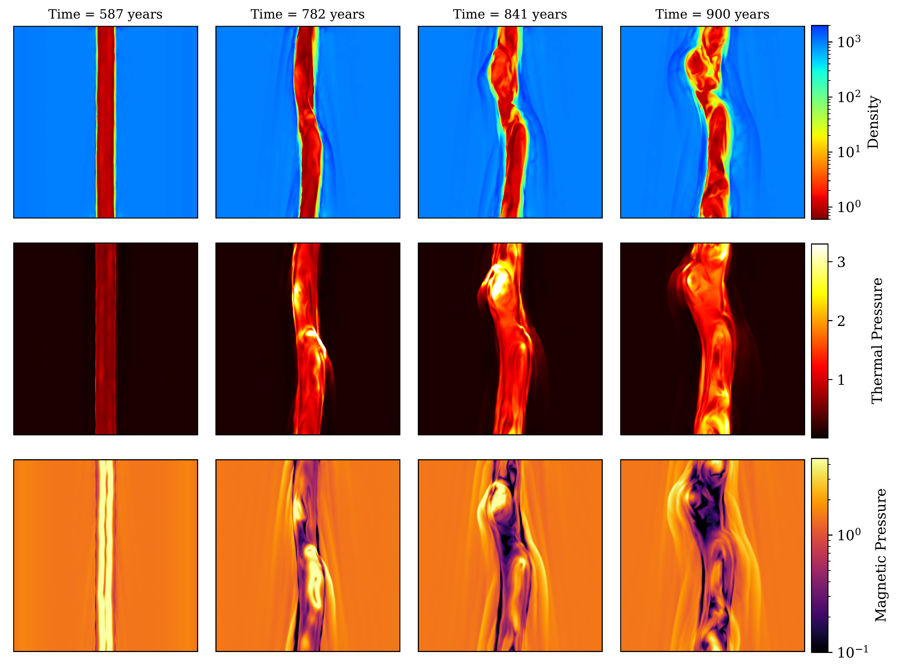
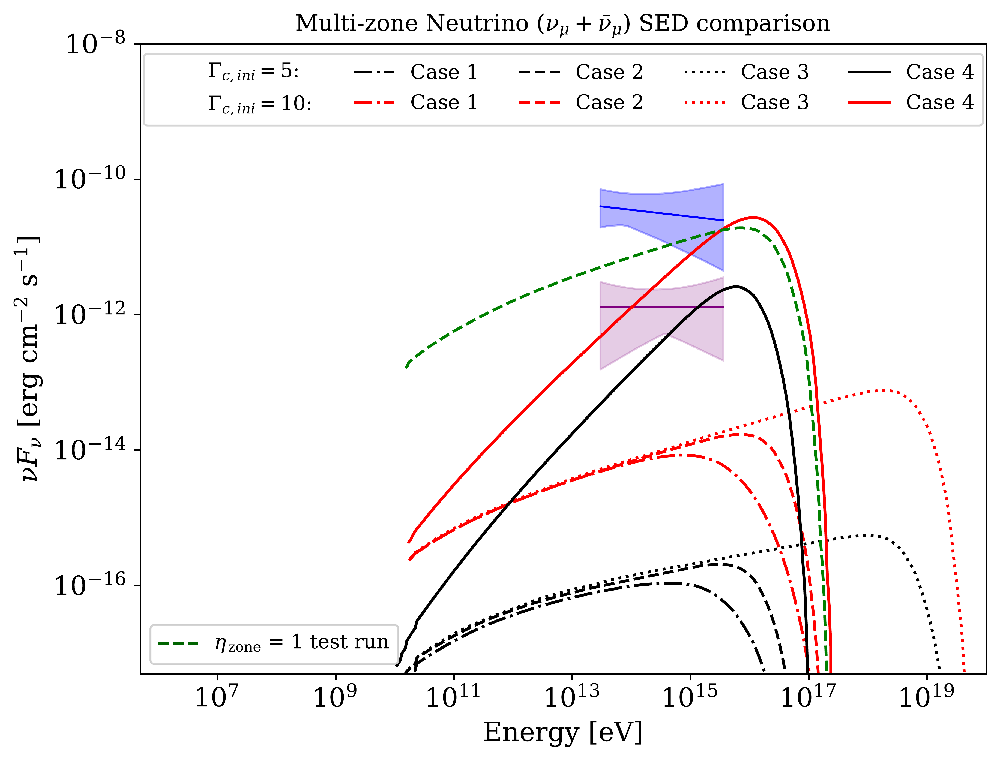
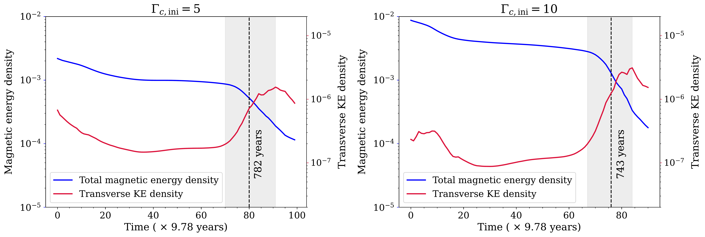

$\newcommand{\ensuremath}{}$
$\newcommand{\xspace}{}$
$\newcommand{\object}[1]{\texttt{#1}}$
$\newcommand{\farcs}{{.}''}$
$\newcommand{\farcm}{{.}'}$
$\newcommand{\arcsec}{''}$
$\newcommand{\arcmin}{'}$
$\newcommand{\ion}[2]{#1#2}$
$\newcommand{\textsc}[1]{\textrm{#1}}$
$\newcommand{\hl}[1]{\textrm{#1}}$
$\newcommand{\footnote}[1]{}$
$\newcommand{\hb}{ \color{blue} }$
$\newcommand{\cf}{ \color{magenta} }$
$\newcommand{\arraystretch}{1.4}$

# Multi-messenger emission derived from relativistic magnetized jet dynamics using a multi-zone framework

<mark>Appeared on: 2026-03-02</mark> -  _31 pages, 15 figures, 3 tables_

H. Bhuyan, B. Vaidya, <mark>C. Fendt</mark>, A. Sharma

**Abstract:** Relativistic jets from Active Galactic Nuclei (AGN) are highly energetic and emit radiation across a wide range of frequencies.Despite several observational studies, their particle composition still remains a key open question.The detection of high-energy neutrinos from blazar sources such as TXS 0506+056 has highlighted the plausibility ofhadronic/lepto-hadronic models for AGN jets.To understand the origin of high-energy neutrinos from such sources, it is imperative to capture the complex interplay betweenthe jet dynamics, their composition, and the mechanism of particle acceleration and cooling in relativistic jets.In this pilot study, we have coupled a numerical multi-zone framework for lepto-hadronic modeling, with 3D relativisticmagneto-hydrodynamic simulations of AGN jets, including external photon fields.Our framework provides synthetic multi-wavelength and neutrino flux by spatially sampling the simulated jet into multiple zones.We investigate the implications of such a framework in exploring the different intrinsic and extrinsic pathways for proton-enrichment in jets.Essentially, we find that for low proton-to-electron number density ratios,producing a substantial jet neutrino flux, requires the underlying proton energy distribution to have a relatively flat spectrum witha power-law index of $\simeq 2.0$ .We further find that while intrinsic shocks triggered by kink-instabilities in the jet can accelerate electrons to high energies, they may not be sufficient to produce such flat particle energy distributions for the chosen set of parsec-scale jet parameters.Finally, to produce a significant jet neutrino emission,our simulations suggest the need to consider particle acceleration mechanisms through alternative pathways, either internal or external.

**Figure 8. -** \small Magneto-hydrodynamic evolution of the jet. Shown are _yz_-plane slices for the density (top), thermal pressure (middle) and magnetic pressure (bottom) at several
    simulation times for the jet with $\Gamma_{\rm c, ini} = 5$.
    All quantities are in code units.
     (*jetplots*)

**Figure 4. -** \small Multi-zone muon neutrino SEDs for the four proton distribution cases of $\Gamma_{\rm c,ini} = 5$(_black curves_) and $10$(_red curves_) jets. The _dashed green curve_ represents the multi-zone neutrino flux for the test simulation with $\eta_{\rm zone} = 1$. The blue "bow-tie" represents the best-fit muon neutrino flux (_blue line_) during the 110 day flaring state of TXS 0506+056 obtained by IceCube with its $68  \%$ confidence region (_blue shaded region_), The pink bow-tie depicts IceCube's best fit muon neutrino flux (_purple line_) from the 9.5 year data of TXS 0506+056 with the its the $68  \%$ confidence region (_pink shaded region_) \citep{icecube2018dataset,IceCube2018}.
     (*Neu_SED*)

**Figure 9. -** \small Evolution of total magnetic energy density and the transverse (_xy_-plane) kinetic energy density for the jets with $\Gamma_{\rm c, ini} = 5$(_left panel_) and $\Gamma_{\rm c, ini} = 10$(_right panel_), respectively.
     The linear phase of kink instability formation is shaded gray and the _dashed black line_ represents the optimal time slice chosen for the multi-zone analysis ($t_{\rm s1}=782$  years for the $\Gamma_{\rm c, ini} = 5$ jet and $t_{\rm s2}=743$  years for the $\Gamma_{\rm c, ini} = 10$ jet). There are two vertical axes in each plot, the total magnetic energy density (_blue solid line_) is associated with the vertical axis on the left side of the plots  while the vertical axis on the right side is associated with the transverse kinetic energy density (_red solid line_) for each plot.
      (*energetics*)

