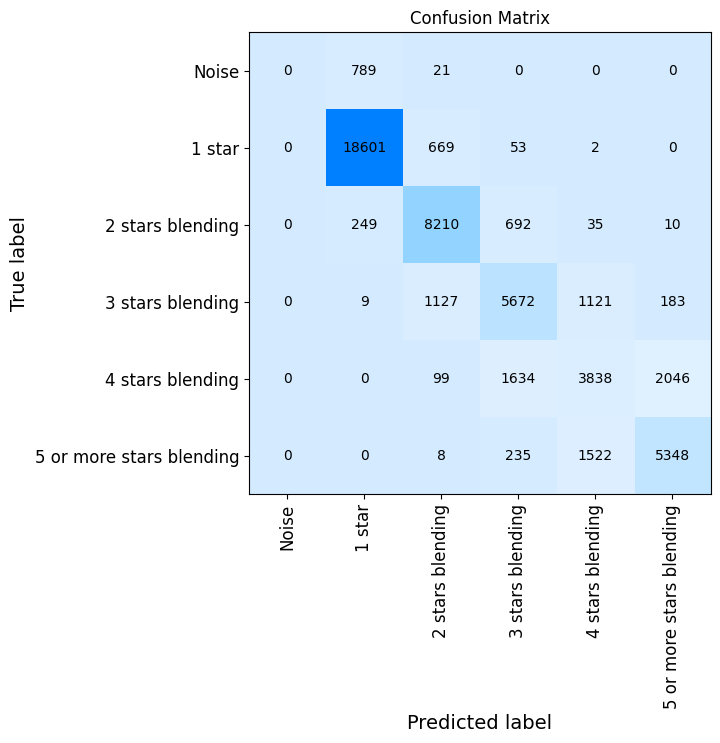
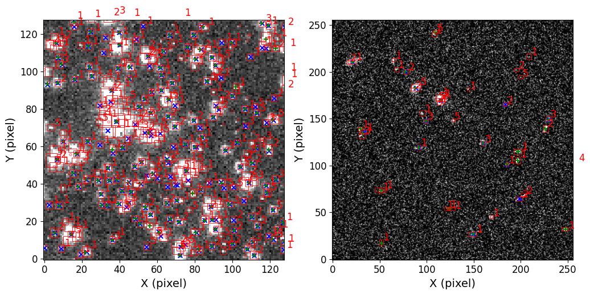
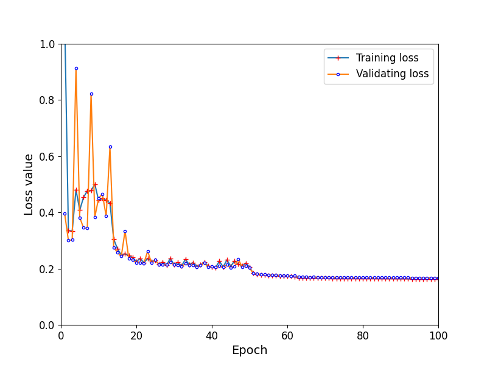

$\newcommand{\ensuremath}{}$
$\newcommand{\xspace}{}$
$\newcommand{\object}[1]{\texttt{#1}}$
$\newcommand{\farcs}{{.}''}$
$\newcommand{\farcm}{{.}'}$
$\newcommand{\arcsec}{''}$
$\newcommand{\arcmin}{'}$
$\newcommand{\ion}[2]{#1#2}$
$\newcommand{\textsc}[1]{\textrm{#1}}$
$\newcommand{\hl}[1]{\textrm{#1}}$
$\newcommand{\footnote}[1]{}$
$\newcommand{\vdag}{(v)^\dagger}$
$\newcommand$
$\newcommand$
$\newcommand{\arraystretch}{0.85}$

# Detection and classification of astronomical sources with Astro-RetinaNet in crowded stellar fields

<mark>Appeared on: 2026-03-03</mark> -  _APJs Accepted_

Y. Yan (闫一波), C. Liu (刘超), J. Li (李佳东), F. Wang (王锋)

**Abstract:** Upcoming next-generation sky surveys will detect large number of faint objects with magnitudes larger than 25.When objects are crowded within a limited a field of view, blending becomes unavoidable.Blending leads to the omission of many sources during photometry in these fields, which cause an underestimates of tens of percent in crowded fields, and remains a major challenge for existing source-extraction techniques.Although artificial neural networks had shown promising results in the detection and classification in wide-field surveys, they often fail with severely blended stars.We developed a robust deep learning model, Astro-RetinaNet, based on the Retinanet algorithm to detect and classify blended sources in single-band astronomical images.After training and evaluating the performance of our network on simulated images, we find precision of 0.96, 0.89,0.70, 0.50,0.75 for single star, 2-star, 3-star, 4-star and 5-or-more star blending cases, respectively, with star number density $\sim$ 22000 stars per $\rm arcmin^2$ .We compare our method's detection capability and completeness both on CSST simulated NGC 2298 images and HST observed M31 images.In crowded and non-crowded stellar fields of simulated NGC 2298, our results show that the model can recover $82\%$ and $95\%$ sources respectively at magnitude ( $i$ band) of 25, while for SExtractor and Photutils the completeness reduces to $20\%, 59\%$ and $60\%, 88\%$ respectively.In the M31 case, as faint as 27 magnitude ( $F814W$ ) in a crowded field, Astro-RetinaNet detects 2,224 sources, significantly outperforming Photutils and SExtractor by factors of 3.4 and 7.1, respectively.

**Figure 5. -** Diagram of confusion matrix of classification capability tested in test data set, over 140,000 sources(at least 85\% of sources are blending stars) involved in this statistics. The darker the color in the diagonal, the better the performance of the classifier. (*fig:Matrix*)

**Figure 7. -** Detection and classification results of blended sources in central and outskirt region of the CSST-simulated NGC 2298 field using Astro-RetinaNet. Left: Astro-RetinaNet detections (red boxes), compared with SExtractor (blue `$\times$') and Photutils (green `$+$') results. Right: results of outskirt part of simulated NGC 2298 as non-crowded field, using the same symbol notation as the left panel. (*fig:Detection ability*)

**Figure 4. -** Loss function curves during training (solid blue line with red circles) and validation (solid origin line with blue circles). The model converges at 50 epochs with a total training duration of 100 epochs.  (*fig:loss_trend*)

