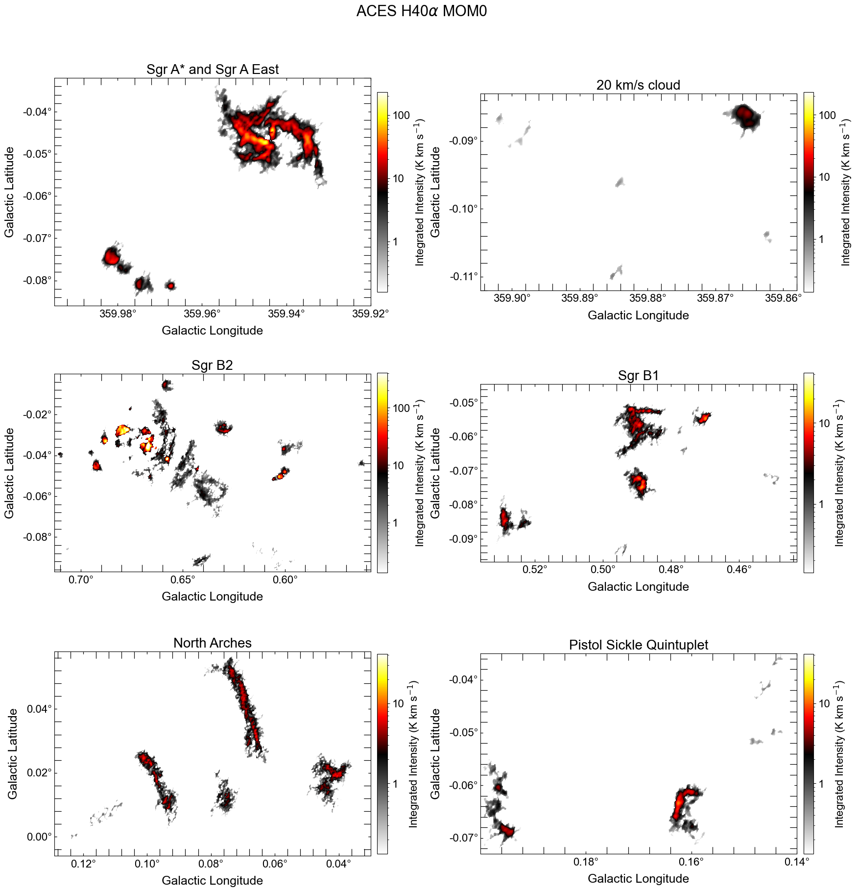
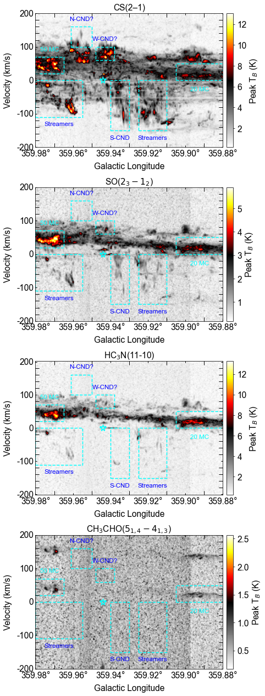
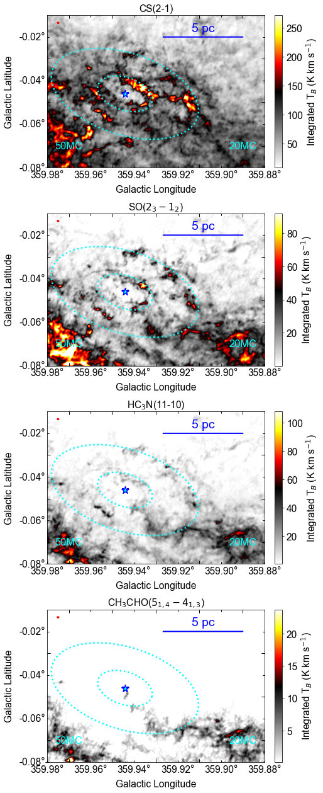

$\newcommand{\ensuremath}{}$
$\newcommand{\xspace}{}$
$\newcommand{\object}[1]{\texttt{#1}}$
$\newcommand{\farcs}{{.}''}$
$\newcommand{\farcm}{{.}'}$
$\newcommand{\arcsec}{''}$
$\newcommand{\arcmin}{'}$
$\newcommand{\ion}[2]{#1#2}$
$\newcommand{\textsc}[1]{\textrm{#1}}$
$\newcommand{\hl}[1]{\textrm{#1}}$
$\newcommand{\footnote}[1]{}$
$\newcommand{\vdag}{(v)^\dagger}$
$\newcommand$
$\newcommand$
$\newcommand{\kms}{km s^{-1}\xspace}$
$\newcommand{\hcop}{HCO^{+}\xspace}$
$\newcommand{\so}{SO(2_{3}-1_{2})\xspace}$
$\newcommand{\ha}{H40\alpha\xspace}$
$\newcommand{\hctn}{HC_3N(11-10)\xspace}$
$\newcommand{\cs}{CS(2-1)\xspace}$
$\newcommand{\chtcho}{CH_3CHO(5_{1,4}-4_{1,3})\xspace}$
$\newcommand{\app}{\sim\xspace}$
$\newcommand{\msun}{M_{\odot}\xspace}$
$\newcommand{\cms}{cm^{-2}\xspace}$
$\newcommand{\cmq}{cm^{-3}\xspace}$
$\newcommand{\asec}{^{\prime}^{\prime}\xspace}$
$\newcommand{\arcdeg}{\mbox{^\circ}}$
$\newcommand{\newcommandaffiliationlabel}[1]{$
$  \refstepcounter{affcounter}$
$  \expandafter\xnewcommand\csname #1\endcsname{\theaffcounter}$
$}$
$\newcommand{\affref}[1]{^{\csname #1\endcsname}}$
$\newcommand{\affrefs}[1]{$
$  ^{$
$    \@for\@ref:=#1\do{$
$      \@ref\@ifnextchar\@nil {,}$
$    }$
$  }$
$}$
$\newcommand{\affrefTwo}[2]{^{\csname #1\endcsname,\csname #2\endcsname}}$
$\newcommand{\affrefThree}[3]{^{\csname #1\endcsname,\csname #2\endcsname,\csname #3\endcsname}}$
$\newcommand{\affrefFour}[4]{^{\csname #1\endcsname,\csname #2\endcsname,\csname #3\endcsname,\csname #4\endcsname}}$
$\newcommand{\printaffiliation}[2]{$
$  ^{\csname #1\endcsname}#2\\%$
$}$

# ALMA Central molecular zone Exploration Survey (ACES) V:\ $\cs$, $\so$, $\chtcho$, $\hctn$ and $\ha$ lines data

<mark>Appeared on: 2026-03-03</mark> -  _Accepted to MNRAS. Website is this https URL and data release is linked from there. Pipeline code is at this https URL_

P.-Y. Hsieh, et al. -- incl., <mark>F. Xu</mark>

**Abstract:** We present data from the ALMA Central Molecular Zone Exploration Survey (ACES) Large Program, which provides broad spectral-line and 3 mm continuum coverage of the Central Molecular Zone (CMZ) at a spatial resolution of 0.1 pc. The survey delivers homogeneous, wide-field mosaics that enable direct comparisons of the physical and chemical conditions across diverse environments in the Galactic center. In this data release paper, we present the $\cs$ , $\so$ , $\chtcho$ , $\hctn$ , and $\ha$ lines observed simultaneously within two broad spectral windows.These lines reveal pronounced spatial and chemical variations across the CMZ, tracing distinct components of molecular gas, shock-affected regions, and ionized structures. The high angular resolution and multi-line capability of the ACES dataset make it a powerful resource for future studies of gas dynamics, star formation activity, and the physical connection between the CMZ and Sgr A*.

**Figure 14. -** 
2-D correlation matrix between the continuum and integrated intensities (\texttt{mom 0} images) of the spectral lines presented in this paper, \citetalias{Walker2025}, and \citetalias{Lu2025}. In the Figure 12 of \citetalias{Lu2025}, all the pixels in the ACES mosaic fields are considered. In this paper we present the sub-fields towards the Brick cloud, the 20 and 50 km s$^{-1}$ clouds, and CND, the TLP clouds, the Sgr C and Sgr B regions. Note that the Sgr A* is excluded in the CND region. The Sgr A* mask is centered on $(l,b)=(359.944^{\circ},-0.046^{\circ})$, with a radius of 4.2$"$. Negative values mean anti-correlation, and the blank cells mean the invalid values in the images preventing calculation.
 (*fig:2d-matrix*)

**Figure 13. -** The zoom-in views of the ACES $\ha$\texttt{mom0} images show regions with significant detections. For easy comparison, the names of the regions follow the nomenclature adopted in [Ginsburg and ACES Team (2025)](https://doi.org/10.1088/0000-0000). (*fig:h40a_sgra*)

**Figure 8. -** 
Left: the \texttt{mom 0} image of the CND. Sgr A* is marked with a cyan star, and the CND is outlined with a small cyan dotted ellipse. The streamers are outlined with the big ellipse  ([Liu, et. al 2013](https://ui.adsabs.harvard.edu/abs/2013ApJ...770...44L), [Hsieh, et. al 2017](https://ui.adsabs.harvard.edu/abs/2017ApJ...847....3H)) .  The $\cs$, $\so$, $\hctn$ and $\chtcho$ lines  images are presented. The beam is shown in the top left corner as a red filled eliipse. Right: the longitude-velocity diagrams of the four molecular lines zoomed-in to the region of the CND.
 (*fig:m0_mosaic_cnd*)

