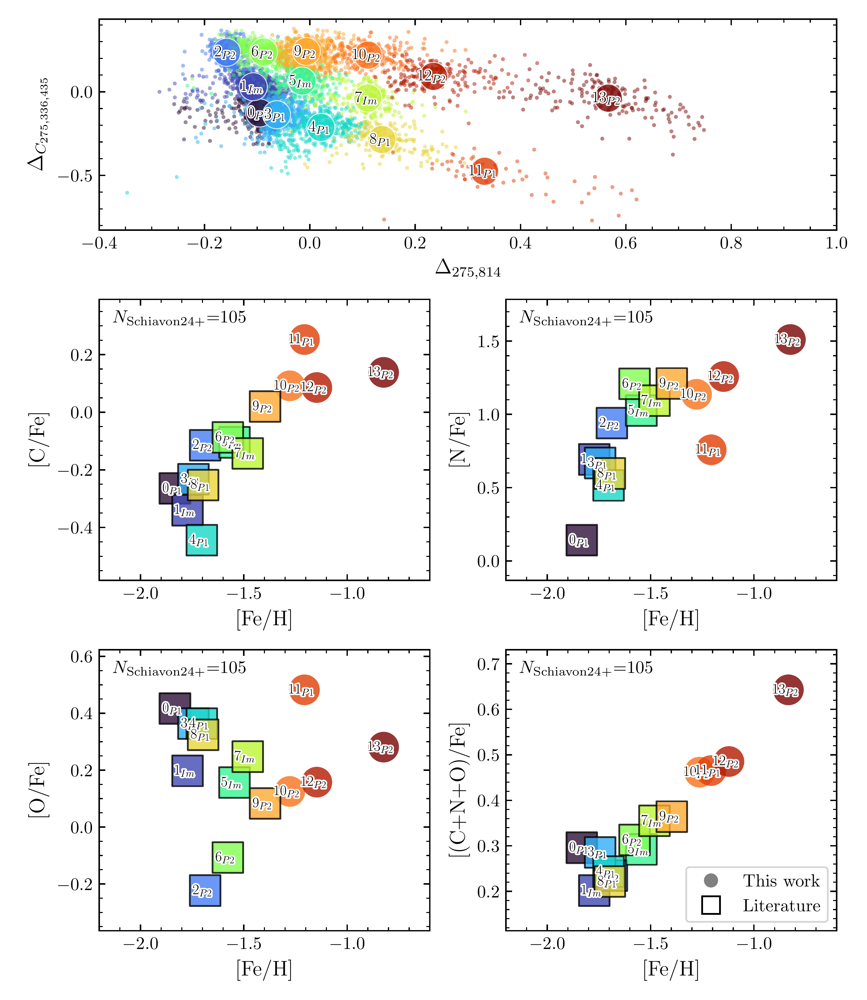
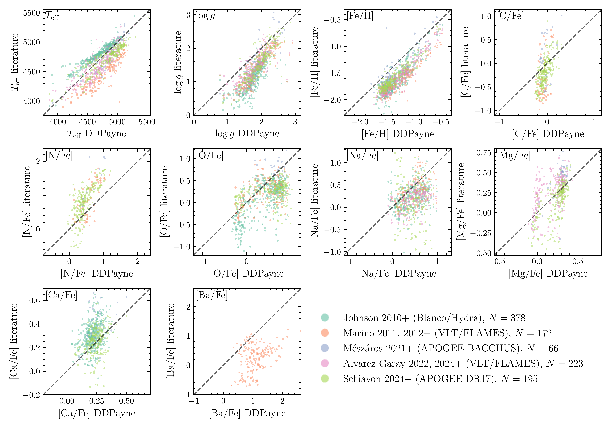
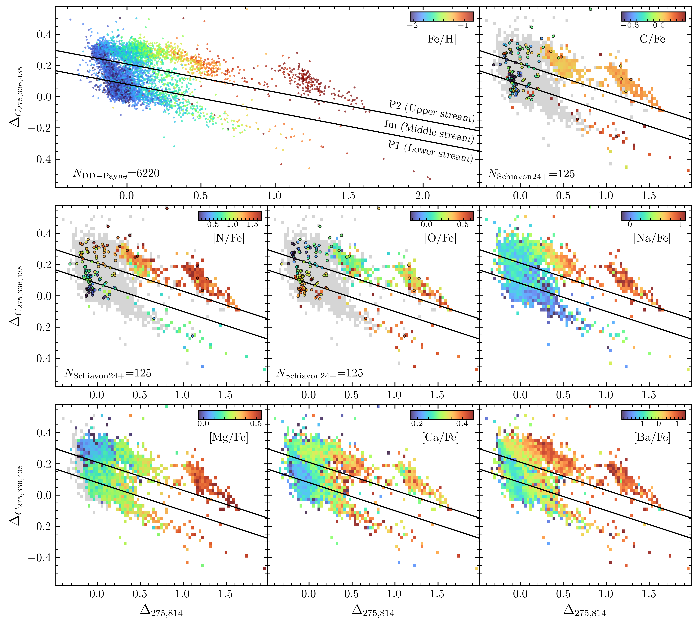

$\newcommand{\ensuremath}{}$
$\newcommand{\xspace}{}$
$\newcommand{\object}[1]{\texttt{#1}}$
$\newcommand{\farcs}{{.}''}$
$\newcommand{\farcm}{{.}'}$
$\newcommand{\arcsec}{''}$
$\newcommand{\arcmin}{'}$
$\newcommand{\ion}[2]{#1#2}$
$\newcommand{\textsc}[1]{\textrm{#1}}$
$\newcommand{\hl}[1]{\textrm{#1}}$
$\newcommand{\footnote}[1]{}$
$\newcommand{\vdag}{(v)^\dagger}$
$\newcommand$
$\newcommand$
$\newcommand{\omc}{\omega Cen}$
$\newcommand{\ebv}{\ensuremath{E(B-V)}}$
$\newcommand{\vlos}{V_{\rm LOS}}$
$\newcommand{\maspyr}{\rm{mas}~\rm{yr}^{-1}}$
$\newcommand{\perpixel}{\text{pix}^{-1}}$
$\newcommand{\maxperyr}{\rm{mas}~\rm{yr}^{-1}}$
$\newcommand{\angstrom}{\mbox{\normalfontÅ}}$
$\newcommand{\kms}{\rm{km~s^{-1}}}$
$\newcommand{\snrmuse}{\rm{S/N}_{\rm{MUSE}}}$
$\newcommand{\teff}{\ensuremath{T_{\mathrm{eff}}}}$
$\newcommand{\feh}{\ensuremath{[\mathrm{Fe/H}]}}$
$\newcommand{\logg}{\mbox{\log g}}$
$\newcommand{\xfe}{\ensuremath{[\mathrm{X/Fe}]}}$
$\newcommand{\cfe}{\ensuremath{[\mathrm{C/Fe}]}}$
$\newcommand{\nfe}{\ensuremath{[\mathrm{N/Fe}]}}$
$\newcommand{\ofe}{\ensuremath{[\mathrm{O/Fe}]}}$
$\newcommand{\mgfe}{\ensuremath{[\mathrm{Mg/Fe}]}}$
$\newcommand{\alfe}{\ensuremath{[\mathrm{Al/Fe}]}}$
$\newcommand{\nafe}{\ensuremath{[\mathrm{Na/Fe}]}}$
$\newcommand{\bafe}{\ensuremath{[\mathrm{Ba/Fe}]}}$
$\newcommand{\alphafe}{\ensuremath{[\mathrm{\alpha/Fe}]}}$
$\newcommand{\dex}{\ensuremath{ \mathrm{dex}}}$
$\newcommand{\nad}{\ensuremath{\mathrm{Na \textsc{i} D}}}$
$\newcommand{\ddpayne}{\textsc{DD-Payne}}$
$\newcommand{\ddpayneg}{\textsc{DD-Payne-G}}$
$\newcommand{\ddpaynea}{\textsc{DD-Payne-A}}$
$\newcommand{\ddpayneamp}{\textsc{DD-Payne-A-mp}}$
$\newcommand{\cannon}{\textsc{The Cannon}}$
$\newcommand{\thepayne}{\textsc{The Payne}}$
$\newcommand{\pampelmuse}{\textsc{PampelMUSE}}$
$\newcommand{\abinitio}{\emph{ab initio}}$

# oMEGACat. IX. Chemical Tagging of Omega Centauri Populations with Machine-Learning-Inferred Abundances from the MUSE Spectrograph

<mark>Appeared on: 2026-03-03</mark> -  _27 pages, 13 figures, 4 tables, submitted to ApJ. Machine-readable data will be available in the online article when accepted_

Z. Wang (王梓先), et al. -- incl., <mark>C. Clontz</mark>, <mark>N. Neumayer</mark>

**Abstract:** We present chemical abundance measurements for 7,302 red giant branch stars within the half-light radius ( $\sim5'$ ) of $\omega$ Centauri ( $\omc$ ), derived from MUSE spectra using the neural network model $\ddpayne$ . $\ddpayne$ effectively identifies spectral features of C, N, and O for $\feh >-1.0$ dex; Mg for $\feh >-1.5$ dex; and Na, Ca, and Ba for all metallicities.By combining these measurements with previous high-resolution studies, we create the most comprehensive picture of $\omc$ 's rich chemical evolutionary history.For the first time, we map elemental variations across the entire chromosome diagram, which is widely used to identify multiple populations.We analyze the median chemical abundance trends as functions of age and metallicity for different subpopulations.The $\ddpayne$ measurements of [ C/Fe ] , [ N/Fe ] , and [ O/Fe ] extend literature trends to higher metallicities and show continuous abundance-metallicity relations, with [ (C+N+O)/Fe ] increasing steadily with $\feh$ . [ Ca/Fe ] and the $s$ -process element [ Ba/Fe ] also increase with metallicity across all populations. For [ Ba/Fe ] , the chemically enhanced (P2) populations are more enriched than primordial (P1) and the intermediate (Im) populations.Furthermore, [ N/Fe ] correlates strongly with stellar age while [ Ca/Fe ] and [ Ba/Fe ] exhibits a weaker age dependence.Using these abundance-metallicity-age relations, we evaluate different formation scenarios of $\omc$ proposed in the literature.Our study demonstrates that combining MUSE with machine learning enables large-sample stellar abundance measurements in crowded cluster cores, overcoming the limitations of fiber-fed spectroscopy for studying multiple stellar populations and their evolutionary histories.

**Figure 9. -** 
    Chemical abundances of C, N, O, and (C+N+O) as a function of $\feh$  for subpopulations defined by \cite{Clontz2025arXiv}.
    The top panel shows the chromosome diagram based on the photometry from \cite{Clontz2025arXiv}.
    For the remaining panels, we plot the median abundance as a function of metallicity for each element to illustrate the abundance-metallicity relations.
    Circles represent the $\ddpayne$  measurements following the selection criteria in Section \ref{subsec:results-quality}, and squares are literature results, with the number of literature stars used written in the top left corner.
     (*fig:xfe_feh_subpops_CNO*)

**Figure 4. -** 
    Direct comparison of $\ddpayne$  abundance measurements for oMEGACat $\ddpayne$  stars with literature values for the cross-matched samples.
    Common stars between oMEGACat and each literature catalog are shown in different colors, with point size indicating $\snrmuse$ .
    The number of common stars is provided in the legend for each literature work, and the black dashed lines are the one-to-one relation for visual reference.
     (*fig:abundances_1_1_literature*)

**Figure 7. -** 
    Chromosome diagram of $\omc$  stars.
    The top-left panel shows individual stars from the oMEGACat $\ddpayne$  sample, color-coded by $\feh$ .
    The remaining panels show the median $\ddpayne$  chemical abundances calculated using stars within each grid cell (0.035 on the x-axis and 0.02 on the y-axis).
    Particularly, $\ddpayne$  measurements of [C/Fe], [N/Fe], and [O/Fe] are shown only for stars with $\feh _{\rm uncal}>-1$ dex, and [Mg/Fe] only for stars with $\feh _{\rm uncal}>-1.5$ dex.
    Gray regions in the [C/Fe], [N/Fe], [O/Fe], and [Mg/Fe] panels are areas excluded by these cuts.
    We also plot individual abundance measurements for C, N, and O from APOGEE DR17 \citep{Schiavon2024MNRAS} to show their variance in the metal-poor regime.
    Black lines indicate the boundaries of the upper (P2), middle (Im), and lower (P1) stellar streams defined in \cite{Clontz2025ApJ}.
     (*fig:ChM_xfe*)

