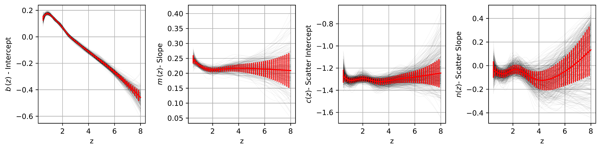
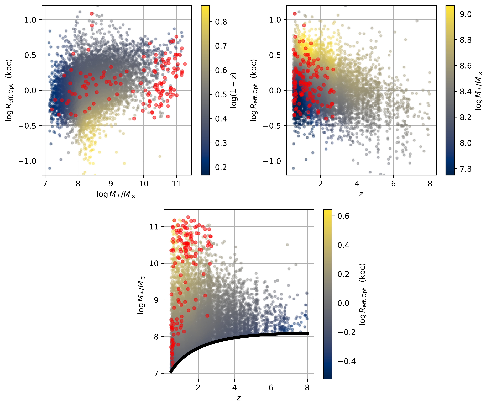
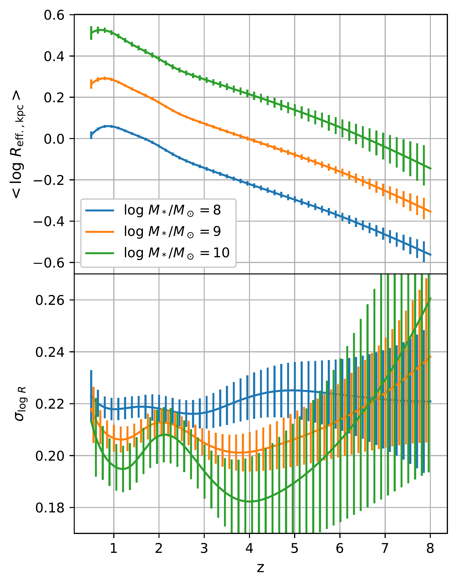

$\newcommand{\ensuremath}{}$
$\newcommand{\xspace}{}$
$\newcommand{\object}[1]{\texttt{#1}}$
$\newcommand{\farcs}{{.}''}$
$\newcommand{\farcm}{{.}'}$
$\newcommand{\arcsec}{''}$
$\newcommand{\arcmin}{'}$
$\newcommand{\ion}[2]{#1#2}$
$\newcommand{\textsc}[1]{\textrm{#1}}$
$\newcommand{\hl}[1]{\textrm{#1}}$
$\newcommand{\footnote}[1]{}$
$\newcommand{\vdag}{(v)^\dagger}$
$\newcommand$
$\newcommand$
$\newcommand{\todo}[1]{{\textcolor{red}{#1}}}$

# Everything Every Band All at Once II: The Relationship Between Optical Size and Stellar Mass Over Eight Billion Years of Cosmic History

<mark>Appeared on: 2026-03-03</mark> -  _Submitted to ApJ. See also Zhang et al., the first paper in this series_

T. B. Miller, et al. -- incl., <mark>A. d. Graaff</mark>

**Abstract:** While the size-mass relation provides insight into the structural evolution of galaxies, the data available and methods employed have hindered our ability to study a detailed and comprehensive description of this key relation across cosmic history. The first paper in this series presents a morphology catalog based on 20 band JWST data in the field of Abell 2744. In this paper we utilize this catalog to measure the size-mass relation from $0.5<z<8$ and $0.5<z<3$ for star-forming and quiescent galaxies respectively. We perform a global fit to our sample using B-splines to flexibly model the redshift evolution which enforces smooth evolution and can account for all observational uncertainties. Symbolic regression is used to derive simple and portable expressions that describe the redshift evolution of the size-mass relation. Analyzing the size evolution of star-forming galaxies in the context of previous work at $z\sim0$ and $z>10$ , we discuss three distinct phases: Rapid growth at $z>5$ , growth that mimics dark matter halos at $5< z <1$ and a late plateau at $0.5<z<1$ . For quiescent galaxies we confirm previous findings that the size-mass relation flattens at $\log M_*/M_\odot < 10$ , which inverts at $z>1$ . Our results imply that quiescent galaxies are smaller than their star-forming counterparts only at around $\log M_*/M_\odot = 10$ ; the two populations have similar sizes at lower and higher masses.

**Figure 9. -** The measured evolution of the parameters describing the size-mass relationship for star-forming galaxies (defined in Eqn. \ref{eqn:sf_pl} and Eqn. \ref{eqn:sf_sig}. The red line showcases the median of the posterior with the error bars denoting the 16th - 84th percentile interval. 250 individual draws from the posterior are shown as the thin black lines. Our method utilizing B-splines to model the redshift evolution allows for complex and non-monotonic evolution while maintaining continuity and smoothness. Qualitatively we find that that the average size of galaxy, as indicated by the intercept $b$, decrease as a function of redshift, except for a plateau at $z<1$, while the slope of the size-mass relation, $m$, stays decreases from $z=0.5$ to $z=1$ but stays constant afterwards. (*fig:sf_params*)

**Figure 8. -** An overview of the sample of galaxies from UNCOVER/MegaScience used in our global size mass fit. We show three panels each with a different slice of the three dimensional relationship between stellar mass, rest-frame optical size and redshift. In each panel star forming galaxies are shown with the colored points where the color describes the median of the third parameter calculated using the \texttt{loess} algorithm. (cleveland1979, [Cappellari, McDermid and Alatalo 2013]()) . Quiescent galaxies are shown as individual red points. (*fig:sample*)

**Figure 2. -** The average size and intrinsic scatter as a function of mass and redshift as measured in this study. The redshift evolution of the average size as function of redshift for three different masses are shown in the top panel. The error bars here denote the measurement uncertainty, not the scatter within the population. At $z>1.5$ the rate of growth is similar across all masses as the slope of the size-mass relation is constant, however at $z<1$ we find more of a turnover in low mass galaxies compared to higher masses at $\log M_*/M_\odot > 9$. The measured scatter around the size-mass relation is shown as a function of mass and redshift in the bottom panel. We find a consistent negative mass dependence of the scatter, galaxies at $\log M_*/M_\odot = 10$ show a scatter of around 0.2 dex whereas for low mass galaxies at $\log M_*/M_\odot = 8$ the scatter is measured to be 0.22 dex. However, our constraints on the scatter are weak at $z>4$ due to the limited sample size of galaxies at this redshift. (*fig:sf_res_overview*)

