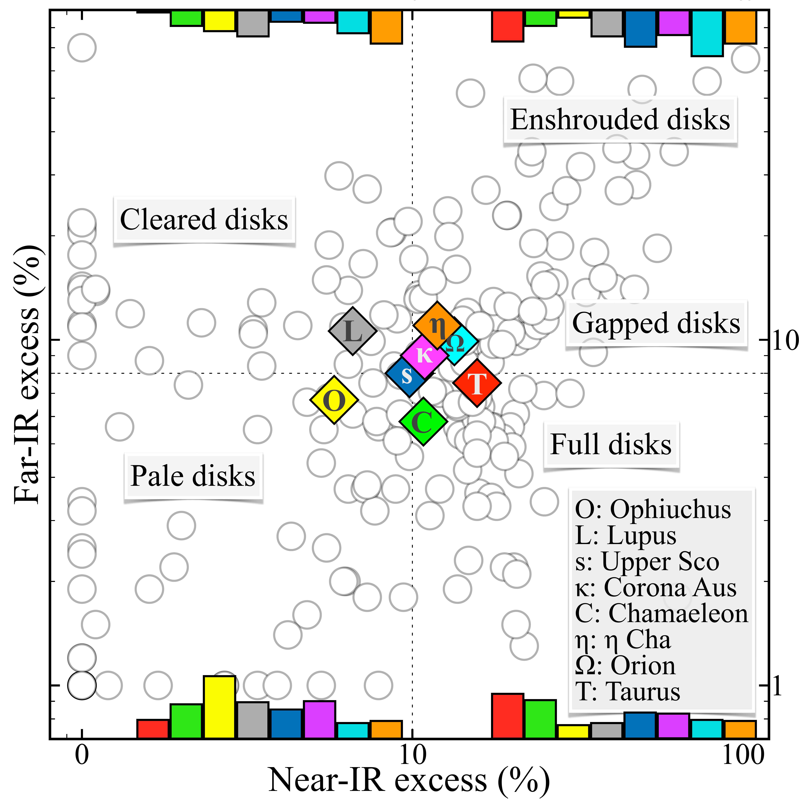

$\newcommand{\ensuremath}{}$
$\newcommand{\xspace}{}$
$\newcommand{\object}[1]{\texttt{#1}}$
$\newcommand{\farcs}{{.}''}$
$\newcommand{\farcm}{{.}'}$
$\newcommand{\arcsec}{''}$
$\newcommand{\arcmin}{'}$
$\newcommand{\ion}[2]{#1#2}$
$\newcommand{\textsc}[1]{\textrm{#1}}$
$\newcommand{\hl}[1]{\textrm{#1}}$
$\newcommand{\footnote}[1]{}$

# Planet-forming disks and their environment \ across regions and time from the full NIR census

<mark>Appeared on: 2026-03-03</mark> -  _Accepted for publication by A&A_

A. Garufi, et al. -- incl., <mark>M. Benisty</mark>

**Abstract:** The evolution of planet-forming disks and the processes of planet formation influence each other, and both of them are possibly impacted by the local environment. Extensive high-resolution imagery of disks across space and time is the best tool for determining their evolution. We compiled a comprehensive list of disk-bearing young stars with near-IR high-contrast images available. The sample sums up to 268 sources, including 51 targets with no prior publications, which makes this study the largest of its kind and the most extensive release of IR disk images to date. Our census reveals very diverse disk and ambient morphologies. Disks in Lupus are bright, in Chamaeleon are faint, in Corona Australis and Taurus are frequently surrounded by ambient emission. Disks experience an abrupt increase in IR brightness between $\mbox{2 Myr}$ and 5 Myr. The earliest IR disk cavities around single stars arise after 2--3 Myr explaining why are young disks faint in the near-IR, and determining which disks can live longer. Well-known, high-longevity disks ( $>$ 8 Myr) are always bright. Ambient material is detected in more than 20 \% of young sources but the fraction drops with time. We find a clear correspondence for the presence of ambient material with the stellar variability, near-IR excess, and mass accretion rate as well as, in turn, with spirals and shadows in disks. Half of the disks with ambient material show spirals while none of them show rings. We therefore propose that the spirals and the disk warps responsible for shadows are generally induced by late infall from the medium, and that this also affects the stellar accretion. The emerging picture proves the fundamental role of the environment for the disk evolution and planet formation.

**Figure 11. -** Gallery of the original images. The DESTINYS targets are gathered in the first five rows above the horizontal line. For each object, the $Q_\phi$ image is shown. The flux scale is arbitrary and different from source to source. The ruler indicates an angular size of 0.5$\arcsec$ corresponding to the spatial scale indicated in each panel.  (*fig:new_sources_gallery*)

**Figure 4. -** Census of disk brightness. _(a)_: trend with FIR excess for the seven most represented regions. The dashed line is the fit to all points except Orion, which is outlying due to the larger distance. _(b)_: trend with age for all {unflagged}, nearby sources. The median value of all regions (including Orion) is shown with colored diamonds as in (a). The dashed line is the median in different age beams. _(c)_: trend with NIR excess. Sources with local shadows are marked {with crosses. The shaded region indicates the exclusion area, since disks detected in low-NIR sources are always bright.}_(d)_: trend with scaled millimeter flux. The shaded region is what we define the regime of heavily self-shadowed disks. The top x-axis gives a coarse indication of the dust mass corresponding to the measured flux under standard assumptions. The bottom panels are the NIR images of the peculiar targets labeled in the diagrams. {Underlined names indicate images with no prior publications. The colored diamonds to the corner of each image indicate the respective region as in (a), {with the addition of a blue c indicating Centaurus}.} (*fig:contrast_trend*)

**Figure 3. -** Stellar and disk properties of the sample. Left: median fraction of systems, NIR and FIR excess (fraction of stellar flux), mass accretion rate (log($\rm M_\odot yr^{-1}$)), stellar variability (mag), and integrated millimeter flux at a same distance (mJy) for the sub-samples of Table \ref{table:sub_sample}. The median value of the entire sample is at the center of the respective column {while the neighboring vertical lines indicate the 30th and 70th percentiles (for quantities of individual sources only)}. Remarkable values {(smaller and larger percentiles or clear outliers) that are} discussed in the text are highlighted by a circle. Right: FIR vs NIR excess diagram of all sources. The median values of the entire sample determines the four quadrants. The diamonds indicate the median values of Taurus (red), Upper Sco (blue), Orion (cyan), Chamaeleon (green), Lupus (grey), Corona Australis (violet), and $\eta$ Cha (orange). {The vertical bars illustrate the relative number of sources from all regions in each quadrant.} (*fig:unres_prop*)

