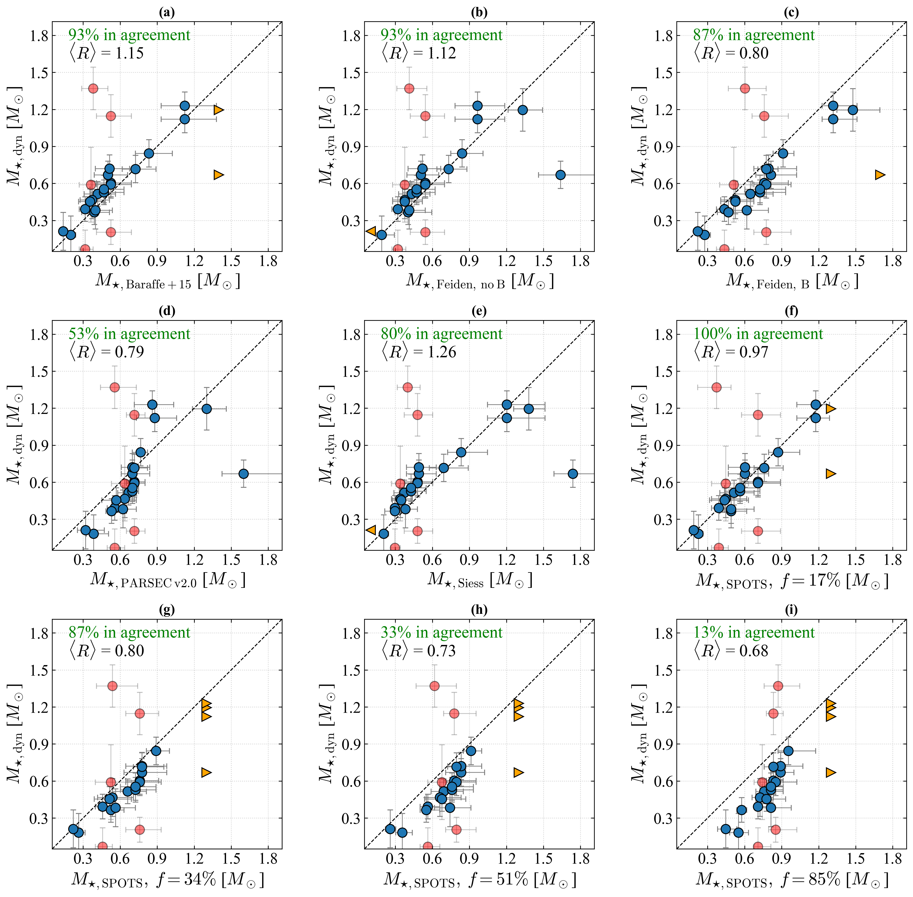
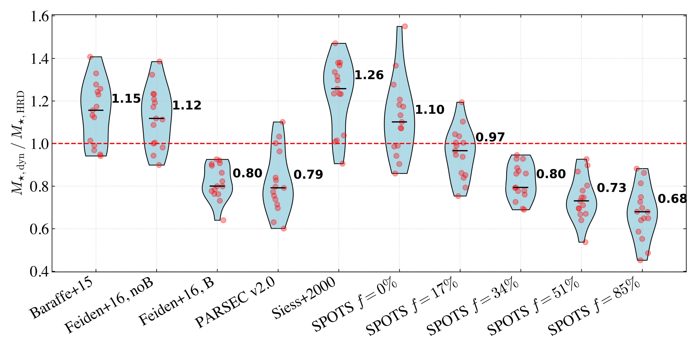
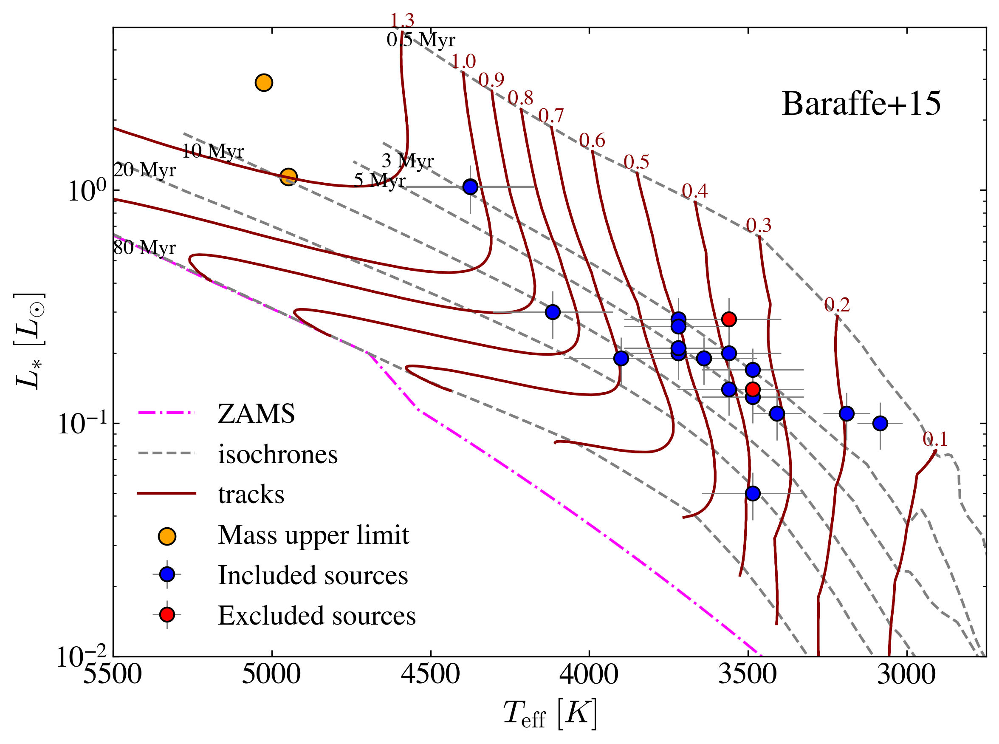
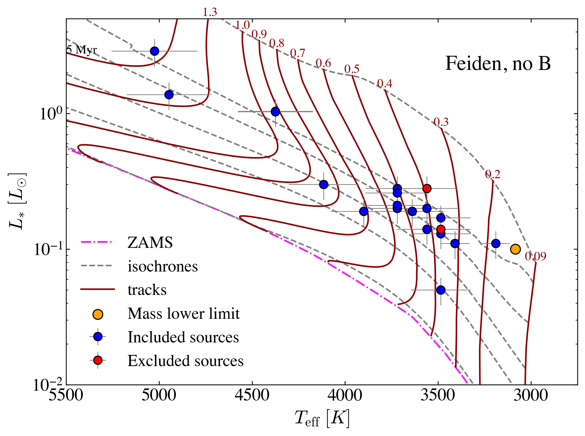
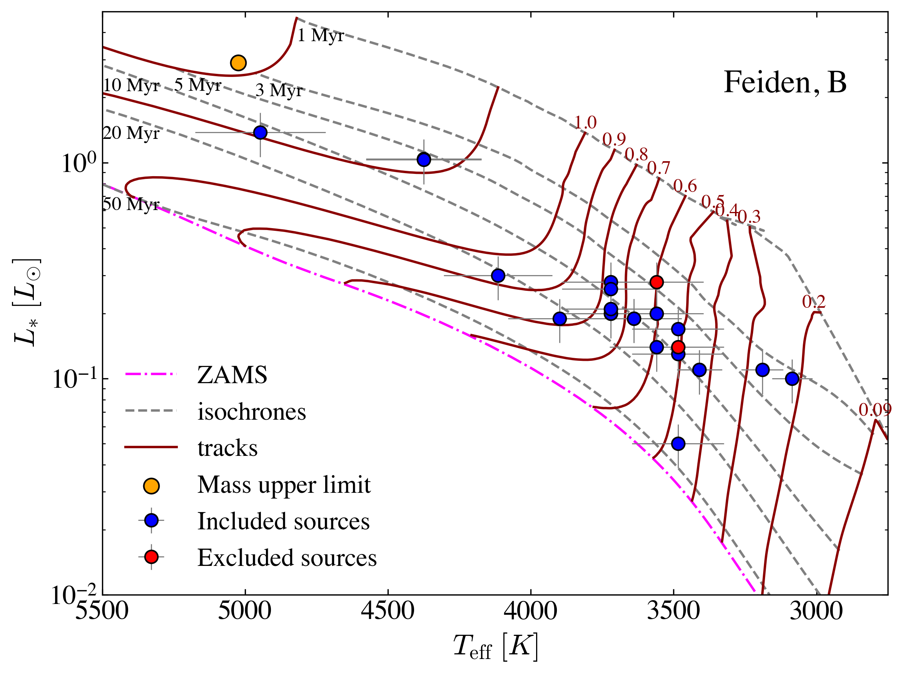
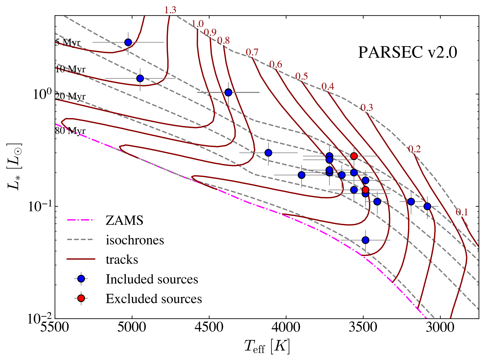
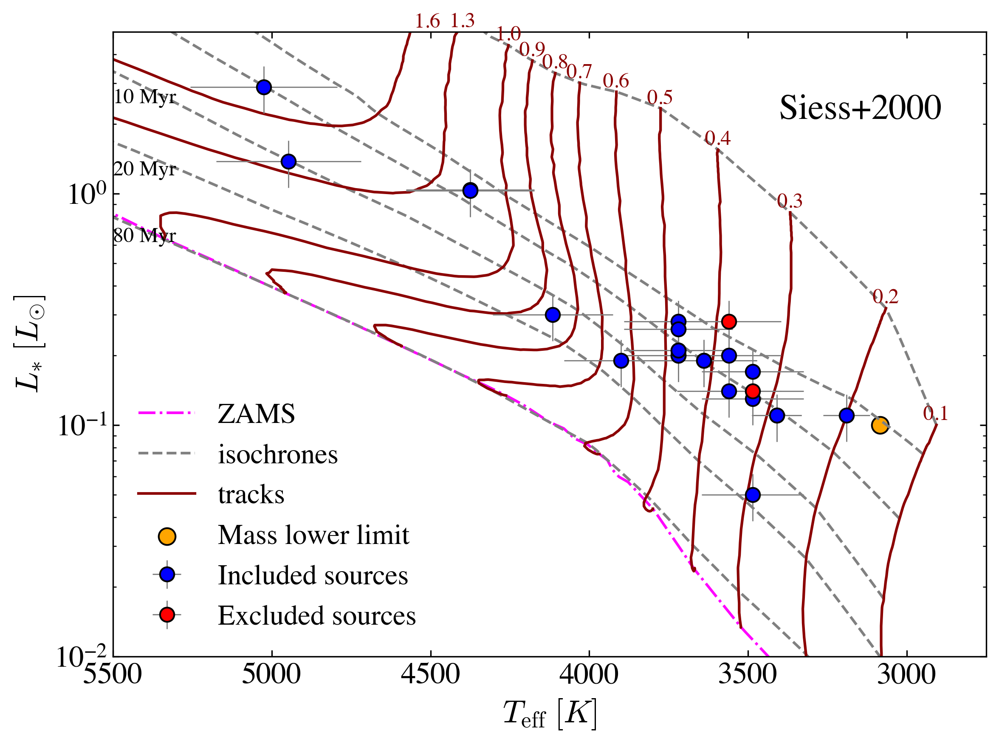
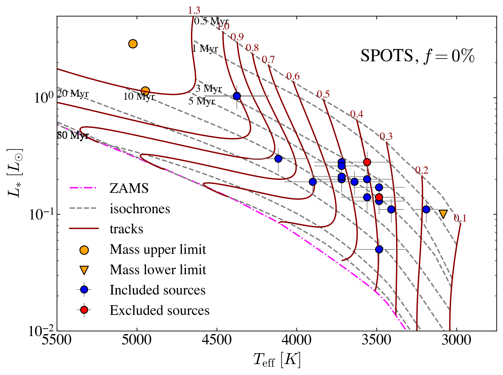

$\newcommand{\ensuremath}{}$
$\newcommand{\xspace}{}$
$\newcommand{\object}[1]{\texttt{#1}}$
$\newcommand{\farcs}{{.}''}$
$\newcommand{\farcm}{{.}'}$
$\newcommand{\arcsec}{''}$
$\newcommand{\arcmin}{'}$
$\newcommand{\ion}[2]{#1#2}$
$\newcommand{\textsc}[1]{\textrm{#1}}$
$\newcommand{\hl}[1]{\textrm{#1}}$
$\newcommand{\footnote}[1]{}$
$\newcommand{\gr}[1]{\textbf{GR: \color{cyan} #1}}$

# Benchmarking pre-main sequence stellar evolutionary tracks using disk-based dynamical stellar masses  

<mark>Appeared on: 2026-03-05</mark> -  _Accepted for publication in A&A. 7 Figures, 2 Tables_

L. Zallio, et al. -- incl., <mark>F. Zagaria</mark>

**Abstract:** Stellar masses are a fundamental property to understand models of pre-main sequence evolution, but their values derived from Hertzsprung–Russell (HR) diagrams are strongly model dependent. We benchmark pre-main sequence stellar evolutionary tracks using stellar masses dynamically estimated by fitting a parametric model to ALMA observations of the $^{12}$ CO $(J=3-2)$ line transition emitted by the disks orbiting 20 sources in the old ( $4-14$ Myr) Upper Scorpius star forming region. We derive stellar masses from HR diagram fitting for ten different stellar evolutionary models, which we then compare with their stellar dynamical masses for comparison in the stellar mass range $0.1-1.3 \> M_\odot$ . Models with a moderate-to-low fraction of cold stellar spots ( $f=17\%$ ) most accurately reproduce the dynamical stellar masses ( $100\%$ of the targets agree within $\pm1\sigma$ ). While a higher spot coverage ( $f=34\%$ ) provides similar stellar mass predictions similar to magnetic equipartition models, larger fractions ( $f\geq51\%$ ) significantly disagree with dynamical masses. Magnetic equipartition models overestimate stellar masses up to a factor $\sim20\%$ , whereas non-magnetic models underestimate them up to $\sim12\%$ . For some models, there is evidence that the stellar mass discrepancies are anticorrelated with dynamical stellar masses. When stellar dynamical mass priors are considered in HR diagram fitting, the median age of a single source can change up to $\sim25\%$ , while the median ages inferred across different tracks become consistent, with the age scatter decreasing by $\gtrsim77\%$ . These results provide strong empirical constraints for testing and developing evolutionary models of pre-main sequence stars.

**Figure 2. -** Comparison between the dynamical stellar masses $M_{\star,\text{dyn}}$ and the masses from HR diagram fitting $M_{\star,\text{HRD}}$. The red points represent the excluded sources discussed in Sect. \ref{sec:data}, while the orange triangles represent mass upper and lower limits.
     (*fig:M*_comparison*)

**Figure 1. -** Violin plot of the ratio of the dynamical stellar masses from disk rotation ($M_{\star,\text{dyn}}$) and the stellar masses from evolutionary models ($M_{\star,\text{HRD}}$) in the mass range $0.1-1.3 \>M_{\odot}$. One-to-one line is indicated with a red dashed line. The median value of $M_{\star,\text{dyn}} / M_{\star,\text{HRD}}$ is reported next to each distribution. (*fig:violin*)

**Figure 4. -** Hertzsprung–Russell diagrams with the different theoretical evolutionary tracks, the isochrones, and the 25 YSOs considered in this work. (*fig:hrd_spots_085*)

