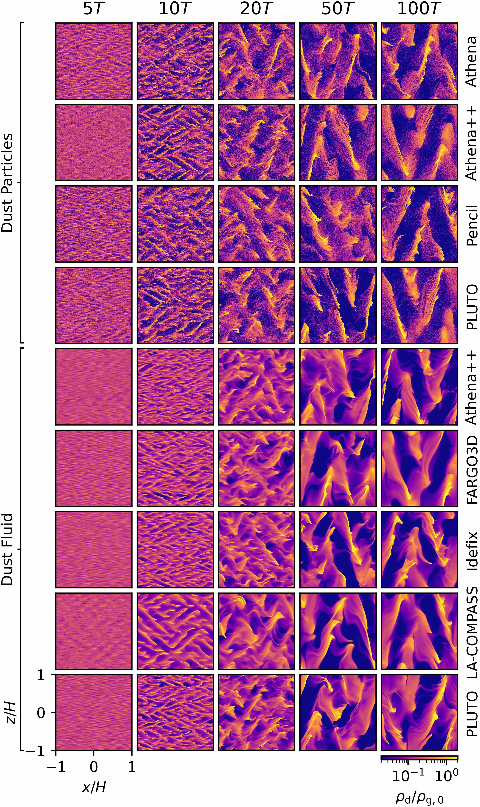
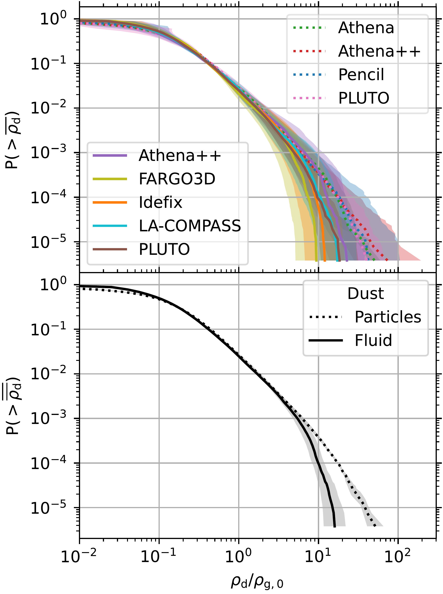
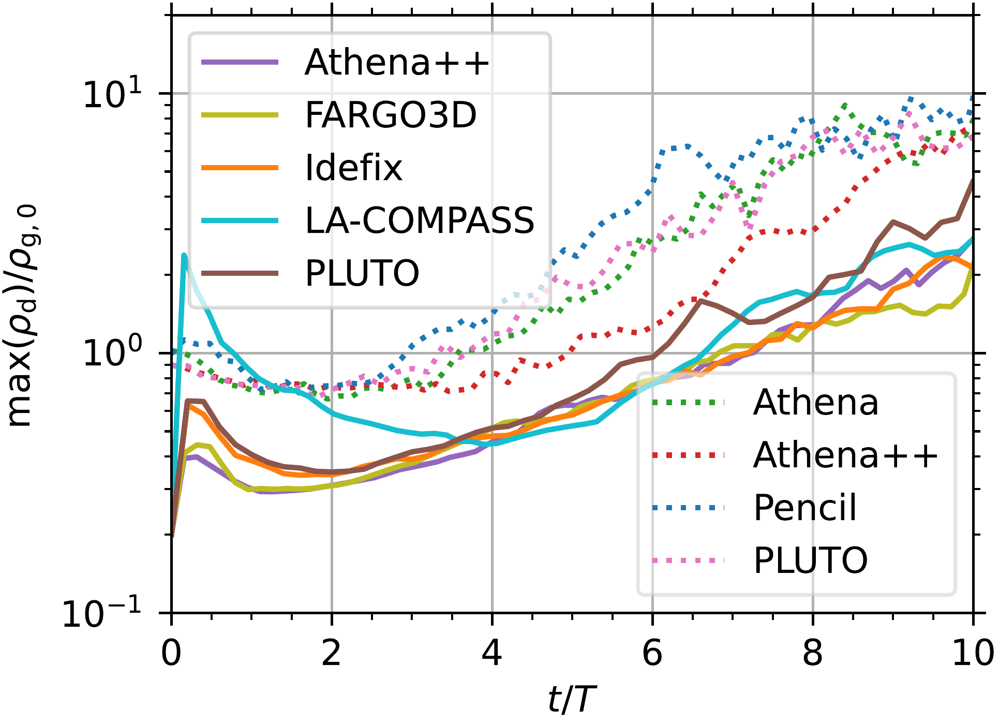

$\newcommand{\ensuremath}{}$
$\newcommand{\xspace}{}$
$\newcommand{\object}[1]{\texttt{#1}}$
$\newcommand{\farcs}{{.}''}$
$\newcommand{\farcm}{{.}'}$
$\newcommand{\arcsec}{''}$
$\newcommand{\arcmin}{'}$
$\newcommand{\ion}[2]{#1#2}$
$\newcommand{\textsc}[1]{\textrm{#1}}$
$\newcommand{\hl}[1]{\textrm{#1}}$
$\newcommand{\footnote}[1]{}$
$\newcommand{\vdag}{(v)^\dagger}$
$\newcommand$
$\newcommand$
$\newcommand{\anote}{^{\mathrm{a}}}$
$\newcommand{\bnote}{^{\mathrm{b}}}$
$\newcommand{\cnote}{^{\mathrm{c}}}$
$\newcommand{\dnote}{^{\mathrm{d}}}$
$\newcommand{\enote}{^{\mathrm{e}}}$
$\newcommand{\fnote}{^{\mathrm{f}}}$
$\newcommand{\gnote}{^{\mathrm{g}}}$
$\newcommand{\hnote}{^{\mathrm{h}}}$
$\newcommand{\inote}{^{\mathrm{i}}}$
$\newcommand{\jnote}{^{\mathrm{j}}}$
$\newcommand{\knote}{^{\mathrm{k}}}$
$\newcommand{\lnote}{^{\mathrm{l}}}$
$\newcommand{\mnote}{^{\mathrm{m}}}$
$\newcommand{\nnote}{^{\mathrm{n}}}$
$\newcommand{\onote}{^{\mathrm{o}}}$
$\newcommand{\pnote}{^{\mathrm{p}}}$
$\newcommand{\qnote}{^{\mathrm{q}}}$
$\newcommand{\rnote}{^{\mathrm{r}}}$
$\newcommand{\snote}{^{\mathrm{s}}}$
$\newcommand{\tnote}{^{\mathrm{t}}}$
$\newcommand{\unote}{^{\mathrm{u}}}$
$\newcommand{\vnote}{^{\mathrm{v}}}$
$\newcommand{\wnote}{^{\mathrm{w}}}$
$\newcommand{\xnote}{^{\mathrm{x}}}$
$\newcommand{\ynote}{^{\mathrm{y}}}$
$\newcommand{\znote}{^{\mathrm{z}}}$
$\newcommand{\avgrhod}{\overline{\rhod}}$
$\newcommand{\cs}{c_\mathrm{s}}$
$\newcommand{\pareff}{\varepsilon_\parallel}$
$\newcommand{\relpareff}{\varepsilon_\parallel^\mathrm{rel}}$
$\newcommand{\etavK}{\eta v_\mathrm{K}}$
$\newcommand{\kWh}{\mathrm{kW}\cdotp\mathrm{h}}$
$\newcommand{\meanavgrhod}{\overline{\avgrhod}}$
$\newcommand{\np}{n_\mathrm{p}}$
$\newcommand{\od}{\mathrm{d}}$
$\newcommand{\Prob}{\mathrm{P}}$
$\newcommand{\Npe}{N_\mathrm{PE}}$
$\newcommand{\rhod}{\rho_\mathrm{d}}$
$\newcommand{\rhog}{\rho_\mathrm{g}}$
$\newcommand{\rhogn}{\rho_\mathrm{g,0}}$
$\newcommand{\SMA}{\mathrm{SMA}}$
$\newcommand{\taus}{\tau_\mathrm{s}}$
$\newcommand{\tlim}{t_\mathrm{lim}}$
$\newcommand{\TNpe}{T_{\Npe}}$
$\newcommand{\tstop}{t_\mathrm{stop}}$
$\newcommand{\Uvec}{\mathbf{U}}$
$\newcommand{\uvec}{\mathbf{u}}$
$\newcommand{\Vvec}{\mathbf{V}}$
$\newcommand{\vvec}{\mathbf{v}}$
$\newcommand{\xhat}{\hat{\mathbf{x}}}$
$\newcommand{\yhat}{\hat{\mathbf{y}}}$
$\newcommand{\jakesays}[1]{{\bf \color{orange}[JBS: #1]}}$
$\newcommand{\jbs}[1]{{\color{orange}#1}}$
$\newcommand{\sijmejansays}[1]{{\bf \color{green}[SJP: #1]}}$
$\newcommand{\rixinsays}[1]{{\bf \color{teal}[RL: #1]}}$
$\newcommand{\krutisays}[1]{{\bf \color{violet}[PS: #1]}}$

# A Comparative Study of the Streaming Instability:\\Unstratified Models with Marginally Coupled Grains

<mark>Appeared on: 2026-03-06</mark> -  _25 pages, 14 figures, submitted to ApJ; for associated repository, see this https URL_

S. A. Baronett, et al. -- incl., <mark>M. Flock</mark>, <mark>P. Sudarshan</mark>

**Abstract:** The streaming instability is a leading mechanism for concentrating solids and initiating planetesimal formation in protoplanetary disks.Although numerous studies have explored its linear growth, nonlinear evolution, and implications for planet formation, the diversity of numerical methods and dust treatments used across the literature has made it difficult to assess which features of the instability are physically robust and which arise from code-dependent choices.We present the first systematic comparison of seven hydrodynamic codes---spanning finite-volume and finite-difference schemes and modeling dust either as Lagrangian particles or as a pressureless fluid---applied to the unstratified streaming instability with a dimensionless stopping time of unity.All codes reproduce the characteristic sequence of exponential growth, filament formation, and turbulent saturation, demonstrating broad agreement in the qualitative behavior of the instability.Quantitatively, however, the dust model remains the dominant source of variation at moderate resolution:particle-based simulations reach higher peak densities and exhibit broader high-density tails than fluid-based models at $512^2$ resolution, although increasing the number of particles brings their initial maximum density evolution into close agreement with that of dust-fluid models.At $1024^2$ , these differences diminish substantially, indicating better agreement of the saturated-state statistics across dust treatments.In terms of computational performance, most particle implementations suffer from imbalanced parallelized loads, while execution on a GPU is at least two to three times more energy efficient and scales better at higher resolutions than on CPUs.Given the intrinsic stochasticity of this nonlinear system, only statistical diagnostics remain meaningful across codes.

**Figure 11. -** Dust density snapshots for Problem BA at grid resolution $512^2$.
    Each row shows those from a single code (Section \ref{sec:codes_numerical_methods}), and each column shows the simulation time in local orbital periods $T$.
    In alphabetical order from top to bottom, upper and lower groups implement an average of $\np = 1$ particle per grid cell/point and a pressureless dust fluid, (Sections \ref{sec:lagrangian_dust_particles} and \ref{sec:pressureless_dust_fluid}) respectively.
    Radial $x$ and vertical $z$ coordinates are in units of the vertical gas scale height $H$.
    The color scale at the bottom right shows the dust density $\rhod$ relative to the initially uniform gas density $\rhogn$ and applies to all snapshots. (*fig:BA-512_snapshots*)

**Figure 3. -** Cumulative distribution functions of the dust density $\rhod$ for Problem BA at grid resolution $512^2$.
    Dotted and solid lines show codes that implement an average of $\np = 1$ particle per grid cell/point and a pressureless dust fluid, (Sections \ref{sec:lagrangian_dust_particles} and \ref{sec:pressureless_dust_fluid}) respectively, with all $\rhod$ relative to the initially uniform gas density $\rhogn$.
    In the upper panel, curves show time averages over the saturated state $\avgrhod$(cf. Figure \ref{fig:BA-512_time_series}), colors different codes (Section \ref{sec:codes_numerical_methods}), and shaded areas the $1\sigma$ time variability.
    In the lower panel, curves show the mean $\meanavgrhod$ of all particle or fluid codes in the upper panel, and shaded areas the standard deviation of their respective $\avgrhod$. (*fig:BA-512_CDF*)

**Figure 1. -** Maximum dust density $\max($\rhod$)$ as a function of time $t < 10T$ for Problem BA at grid resolution $512^2$.
    The units for density and time are the initially uniform gas density $\rhogn$ and the local orbital period $T$, respectively.
    Using a similar cadence for each time series, dotted lines show particle codes (with average of $\np = 1$ particle per grid cell/point), solid lines show codes with pressureless dust fluids, and colors differentiate the codes (Sections \ref{sec:lagrangian_dust_particles}, \ref{sec:pressureless_dust_fluid}, and \ref{sec:codes_numerical_methods}, respectively). (*fig:BA-512_time_series_pre-10T*)

