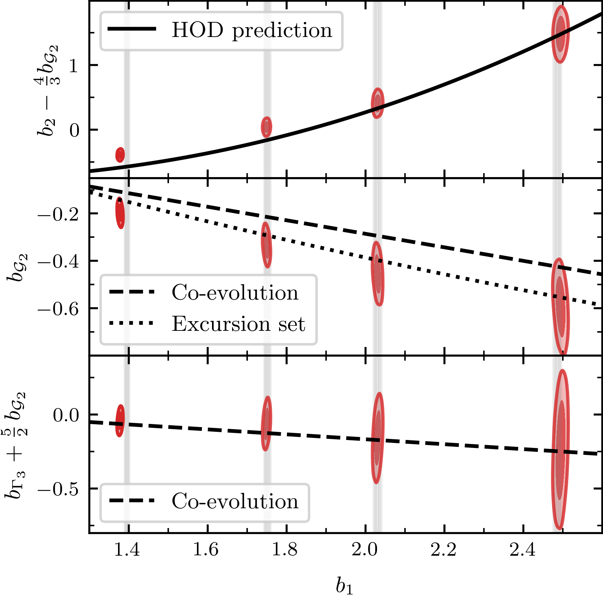
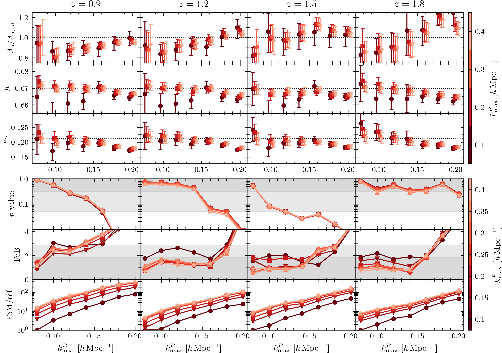
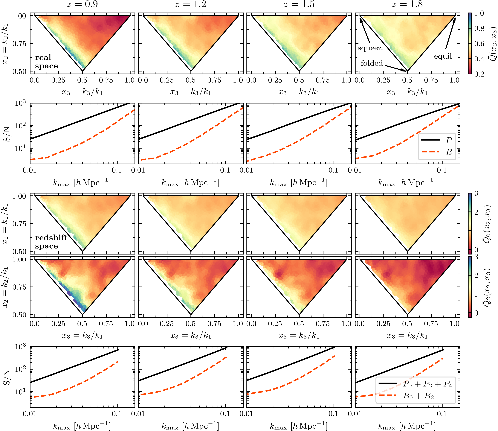

$\newcommand{\ensuremath}{}$
$\newcommand{\xspace}{}$
$\newcommand{\object}[1]{\texttt{#1}}$
$\newcommand{\farcs}{{.}''}$
$\newcommand{\farcm}{{.}'}$
$\newcommand{\arcsec}{''}$
$\newcommand{\arcmin}{'}$
$\newcommand{\ion}[2]{#1#2}$
$\newcommand{\textsc}[1]{\textrm{#1}}$
$\newcommand{\hl}[1]{\textrm{#1}}$
$\newcommand{\footnote}[1]{}$
$\newcommand{\de}{\mathrm{d}}$
$\newcommand{\nn}{\nonumber}$
$\newcommand{\jhep}{JHEP}$
$\newcommand{\xv}{\mathbf{x}}$
$\newcommand{\yv}{\mathbf{y}}$
$\newcommand{\sv}{\mathbf{s}}$
$\newcommand{\kv}{\mathbf{k}}$
$\newcommand{\nv}{\mathbf{n}}$
$\newcommand{\mv}{\mathbf{m}}$
$\newcommand{\rv}{\mathbf{r}}$
$\newcommand{\qv}{\mathbf{q}}$
$\newcommand{\pv}{\mathbf{p}}$
$\newcommand{\Pl}{P_{\rm L}}$
$\newcommand{\del}{\delta}$
$\newcommand$
$\newcommand{\kN}{k_{\rm Nyq}}$
$\newcommand{\kmin}{k_{\rm min}}$
$\newcommand{\kmax}{k_{\rm max}}$
$\newcommand{\kmaxP}{k_{\rm max}^{P}}$
$\newcommand{\kmaxB}{k_{\rm max}^{B}}$
$\newcommand{\omegam}{\Omega_{\rm m} h^2}$
$\newcommand{\omegac}{\omega_{\rm c}}$
$\newcommand{\As}{A_{\rm s}}$
$\newcommand{\G}{{\mathcal G}}$
$\newcommand{\dd}{{\mathrm d}}$
$\newcommand{\ie}{{\em i.e.}~}$
$\newcommand{\eg}{{\em e.g.}~}$
$\newcommand{\Ms}{  h^{-1}   M_\odot}$
$\newcommand{\Mpc}{  h^{-1}   {\rm Mpc}}$
$\newcommand{\cMpc}{  h^{-3}   {\rm Mpc}^3}$
$\newcommand{\Gpc}{  h^{-1}   {\rm Gpc}}$
$\newcommand{\cGpc}{  h^{-3}   {\rm Gpc}^3}$
$\newcommand{\kMpc}{  h   {\rm Mpc}^{-1}}$
$\newcommand{\kcMpc}{  h^3   {\rm Mpc}^{-3}}$
$\newcommand{\eq}[1]{Eq.~(\ref{#1})}$
$\newcommand{\Pg}{P_{\rm g}}$
$\newcommand{\Ps}{P_{s}}$
$\newcommand{\Bg}{B_{\rm g}}$
$\newcommand{\Bs}{B_{s}}$
$\newcommand{\bGtwo}{b_{\mathcal{G}_2}}$
$\newcommand{\greenref}[1]{\textcolor{green!60!black}{#1}}$
$\newcommand{\github}[1]{$
$   \href{#1}{\faGithubSquare}$
$}$
$\newcommand{\MyGreen}{\color[rgb]{0.13,0.55,0.13}}$
$\newcommand{\orcid}[1]$
$\newcommand{\eprint}[2][]{\unskip}$
$\newcommand{\linenumbers}[0]$
$\newcommand{\vec}{\mathbf}$
$\newcommand{\jcap}{JCAP}$
$\newcommand{\arraystretch}{1.3}$
$\newcommand{\arraystretch}{1.3}$
$\newcommand\KP{#1}$

# $\Euclid$ preparation: Galaxy power spectrum and bispectrum modelling

<mark>Appeared on: 2026-03-31</mark> -  _16+2 pages, 11 figures, 4+1 tables, abstract abridged for arXiv submission_

E. Collaboration, et al. -- incl., <mark>K. Jahnke</mark>

**Abstract:** Higher-order correlation functions of the large-scale galaxy distribution offer access to information beyond that contained in standard 2-point statistics such as the power spectrum. In this work we assess this potential for the $\Euclid$ mission using synthetic catalogues of H $\alpha$ galaxies based on the 54 $\cGpc$ Flagship I simulation, designed to reproduce the $\Euclid$ spectroscopic sample. We comprehensively validate the one-loop galaxy power spectrum and tree-level bispectrum predictions from perturbation theory in both real and redshift space. Assuming scale cuts consistent with our previous power spectrum study on the same catalogues, this modelling yields unbiased cosmological constraints for the bispectrum up to $k_{\rm max} = 0.15 \kMpc$ in real space and $0.08   (0.1) \kMpc$ at the lowest (highest) redshift, corresponding to $z=0.9$ ( $z=1.8$ ), for the monopole and quadrupole in redshift space using statistical uncertainties corresponding to the full simulation volume. With these scale cuts, adding bispectrum information to the power spectrum improves constraints on the amplitude of scalar perturbations and the matter density by up to 30 \% , increasing the overall figure of merit for key cosmological parameters by a factor of about 2.5. Similar conclusions hold when statistical uncertainties are rescaled to a $\Euclid$ -like volume, highlighting the importance of the bispectrum for fully exploiting the forthcoming $\Euclid$ data. Our analysis also provides the first detailed characterisation of the nonlinear bias model of H $\alpha$ emitters, showing that bias relations calibrated on low-resolution _N_ -body simulations do not adequately describe the clustering of H $\alpha$ galaxies at low redshift, whereas excursion-set and co-evolution relations for tidal biases remain accurate. Finally, we benchmark six independent modelling codes, finding excellent agreement under matched assumptions, which testifies to the robustness of our results and provides a benchmark for the official analysis pipeline.

**Figure 1. -** Constraints on nonlinear galaxy bias parameters for four different redshift bins as a function of the corresponding recovered value of the linear bias. These are compared to the predictions of the bias relations: Eq. \ref{eq:b2_hod} in the first panel; Eqs. (\ref{eq:bGtwo_LL}, \ref{eq:bGtwo_fit}) (based on co-evolution and excursion set, respectively) in the second panel; and Eq. $\eq$ref{eq:bG3_relation}(based on co-evolution) in the third panel. The grey vertical bands correspond to the $b_1$ estimates (and their 1$\sigma$ uncertainty) from the galaxy and matter power spectra described in \citet{PezzottaEtal2024}. While not shown explicitly, we have verified that the MAP values for the bias parameters fall within the 68\% credible intervals. (*fig:bias_relations_fixed_cosmology*)

**Figure 8. -** Results of the power spectrum and bispectrum analysis in real space assuming the maximal model as a function of the bispectrum scale cut $\kmaxB$ and for different values of the power spectrum scale cut $\kmaxP$, denoted by the colour gradient. Each column corresponds to a different redshift. The top three rows show posterior means and 68\% credible intervals for the three cosmological parameters (slightly displaced along the $x$-axis for readability), while the bottom three show respectively the goodness of fit in terms of the $p$-value, the FoB, and FoM. While not explicitly plotted, we have verified that the maximum a posteriori (MAP) values for the cosmological parameters fall within the 68\% credible intervals. The dashed lines in the top three rows denote the fiducial values of the three cosmological parameters. The grey bands in the $p$-value and FoB panels represent the 68 and 95 percentiles of the associated distributions. The FoM values are normalised to the value computed at $\kmaxP=0.1$\kMpc$$ and $\kmax^B=0.08$\kMpc$$. (*fig:cosmo_no_relation*)

**Figure 7. -** The first row shows, for the four redshifts, the dependence on the triangle shape of the bispectrum measurements in real space in terms of the reduced bispectrum $Q_{\rm g}$ of $\eq${eq:Q_real}, averaged over the values of $k_1$ from  $0.02$ to $0.16$\kMpc$$, as a function of the ratios $x_2$\eq$uiv k_2/k_1$ and $x_3$\eq$uiv k_3/k_1$. The same quantity in redshift space for the reduced bispectra defined in $\eq${eq:Q_redshift} is displayed in the third and fourth rows for monopole and quadrupole respectively, with $k_1$ averaged here from $0.02$ to $0.11$\kMpc$$. The second and fifth row present the $\mathrm{S}/\mathrm{N}$ as function of $\kmax$ in the power spectrum and bispectrum respectively in real space -- $\eq${eq:StoN_P} and $\eq${eq:StoN_B} -- and redshift space -- $\eq${eq:StoNPell} and $\eq${eq:StoNBell}. (*fig:Bdata_HOD3*)

