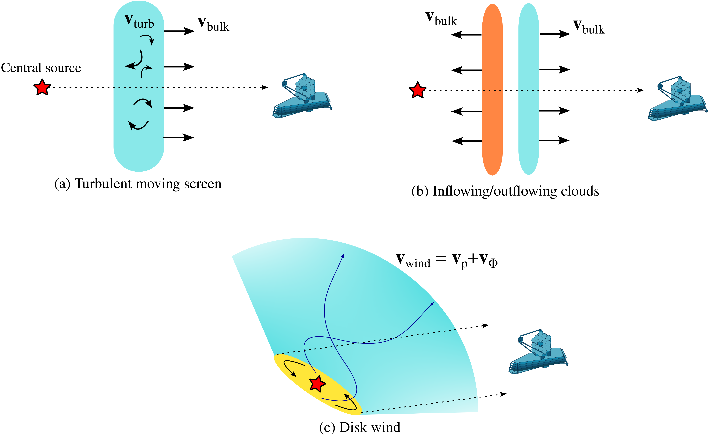
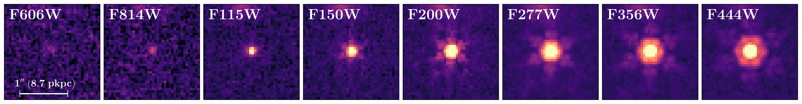
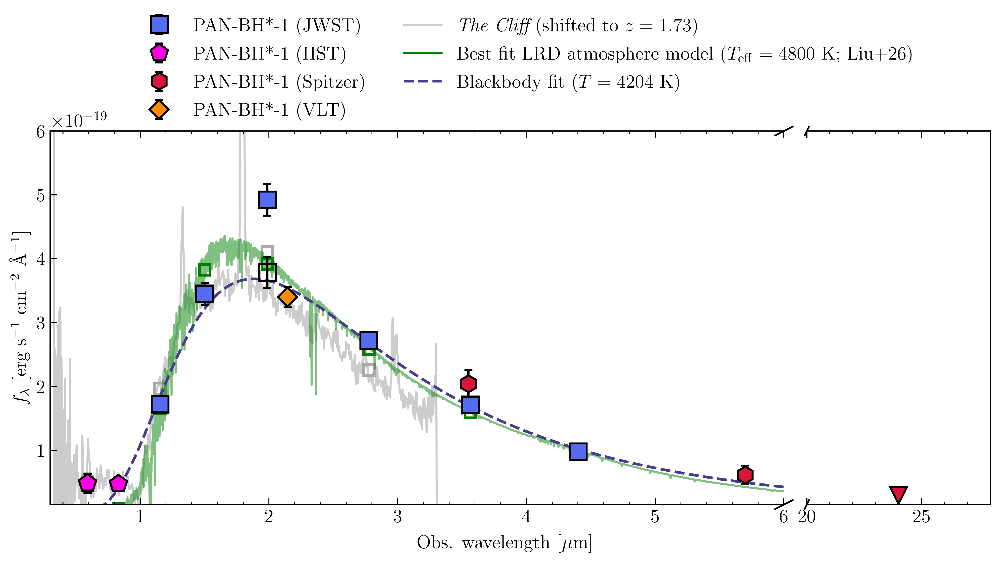
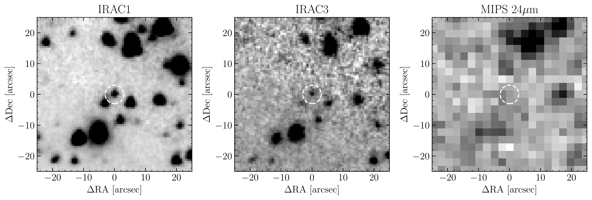

$\newcommand{\ensuremath}{}$
$\newcommand{\xspace}{}$
$\newcommand{\object}[1]{\texttt{#1}}$
$\newcommand{\farcs}{{.}''}$
$\newcommand{\farcm}{{.}'}$
$\newcommand{\arcsec}{''}$
$\newcommand{\arcmin}{'}$
$\newcommand{\ion}[2]{#1#2}$
$\newcommand{\textsc}[1]{\textrm{#1}}$
$\newcommand{\hl}[1]{\textrm{#1}}$
$\newcommand{\footnote}[1]{}$
$\newcommand{\MBH}{{\ensuremath{M_{\rm BH}}}}$
$\newcommand{\Halpha}{{\ensuremath{\text{H}{\alpha}}}}$
$\newcommand{\Hbeta}{{\ensuremath{\text{H}{\beta}}}}$
$\newcommand{\Hgamma}{{\ensuremath{\text{H}{\gamma}}}}$
$\newcommand{\oiii}{{\text{[O {\sc iii}]}}}$
$\newcommand{\panbhs}{\text{PAN-BH*-1}}$
$\newcommand{\cliff}{\text{\it The Cliff}}$
$\newcommand{\mombhs}{\text{MoM-BH*}}$
$\newcommand{\caperslrd}{\text{CAPERS-LRDz9}}$

# A Black Hole Star at Cosmic Noon: Extreme Balmer break, photospheric continuum, and broad absorption by thick winds in a Little Red Dot at z = 1.7

<mark>Appeared on: 2026-03-31</mark> -  _9 pages, 5 figures, and 2 appendices. Submitted to ApJL. Comments welcome_

Alberto~Torralba, et al.

**Abstract:** Recent studies at high redshift have revealed an enigmatic class of Little Red Dots (LRDs) with extreme Balmer breaks, stronger than in any stellar atmosphere. However, it is unclear whether such objects exist at lower redshift, especially given the low number of LRDs reported at $z\lesssim 2$ .Here we report the discovery of PAN-BH*-1, an LRD with an extreme Balmer break at $z=1.73$ , identified from JWST/NIRCam pure-parallel imaging taken by the PANORAMIC survey, and confirmed by deep VLT/X-Shooter spectroscopy. The rest-optical to near-infrared spectral energy distribution of PAN-BH*-1 is consistent with a photospheric continuum with effective temperature $T_{\rm eff}\approx 4800$ K. The broad H $\alpha$ emission line shows remarkably deep absorption, stronger than previously measured in any LRD. The absorption trough spans from $-520$ km/s to $+267$ km/s with respect to the systemic redshift. The presence of blue- and red-shifted absorption suggests complex dynamics of the obscuring gas along the line of sight. We speculate that the absorption trough can be produced by a thick wind launched from a thick, rotating photospheric disk, the latter being the source of the red optical continuum.While the source is unresolved in the rest-optical JWST data ( $r_{\rm eff}<47$ pc), the rest-NUV HST imaging shows an extended morphology with $r_{\rm eff}=1.0^{+0.5}_{-0.3}$ kpc, that we interpret as a host galaxy with a stellar mass $\sim 10^8$  $M_\odot$ , in line with the narrow H $\alpha$ emission. The discovery of this object at cosmic noon highlights the feasibility of systematic searches for extreme LRDs with wide-area facilities such as Euclid and Roman.

**Figure 9. -** {\rm Geometric configurations for the absorber.} We illustrate three scenarios that could give rise to the observed Balmer absorption in $\panbhs$ . In scenario (a), the obscuring agent is a thick screen of gas with a certain bulk velocity, and turbulent motions produce the broadening of the absorption trough. In (b), there are two (or more) absorbers with opposite velocities in the line-of-sight. These first two scenarios are dynamically unstable, therefore variability is expected in the absorption. Lastly, in (c) we observed an extended source through a disk wind with a rotational component ($\mathbf{v}_\phi$) in addition to the poloidal (non-azimuthal) velocity ($\mathbf{v}_p$). In the last scenario, the redshifted absorption is produced by stream lines that oppose the observer when projected along the line-of-sight, despite the fact that the gas is outflowing from the central source. (*fig:wind_cartoon*)

**Figure 7. -** ** SED of $\panbhs$ **** Top:** Cutouts from all the HST and JWST images in which $\panbhs$  is covered. It shows a remarkably compact morphology in all the wavelengths, resolved only in the HST F606W and F814W bands (Sect. \ref{sec:morph}). ** Bottom:** Photometry from JWST/NIRCam (blue squares), HST/ACS (purple pentagons), and Spitzer/IRAC+MIPS (red hexagons, and red triangle for the 5$\sigma$ upper limit). The empty square is the F200W flux after subtracting the $\Halpha$  flux measured from X-Shooter spectroscopy. We show the spectrum of $\cliff$  for comparison (gray line), shifted to $z=1.73$ and normalized to the F150W flux of $\panbhs$ . We also show the best-fitting Blackbody spectrum (blue dashed line) and the best model from the synthetic LRD atmosphere models from [Liu, et. al (2026)](https://ui.adsabs.harvard.edu/abs/2026arXiv260302317L), shifted to $z=1.73$(green line), under-sampled a factor 500 for clarity. (*fig:SED*)

**Figure 3. -** Cutouts of the Spitzer IRAC and MIPS bands with coverage of $\panbhs$ . The source is clearly detected in the IRAC bands 1 and 3, and undetected in the MIPS 24$\mu$m channel. For reference, we show a 6$\arcsec$  diameter aperture with a white cicle, as used to estimate the 24 \unit{\mu m} upper limit. (*fig:irac_phot*)

