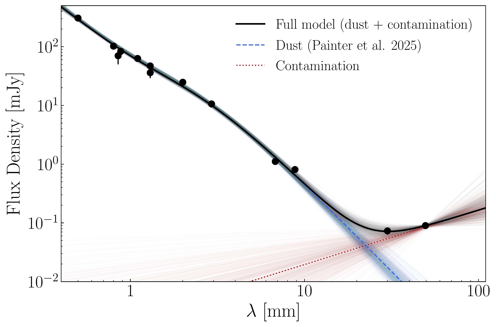
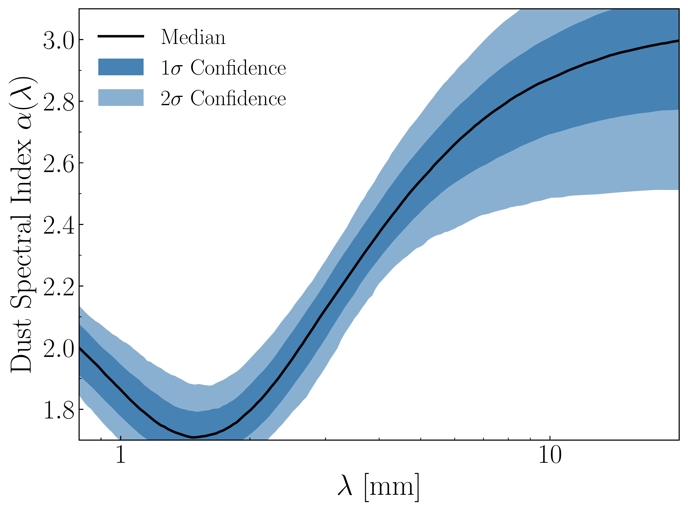
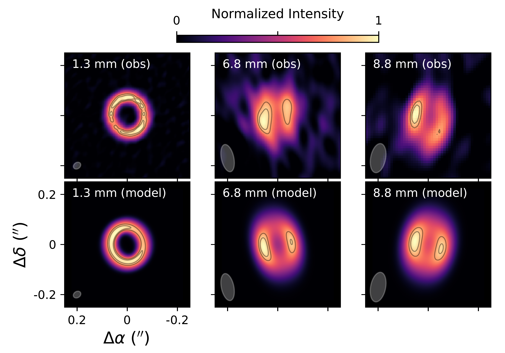
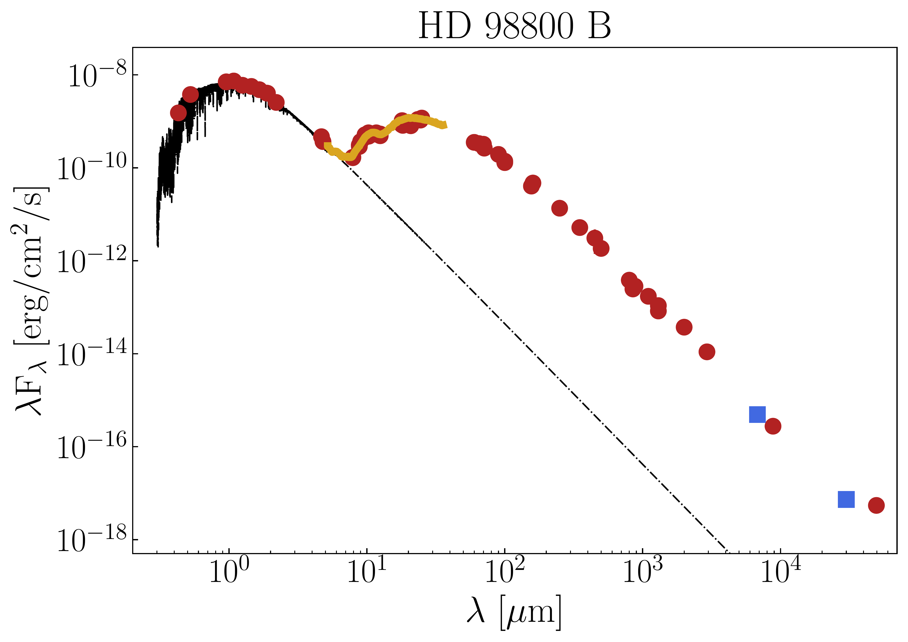
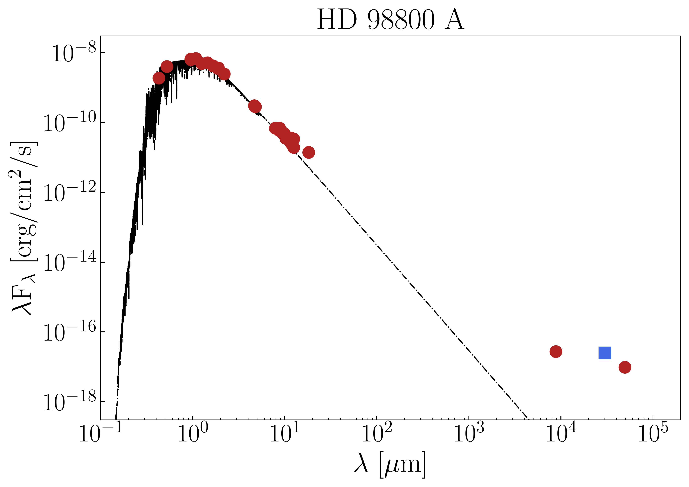

$\newcommand{\ensuremath}{}$
$\newcommand{\xspace}{}$
$\newcommand{\object}[1]{\texttt{#1}}$
$\newcommand{\farcs}{{.}''}$
$\newcommand{\farcm}{{.}'}$
$\newcommand{\arcsec}{''}$
$\newcommand{\arcmin}{'}$
$\newcommand{\ion}[2]{#1#2}$
$\newcommand{\textsc}[1]{\textrm{#1}}$
$\newcommand{\hl}[1]{\textrm{#1}}$
$\newcommand{\footnote}[1]{}$
$\newcommand{\uv}{\textit{uv}}$
$\newcommand{\uvplane}{\uv-plane}$
$\newcommand{\mJybeam}{ mJy~beam^{-1}}$
$\newcommand{\muJybeam}{ \muJy~beam^{-1}}$
$\newcommand{\klambda}{\mbox{k\lambda}}$
$\newcommand{\thebibliography}{\DeclareRobustCommand{\VAN}[3]{##3}\VANthebibliography}$
$\newcommand\mn{@urlcharsother}$
$\newcommand\mn{@doi}$
$\newcommand\mn{@doi@}$
$\newcommand\mn{@eprint#1#2}$
$\newcommand\mn{@eprint@arXiv#1}$
$\newcommand\mn{@eprint@dblp#1}$
$\newcommand\mn{@eprint@#1:#2:#3:#4}$
$\newcommand{\@}{tempa}$
$\newcommand{\@}{tempa }$
$\newcommand{\@}{tempb }$
$\newcommand{\@}{tempc }$
$\newcommand{\@}{tempb }$

# Large Dust Grains and a Possible Dust Trap in the Polar Circumbinary Disc of HD 98800B

<mark>Appeared on: 2026-04-01</mark> -  _11 pages, 5 figures, 3 tables. Accepted for publication in MNRAS_

Á. Ribas, et al. -- incl., <mark>F. Zagaria</mark>

**Abstract:** HD 98800 is a nearby hierarchical quadruple system comprising two binaries orbiting each other. Surprisingly, despite its $\sim 10$ Myr age and dynamic environment, the Ba-Bb component is surrounded by a compact gas-rich disc in a polar configuration. Previous millimetre continuum observations of this disc found a low millimetre spectral index ( $\alpha \sim 2.1$ up to 9 mm), potentially arising from large dust grains, optically thick emission, or both. Furthermore, the interpretation was complicated by emission mechanisms other than dust thermal continuum at longer wavelengths. We present new observations of this system with the Very Large Array (VLA) at 6.8 mm and 3 cm, providing crucial additional sampling of the emission at millimetre/centimetre wavelengths. By combining these with ancillary data, we derive a dust spectral index $\alpha_{\rm dust} < 3$ for wavelengths $\le 1$ cm. Our modeling suggests that the emission is optically thick at short millimetre wavelengths ( $\lambda \le 3$ mm) and it becomes at least partially optically thin for the VLA observations. The shallow spectral index thus indicates the existence of large grains in the disc. We also identify gyro-synchrotron emission from the A and B components at $\lambda \gtrsim $ 3 cm. The VLA images also reveal an azimuthal asymmetry at 6.8 mm and 8.8 mm, which is not present in high-resolution ALMA 1.3 mm data. After ruling out geometric and illumination effects, we interpret this asymmetry as a local dust overdensity, possibly induced by a vortex or a relic of the previous passage of the A component.

**Figure 1. -** Top panel: Fitting results of the mm/cm SED of HD 98800B including a dust contribution following \citet{Painter2025} and a power law to account for other emission mechanisms. The fit is performed to all the available photometry at wavelengths $\lambda \geq$500 $\mu$m. The solid lines show the median of the total model (black), dust emission (blue), and contamination emission (red), while the shaded regions correspond to 500 models randomly sampled from the posterior distributions. Bottom panel: Dust spectral index $\alpha_{\rm dust}$ as a function of wavelength resulting from the fitting procedure. The black solid line shows the median of the posterior distribution, while the shaded regions correspond to the 1$\sigma$ and 2$\sigma$ confidence intervals. (*fig:mm_fit*)

**Figure 2. -** Top row: ALMA and VLA observations of HD 98800B. Bottom row: Simulated MCFOST images (see Section \ref{sec:opt_thick_disc}) of an optically thick disc with an exposed inner wall, convolved with the corresponding synthesized beams of the observations (shown as gray ellipses). All images are normalized from zero to their peak intensity. Contours correspond to the 80\% and 90\% of the peak intensity. The model successfully reproduces the azimuthal asymmetry observed in the VLA data but also results in an asymmetric disc at 1.3 mm which is brighter on the east side, in contrast with the ALMA observations. (*fig:simulated_images*)

**Figure 3. -** Updated SEDs of HD 98800B (top) and HD 98800A. The new VLA observations are shown as blue squares. The rest of the photometric data compiled in \citet{Ribas2018} are shown as red dots, and the mid-IR spectrum from *Spitzer*/IRS \citep{Furlan2007} is presented in orange. The dashed black lines show the stellar photospheres of a 4200 K and 4500 K star, respectively \citep[following][]{Andrews2010a}. (*fig:new_SEDs*)

