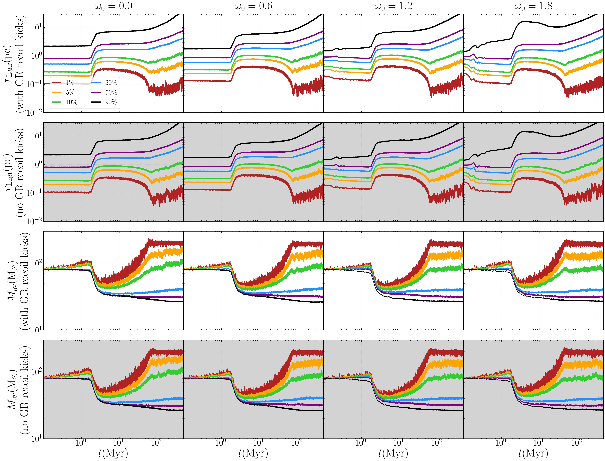
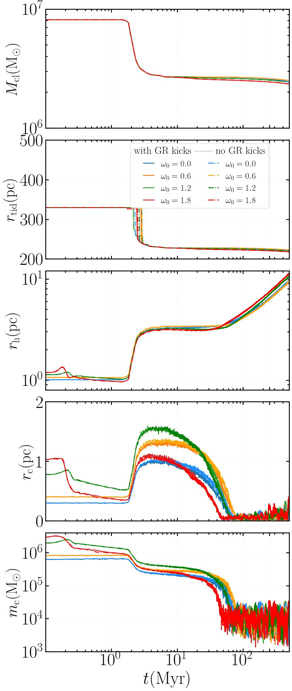
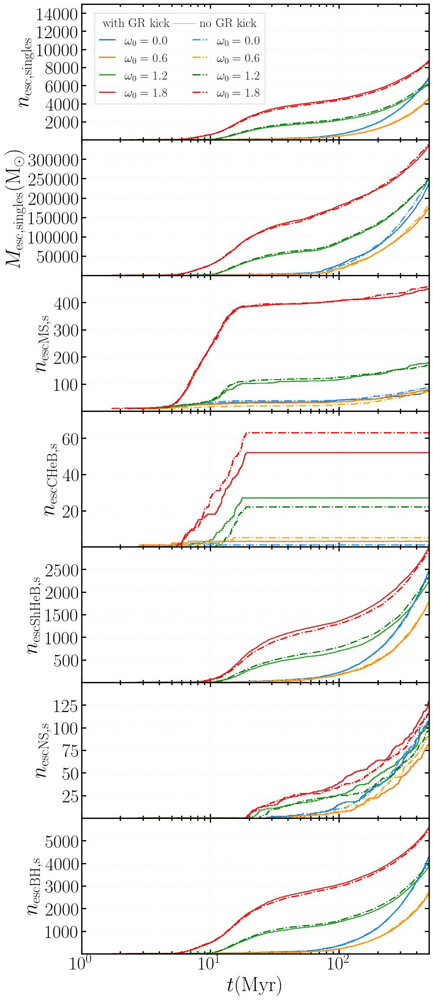

$\newcommand{\ensuremath}{}$
$\newcommand{\xspace}{}$
$\newcommand{\object}[1]{\texttt{#1}}$
$\newcommand{\farcs}{{.}''}$
$\newcommand{\farcm}{{.}'}$
$\newcommand{\arcsec}{''}$
$\newcommand{\arcmin}{'}$
$\newcommand{\ion}[2]{#1#2}$
$\newcommand{\textsc}[1]{\textrm{#1}}$
$\newcommand{\hl}[1]{\textrm{#1}}$
$\newcommand{\footnote}[1]{}$
$\newcommand{\msun}{\ensuremath{\mathrm{M}_\odot}}$
$\newcommand{\zsun}{\ensuremath{\mathrm{Z}_\odot}}$
$\newcommand{\mj}{\ensuremath{\mathrm{M}_\mathrm{Jup}}}$
$\newcommand{\hmr}{\ensuremath{r_\mathrm{h}}}$
$\newcommand{\mcore}{\ensuremath{m_\mathrm{c}}}$
$\newcommand{\rcore}{\ensuremath{r_\mathrm{c}}}$
$\newcommand{\rhocore}{\ensuremath{\rho_\mathrm{c}}}$
$\newcommand{\tcr}{\ensuremath{t_\mathrm{cr}}}$
$\newcommand{\trh}{\ensuremath{t_\mathrm{rh}}}$
$\newcommand{\tms}{\ensuremath{t_\mathrm{ms}}}$
$\newcommand{\vd}{\ensuremath{\sigma_\mathrm{v}}}$
$\newcommand{\rtide}{\ensuremath{r_\mathrm{tid}}}$
$\newcommand{\rlagr}{\ensuremath{r_\mathrm{Lagr}}}$
$\newcommand{\avmass}{\ensuremath{M_\mathrm{av}}}$
$\newcommand{\mcl}{\ensuremath{M_\mathrm{cl}}}$
$\newcommand{\kmps}{\ensuremath{\mathrm{km~s}^{-1}}}$
$\newcommand{\nbo}{\textsc{Nbody6++GPU}}$
$\newcommand{\fortran}{\texttt{FORTRAN}}$
$\newcommand{\clang}{\texttt{C}}$
$\newcommand{\cpp}{\texttt{C++}}$
$\newcommand{\python}{\texttt{Python}}$
$\newcommand{\nbody}{\textit{N}-body}$
$\newcommand{\mcluster}{\textsc{McLuster}}$
$\newcommand{\fopax}{\textsc{Fopax}}$
$\newcommand{\petar}{\textsc{PeTar}}$
$\newcommand{\eref}[1]{Eq.~(\ref{#1})}$
$\newcommand{\erefp}[1]{(Eq.~\ref{#1})}$
$\newcommand{\fref}[1]{Fig.~\ref{#1}}$
$\newcommand{\tref}[1]{Table~\ref{#1}}$
$\newcommand{\sref}[1]{Sect.~\ref{#1}}$
$\newcommand{\albrecht}[1]{\textcolor{green}{#1}}$
$\newcommand{\manuel}[1]{\textcolor{blue}{#1}}$
$\newcommand{\nadine}[1]{\textcolor{cyan}{#1}}$
$\newcommand{\ataru}[1]{\textcolor{brown}{#1}}$
$\newcommand{\boyuan}[1]{\textcolor{orange}{#1}}$
$\newcommand{\abbas}[1]{\textcolor{orange}{#1}}$
$\newcommand{\peter}[1]{\textcolor{pink}{#1}}$
$\newcommand{\dominik}[1]{\textcolor{teal}{#1}}$
$\newcommand{\renyue}[1]{\textcolor{violet}{#1}}$
$\newcommand{\arek}[1]{\textcolor{yellow}{\bf #1}}$
$\newcommand{\thorsten}[1]{\textcolor{lime}{#1}}$
$\newcommand{\francesco}[1]{\textcolor{violet}{\bf #1}}$
$\newcommand{\marcelo}[1]{\textcolor{black}{#1}}$
$\newcommand{\rainer}[1]{\textcolor{black}{#1}}$
$\newcommand{\kw}[1]{\textcolor{black}{#1}}$
$\newcommand{\rs}[1]{\textcolor{red}{\sf{[Rainer: #1]}}}$
$\newcommand{\rsd}[1]{\textcolor{red}{\sout{[Rainer: #1]}}}$
$\newcommand{\ls}[1]{\textcolor{blue}{\sf{[Shuai: #1]}}}$
$\newcommand{\lsd}[1]{\textcolor{blue}{\sout{[Shuai: #1]}}}$

# Direct $N$-body simulations of rotating and extremely massive Population III star clusters

<mark>Appeared on: 2026-04-01</mark> -  _20 pages, 14 figures, 5 tables, accepted for publication in A&A_

K. Wu, et al. -- incl., <mark>N. Neumayer</mark>

**Abstract:**            Aims. We present eight direct N-body simulations with NBODY6++GPU of extremely massive, initially rotating Population III star clusters with 1.01 x 10^5 stars. Methods. Our models include primordial binaries, a continuous initial mass function, differential rotation, tidal mass loss, updated fitting formulae for extremely massive metal-poor Population III stars, and general-relativistic merger recoil kicks. We assess their impact on cluster dynamics. Results. All runs form black holes below, within, and above the pair-instability gap, with multi-generation growth. Faster-rotating clusters core-collapse earlier; post-collapse clusters host a rotating, axisymmetric subsystem of intermediate-mass black holes (IMBHs) at the centre and an expanding halo of lower-mass objects. Pair-instability supernovae and compact-object formation at ~2-3 Myr sharply reduce total mass and a large fraction of the cluster's angular momentum. All Population III clusters in our simulations have the gravothermal-gravogyro catastrophe phase. Conclusions. We confirm two of the hypothesized formation channels of galactic nuclei seed black holes: gravitational runaway mergers of black holes and of Population III stars, which core-collapse into IMBHs thereafter. Higher initial star cluster bulk rotation correlates with earlier core collapse and, in the event counts reported here, with more coalescences/collisions and lower retained (compact) binary abundances. Initial bulk rotation is a primary control parameter of cluster evolution: faster rotation accelerates early angular-momentum transport, gravothermal collapse, mass segregation, and amplifies post-collapse expansion, which also favours the formation of a compact central IMBH subsystem.         

**Figure 10. -** Plot showing the Lagrange radii $\rlagr$  and the average mass $\avmass$  within spheres that contain 1\%, 5\%, 10\%, 30\%, 50\%, and 90\% of the total cluster mass at the current simulation time-step for up to 500 Myr. Time is shown on a logarithmic scale to highlight the cluster's rapid early evolution. Each column represents one rotational parameter $\omega_{0}$ of the rotating King model ($\omega_{0}$ = 0.0, 0.6, 1.2, 1.8). Models with K are plotted on a white background; models without GR kicks (NoK) are shaded light grey. (*rlagr*)

**Figure 2. -** Plot showing the total cluster mass $\mcl $, the tidal radius $\rtide$ , the half mass radius $\hmr$ , the mass of the core $\mcore $ and the radius of the core $\rcore$  in the four panels for all eight simulations with and without GR recoil kicks for different $\omega_{0}$. Time is shown on a logarithmic scale to highlight the cluster's rapid early evolution. The models with K are plotted as solid curves and the models without (NoK models) are plotted as dash-dotted curves.
     (*Global_properties*)

**Figure 3. -** Plots showing cumulative counts of escaping single stars $n_{\mathrm{esc,singles}}$, their total mass $M_{\mathrm{esc,singles}}$, and counts of escaping single MS, CHeB, ShHeB, NS and BH stars ($n_{\mathrm{escMS,s}}$, $n_{\mathrm{escCHeB,s}}$, $n_{\mathrm{escShHeB,s}}$, $n_{\mathrm{escNS,s}}$, $n_{\mathrm{escBH,s}}$) for all eight simulations. K: solid; NoK: dash-dotted.
     (*escapers*)

