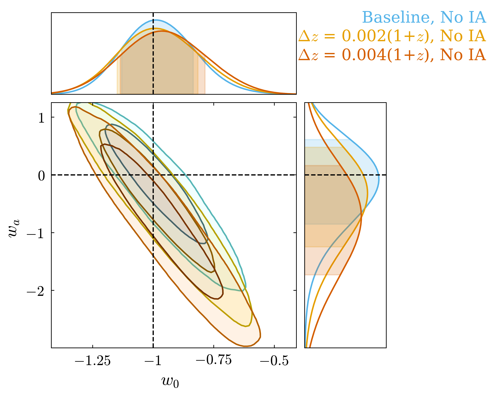
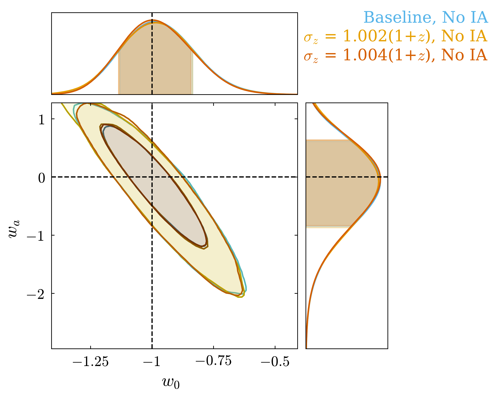
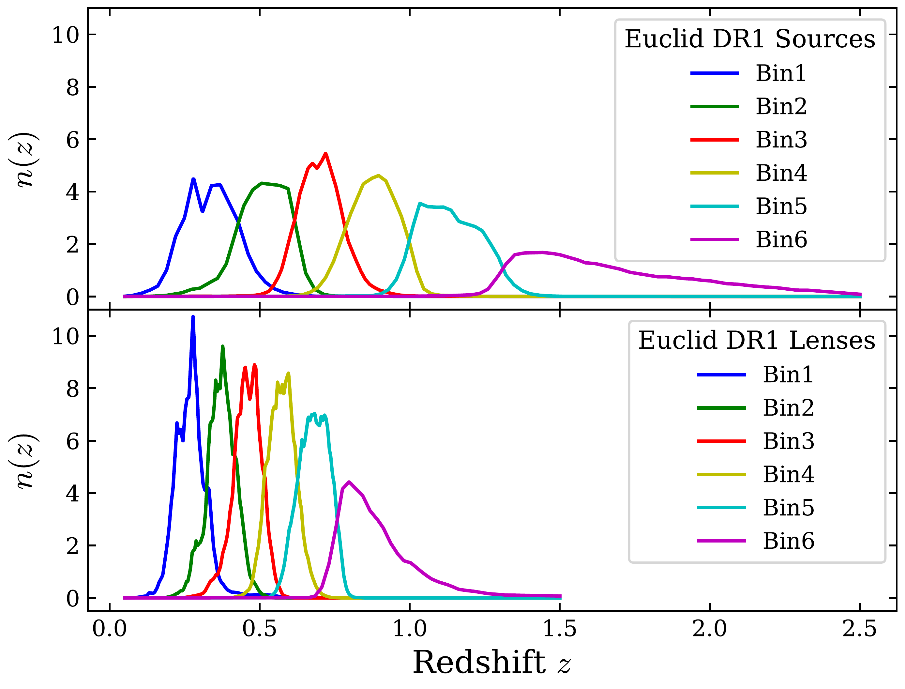
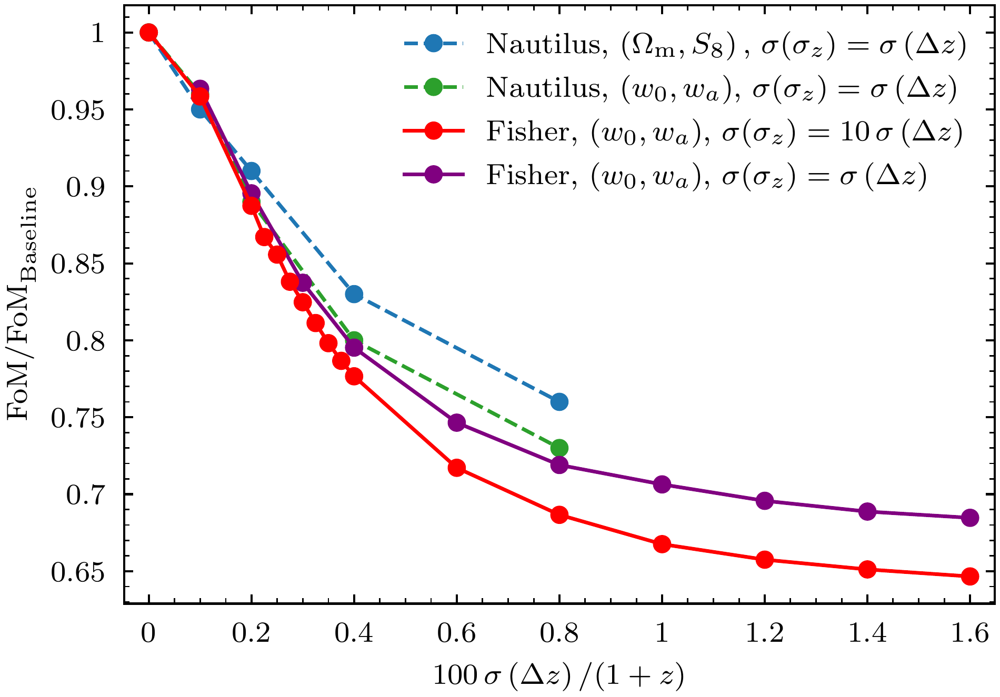

$\newcommand{\ensuremath}{}$
$\newcommand{\xspace}{}$
$\newcommand{\object}[1]{\texttt{#1}}$
$\newcommand{\farcs}{{.}''}$
$\newcommand{\farcm}{{.}'}$
$\newcommand{\arcsec}{''}$
$\newcommand{\arcmin}{'}$
$\newcommand{\ion}[2]{#1#2}$
$\newcommand{\textsc}[1]{\textrm{#1}}$
$\newcommand{\hl}[1]{\textrm{#1}}$
$\newcommand{\footnote}[1]{}$
$\newcommand{\todo}[1]{ \textcolor{red}{(TO DO: {#1})} }$
$\newcommand{\anna}[1]{\textcolor{orange}{{#1}}}$
$\newcommand{\ze}[1]{ \textcolor{purple}{{#1}} }$
$\newcommand{\zec}[1]{ \textcolor{purple}{(ZF: {#1})} }$
$\newcommand{\klara}[1]{\textcolor{cyan}{{#1}}}$
$\newcommand{\vincent}[1]{ \textcolor{teal}{{#1}} }$
$\newcommand{\orcid}[1]$
$\newcommand{\linenumbers}$
$\newcommand{\orcid}[1]$
$\newcommand\itt{#1}$
$\newcommand\itc{#1}$

# $\Euclid$ preparation: Impact of redshift distribution uncertainties on the joint analysis of photometric galaxy clustering and weak gravitational lensing

<mark>Appeared on: 2026-04-02</mark> -  _13+6 pages, 5+9 figures, 5+5 tables_

E. Collaboration, et al. -- incl., <mark>K. Jahnke</mark>

**Abstract:** One of the $\Euclid$ mission's key projects is the so-called 3 $\times$ 2pt analysis, that is,  the combination of cosmic shear, photometric galaxy clustering, and galaxy-galaxy lensing.Although $\Euclid$ has established quality requirements for the photo- $z$ accuracy needed for the weak lensing galaxy sample,no such requirements have been set for the photometric clustering sample.In this paper, we investigate the impact of redshift uncertainties on $\Euclid$ 's photometric galaxy clustering analysis and its combination with weak gravitational lensing, focusing on data release 1 (DR1). In particular, we study whether having precise knowledge of the mean of the redshift distributions per bin is sufficient to avoid biases in the resulting cosmological constraints or whether accuracy in the higher-order moments of the distribution is required. We evaluate the results based on their constraining power on $w_{\mathrm{0}}$ and $w_{a}$ and define thresholds for the precision and accuracy of $\Euclid$ 's redshift distribution of the photometric clustering sample.We find that the redshift distributions of the photometric clustering sample must be known at an accuracy of 0.004(1+ $z$ ) in  the mean in order to recover 80 $\%$ of the constraining power in $\Euclid$ 's DR1 $w_0w_{a}$ CDM 3 $\times$ 2pt analysis.The impact of the uncertainty on the width is negligible, provided the mean redshift is constrained with sufficient accuracy. For most sources of redshift distribution error, attaining the requirement on the mean will also reduce uncertainty in the width well below the required level.

**Figure 13. -** Comparison of cosmological constraints on $w_{\rm 0}$ and $w_{a}$ in $w_{\rm 0}w_{a}$CDM considering a 3$\times$2pt analysis. The constraints are obtained from a simulated data vector and analysed assuming different modifications of the lens redshift distribution. _Left:_ Comparison of the constraints from the baseline and the ones obtained from a shifted lens $n(z)$ distribution. _Right:_ Comparison of the constraints from the baseline and the ones obtained from a stretched lens $n(z)$ distribution. (*w0wa constraints*)

**Figure 1. -** Normalised redshift distributions of source galaxies (Top) and lens galaxies (Bottom) from the Flagship simulation assuming a DR1-like setup. (*fig:dr1-nz*)

**Figure 2. -** Evolution of the FoM of two selected parameter combinations considering different priors on the lens redshift distribution parameters with respect to the baseline without prior, at $\sigma\left(\Delta z\right)=0$. The corresponding values of the FoMs from the Monte Carlo analysis are listed in Table \ref{t:FoMgaussian}. The green and purple curves correspond to the same scenario tested with the Monte Carlo (green) and Fisher (purple) approaches. (*fig:foms*)

