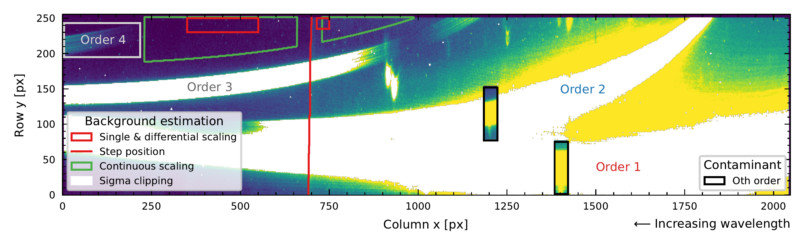
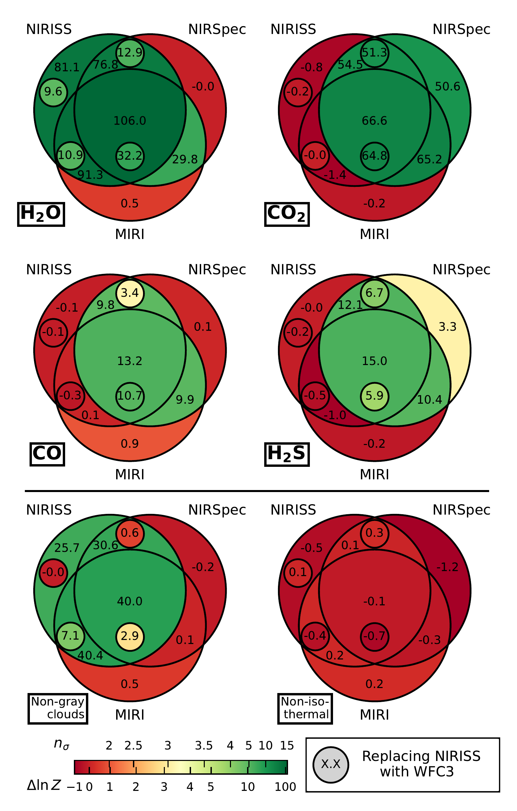
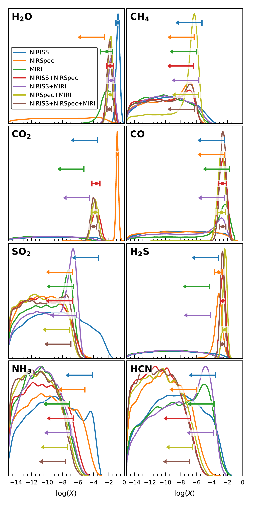

$\newcommand{\ensuremath}{}$
$\newcommand{\xspace}{}$
$\newcommand{\object}[1]{\texttt{#1}}$
$\newcommand{\farcs}{{.}''}$
$\newcommand{\farcm}{{.}'}$
$\newcommand{\arcsec}{''}$
$\newcommand{\arcmin}{'}$
$\newcommand{\ion}[2]{#1#2}$
$\newcommand{\textsc}[1]{\textrm{#1}}$
$\newcommand{\hl}[1]{\textrm{#1}}$
$\newcommand{\footnote}[1]{}$
$\newcommand{\zenododoi}{\href{https://doi.org/10.5281/zenodo.19356398}{10.5281/zenodo.19356398}}$
$\newcommand{\comment}[2][{[}...{]}]{\textcolor{red}{#1}}$
$\newcommand{\missing}{\textcolor{red}{{[}...{]}}}$
$\newcommand{\pending}[1]{\colorbox{yellow}{#1}}$
$\newcommand{\gitrepo}{\textcolor{red}{TO BE INCLUDED}}$
$\newcommand{\showfontsize}[1]{$
$  \begingroup$
$  #1$
$  \typeout{Font size for \string#1 is \f@size pt (baseline skip: \f@baselineskip pt)}$
$  \endgroup$
$}$

# Information content of JWST transmission spectroscopy of the exoplanet HAT-P-12b from the optical to the mid-infrared

<mark>Appeared on: 2026-04-02</mark> -  _21 pages, 15 figures, 4 tables; submitted to A&A_

L. Heinke, et al. -- incl., <mark>T. Henning</mark>

**Abstract:** The James Webb Space Telescope (JWST) provides low- to medium-resolution spectra with unprecedented precision and broad near- to mid-infrared wavelength coverage, enabling the detailed characterization of exoplanet atmospheres. Given the complexity of JWST data and the diversity of observing modes, it is essential to understand the information content of the resulting spectra to optimize observation strategies and assess the limits of atmospheric inference. We present a new JWST NIRISS SOSS transit observation of the warm sub-Saturn $\object{HAT-P-12b}$ . Together with complementary NIRSpec G395M and MIRI LRS data, this enables a detailed assessment of the information content across JWST instruments over the full accessible wavelength range (excluding MIRI MRS). The NIRISS data were reduced, and the impact of specific reduction choices on the resulting transmission spectrum was assessed. Atmospheric retrievals were performed for all combinations of JWST data, supplemented by archival HST observations in select cases. The analysis further included evaluations of molecular detection significances and assumptions about the atmospheric structure. The same four molecules previously reported were significantly detected: $\ce{H2O}$ , $\ce{CO2}$ , $\ce{CO}$ , and $\ce{H2S}$ .    Except for $\ce{H2O}$ , all required NIRSpec coverage for detection, while $\ce{H2S}$ was only detected in multi-instrument retrievals. Abundance constraints obtained using HST WFC3 instead of JWST NIRISS SOSS were largely consistent, particularly when combining instruments, but NIRISS SOSS proved essential to establish robust evidence for non-gray cloud behavior. A scattering slope of moderate steepness ( $p < 4$ ) was consistently retrieved, independent of the chosen HST STIS reduction. Single-instrument retrievals, even when yielding significant detections, tend to overestimate molecular abundances. In contrast, retrievals that combine spectra from multiple JWST instruments generally converge toward consistent abundance constraints. The derived C/O ratio remains sensitive to subtle differences between NIRSpec reductions, owing to the instrument’s exclusive coverage of the carbon-bearing molecules $\ce{CO2}$ and $\ce{CO}$ , so its interpretation requires caution. The results are broadly consistent with information content studies of the benchmark target WASP-39b, although differences, including the absence of a preference for non-isothermal $T$ -- $P$ profiles, highlight variations in information content across exoplanet types.

**Figure 10. -** Overview of the data recorded by the NIRISS detector, based on a stack of out-of-transit integration images. The spectral orders are labeled, with a different color scale applied to enhance the visibility of the faint 4th order (gray rectangle).
    Regions used for scaling the model background and the location of the background step are highlighted (red and green).
    Areas identified via sigma clipping as containing signal (rather than background) have been masked (white).
    The locations of two potential 0th-order contaminants overlapping with the spectral traces are also indicated. For better visibility, these regions are shown with a separate color scale and an enlarged box ($2 \times \Delta \mathrm{x}$) compared to the area that was interpolated over. (*fig:backs+contams*)

**Figure 1. -** Venn diagrams of JWST instrument combinations showing detection significances of the four significantly detected molecules (top) and the preference for two modeling assumptions (bottom). Additional circles were used to show the significances obtained when replacing the JWST NIRISS SOSS with the HST WFC3 instrument data. The significances are reported as log-evidence differences $\Delta \ln{Z}$ and visualized using a custom non-linear color scale. The colorbar also provides a conversion to $n_\sigma$ detection significances following the calibration scale from [Benneke and Seager (2013)](https://ui.adsabs.harvard.edu/abs/2013ApJ...778..153B). (*fig:signif_jwst_wfc3*)

**Figure 2. -** Marginal posterior distributions of the chemical abundances for all included molecules, retrieved using different JWST instrument combinations. The shown distributions were derived from the samples via kernel density estimation (KDE; Gaussian kernel with bandwidth $h=0.1
    $). For each distribution, markers indicate either the $1\sigma$ credible interval, in cases of well-constrained posteriors, or the 95th percentile upper limit (arrows) when only an upper bound can be established. (*fig:marg_abunds_jwst*)

