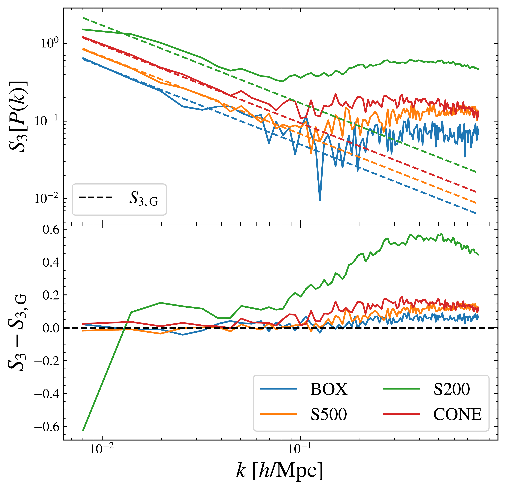
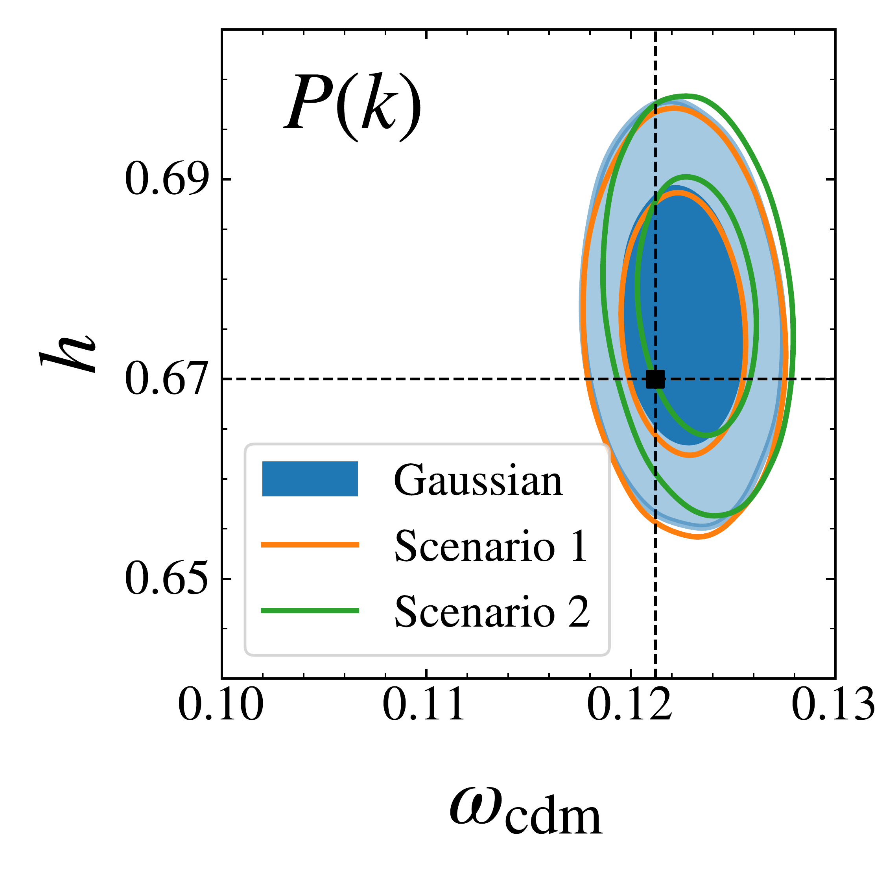
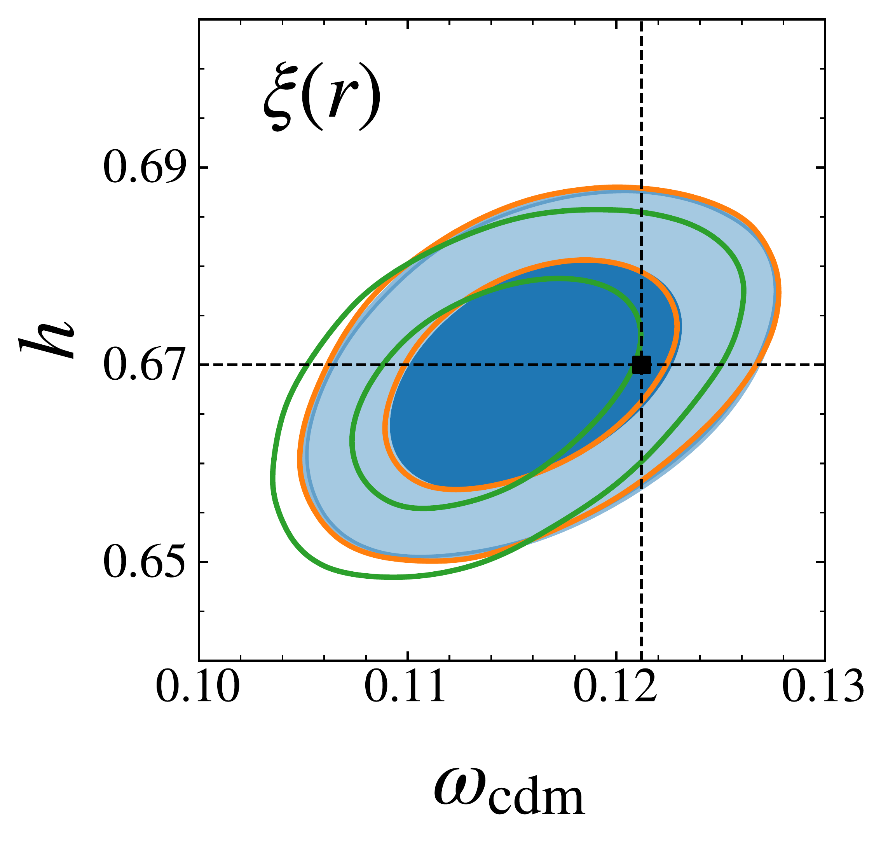
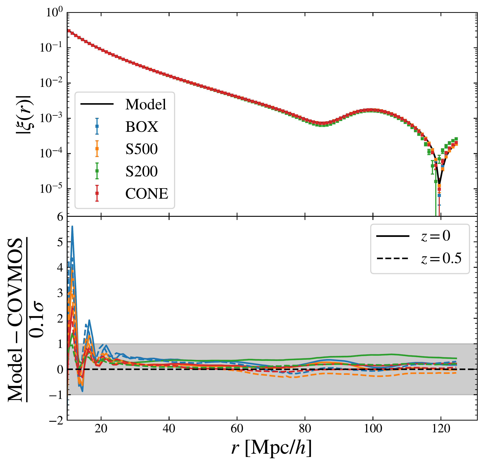

$\newcommand{\ensuremath}{}$
$\newcommand{\xspace}{}$
$\newcommand{\object}[1]{\texttt{#1}}$
$\newcommand{\farcs}{{.}''}$
$\newcommand{\farcm}{{.}'}$
$\newcommand{\arcsec}{''}$
$\newcommand{\arcmin}{'}$
$\newcommand{\ion}[2]{#1#2}$
$\newcommand{\textsc}[1]{\textrm{#1}}$
$\newcommand{\hl}[1]{\textrm{#1}}$
$\newcommand{\footnote}[1]{}$
$\newcommand$
$\newcommand$
$\newcommand$
$\newcommand$
$\newcommand$
$\newcommand$
$\newcommand$
$\newcommand$
$\newcommand$
$\newcommand$
$\newcommand$
$\newcommand$
$\newcommand$
$\newcommand$
$\newcommand$
$\newcommand$
$\newcommand$
$\newcommand$
$\newcommand$
$\newcommand$
$\newcommand$
$\newcommand$
$\newcommand$
$\newcommand$
$\newcommand$
$\newcommand$
$\newcommand$
$\newcommand$
$\newcommand$
$\newcommand$
$\newcommand$
$\newcommand$
$\newcommand$
$\newcommand$
$\newcommand$
$\newcommand$
$\newcommand$
$\newcommand$
$\newcommand$
$\newcommand$
$\newcommand$
$\newcommand$
$\newcommand$
$\newcommand$
$\newcommand{\covmos}{\texttt{COVMOS}}$
$\newcommand{\demcov}{\texttt{DEMNUni-Cov}}$
$\newcommand{\demnu}{\texttt{DEMNUni}}$
$\newcommand{\nercome}{\texttt{NERCOME}}$
$\newcommand{\halofit}{\texttt{Halofit}}$
$\newcommand{\hmcode}{\texttt{HMcode}}$
$\newcommand{\regpt}{\texttt{RegPT}}$
$\newcommand$
$\newcommand$
$\newcommand$
$\newcommand$
$\newcommand$
$\newcommand$
$\newcommand$
$\newcommand$
$\newcommand$
$\newcommand{\syl}[1]{\textcolor{red}{[{\bf Sylvain}: #1]}}$
$\newcommand{\ju}[1]{\textcolor{magenta}{[{\bf Julien}: #1]}}$
$\newcommand{\lcal}{ {\mathcal L} }$
$\newcommand{\pcal}{ {\mathcal P} }$
$\newcommand{\mcal}{ {\mathcal M} }$
$\newcommand{çal}{ {\mathcal C} }$
$\newcommand{\qcal}{ {\mathcal Q} }$
$\newcommand{\jcal}{ {\mathcal J} }$
$\newcommand{\ical}{ {\mathcal I} }$
$\newcommand{\acal}{ {\mathcal A} }$
$\newcommand{\fcal}{ {\mathcal F} }$
$\newcommand{\ncal}{ {\mathcal N} }$
$\newcommand{\hcal}{ {\mathcal H} }$
$\newcommand{\gcal}{ {\mathcal G} }$
$\newcommand{\scal}{ {\mathcal S} }$
$\newcommand{\dirac}{\delta^{\rm D}}$
$\newcommand{\tdel}{\tilde\delta}$
$\newcommand{\hdel}{\hat\delta}$
$\newcommand{\rmin}{r_{\rm min}}$
$\newcommand{\rmax}{r_{\rm max}}$
$\newcommand{\mini}{{\rm min}}$
$\newcommand{\maxi}{{\rm max}}$
$\newcommand{\acos}{{\rm acos}}$
$\newcommand{\deus}{\texttt{DEUS-PUR}}$
$\newcommand{Ç}[1]{\textbf{\textcolor{magenta}{[Melita: #1]}}}$
$\newcommand{ç}[1]{{\textcolor{magenta}{#1}}}$
$\newcommand{\orcid}[1]$
$\newcommand{\linenumbers}[0]$
$\newcommand{\arraystretch}{1.5}$
$\newcommand{\arraystretch}{1.5}$
$\newcommand\ba{#1}$

# $\Euclid$\/ preparation: Non-Gaussianity of 2-pt statistics likelihood: Parameter inference with a non-Gaussian likelihood in Fourier and configuration space

<mark>Appeared on: 2026-04-03</mark> -  _25 pages, 12 figures, submitted to A&A_

E. Collaboration, et al. -- incl., <mark>K. Jahnke</mark>

**Abstract:** The extraction of cosmological information from 2-point statistics relies critically on the assumed form of their likelihood. Although a Gaussian likelihood is generally adopted, the first paper of this series  ([Euclid Collaboration: Bel, et. al 2025](https://ui.adsabs.harvard.edu/abs/2025arXiv251108266E))  showed that the distribution of power-spectrum estimates exhibits non-Gaussian features at both large and small scales ( $k<0.5  \invMpc$ ) with their amplitude depending on survey volume, masking, and shot noise. In this work we account for this skewness in parameter inference by modelling the likelihood through an Edgeworth expansion which involves the complete skewness tensor, composed of 1-point, 2-point, and 3-point correlators. To simplify the calculations of this expansion we perform a change of basis which reduces the precision matrix to the identity. In this basis, the off-diagonal elements of the skewness tensor are consistent with zero, while the amplitude of its diagonal match the level expected for a Gaussian underlying field. We perform parameter inference with this likelihood model and find that including only the diagonal part of the skewness is sufficient, while incorporating the full skewness tensor injects noise without improving accuracy. Despite the estimated excess skewness in the original basis, the cosmological constraints remain effectively unchanged when adopting a Gaussian likelihood or considering the more complete Edgeworth expansion, with variations in the figure of merit of cosmological parameters between the two cases below $5\%$ . This result remains unchanged against variations of the survey volume and geometry, scale-cut, and 2-point statistic (power spectrum or correlation function). Using $10  000$ cloned $\Euclid$ large mocks based on realistic galaxy catalogues with characteristics close to future $\Euclid$ data, we find no detectable excess skewness on intermediate scales, due to the level of shot noise expected for the $\Euclid$ spectroscopic sample. We conclude that the Gaussian likelihood assumption is robust for $\Euclid$ 2-point statistics analyses in both Fourier and configuration space.

**Figure 3. -** Comparison of the estimated skewness and the expectation in the case of a Gaussian field. _ Top_: Skewness of the power spectrum distribution estimated on the $10  000$\covmos realisations for each of the four geometries at $z=0$. The dashed lines show the skewness predicted in the case of a Gaussian field. _ Bottom_: Difference between the estimated skewness and the prediction for a Gaussian field. (*fig:skew_geom_pk*)

**Figure 7. -** 2D marginalised posterior distribution of cosmological parameters estimated in the CONE geometry for the Gaussian likelihood approximation and the two scenarios of the Edgeworth expansion. The top and bottom panels respectively show the results obtained in Fourier and configuration space. The corresponding scale cuts are $\kmax = 0.2  h/\mr{Mpc}$ in Fourier space and $\rmin = 20  \mr{Mpc}/h$ in configuration space. (*fig:tri_xi_pk_cone*)

**Figure 2. -** Validation of the forward modelling of the window function on the 2PCF for all geometries. _ Top_: Mean over the 2PCFs estimated from the $10  000$\covmos realisations for each geometry (squares with error bars) and the model (line), in absolute value. The error bars represent the error on the mean over the
$10  000$ realisations.  _ Bottom_: Residual in number of $\sigma$ considering $10$\% of the error on one realisation for each geometry. (*fig:geometries_xi*)

