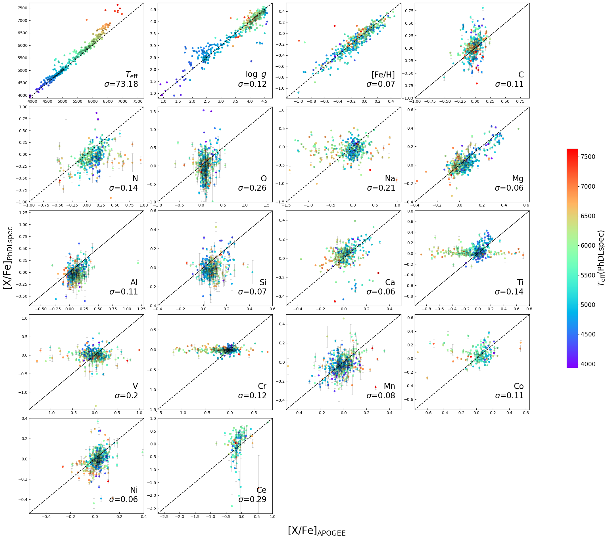
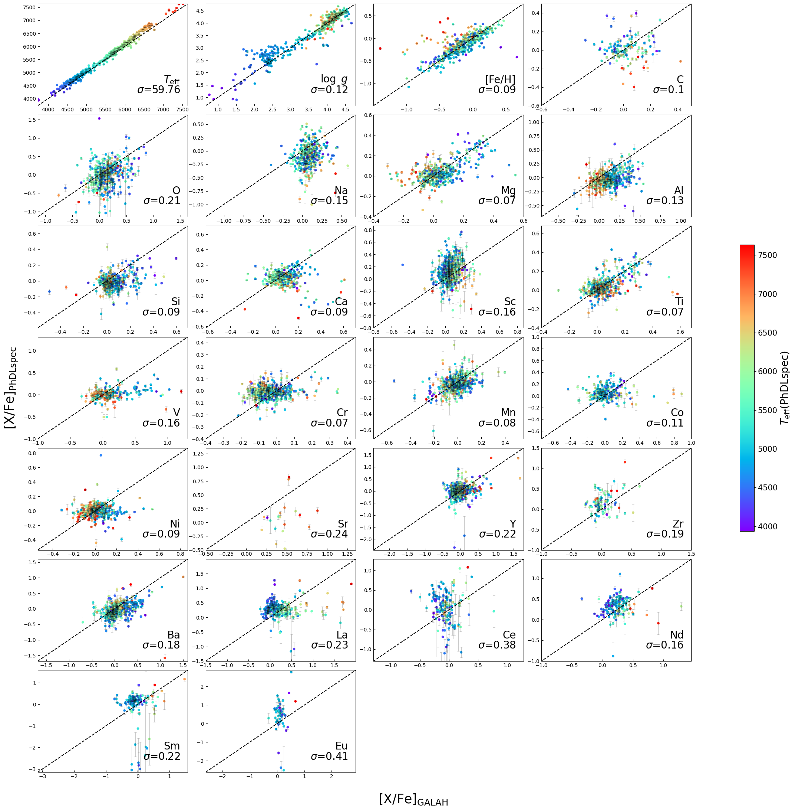
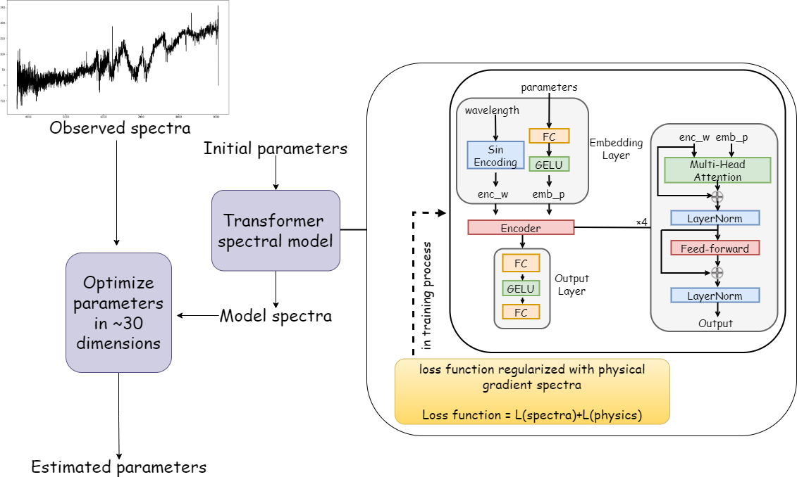

$\newcommand{\ensuremath}{}$
$\newcommand{\xspace}{}$
$\newcommand{\object}[1]{\texttt{#1}}$
$\newcommand{\farcs}{{.}''}$
$\newcommand{\farcm}{{.}'}$
$\newcommand{\arcsec}{''}$
$\newcommand{\arcmin}{'}$
$\newcommand{\ion}[2]{#1#2}$
$\newcommand{\textsc}[1]{\textrm{#1}}$
$\newcommand{\hl}[1]{\textrm{#1}}$
$\newcommand{\footnote}[1]{}$
$\newcommand{\vdag}{(v)^\dagger}$
$\newcommand\aastex{AAS\TeX}$
$\newcommand\latex{La\TeX}$

# \texttt{PhDLspec}: physical-prior embedded deep learning method for spectroscopic determination of stellar labels in high-dimensional parameter space

<mark>Appeared on: 2026-04-06</mark> -  _Accepted for publication in The Astrophysical Journal. 28 pages, 16 figures. Data and code are available at Zenodo_

T. Wu, et al. -- incl., <mark>M. Zhang</mark>

**Abstract:** Unlocking the full physical information encoded in low-resolution spectra poses a significant challenge for astronomical survey analysis. Such a task demands modeling spectra and optimizing astrophysical parameters in high-dimensional space, as a consequence of line blending. Here we present \texttt{PhDLspec} -- a deep learning framework embedded with physical priors for stellar spectra modeling and analysis. By imposing differential spectra derived from _ab initio_ stellar atmospheric model calculation on a ${\sc transformer}$ framework, \texttt{PhDLspec} can rigorously and precisely model stellar spectra by simultaneously taking into account more than 30 physical parameters, at a computational speed hundreds of times faster than _ab initio_ model calculation. With such a flexible stellar modeling approach, \texttt{PhDLspec} can effectively derive $\sim$ 30 stellar labels from a low-resolution spectrum using affordable optimization techniques. Application to LAMOST spectra ( $R\lesssim1800$ ) yields stellar elemental abundances in good agreement with high-resolution spectroscopic surveys, following essential calibrations to correct systematic biases in elemental abundance estimates using wide binaries and reference high-resolution datasets. We provide a catalog of 25 elemental abundances for 116,611 subgiant stars with precise age estimates. The successful application of \texttt{PhDLspec} to LAMOST spectra for high-dimensional parameter determination sheds light on similar challenges faced by other surveys and disciplines.

**Figure 12. -** One-to-one comparison of the atmospheric parameters and elemental abundances ([X/Fe]) derived with \texttt{PhDLspec} from LAMOST spectra with those from APOGEE DR17 \citep{2022ApJS..259...35A} for stars in common. Each panel shows the comparison for a label, with the dashed line indicating the 1:1 relation. Points are color-coded by $T_{\rm eff}$ derived with \texttt{PhDLspec}. The standard deviation ($\sigma$) of the label differences is marked in each panel. (*fig:lamapo2*)

**Figure 13. -** Same as Figure \ref{fig:lamapo2}, but for comparison with GALAH DR3. (*fig:lamgalah2*)

**Figure 3. -** Schematic diagram of the \texttt{PhDLspec} method. The transformer-based spectral model employs an embedding layer that combines wavelength encoding and parameter embedding, followed by multiple encoder blocks with multi-head attention, layer normalization, and feed-forward layers. The output spectra are generated through a fully connected output layer. The model training is regularized with physical gradient spectra from _ab initio_ computation. Observed spectra are fitted by simultaneously optimizing stellar parameters in a $\sim$30-dimensional parameter space.
 (*fig:flow*)

