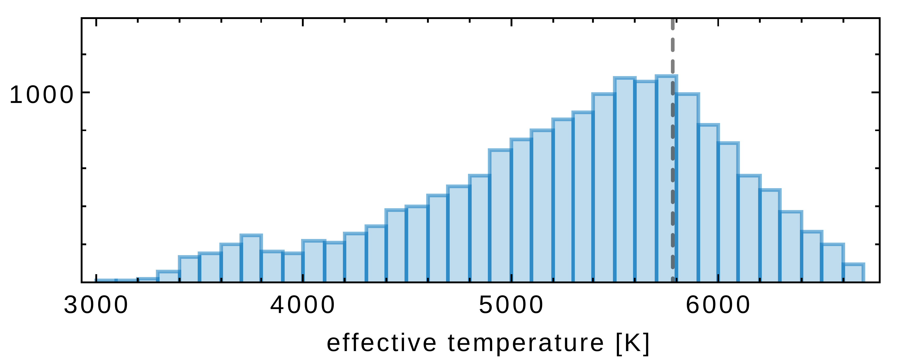
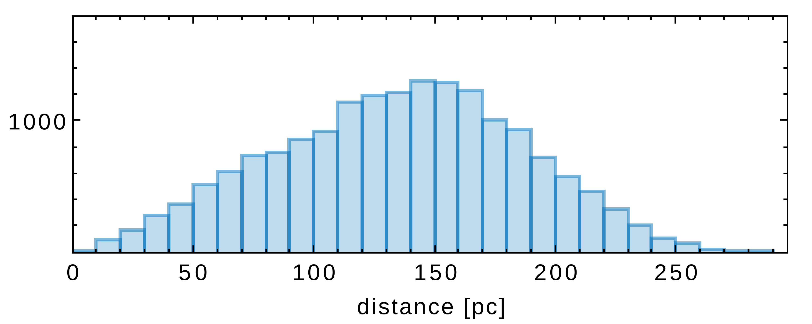
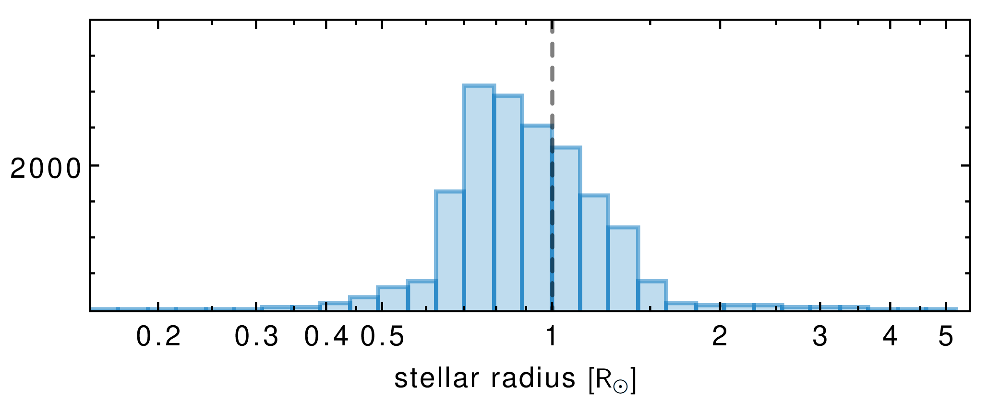
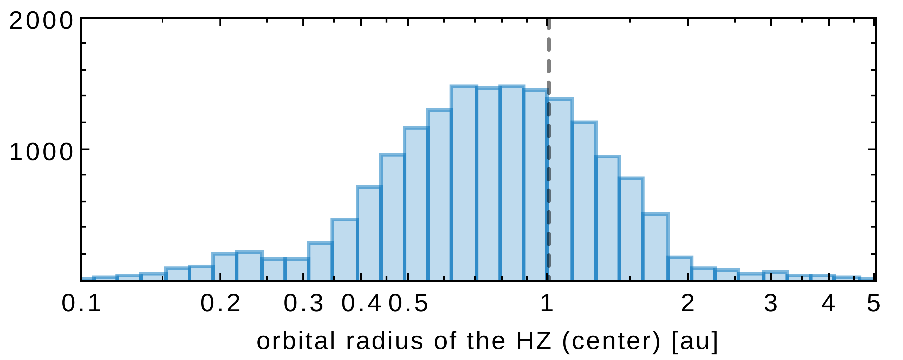
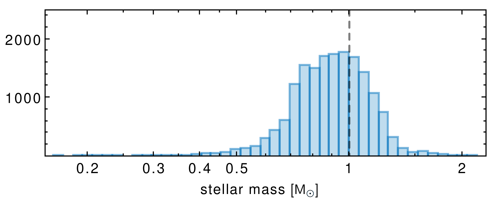
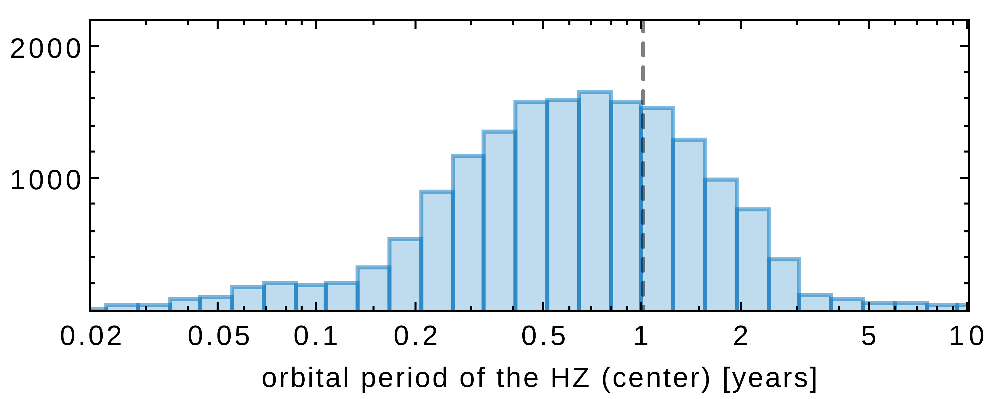
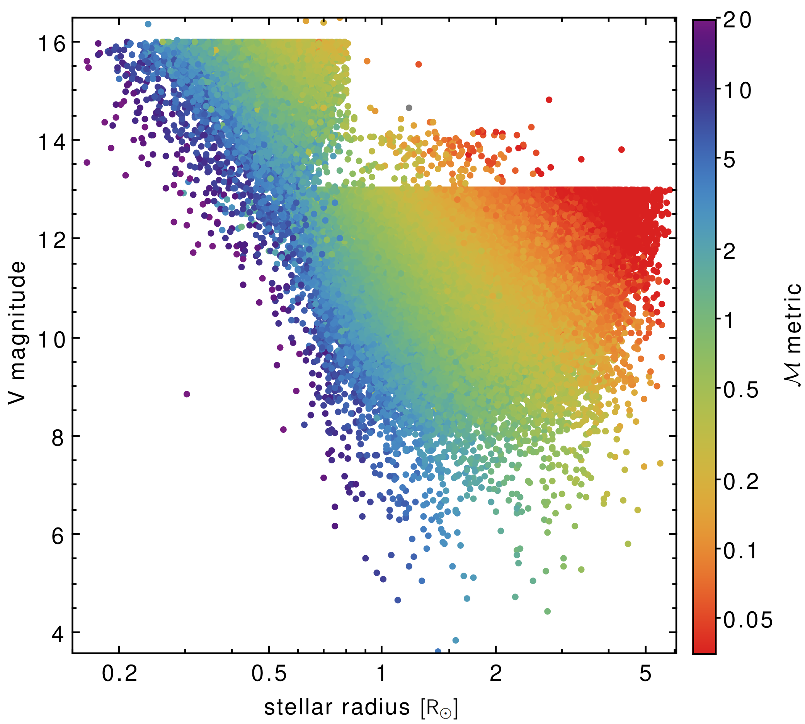
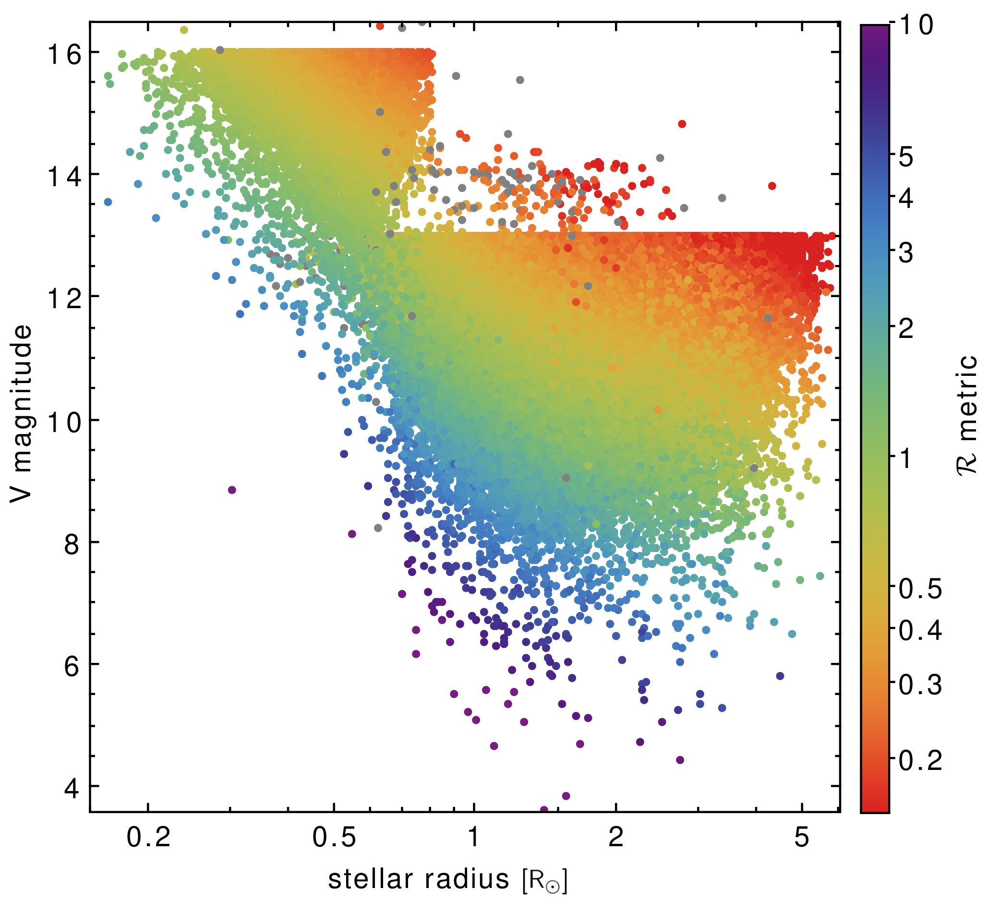
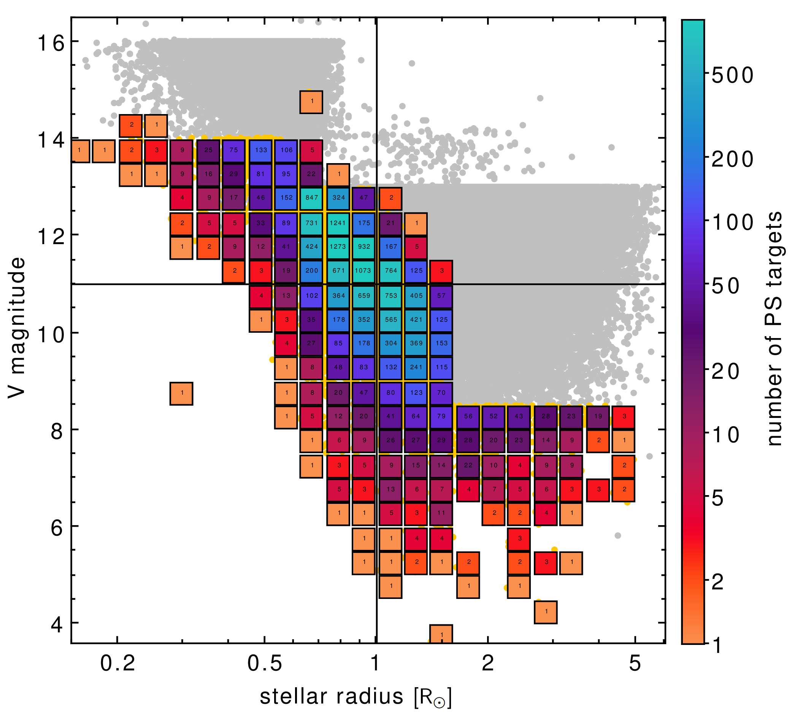
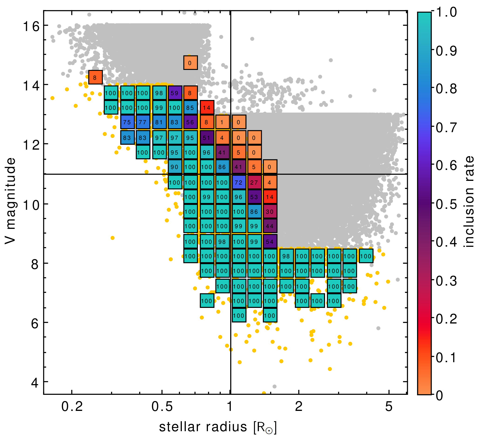

$\newcommand{\ensuremath}{}$
$\newcommand{\xspace}{}$
$\newcommand{\object}[1]{\texttt{#1}}$
$\newcommand{\farcs}{{.}''}$
$\newcommand{\farcm}{{.}'}$
$\newcommand{\arcsec}{''}$
$\newcommand{\arcmin}{'}$
$\newcommand{\ion}[2]{#1#2}$
$\newcommand{\textsc}[1]{\textrm{#1}}$
$\newcommand{\hl}[1]{\textrm{#1}}$
$\newcommand{\footnote}[1]{}$
$\newcommand{\valerio}[1]{\noindent\textcolor{red}{\blacktriangleright \textbf{#1}}}$
$\newcommand{\GP}[1]{\noindent\textcolor{red}{\blacktriangleright \textbf{#1}}\\}$
$\newcommand{\rev}[1]{#1}$

# The PLATO field selection process: III. Selection of the Prime Sample for the LOPS2 field

<mark>Appeared on: 2026-04-07</mark> -  _12 pages, 3 tables, 8 figures. Submitted to A&A_

V. Nascimbeni, et al. -- incl., <mark>M. Bergemann</mark>

**Abstract:** The PLanetary Transits and Oscillations of stars (PLATO) mission will begin its four-year nominal mission in early 2027 by monitoring its Long-duration Observation Phase field at South (LOPS2) for at least two years continuously. The primary aim of PLATO is a very ambitious and challenging one: the discovery of $\rev{Earth-like planets in the habitable zone of}$ nearby and bright solar analogues. To this purpose, the PLATO Mission Consortium, through its Ground-based Observing Program (GOP), will perform the follow-up needed to confirm part of the candidate planets photometrically detected by PLATO and measure their masses through radial velocity curves. For the LOPS2, the GOP is committed (as part of the PLATO mission) to follow-up the candidate exoplanets discovered orbiting the $15 000$ high-quality target subset of the PLATO Input Catalog (PIC) known as the Prime Sample (PS). The PS will be made public nine months before launch in the context of the first Guest Observer (GO) call for proposals to be issued by the European Space Agency (ESA). Here, we present the quantitative metrics and thresholds defined to select and prioritize the PS. Our method is perfectly general and suitable to rank any list of stars surveyed for transiting planets. We also describe the astrophysical properties of the LOPS2 PS, both in a statistical sense and for some specific targets of interest.

**Figure 7. -** Main parameters of the Prime Sample (Section \ref{sec:primesample}) stars. *In reading order:* histograms of the distribution in effective temperature $T_\mathrm{eff}$, distance $d$, stellar radius $R_\star$, orbital radius of the HZ (Eq. \ref{eq:ahz}), stellar mass $M_\star$, orbital period of the HZ (Eq. \ref{eq:phz}) for all entries flagged as PS stars in the tPIC2.2 ($17 101$); the values are taken from the same catalog. The dashed vertical lines mark the Solar values: 1 $M_\odot$, 1 $R_\odot$, 5778 K, 1 au, 1 year. (*fig:histograms*)

**Figure 4. -** Metrics $\mathcal{M}$ and $\mathcal{R}$(as defined in Sections \ref{sec:m1m2} and \ref{sec:r1r2}) applied to our stellar sample. *Left plot:* the whole sample of $217  741$ stars in tPIC2.2 plotted as a function of stellar radius $R_\star$ and $V$ magnitude and color-coded according to the value of $\mathcal{M}$ metric (defined in Section \ref{sec:m1m2}). The sharp cuts at $V=13$ and $V=16$ are due to the magnitude requirements of samples P5 and P4, respectively (Table \ref{tab:samples}). *Right plot:* same, but for $\mathcal{R}$(defined in Section \ref{sec:r1r2}). Note that the color scale does not span the same numerical range. (*fig:metrics*)

**Figure 6. -** Statistical properties of the Prime Sample (Section \ref{sec:primesample}). *Left plot:* number of PS stars in each cell of the $V$, $R_\star$ plane. The number is color-coded on a logarithmic scale and labeled on each cell. *Right plot:* Inclusion rate, i. e., the fraction of tPIC targets selected in the Prime Sample, for each cell of the $V$, $R_\star$ plane. Bright, late-type dwarfs are included with an inclusion rate of 100\% or very close to it, corresponding to the cyan shade of the color scale. Only cells containing at least five tPIC targets are plotted. (*fig:metrics_ps*)

