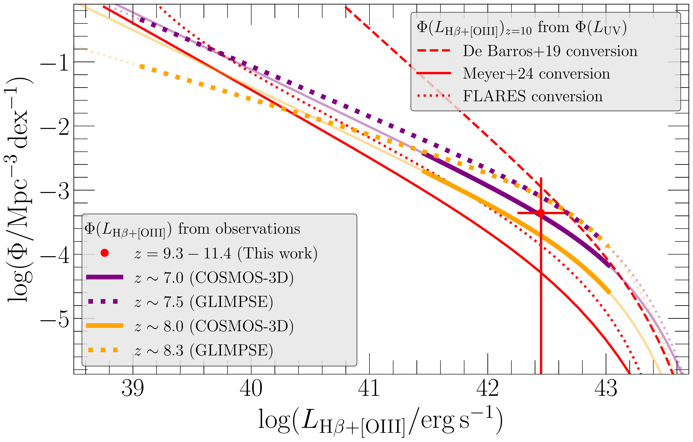
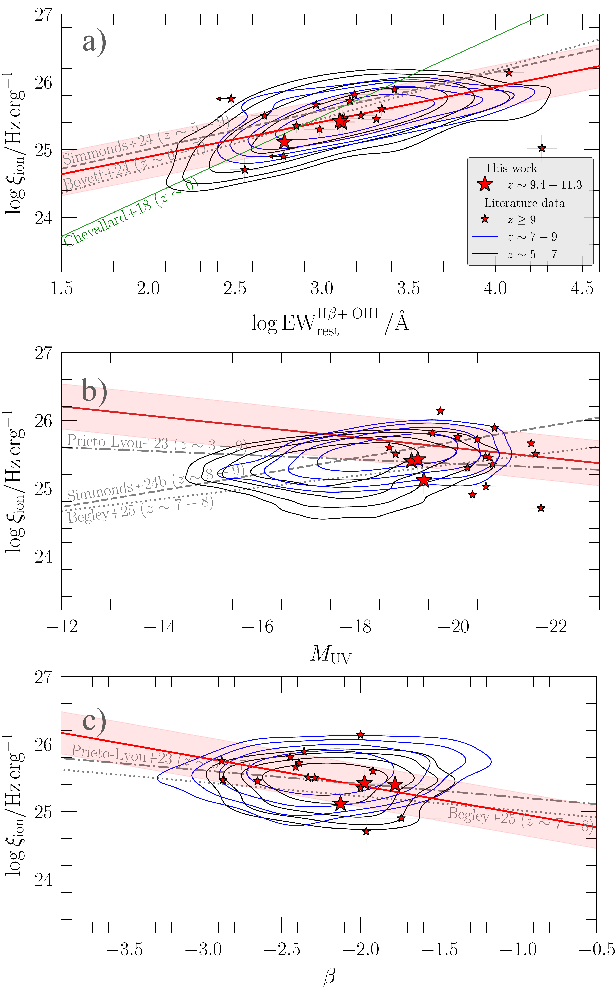

$\newcommand{\ensuremath}{}$
$\newcommand{\xspace}{}$
$\newcommand{\object}[1]{\texttt{#1}}$
$\newcommand{\farcs}{{.}''}$
$\newcommand{\farcm}{{.}'}$
$\newcommand{\arcsec}{''}$
$\newcommand{\arcmin}{'}$
$\newcommand{\ion}[2]{#1#2}$
$\newcommand{\textsc}[1]{\textrm{#1}}$
$\newcommand{\hl}[1]{\textrm{#1}}$
$\newcommand{\footnote}[1]{}$
$\newcommand{\trg}[1]{{\color{red}#1}}$
$\newcommand{\arcsecs}{\mbox{^{\prime\prime}}}$
$\newcommand{\Msolar}{\mbox{\rm M_{\odot} }}$
$\newcommand{\arraystretch}{1.1}$
$\newcommand{\arraystretch}{1.1}$
$\newcommand{\arraystretch}{1.2}$
$\newcommand{\thebibliography}{\DeclareRobustCommand{\VAN}[3]{##3}\VANthebibliography}$
$\newcommand{\gs}{\mathrel{\raise0.35ex\hbox{\scriptstyle >}\kern-0.6em \lower0.40ex\hbox{{\scriptstyle \sim}}}}$
$\newcommand{\ls}{\mathrel{\raise0.35ex\hbox{\scriptstyle <}\kern-0.6em \lower0.40ex\hbox{{\scriptstyle \sim}}}}$

# MIDIS: Strong H$\beta$+[Oiii] Line Emitters at $z\gs 9$

<mark>Appeared on: 2026-04-07</mark> -  _19 pages, 12 figures. Submitted to MNRAS_

T. R. Greve, et al. -- incl., <mark>F. Walter</mark>, <mark>T. Henning</mark>

**Abstract:** We present a search for strong H $\beta$ + [ O iii ] line emitters acrossthe redshift range $z=9.4-11.3$ in the Hubble Ultra Deep Field using ultra-deepMIRI/F560W imaging ( $28.59 {\rm mag}$ , AB, 5- $\sigma$ point-sourcesensitivity) from the MIRI Deep Imaging Survey (MIDIS). Three galaxies areidentified via pronounced F560W flux excesses relative to their underlyingcontinuum, consistent with strong rest-frame optical line emission. Fromspectral energy distribution modelling we derive rest-frameH $\beta$ + [ O iii ] equivalent widths in the range $\sim600-1300 \si{\angstrom}$ (median value $\simeq1260^{+327}_{-259} \si{\angstrom}$ ), placing these objects among the mostextreme nebular line emitters known at these epochs. We combine our MIDISsources with a compiled literature sample of 16 spectroscopically confirmedgalaxies at $z \geq 9$ with published H $\beta$ + [ O iii ] equivalent widthmeasurements and associated physical properties. We find a median ${\rmEW}^{\rm H\beta+[Oiii]}_{\rm rest} \simeq1318^{+544}_{-385} \si{\angstrom}$ , similar to values observed in star-forminggalaxies at $z \sim 6-9$ . We find no evidence for a steep increase nor asystematic decline in H $\beta$ + [ O iii ] equivalent widths beyond $z \sim9$ . Binning our combined $z\geq 9$ sample in UV luminosity, we find higherequivalent widths for the more UV luminous systems, which is qualitativelyconsistent with trends reported at $z=6-9$ . We do not find a statisticallysignificant anti-correlation between H $\beta$ + [ O iii ] equivalent widthand stellar mass within our $z\geq 9$ sample. However, a log-linear fit to thedata suggests a trend broadly consistent with the anti-correlation observed atlower redshift. We place a first constraint on the H $\beta$ + [ O iii ] line luminosity function at $z\simeq 9-11$ ( $\Phi \sim 10^{-3.4} {\rmMpc^{-3} dex^{-1}}$ at $\log(L_{\rm H\beta+[Oiii]}/{\rm erg s^{-1}})= 42.5$ ), which is consistent with a general decline compared to spectroscopicdeterminations of the luminosity function at $z\simeq 7-8$ .  For our MIDISsources, we derive ionising photon production efficiencies in the range $\log(\xi_{\rm ion}/{\rm Hz erg^{-1}}) = 25.1-25.4$ . Using our combined $z\geq9$ sample, we have examined scaling relations between $\xi_{\rm ion}$ andH $\beta$ + [ O iii ] equivalent width, UV luminosity, and UV continuumslope. We find statistically significant correlation between $\xi_{\rm ion}$ and ${\rm EW}_{\rm rest}^{\rm H\beta+[Oiii]}$ and between $\xi_{\rmion}$ and $\beta$ , which are also consistent with those observed at $z\simeq5-9$ .  No significant correlation of $\xi_{\rm ion}$ with UV luminosity isdiscernible within our combined $z\geq 9$ sample, which again is consistentwith studies at lower redshift. Together, these results indicate that thephysical conditions governing nebular emission and its coupling to the UVcontinuum emission properties and the ionising photon production efficiency ingalaxies are in place very early ( $z \simeq 9-11$ ) on during the epoch ofreionisation and consistent with a continuation of trends already establishedat $z \sim 6-9$ .

**Figure 11. -** ** a)** H$\beta$+[Oiii] rest-frame EW as a function of
        stellar mass for our $z\simeq 9.4-11.3$ MIDIS sample (large red stars)
        and $z\geq 9$ sources from the literature (small red stars; see Table
        \ref{tab:lit_z9_ew}). For comparison, we include samples at $z=7-9$ ([Endsley, et. al 2021](https://ui.adsabs.harvard.edu/abs/2021MNRAS.500.5229E), [Rinaldi, et. al 2023](https://ui.adsabs.harvard.edu/abs/2023ApJ...952..143R), [Heintz, et. al 2025](https://ui.adsabs.harvard.edu/abs/2025A&A...693A..60H))  and $z=5-7$ ([Endsley, et. al 2021](https://ui.adsabs.harvard.edu/abs/2021MNRAS.500.5229E), [Endsley, et. al 2023](https://ui.adsabs.harvard.edu/abs/2023MNRAS.524.2312E), [Rinaldi, et. al 2023](https://ui.adsabs.harvard.edu/abs/2023ApJ...952..143R), [Heintz, et. al 2025](https://ui.adsabs.harvard.edu/abs/2025A&A...693A..60H)) . At $z$\ls$
        3.2$, we show binned measurements from the literature
         ([Schenker, et. al 2013](https://ui.adsabs.harvard.edu/abs/2013ApJ...777...67S), [Khostovan, et. al 2016](https://ui.adsabs.harvard.edu/abs/2016MNRAS.463.2363K), [Reddy, et. al 2018](https://ui.adsabs.harvard.edu/abs/2018ApJ...869...92R))  together with their
        published log-linear fits (solid lines). Purple contours indicate the
        density distribution of $z\simeq 9-11$ galaxies from the {\tt FLARES}
        simulations  ([Lovell, et. al 2021](https://ui.adsabs.harvard.edu/abs/2021MNRAS.500.2127L), [Vijayan, et. al 2024](https://ui.adsabs.harvard.edu/abs/2024MNRAS.527.7337V))  that satisfy the same
        selection criteria as the MIDIS sample. ** b)** Same as panel (a), but
        with the $z=5-7$, $z=7-9$, and $z\geq 9$ samples binned in stellar mass.
        Log-linear fits to the individual data-points (i.e., non-binnned) data are
        shown as solid lines, with the corresponding residual scatter indicated by the
        shaded regions.
         (*fig:EW-vs-mstar*)

**Figure 5. -** 
        H$\beta$+[Oiii] luminosity function estimates at $z\simeq
        9.4-11.3$(red circles, this work). Also shown are determinations of
        the H$\beta$+[Oiii] luminosity functions at $z\sim 7.0-7.5$
        and $\sim 8.0-8.3$, shown as purple and yellow curves, respectively,
        based on unbiased spectroscopic surveys from [Meyer, et. al (2025)](https://ui.adsabs.harvard.edu/abs/2025arXiv251011373M)(solid
        curves) and [Korber, et. al (2025)](https://ui.adsabs.harvard.edu/abs/2025arXiv251004771K)(dotted curves). The thick parts of the curves
        indicate the luminosity range directly probed by the surveys. The red solid,
        dashed and dotted curves show the derived $z\sim 10$ H$\beta$+[Oiii]
        luminosity functions based on the UV luminosity function at $z\sim 10$ from
        [Whitler, et. al (2025)](https://ui.adsabs.harvard.edu/abs/2025arXiv250100984W) and three empirical $L_{\rm H\beta+[Oiii]} -
        L_{\rm UV}$ conversion (see \S\ref{section:LF} and
        Fig. \ref{fig:LOIIIHb_LUV}).
         (*fig:LF*)

**Figure 8. -** 
        Scaling relations of $\log(\xi_{\rm ion}/{\rm Hz erg^{-1}})$ vs
        $\log({\rm EW}_{\rm rest}^{\rm H\beta+[Oiii]}/\si{\angstrom})$(panel ** a)**), $M_{\rm UV}$(panel ** b)**), and $\beta$(panel
        ** c)**). Large red stars indicate the $z=9.4-11.3$ MIDIS sample,
        while small red stars show the $z\geq 9$ literature sample (Table
        \ref{tab:lit_z9_ew}. Literature samples at $z=5-7$ and $z=7-9$ are
        shown as black and blue contours, respectively
        \citep{Stefanon2022,Prieto-Lyon2023,Ning2023,Simmonds2023,Matthee2023,Mascia2024,Saxena2024,Lin2024,Whitler2024,
        Boyett2024,Simmonds2024b,Rinaldi2024,Heintz25,Begley2025}. In all three
        panels, the thick red line show the log-linear fit to the scaling
        relations of the $z\geq 9$ galaxies, with the residual scatter shown as
        the red shaded region. In panel a), the gray  dashed and dotted lines
        indicate translated literature relations based on spectroscopic
        measurements of ${\rm EW}^{\rm[Oiii]\lambda5007}$ ([Simmonds, et. al 2024](https://ui.adsabs.harvard.edu/abs/2024MNRAS.535.2998S), [Boyett, et. al 2024](https://ui.adsabs.harvard.edu/abs/2024MNRAS.535.1796B)) , converted to ${\rm EW}_{\rm
        rest}^{\rm H\beta+[Oiii]}$ using a luminosity-dependent
        prescription for the H$\beta$/[Oiii] ratio. In panel b), the
        dashed, dotted, and dot-dashed lines show log-linear fits to large
        spectroscopic $z$\gs$ 7$ samples from [Simmonds, et. al (2024)](https://ui.adsabs.harvard.edu/abs/2024MNRAS.535.2998S),
        [Begley, et. al (2025)](https://ui.adsabs.harvard.edu/abs/2025MNRAS.537.3245B) and  ([Prieto-Lyon, et. al 2023](https://ui.adsabs.harvard.edu/abs/2023A&A...672A.186P)) , respectively.
        in panel c),
         (*fig:scalingrelations*)

