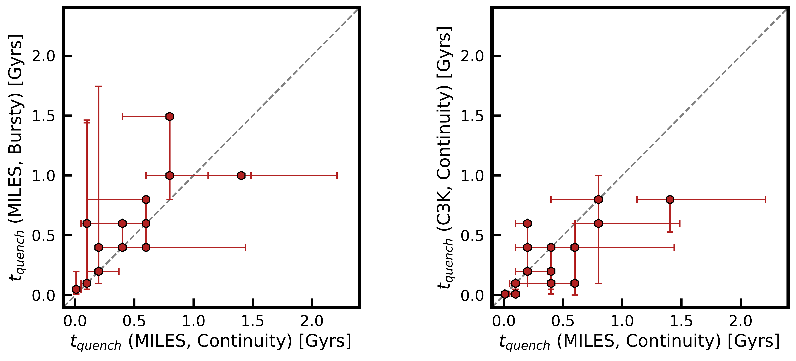
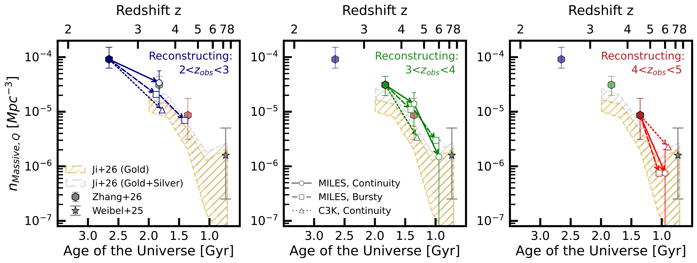

$\newcommand{\ensuremath}{}$
$\newcommand{\xspace}{}$
$\newcommand{\object}[1]{\texttt{#1}}$
$\newcommand{\farcs}{{.}''}$
$\newcommand{\farcm}{{.}'}$
$\newcommand{\arcsec}{''}$
$\newcommand{\arcmin}{'}$
$\newcommand{\ion}[2]{#1#2}$
$\newcommand{\textsc}[1]{\textrm{#1}}$
$\newcommand{\hl}[1]{\textrm{#1}}$
$\newcommand{\footnote}[1]{}$
$\newcommand{\vdag}{(v)^\dagger}$
$\newcommand\aastex{AAS\TeX}$
$\newcommand\latex{La\TeX}$

# Winding Back the Clock: Recent Star Formation Histories of Massive Quiescent Galaxies Are Consistent With Their Rapid Number Density Evolution Since $\mathbf{z\sim7}$

<mark>Appeared on: 2026-04-08</mark> -  _13 pages, 3 figures_

Y. Zhang, et al. -- incl., <mark>A. d. Graaff</mark>

**Abstract:** Massive quiescent galaxies have been identified out to $z\sim7$ in early JWST data in a substantial excess ( $\rm \gtrsim 1 dex$ at $z>4$ ) of number densities from most theoretical predictions. We investigate whether the number densities implied by the star formation histories of quiescent galaxies at $2<z<5$ are consistent with the observed number density evolution of that population since $z>7$ . For this work, we rely on stellar population synthesis modeling of JWST NIRCam photometry (from CEERS and PRIMER) and NIRSpec/PRISM spectra of massive ( $\rm M_{*} > 10^{10.5}M_{\odot}$ ) quiescent galaxies in the RUBIES survey. We infer their star-formation histories through Bayesian spectro-photometric fitting with Prospector, exploring the sensitivity of our results to stellar libraries and SFH priors. For each source, we compute a timescale over which it would be identified as quiescent -- leveraging the recent and most robust SFH timescale -- and deduce the number density of the quiescent population at previous epochs. These reconstructed number densities are then compared to existing observational constraints, including a new measurement from the PANORAMIC pure parallel survey, whose wide-area and independent sightlines reduce sensitivity to cosmic variance. We find striking agreement between reconstructed and observed number densities up to $z\sim7$ , a self-consistency that lends credence to stellar population synthesis modeling of distant quiescent galaxies. Furthermore, by connecting the recent ( $\rm \sim 1 Gyr$ ) star-formation histories and number densities of quiescent galaxies and their implied progenitors, we reinforce the known tension between observations and model predictions at $3<z<7$ .

**Figure 1. -** Top panels: The spectro-photometric fits of an example quiescent galaxy (RUBIES-UDS-175698) at $z\sim3.1$, given three \texttt{prospector} setups. The fiducial model (red) adopts the MILES spectral library and a continuity SFH prior. Additionally, we test a second model variant that changes to a bursty SFH prior (orange) and a third model that changes to the C3K spectral library (teal). The model spectrum and photometry are shown in color, and the observed spectrum and photometry are shown in black and gray. Middle panel: The inferred SFHs of this galaxy. For each setup, we show the resulting median (solid lines) and $16-84\%$ percentile (solid or hatched bands) SFHs, adopting the same color coding as the top panels. Bottom panel: The median time since quenching in each model, defined as the lookback time since $\rm sSFR$ drops below $\rm 10^{-10} yr^{-1}$, with $\rm 50  Myrs$ subtracted to account for O and B star lifetimes. For a given quiescent galaxy, this timescale is sensitive to modeling assumptions, even though the model fits to the observed data are similarly excellent.
 (*fig: method*)

**Figure 2. -** Recovered $t_{q}$ between given pairs of model setups. In the left panel, we show the fiducial model (MILES spectral library; continuity SFH prior) versus the bursty prior variant. In the right panel, we compare the fiducial model to the variant adopting the C3K spectral library. Overall, we find that models with a bursty SFH prior systematically infer longer time since quenching than those with a continuity prior. In addition, models with the C3K spectral library systematically infer shorter $t_{q}$ than those adopting MILES.
 (*fig: timescale*)

**Figure 3. -** In these panels, we compare the number density of quiescent galaxies reconstructed from SFHs in this work (open symbols) to values measured from a subset of direct observations in the literature, including RUBIES (\citealp{Weibel.etal.2025,Zhang.etal.2026}; filled symbols) and PANORAMIC (\citealp{Ji.etal.2026}; hatched bands). We show the number density reconstructed from the $2<z<3$ quiescent population (blue) in the left panel, $3<z<4$(green) in the middle, and $4<z<5$(red) in the right. We include uncertainties only on the fiducial model predictions for clarity (open circles). To show the scatter range in these predictions due to modelling assumptions, we show the median model predictions from the bursty prior variant (open squares) and the C3K variant (open triangles). If no quiescent galaxies would have been visible as quiescent in a given redshift bin, we don't show the reconstructed number densities. Overall, the reconstructed quiescent galaxy number densities are in agreement with direct observations within $1 \sigma$ up to $z\sim7$.
 (*fig: punchline*)

