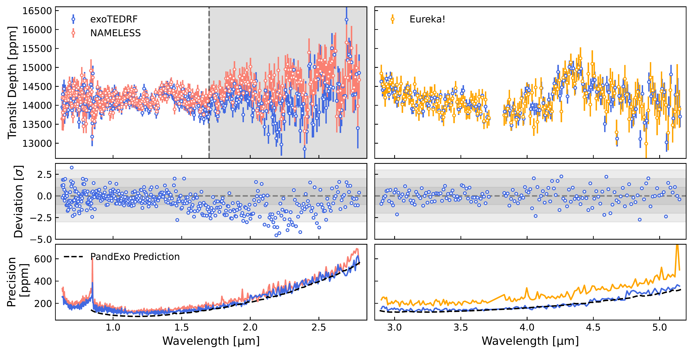
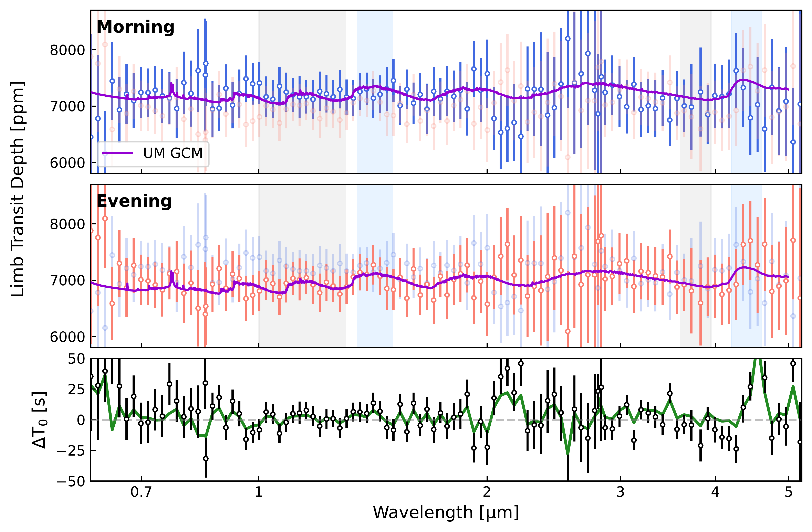
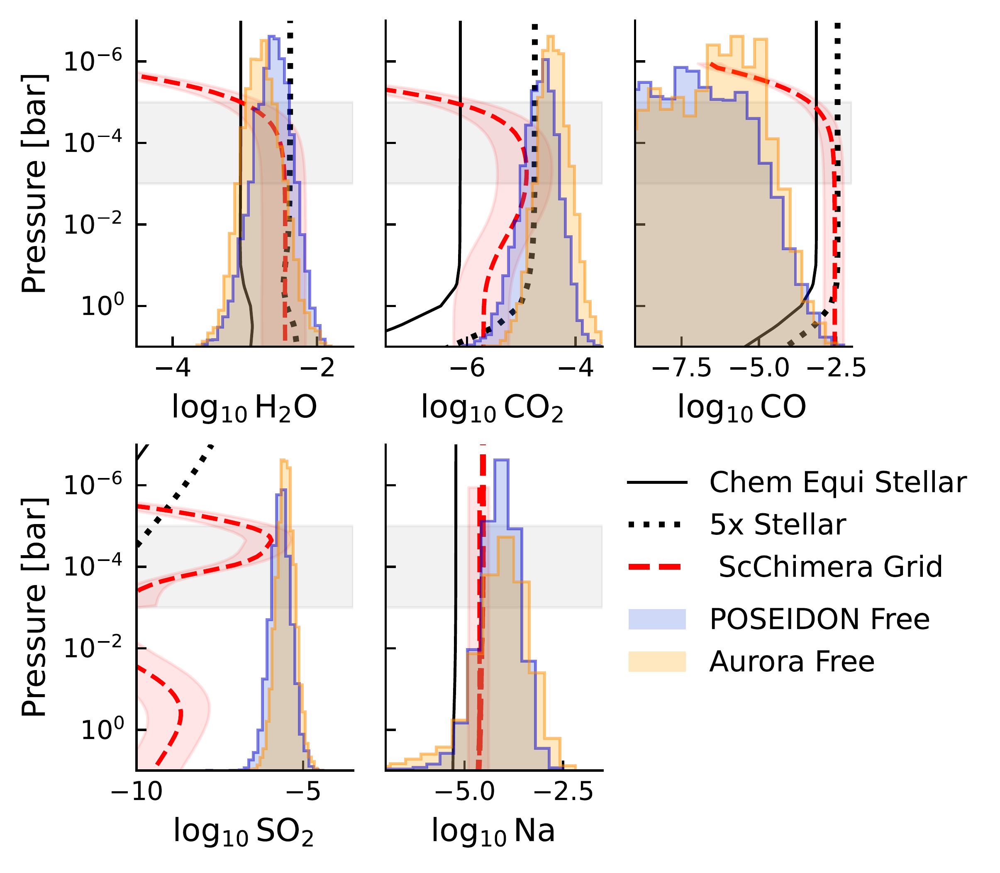

$\newcommand{\ensuremath}{}$
$\newcommand{\xspace}{}$
$\newcommand{\object}[1]{\texttt{#1}}$
$\newcommand{\farcs}{{.}''}$
$\newcommand{\farcm}{{.}'}$
$\newcommand{\arcsec}{''}$
$\newcommand{\arcmin}{'}$
$\newcommand{\ion}[2]{#1#2}$
$\newcommand{\textsc}[1]{\textrm{#1}}$
$\newcommand{\hl}[1]{\textrm{#1}}$
$\newcommand{\footnote}[1]{}$

# Super-Solar Metallicity and Tentative Evidence for Photochemistry on WASP-96 b from JWST and Ground-Based VLT Transmission Spectroscopy

<mark>Appeared on: 2026-04-08</mark> -  _Accepted to AJ_

M. Radica, et al. -- incl., <mark>E.-M. Ahrer</mark>, <mark>D. Christie</mark>

**Abstract:** With its expanded wavelength coverage and increased precision compared to previous space-based observatories, JWST provides the opportunity to revisit benchmark planets and view them in a new light. Here, we conduct an in-depth study of the atmosphere of the hot-Saturn WASP-96 b combining a new JWST NIRSpec/G395H transit with archival NIRISS/SOSS and VLT/FORS2 transmission spectra. The combined spectrum shows clearly-visible features from $H_2$ O, $CO_2$ , and Na. CO, though, remains unconstrained, precluding a firm metallicity derivation from free retrievals alone. However, self-consistent grids yield a broadly super-stellar atmospheric metallicity of 2--6 $\times$ stellar. When combined with a roughly stellar C/O ratio ( $0.41^{+0.10}_{-0.09}$ from self-consistent grids), we find that WASP-96 b potentially formed via core-accretion beyond the $H_2$ O snowline and subsequently accreted volatile-rich material. Free retrievals also find a moderate preference ( $\ln B$ =2.69) for models with $SO_2$ versus without. WASP-96 b falls directly on the proposed "$SO_2$ shoreline" and the retrieved $SO_2$ abundance is well-matched to predictions from photochemical models. Our combined spectrum displays an optical slope, which our models fit with opacity from scattering aerosols --- either small-particle condensate clouds or photochemical hazes --- though we cannot completely rule out the broad wings of Na or the effects of stellar contamination. Future observations are necessary to disentangle these effects. Finally, we explore the possibility for limb asymmetry in WASP-96 b's transmission spectrum and provide several tests to identify asymmetries in our data. We encourage the community to prioritize the development of a robust pathway to quantify the presence of limb asymmetry --- particularly for low signal-to-noise cases.

**Figure 6. -** Comparison between our nominal \texttt{exoTEDRF} spectra and alternate reductions with \texttt{NAMELESS} for NIRISS (left panels) and \texttt{Eureka!} for NIRSpec (right panels).
    *Top*: The two spectra produced for each instrument overplotted. The grey shading in the NIRISS panel denotes wavelengths not used in the comparative retrievals (see Section \ref{sec: Modelling}).
    *Middle*: Error-normalized differences for each instrument. There is a significant divergence between the two NIRISS/SOSS spectra redwards of $\sim$1.7 µm which can be attributed to differences in 1/$f$ noise correction methodologies (see Appendix \ref{app: SOSS 1/f}).
    *Bottom*: Light curve scatter as a function of wavelength compared to \texttt{PandExo} predictions. (*fig:Spectra_Compare_R300*)

**Figure 7. -** WASP-96 b's morning and evening limb transmission spectra as observed with JWST.
    *Top*: The morning-limb transmission spectrum (blue data points) compared to the evening-limb spectrum (faded red). Overplotted in purple is the morning-limb spectrum from the aerosol-free, 10$\times$ solar UM GCM run (see Appendix \ref{app: GCM}). Blue and grey shaded rectangles denote the in-band and out-of-band wavelengths, respectively, for the $H_2$O and $CO_2$ band amplitude calculations (see Section \ref{sec: Limb Holistic}).
    *Middle*: Inverse of the above, focusing on the evening-limb spectrum.
    *Bottom*: Fitting mid-transit time as a function of wavelength assuming a uniform-limb (i.e., \texttt{batman}) planet (black points). In green is the $\rm T_0$ spectrum derived from the asymmetric \texttt{catwoman} fits using the formalism of \citet{murphy_analytic_2024}. (*fig:Limb_Spectra*)

**Figure 1. -** Abundances of several prominent chemical species inferred from the \texttt{POSEIDON}(blue histograms) and \texttt{Aurora}(orange histograms) free retrievals. Overplotted are chemical equilibrium abundance profiles for a stellar (logZ$\sim$2$\times$ solar, C/O=0.42; solid) and 5$\times$ stellar (logZ$\sim$10$\times$ solar; dotted) metallicity atmosphere, as well as constraints from the self-consistent grid (red). The grey shaded regions denote the approximate pressures probed by these observations. Solar abundances are taken to be those from \citet{asplund2009} to match \citet{nikolov_solar--supersolar_2022}. (*fig:Abundance_profiles*)

