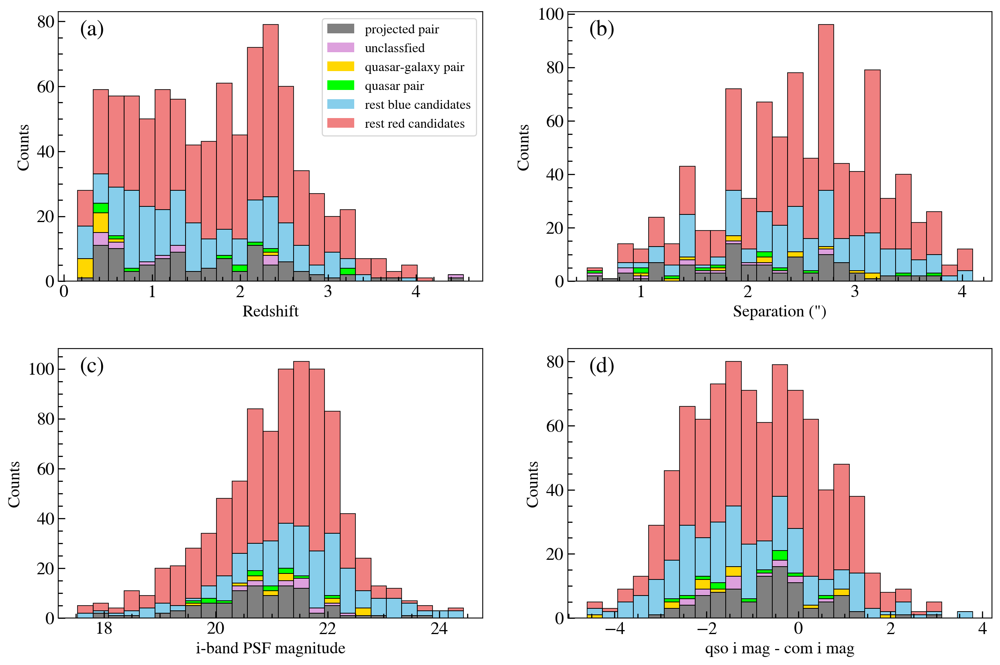
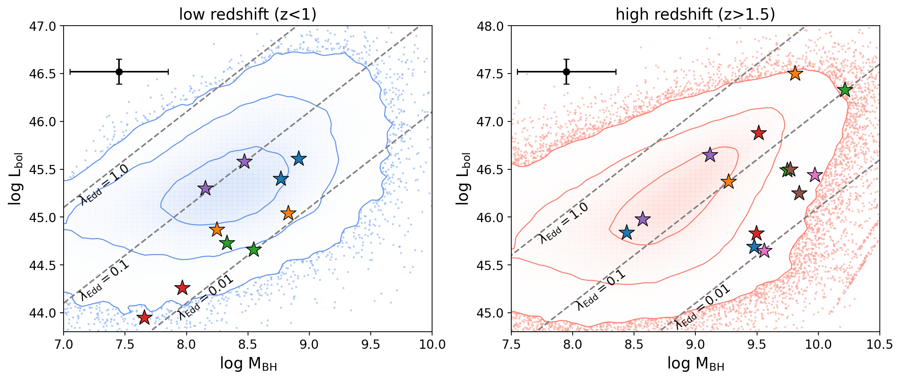
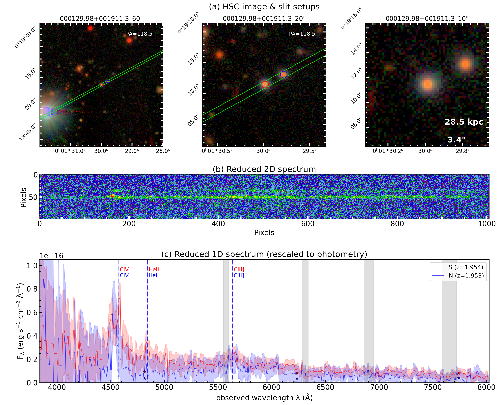
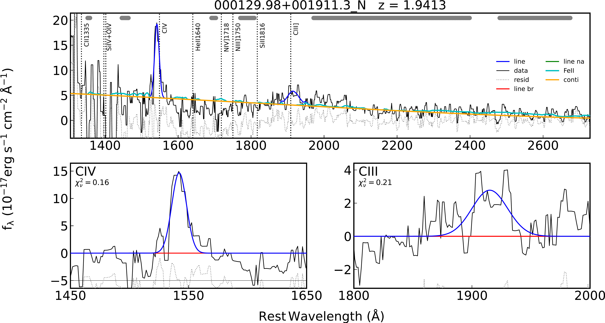
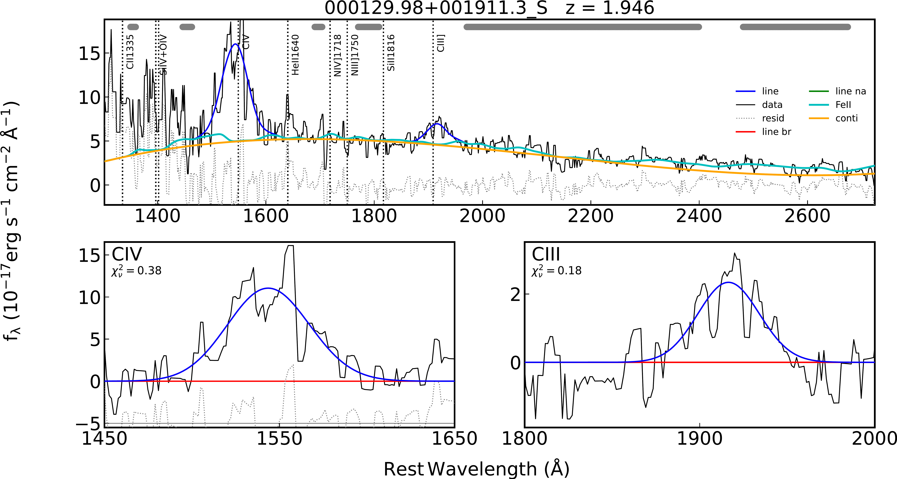

$\newcommand{\ensuremath}{}$
$\newcommand{\xspace}{}$
$\newcommand{\object}[1]{\texttt{#1}}$
$\newcommand{\farcs}{{.}''}$
$\newcommand{\farcm}{{.}'}$
$\newcommand{\arcsec}{''}$
$\newcommand{\arcmin}{'}$
$\newcommand{\ion}[2]{#1#2}$
$\newcommand{\textsc}[1]{\textrm{#1}}$
$\newcommand{\hl}[1]{\textrm{#1}}$
$\newcommand{\footnote}[1]{}$
$\newcommand\sersic{Sérsic}$
$\newcommand\OIII{[\text{O} \textsc{iii}]}$
$\newcommand\OII{[\text{O} \textsc{ii}]}$
$\newcommand\NII{[\text{N} \textsc{ii}]}$
$\newcommand\Ha{\text{H}\alpha}$
$\newcommand\Hb{\text{H}\beta}$
$\newcommand\MgII{\text{Mg} \textsc{ii}}$
$\newcommand\CIV{\text{C} \textsc{iv}}$
$\newcommand\Ca{\text{Ca} \textsc{ii}~\text{H\&K}}$
$\newcommand{\thebibliography}{\DeclareRobustCommand{\VAN}[3]{##3}\VANthebibliography}$

# Spectroscopic confirmation of dual and offset quasars from the Subaru HSC-SSP program

<mark>Appeared on: 2026-04-08</mark> - 

S. Tang, et al. -- incl., <mark>K. Jahnke</mark>

**Abstract:** We present a spectroscopic follow-up program targeting closely-separated dual quasar candidates selected from imaging of SDSS quasars with the Subaru Hyper Suprime-Cam Subaru Strategic Program (HSC-SSP). Using two-dimensional image decomposition, our selection identifies PSF-like companions within 0 $\farcs$ 6–4 $\arcsec$ separation ( $\lesssim$ 30 kpc) around the SDSS quasar. We newly confirm six broad-line dual quasars and eleven offset quasars (quasar-galaxy pairs), spanning $1.5 < z < 3.3$ for the duals and predominantly $z < 0.6$ for the offset systems. No obvious lensed quasars were discovered from this program. We obtained 99 spectra of these candidates from NTT/EFOSC2, Gemini/GMOS-N, Keck/NIRES, and Subaru/FOCAS. From the spectra, we measure the emission-line properties of these dual black holes (BH). At $z>1.5$ , the confirmed duals exhibit high black hole mass ( $M_{\rm BH}$ $=10^{8.5}$ – $10^{10} M_{\odot}$ ) with high bolometric luminosities ( $L_{\rm bol}$ $=10^{45.5}$ – $10^{47.5}$ erg s $^{−1}$ ), yet accrete at moderate Eddington ratios ( $\lambda_{\rm Edd}=$ 0.01–0.4). From the spectroscopically-confirmed samples, we estimate the dual fraction of SDSS quasars with separations of $0.6\arcsec$ – $4\arcsec$ to be 0.2 \% -1.2 \% at $z<0.8$ , 0.08 \% -0.24 \% at $0.8<z<1.5$ , and 0.06 \% at $1.5<z<3.3$ . These values are broadly consistent with other recent optical studies, but lower than theoretical expectations of a rising dual fraction at cosmic noon. However, we note that these fractions, especially at high $z$ , still need a more accurate assessment of selection and observation effects.

**Figure 4. -** Classification outcomes of our dual quasar survey as a function of (a) redshift, (b) angular separation, (c) $i$-band PSF magnitude of the companion, and (d) $i$-band magnitude difference between the SDSS quasar and the companion. A total number of 122 systems have been observed among 883 dual candidates. Gray histograms denote projected pairs (96 systems where the two components are at different redshifts), pink histograms show unclassified cases (14 systems, mostly due to blending or low S/N), green and yellow histograms correspond to confirmed broad-line dual quasars (12) and quasar–galaxy pairs (14), respectively. The blue and red histograms represent unobserved candidates with companion color $g-r<1$(212 systems) and $g-r>1$(548 systems). (*fig:z_success*)

**Figure 2. -** Bolometric luminosities vs. black hole masses for confirmed dual quasars by our project (colored star marks), including six pairs from our previous works. **Left panel:**$z<1$ systems; **Right panel:**$z>1.5$ systems. In each panel, the same colored star marks indicate every two members of each pair. Representative uncertainties in $M_{\rm BH}$ and $L_{\rm bol}$ are shown in the top-left corner of each panel. Underlying contours show the 1$\sigma$, 2$\sigma$, and 3$\sigma$ distributions of SDSS DR14 quasars in the corresponding redshift range. Dashed gray lines indicate constant Eddington ratios ($\lambda_{\rm Edd}=1.0, 0.1, 0.01$). (*fig:BH_bol_edd*)

**Figure 3. -** Example of a standardized "Discovery Panel" for J000129.98+001911.3.
    Panel (a): HSC three-color images with side lengths of 60$\arcsec$, 20$\arcsec$, and 10$\arcsec$, including slit orientation and source separation.
    Panel (b): \texttt{PypeIt}-reduced 2D spectrum. The spectrum at the center (50 pixels) corresponds to the SDSS quasar (source circled in red in panel a).
    Panel (c): 1D spectra of the SDSS quasar (red) and the companion source (blue), rescaled to HSC photometry.
    Panel (d): PyQSOFit results for both 1D spectra.
    A detailed description of the Discovery Panel format is provided in Section \ref{sec:individuals}.
    The full figure set for all systems analyzed in this work is available as supplementary material online. (*fig:J000129.98+001911.3*)

