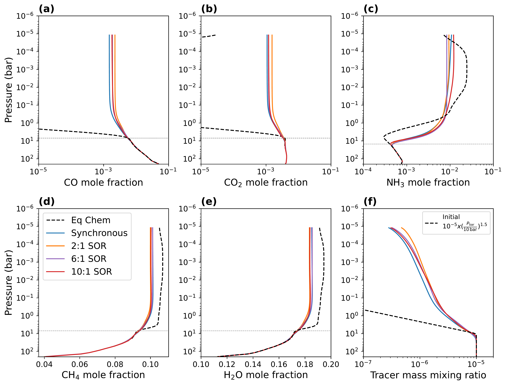
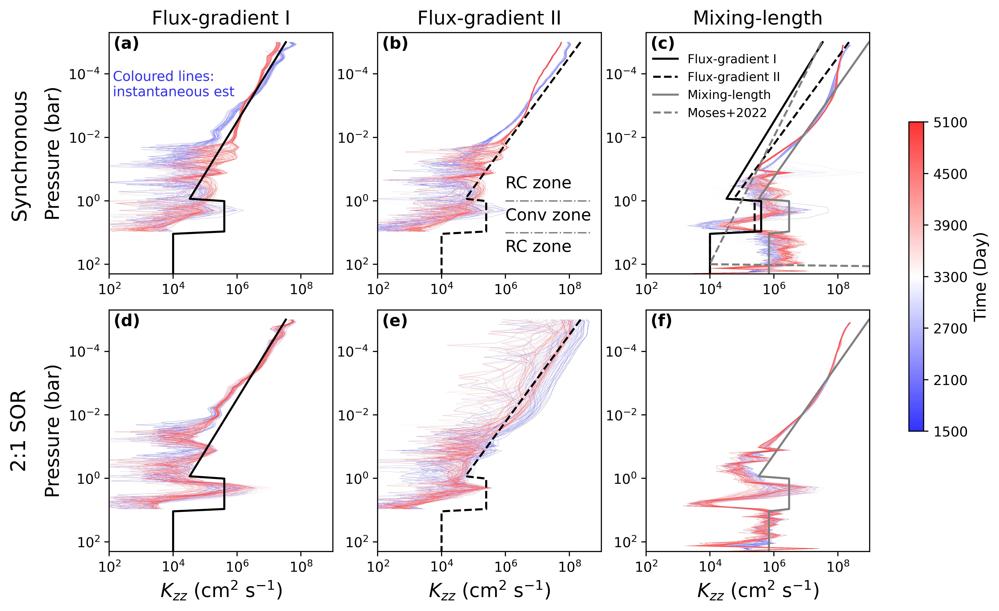

$\newcommand{\ensuremath}{}$
$\newcommand{\xspace}{}$
$\newcommand{\object}[1]{\texttt{#1}}$
$\newcommand{\farcs}{{.}''}$
$\newcommand{\farcm}{{.}'}$
$\newcommand{\arcsec}{''}$
$\newcommand{\arcmin}{'}$
$\newcommand{\ion}[2]{#1#2}$
$\newcommand{\textsc}[1]{\textrm{#1}}$
$\newcommand{\hl}[1]{\textrm{#1}}$
$\newcommand{\footnote}[1]{}$
$\newcommand\linenumberfont{\normalfont\tiny\color{gray}}$
$\newcommand{\thebibliography}{\DeclareRobustCommand{\VAN}[3]{##3}\VANthebibliography}$

# Three-dimensional transport-induced chemistry ontemperate sub-Neptune K2-18b, Part II: the combined effects of atmospheric dynamics and chemical reactions

<mark>Appeared on: 2026-04-10</mark> -  _Resubmitted to MNRAS after addressing referee's comments_

J. Liu, <mark>D. Christie</mark>, J. Yang, K. Kohary

**Abstract:** The upper atmospheres of temperate sub-Neptunes are strongly influenced by atmospheric dynamics due to their cool equilibrium temperature and thereby longer chemical timescales than the atmospheric dynamical timescales. In this study, we used a three-dimensional (3D) general circulation model to investigate the transport-induced disequilibrium chemistry and vertical mixing on temperate gas-rich mini-Neptunes, using K2-18b as an example. We model K2-18b assuming 180 times solar metallicity and consider it as either a synchronous or an asynchronous rotator, exploring spin-orbit resonances of 2:1, 6:1, and 10:1. We find that the vertical transport affects the chemical structure significantly, making $CO_2$ and CO more abundant ( $\sim$ 10 $^{-3}$ ) in the upper atmosphere compared to the chemical equilibrium abundance ( \textless{10$^{-15}$} ), and horizontal winds further homogenize the chemical composition zonally in this region.  Molecular abundances in the photosphere generally agree across different rotation periods. We employ a passive tracer in the model to estimate the one-dimensional (1D) equivalent eddy-diffusion coefficient ( $K_{zz}$ ) of K2-18b, providing a parameter useful for future 1D atmospheric models. Additionally, synthetic transmission spectra generated from our model are compared with the JWST observations, and we find that our model can provide a comparable fit to the observations. This work offers a 3D perspective on transport-induced chemistry on a temperate sub-Neptune and derives vertical mixing parameters to support 1D modelling.

**Figure 2. -** Horizontal distribution of passive tracer (a), CO (b), $CO_2$(c), $NH_3$(d), $CH_4$(e), and $H_2$O (f) at 0.001 bar. The results are transformed into the heliocentric frame, keeping the substellar point at 0$^\circ$ longitude and 0$^\circ$ latitude. The black star-shaped markers indicate the location of the substellar point. The streamlines indicate the direction of the flow.
To highlight the horizontal gradient, the contours indicate the local mole fraction divided by the global mean at this pressure level. The corresponding average values are displayed above each panel.
Columns from left to right show results from synchronous, 2:1 SOR, 6:1 SOR, and 10:1 SOR simulations, respectively. (*fig:mole_2D*)

**Figure 1. -** 
Global-mean vertical profiles of CO (a), $CO_2$(b), $NH_3$(c), $CH_4$(d), and $H_2$O (e) mole fractions and passive tracer mass mixing ratio (f).
Coloured lines show results from simulations assuming K2-18b is a synchronous rotator (blue), or in 2:1 SOR (orange), 6:1 SOR (purple), and 10:1 SOR (red).
Black dashed lines depict the chemical equilibrium abundances calculated via Gibbs free energy minimisation using the temperature field from the kinetics run; because the global-mean temperature profiles are consistent across different rotation rates, only results from the synchronous simulation are shown here.
Horizontal grey dotted lines indicate the quench levels for each species. The quench levels for CO, $CO_2$, $NH_3$, $CH_4$, and $H_2$O are 7, 7, 15, 7, and 7 bar, respectively. The dashed black line in panel (f) indicates the initial passive tracer mass mixing ratio used in all simulations.
 (*fig:mole_profile*)

**Figure 4. -** $K_{zz}$ derived with the flux-gradient relationship I (a) and II (b) and the mixing-length theory (c). Panels (a)--(c) show results from the synchronous simulation, while panels (d)--(f) correspond to the 2:1 SOR simulation. Coloured lines represent the $K_{zz}$ profiles calculated every thirty model days from the instantaneous model output, where bluer lines represent earlier stages of the simulation and redder lines indicate later stages. The results for the last 3600 days are shown after the simulations have spun up.
The thick solid (dashed) black and solid grey lines represent a roughly `average' parametrisation for the $K_{zz}$ profiles derived from the flux-gradient relationship I (II) and the mixing length theory. The three average $K_{zz}$ profiles estimated from different methods are all plotted in panel (c) for comparison. The thin grey dashed-dotted lines indicate the boundary between the radiative-convective (RC) zones and the convective (Conv) zone in panel (b).
Above 1 bar, the average $K_{zz}$ profiles are
$3\times10^4\cdot(1 \text{bar}/P_\text{bar})^{0.61}$ cm$^2$ s$^{-1}$, $5\times10^{4}\cdot(1 \text{bar}/P_\text{bar})^{0.7}$ cm$^2$ s$^{-1}$, and $3\times10^{5}\cdot( 1 \text{bar}/P_\text{bar})^{0.7}$ cm$^2$ s$^{-1}$ for flux-gradient relationship I (solid black), flux-gradient relationship II (dashed black), and the mixing length theory (solid grey), respectively. Between 1 and 10 bar, the average $K_{zz}$ profiles are set to be constants: 4$\times$10$^{5}$ cm$^2$ s$^{-1}$,  4$\times$10$^{5}$ cm$^2$ s$^{-1}$, and 3$\times$10$^{6}$ cm$^2$ s$^{-1}$ for the three methods. Note that the detached convective zone is set to be more extended vertically, from 1 to 10 bar in the average $K_{zz}$ profile. The grey dashed line in
panel (c) is the estimation in \citet[][equation 1]{moses2022chemical}: $K_{zz} = 9.77 \times 10^4 \cdot (1 \mathrm{bar}/P_\text{bar})^{0.5}$ cm$^2$ s$^{-1}$. (*fig:Kzz_profile*)

