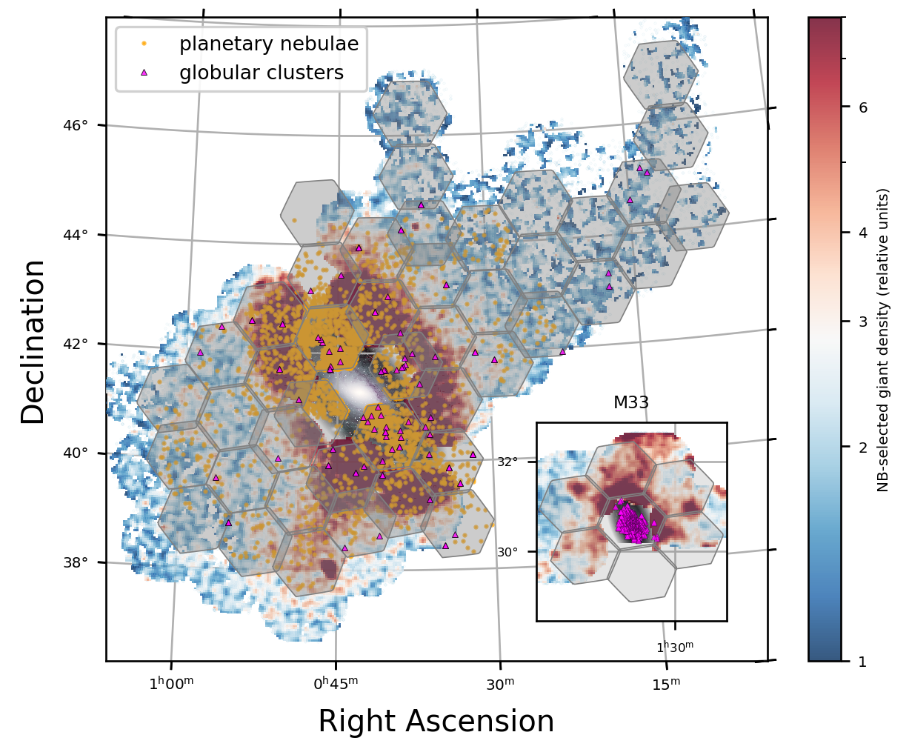
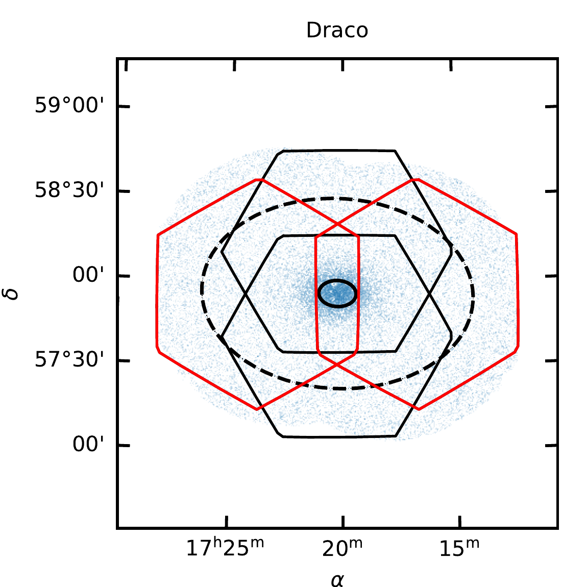
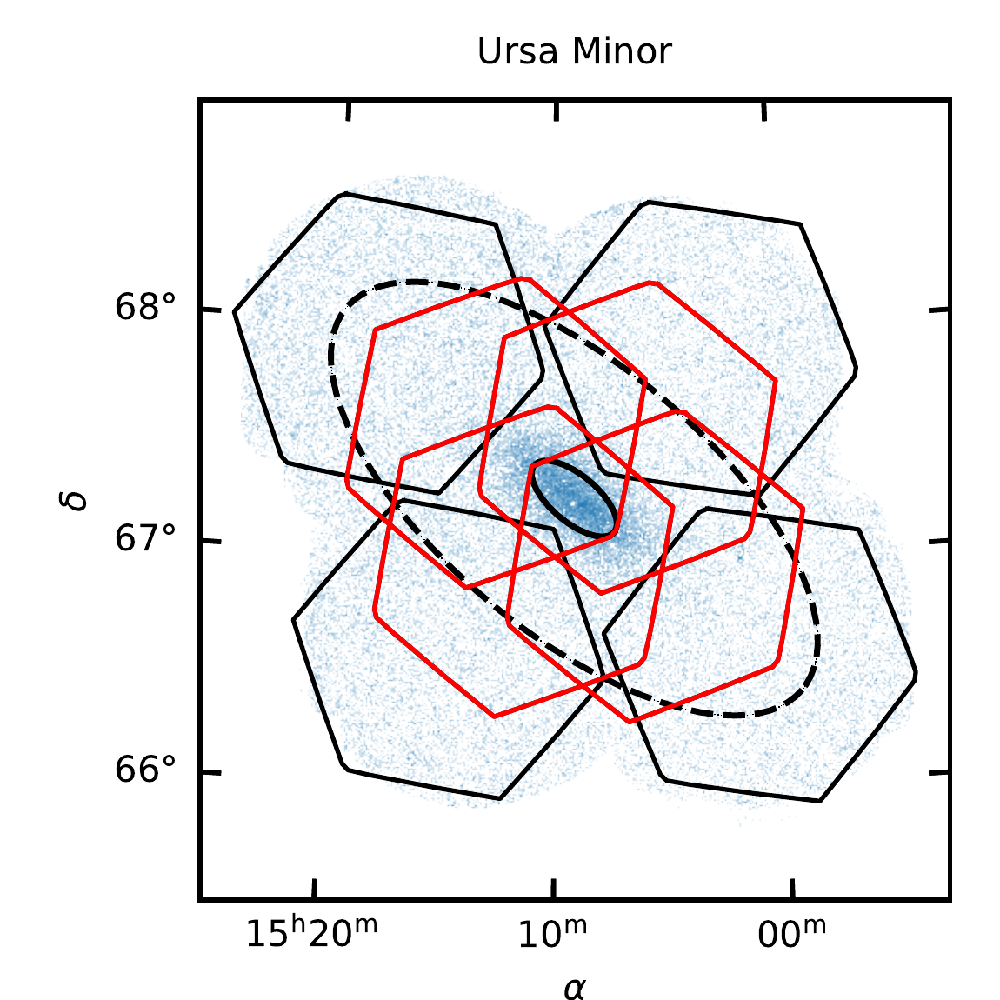
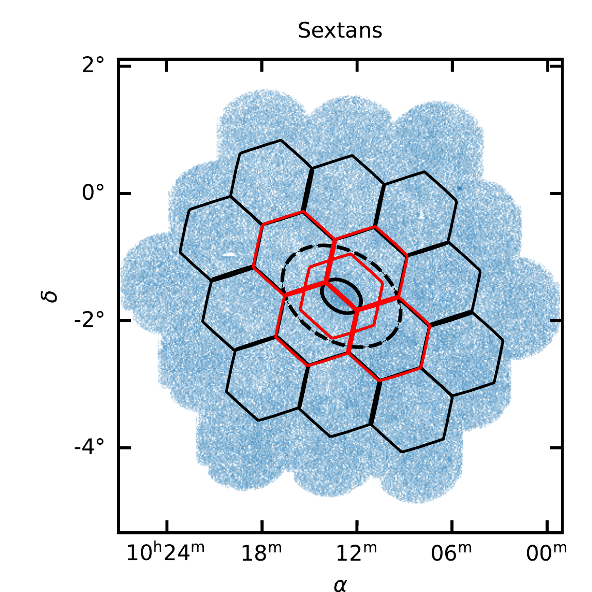
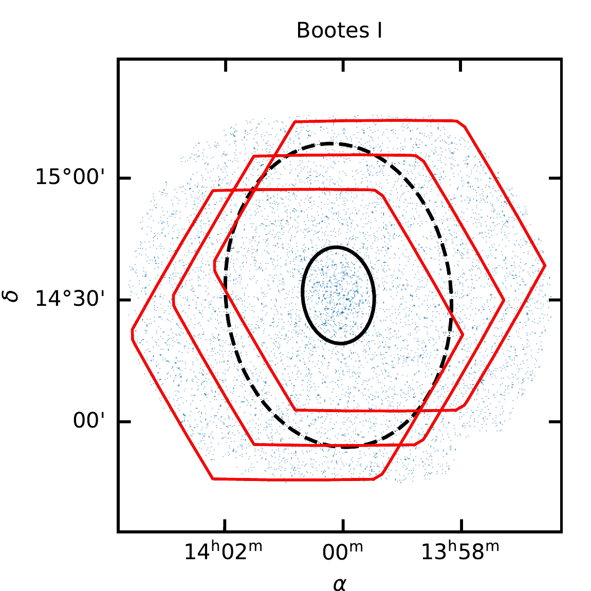
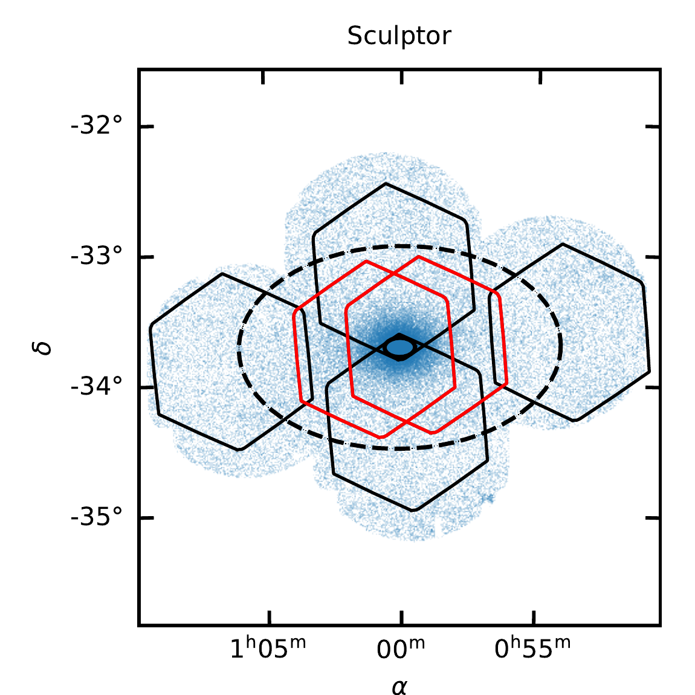
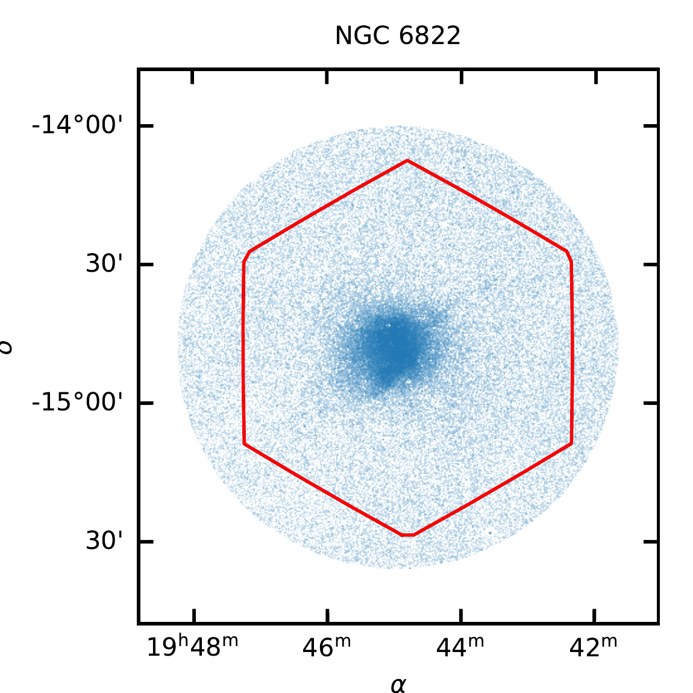
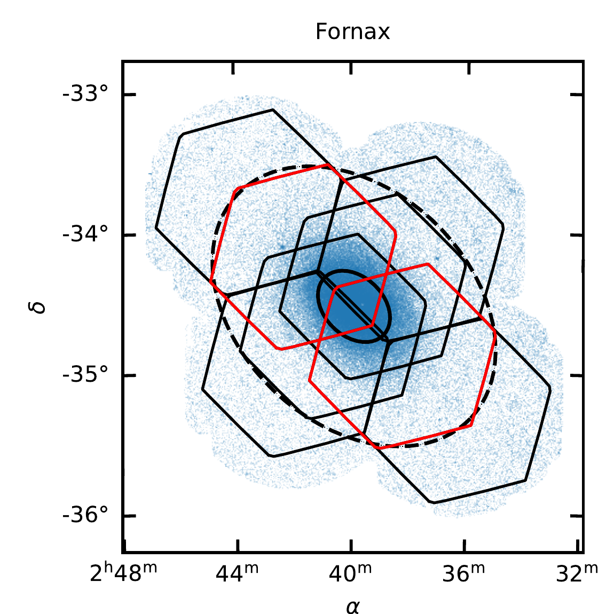
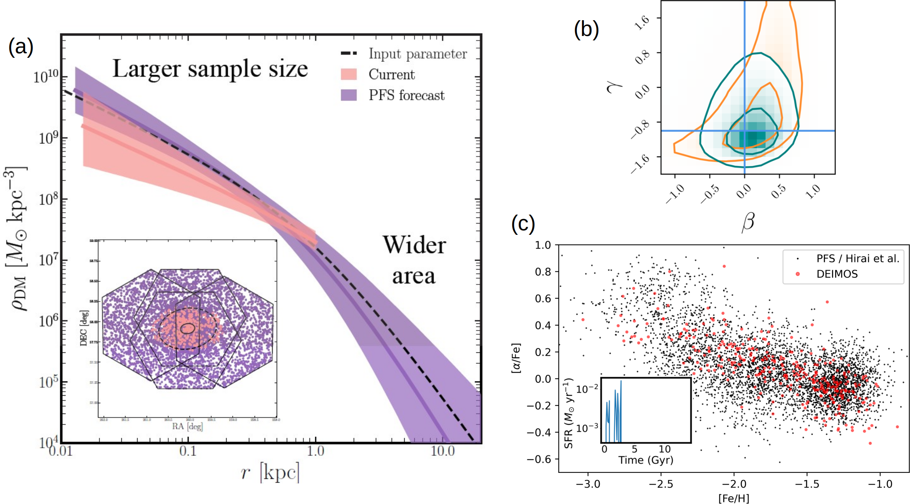

$\newcommand{\ensuremath}{}$
$\newcommand{\xspace}{}$
$\newcommand{\object}[1]{\texttt{#1}}$
$\newcommand{\farcs}{{.}''}$
$\newcommand{\farcm}{{.}'}$
$\newcommand{\arcsec}{''}$
$\newcommand{\arcmin}{'}$
$\newcommand{\ion}[2]{#1#2}$
$\newcommand{\textsc}[1]{\textrm{#1}}$
$\newcommand{\hl}[1]{\textrm{#1}}$
$\newcommand{\footnote}[1]{}$
$\newcommand{\gsim}{\hspace{0.3em}\raisebox{0.4ex}{>}\hspace{-0.75em}\raisebox{-.7ex}{\sim}\hspace{0.3em}}$
$\newcommand{\lsim}{\hspace{0.3em}\raisebox{0.4ex}{<}\hspace{-0.75em}\raisebox{-.7ex}{\sim}\hspace{0.3em}}$
$\newcommand{\change}[1]{\textcolor{blue}{#1}}$
$\newcommand{\red}[1]{\textcolor{red}{#1}}$
$\newcommand{\blue}[1]{\textcolor{blue}{#1}}$
$\newcommand{\orange}[1]{\textcolor{orange}{#1}}$
$\newcommand{\mc}[1]{#1}$
$\newcommand{\mi}[1]{#1}$
$\newcommand{\cf}[1]{#1}$
$\newcommand{\kh}[1]{#1}$
$\newcommand{\tilman}[1]{#1}$
$\newcommand{\ld}[1]{#1}$
$\newcommand{\acs}[1]{#1}$
$\newcommand{\sestito}[1]{#1}$
$\newcommand{\yh}[1]{#1}$
$\newcommand{\pk}[1]{#1}$
$\newcommand{\enk}[1]{\textbf{\textcolor{red}{#1}}}$
$\newcommand{\yk}[1]{\textbf{\textcolor{green}{#1}}}$
$\newcommand{\fix}[1]{\textbf{\textcolor{red}{#1}}}$
$\newcommand{\Msun}{M_{\odot}}$
$\newcommand{\FeH}{\left[\mathrm{Fe}/\mathrm{H}\right]}$
$\newcommand{\onohiula}{`\=Onohi`ula}$

# Galactic Archaeology with the Subaru $\onohiula$ Prime Focus Spectrograph Strategic Program

<mark>Appeared on: 2026-04-14</mark> -  _The Galactic Archaeology science case for the Subaru Strategic Program for the `Ōnohi`ula Prime Focus Spectrograph. Not yet submitted to any journal_

M. Chiba, et al. -- incl., <mark>N. Martin</mark>, <mark>X. Zhang</mark>

**Abstract:** The recently commissioned Subaru $\onohiula$ Prime Focus Spectrograph (PFS) will obtain spectra from nearly 2,400 fibers that cover 1.24 square degrees.  The 360 night Subaru Strategic Program  for PFS is dedicating approximately one-third of its allocation (130 nights) to study the structure and evolution of galaxies in the Local Group.  This Galactic Archaeological survey has three pillars.  (1) We will determine whether the mass density profiles of dwarf galaxies are consistent with cusps, as expected for cold dark matter, or cores, as expected from alternative dark matter theories or baryonic feedback.  We will deduce the density profiles as a function of radius from modeling of the full line-of-sight velocity and abundance distributions for six dwarf galaxies.  Our total sample will consist of 18,000 member stars to beyond the nominal tidal radius of each system.  (2) From measurements of the [ $\alpha$ /Fe ] abundance ratio, we will learn the difference in assembly history of the two most massive galaxies in the Local Group: M31 and the Milky Way.  We will observe 30,000 member stars over 45 square degrees of M31's halo and outer disk.  (3) We will uncover how the most fragile (outer) part of the Milky Way responded to accretion events both in the distant past (such as Gaia--Sausage Enceladus) and in more recent history (such as the  Sagittarius dwarf spheroidal galaxy).  To support this study, PFS will provide velocities and metallicities---from which, in combination with photometry, we will deduce ages---for tens of thousands of main-sequence stars out to a Galactocentric distance of $\sim$ 30 kpc.

**Figure 15. -** Proposed PFS pointings (_ gray hexagons_) in M31 and M33 (_ inset_).  The color map shows the surface  density of candidate member stars selected through the combination of HSC broadband ($g$, $i$) and narrowband (NB515) imaging \citep{Ogami2025}.  We anticipate observing about 30,000 red giants in M31.  Also shown are planetary nebulae (\S\ref{sec:pn}) and candidate globular clusters (\S\ref{sec:gcs}).
 (*fig:m31*)

**Figure 13. -** The planned PFS pointings for the dwarf galaxies. Red hexagons indicate pointings that will be repeated to identify candidate binary systems.   The blue and gray dots in each panel are member and non-member star candidates selected by HSC photometry.
The solid and dashed ellipses show the core and nominal tidal radii that result from fits to King model profiles \citep{Munoz2018}. (*fig:dwarf_pointings*)

**Figure 12. -** (a) DM density profiles derived by an axisymmetric, 2nd-velocity-moment Jeans analysis. The underlying model is shown as a dashed line. The shaded bands and colored curves correspond to the recovered density profiles and uncertainties obtained using line-of-sight velocities for stars that match "Current" ($N = 500$, orange) and "PFS forecast" ($N = 5,000$, purple) samples, distributed on the sky as shown in the inset. The ellipses correspond to the half-light and tidal radii.
(b) MCMC posteriors on the DM inner profile slope $(\gamma)$ and velocity anisotropy $(\beta)$ from a spherically symmetric Jeans analysis using first only the 2nd-order velocity moment (orange) and then both the 2nd- and 4th-order velocity moments, thus allowing the inclusion of non-Gaussianity (cyan) \citep{Wardana2025}.
The vertical and horizontal lines depict the input values of this mock analysis, for the case of a cusp $(\gamma= -1)$ and isotropy $(\beta=0)$.
(c) [$\alpha$/Fe] vs. [Fe/H] for uniformly analyzed spectroscopic data from DEIMOS for the Sculptor dSph $\yh${\citep[red,][]{Kirby2011a}} plus anticipated results from PFS data (black), assuming bursty star-formation histories taken from the cosmological simulation of \citet{Hirai2024}. The repeated starbursts, indicated in the inset, are sufficient to modify the DM profile and result in clustering of the black points in elemental abundance space.
 (*fig:dsph_dm*)

