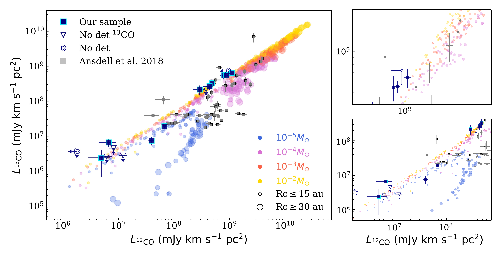
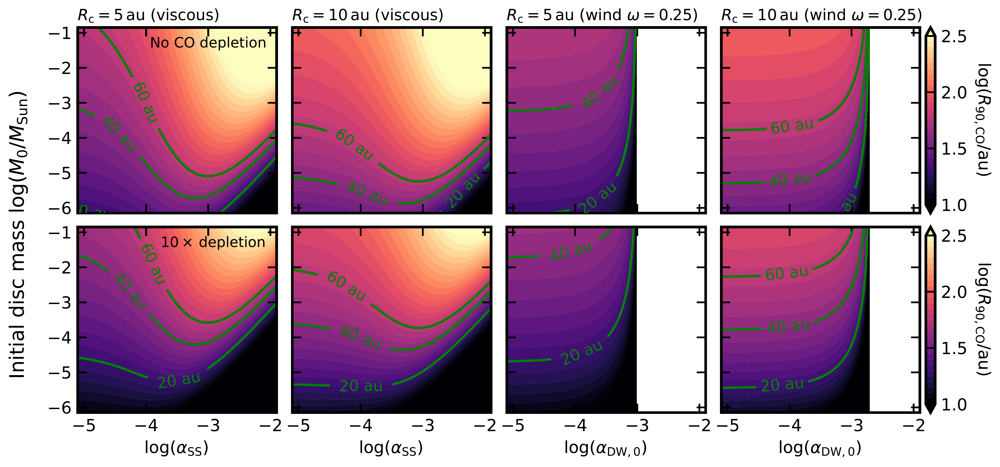

$\newcommand{\ensuremath}{}$
$\newcommand{\xspace}{}$
$\newcommand{\object}[1]{\texttt{#1}}$
$\newcommand{\farcs}{{.}''}$
$\newcommand{\farcm}{{.}'}$
$\newcommand{\arcsec}{''}$
$\newcommand{\arcmin}{'}$
$\newcommand{\ion}[2]{#1#2}$
$\newcommand{\textsc}[1]{\textrm{#1}}$
$\newcommand{\hl}[1]{\textrm{#1}}$
$\newcommand{\footnote}[1]{}$
$\newcommand{\review}[1]{\textcolor{red}{#1}}$
$\newcommand{\Review}[1]{#1}$
$\newcommand{\review}[1]{\textcolor{red}{#1}}$
$\newcommand{\Review}[1]{#1}$

# Compact CO emission and no evidence of radial drift: ALMA observations of the faintest planet-forming disks in Lupus

<mark>Appeared on: 2026-04-14</mark> - 

G. Ricciardi, et al. -- incl., <mark>F. Zagaria</mark>

**Abstract:** A large fraction of the planet-forming disks surveyed by ALMA show faint CO emission, which is commonly interpreted as an indication of severe CO depletion. However, disks can be faint for multiple reasons, including by having their emission unresolved spatially, which may result in their size being overestimated, making their flux appear faint. The limited sensitivity of previous observations prevented us from determining whether this scenario can indeed account for the observed faint CO emission for radially compact disks, hindering our understanding of disk evolution and planet formation in most of the disk population. We present new ALMA observations targeting $^{12}$ CO $(J = 3-2)$ and $^{13}$ CO $(J = 3-2)$ in 17 of the faintest planet-forming disks in Lupus. We aim to test the feasibility of the compact disk scenario as a plausible explanation for compact disks with faint CO isotopologue emission. Our sample contains 17 disks observed with ALMA in Band 7 at the moderate angular resolution of $0\farcs25$ ( $\approx$ 20 au radius at 160 pc, median distance of the sample), approximately one order of magnitude deeper than the available archival ALMA data where $^{12}$ CO and $^{13}$ CO were not detected. We used line stacking techniques to enhance the signal to noise ratio and extract the CO fluxes when possible. Finally, we compared the CO line luminosities with a grid of physical-chemical models of extended and compact disks and computed the disk dust and CO sizes. We detected $^{12}$ CO and $^{13}$ CO emission in 10 disks, 4 disks were detected only in $^{12}$ CO, and 3 disks were not detected in either of the two isotopologues. The observations indicate that some of these disks are consistent with being intrinsically compact and optically thick, in both $^{12}$ CO and $^{13}$ CO. This scenario offers an alternative explanation to the commonly accepted hypothesis of significant CO depletion. The derived gas radii further support this interpretation ( $R_{\rm CO} \leq 40 {\rm au}$ ), suggesting that a significant fraction of disks may be born intrinsically small, as also indicated by recent Class 0/I surveys. Furthermore, the resulting gas-to-dust size ratios reveal no clear signs of dust evolution, suggesting that these compact disks are not drift-dominated.

**Figure 13. -** Comparison of Lupus disk CO line luminosities with physical–chemical model predictions. The DALI models from [Miotello, et. al (2021)](https://ui.adsabs.harvard.edu/abs/2021A&A...651A..48M) are shown as background dots; different colors indicate different disk gas masses, and the symbol size scales with disk radius. The Lupus sources from [Ansdell, et. al (2018)](https://ui.adsabs.harvard.edu/abs/2018ApJ...859...21A) are overplotted as gray squares. For our sample, blue sqares mark detections, open triangles indicate non-detections in $^{13}$CO, and open crosses represent non-detections in both CO isotopologues. The two panels on the right show zoomed-in views: the top one show the targets in the first SG, the bottom one the targets of the 2nd SG. (*figure:luminosities_plot*)

**Figure 15. -** Toy-model-based gas disk sizes ($R_{\rm CO,90}$) as a function of the initial disk mass ($M_0$) and evolution efficiency ($\alpha$) for different initial disk sizes ($R_{\rm c}=5$ and $10 {\rm au}$, odd and even columns) CO depletion factors (0 and 10, top and bottom rows) in the viscous and MHD-wind case. The green curves display contours compatible with the gas size range spanned by our data (cf., Tab. \ref{table:sample}). (*figure:models*)

**Figure 18. -** Comparison of Lupus disk CO line luminosities with physical–chemical model predictions. The DALI models from [Miotello, et. al (2021)](https://ui.adsabs.harvard.edu/abs/2021A&A...651A..48M) are shown as background dots; different colors indicate different disk gas masses, and the symbol size scales with disk radius. The Lupus sources from [Ansdell, et. al (2018)](https://ui.adsabs.harvard.edu/abs/2018ApJ...859...21A) are overplotted as gray squares. For our sample, blue sqares mark detections, open triangles indicate non-detections in $^{13}$CO, and open crosses represent non-detections in both CO isotopologues. The two panels on the right show zoomed-in views: the top one show the targets in the first SG, the bottom one the targets of the 2nd SG. (*figure:luminosities_plot*)

