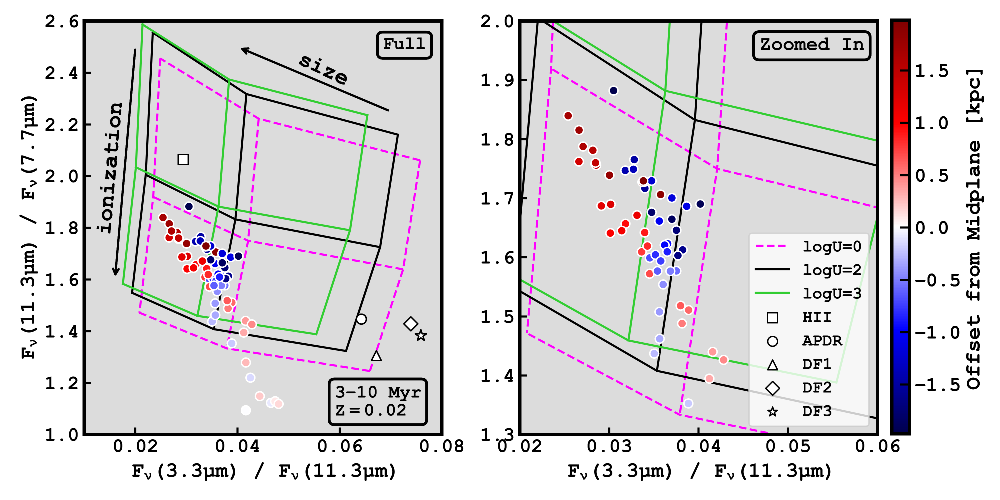
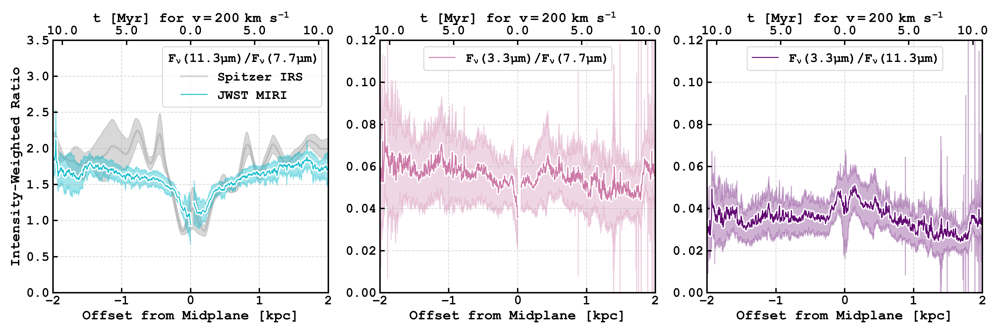

$\newcommand{\ensuremath}{}$
$\newcommand{\xspace}{}$
$\newcommand{\object}[1]{\texttt{#1}}$
$\newcommand{\farcs}{{.}''}$
$\newcommand{\farcm}{{.}'}$
$\newcommand{\arcsec}{''}$
$\newcommand{\arcmin}{'}$
$\newcommand{\ion}[2]{#1#2}$
$\newcommand{\textsc}[1]{\textrm{#1}}$
$\newcommand{\hl}[1]{\textrm{#1}}$
$\newcommand{\footnote}[1]{}$
$\newcommand{\vdag}{(v)^\dagger}$
$\newcommand\aastex{AAS\TeX}$
$\newcommand\latex{La\TeX}$
$\newcommand\eleven{11.3~\micron}$
$\newcommand\seven{7.7~\micron}$
$\newcommand\three{3.3~\micron}$
$\newcommand\ElevenSeven{11.3/7.7~\micron}$
$\newcommand\ThreeSeven{3.3/7.7~\micron}$
$\newcommand\ThreeEleven{3.3/11.3~\micron}$
$\newcommand\kms{km~s^{-1}}$
$\newcommand\ha{H\alpha}$
$\newcommand\LTIR{L_{\rm TIR}}$
$\newcommand\LPAH{L_{\rm PAH}}$
$\newcommand\LPAHJWST{\LPAH(JWST)}$
$\newcommand\LPAHSpitz{\LPAH(Spitzer)}$
$\newcommand\qpah{q_{\rm PAH}}$
$\newcommand\qpahsim{q_{\rm PAH}^{\rm sim}}$
$\newcommand\qpahlim{q_{\rm PAH}^{\rm UL}}$
$\newcommand\hii{H~\textsc{ii}}$
$\newcommand\Msunperyr{M_{\odot}~yr^{-1}}$
$\newcommand\Msun{M_{\odot}}$

# JWST Observations of Starbursts: Dust Processing in the M82 Superwind

<mark>Appeared on: 2026-04-15</mark> -  _31 pages, 12 figures, accepted to ApJ_

S. A. Cronin, et al. -- incl., <mark>F. Walter</mark>

**Abstract:** We present JWST MIRI and NIRCam imaging of the inner ${\sim}5$ kpc of the M82 superwind at ${\sim}0\farcs05{-}0\farcs375$ ( ${\sim}0.9{-}6.5$ pc) resolution. Targeted filters probe emission from polycyclic aromatic hydrocarbons (PAHs; F335M, F360M, F770W, F1130W) and continuum (F250M, F360M). The images reveal a network of cool wind filaments traced by PAHs. PAH surface brightness declines with the inverse square of distance to the midplane, suggesting that the incident radiation field from the starburst drives the observed PAH intensity out to $\pm 2.5$ kpc. The $\ThreeEleven$ and $\ThreeSeven$ band ratios show uniformity with distance from the starburst, though comparisons with mid-IR dust emission models indicate a modest shift toward larger PAHs. Outside the disk, $\ElevenSeven$ increases moderately, reflecting that PAHs become more neutral with distance from the starburst as they are exposed to a declining radiation field and ionization parameter. Overall, PAHs in the wind are consistent with standard-to-large sizes and standard-to-high ionization states. Including _Spitzer_ and _Herschel_ data, PAH abundance ( $\qpah$ ) is set at ${\sim}1\%$ in the starburst and remains unchanging out to $\pm 5$ kpc off the disk. This flat $\qpah$ profile suggests that PAHs are shielded from the hot wind, perhaps residing in the surface layers of cool clouds, with possible replenishment from cloud interiors and enrichment of the halo from previous bursts. In this picture, clouds are not dense enough to promote PAH growth, and they likely undergo radiative cooling and mixing with the hot phase to survive the gauntlet for at least ${\sim}20$ Myr.

**Figure 5. -** Maps of \three, \seven, and \eleven PAH emission in units of $F_{\nu}$[MJy sr$^{-1}$]. These images are background- and continuum-subtracted (see Section \ref{sec:data}), and rotated to align with the galaxy minor axis. The MIRI maps are presented at their native resolutions: $0$\farcs$269 \approx 4.7$ pc resolution for F770W and $0$\farcs$375 \approx 6.5$ pc resolution for F1130W. The \three map is at the $0$\farcs$12 \approx 2$ pc resolution of the F360M image. We average emission values in a $33$\arcsec$$-wide slice along the minor axis (white rectangles) and present them in Figure \ref{fig:emission_slice}. (*fig:emission_maps*)

**Figure 8. -** M82 PAH intensity-weighted ratios plotted over synthetic ratio grids calculated from the [Draine, et. al (2021)](https://ui.adsabs.harvard.edu/abs/2021ApJ...917....3D) dust models. The points represent the mean ratio after binning the Figure \ref{fig:ratio_slice} data for readability. The right panel is a zoomed-in version of the left to easily distinguish the points. The grids show very little change when assuming a [Bruzual and Charlot (2003)](https://ui.adsabs.harvard.edu/abs/2003MNRAS.344.1000B) radiation field from either a $3$ or $10$ Myr old starburst at solar ($Z = 0.02$) metallicity. The individual grids vary only in the mean radiation field heating of the dust ($U$). The choice of $U = 1, 10^2, 10^3$ is informed by independent derivations of the M82 radiation field intensity from [Draine and Li (2007)](https://ui.adsabs.harvard.edu/abs/2007ApJ...657..810D) SED fitting to Herschel data  ([Leroy, et. al 2015](https://ui.adsabs.harvard.edu/abs/2015ApJ...814...83L)) , and from SOFIA observations  ([Levy, et. al 2023](https://ui.adsabs.harvard.edu/abs/2023ApJ...958..109L)) . The ratios found in the starburst are not well represented by any of the models, including the solar neighborhood or M31 bulge models (not shown), and are likely driven by silicate absorption diluting the \eleven intensity. Overall, PAHs in the M82 wind range between standard-to-high ionization state and standard-to-large size. PAHs appear more neutral (and possibly larger) with distance, with charge driving most of the observed trend. The white shapes are ratios measured in the \hii region, atomic PDR (APDR), and dissociation fronts (DF) of the Orion Bar ( ([Peeters, et. al 2024](https://ui.adsabs.harvard.edu/abs/2024A&A...685A..74P), [Chown, et. al 2024](https://ui.adsabs.harvard.edu/abs/2024A&A...685A..75C)) ). The M82 ratios match closest with values measured in the \hii region of the Bar. (*fig:Draine_models*)

**Figure 7. -** PAH ratios weighted by intensity at \eleven as a function of distance in the M82 wind. These ratios are computed over the $33$\arcsec$$-width slice in Figure \ref{fig:ratio_maps}, which matches the slice taken in Figure \ref{fig:emission_slice}. An estimated timescale of material moving in the wind is on the top axis, assuming a deprojected velocity of $200$ \kms. (_Left_) The \ElevenSeven ratio (blue) dips near the galaxy midplane, likely due to extinction due to the silicate feature at $9.7\mu$m affecting emission at \eleven. There is a moderate gradient with distance that could be attributed to PAHs becoming more neutral with distance. These results are consistent with the \ElevenSeven ratio measured with the IRS on _Spitzer_(gray; see Appendix \ref{spitzer_pah_ratio}). (_Middle \& Right_) The \ThreeSeven and \ThreeEleven ratios are mostly uniform with distance, an indicator of constant PAH size. The uptick in \ThreeEleven in the nucleus is again likely due to silicate absorption. (*fig:ratio_slice*)

