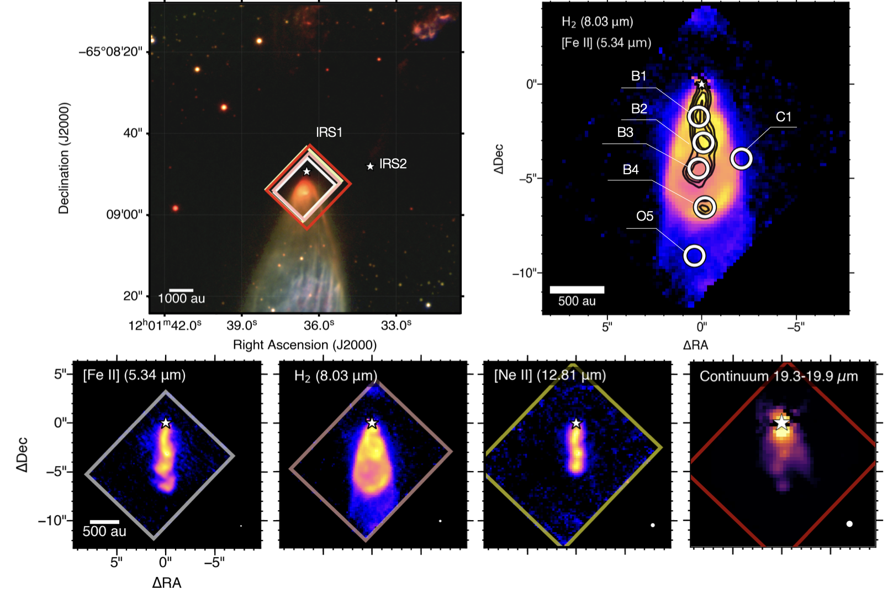
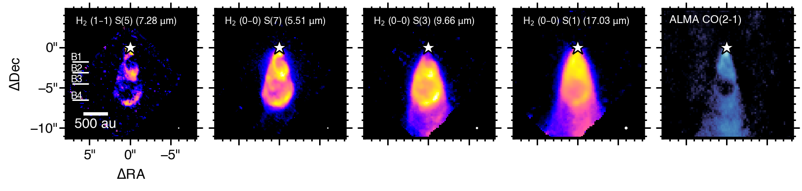
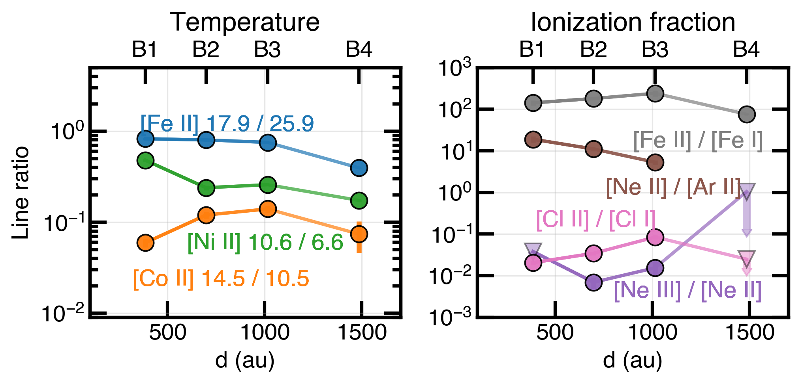

$\newcommand{\ensuremath}{}$
$\newcommand{\xspace}{}$
$\newcommand{\object}[1]{\texttt{#1}}$
$\newcommand{\farcs}{{.}''}$
$\newcommand{\farcm}{{.}'}$
$\newcommand{\arcsec}{''}$
$\newcommand{\arcmin}{'}$
$\newcommand{\ion}[2]{#1#2}$
$\newcommand{\textsc}[1]{\textrm{#1}}$
$\newcommand{\hl}[1]{\textrm{#1}}$
$\newcommand{\footnote}[1]{}$
$\newcommand{\lsun}{\mbox{L}_\odot}$
$\newcommand{\msun}{\mbox{M}_\odot}$
$\newcommand{\macc}{\dot{M}_{\rm acc}}$

# JOYS: Launching and destruction of dust in protostellar jets. \ The case of BHR71-IRS1 with JWST/MIRI

<mark>Appeared on: 2026-04-15</mark> -  _21 pages, 23 figures, accepted for publication in the Astronomy and Astrophysics_

Ł. Tychoniec, et al. -- incl., <mark>C. Gieser</mark>, <mark>H. Beuther</mark>

**Abstract:** Protostellar winds can theoretically lift solids from the planet-forming disks, but direct evidence for launched dust has been scarce so far. Numerous atomic lines that are unique to mid-infrared (IR) wavelengths reveal refractories eroded from dust grains and provide information on wind properties in the earliest stages of the star formation process. We aim to characterize the gas-phase composition, shock properties, and dust content of the jet from the Class 0 protostar BHR71-IRS1, one of the best cases of a resolved central jet inside a wide-angle wind. We present JWST/MIRI-MRS spectral imaging of the inner 2000 au of the BHR71-IRS1 blueshifted side of the outflow. Atomic line intensities are compared to shock models to constrain the physical conditions and elemental abundances of the outflowing gas. Dust continuum maps are constructed from PSF-subtracted cubes, and the dust spectral energy distribution is analyzed. The ionized central jet of BHR71-IRS1 is spatially resolved and imaged for the first time, revealing a unique inventory of refractory, volatile, and noble-gas fine-structure lines (Fe, Ni, Co, Cl, S, Ne, Ar). The emission is concentrated along four bright knots that wiggle along the jet axis. PSF-subtracted continuum maps reveal extended mid-IR continuum emission co-spatial with the jet bullets and within the $H_2$ -traced outflow cone. Spectral energy distributions along the jet are fit together with the extinction, revealing a warm (200-400 K) and a cold (70-90 K) dust component. Shock modeling constrained by the mid-IR lines indicates a decline in shock velocity from 70 to 35 km s $^{-1}$ and pre-shock density from $>$ 10 $^5$ to $ 4\times 10^4$ cm $^{-3}$ with distance from the protostar. Gas-phase Fe and Ni are measurably depleted relative to Solar abundances, consistent with a substantial fraction of refractories remaining locked in grains in spite of the shocks. These JWST observations provide direct evidence that dust is launched in a Class 0 jet and at least partly survives shock processing. The richness of refractory tracers in the BHR71-IRS1 jet provides a window into inner-disk composition at the onset of planet formation.

**Figure 15. -** _ Top left:_ Large-scale view of the BHR71 globule in $Ks$(red) and $H$(green) bands from the Persson’s Auxiliary Nasmyth Infrared Camera \citep[PANIC;][]{Martini.Persson.ea2004} taken on 2009 January 17 and 18 and $J$(blue) band from Infrared Side-Port Imager \citep[ISPI;][]{vanderBliek.Norman.ea2004} taken on 2009 June 11.    See also  (Tobin.Hartmann.ea2010, Tobin.Bourke.ea2019) . Stars mark positions of the protostars from ALMA high-resolution images  (Ohashi.Tobin.ea2023) .
   The colored rectangles highlight the field-of-view of the MIRI-MRS mosaics for Channel 1 (white), 2 (pink), 3 (yellow), and 4 (red). _ Top right:_ MIRI-MRS
        integrated Gaussian intensity map of $H_2$ S(4) (8.03 $\mu$m; colorscale) and [Fe ii] a$^6$D$_{9/2}$-a$^4$F$_{9/2}$(5.34 $\mu$m; black contours).
        Circles show and label the regions selected for spectral analysis. The coordinates are relative to the IR protostar source position, 12$^h$01$^m$36.454, $-65{^\circ}08$\arcmin$49$\farcs$267$(J2000), indicated with the white star.
        _ Bottom:_  Integrated Gaussian intensity maps of (from left to right:) [Fe ii] a$^6$D$_{9/2}$-a$^4$F$_{9/2}$(5.34 $\mu$m; Channel 1),
        $H_2$ S(4) (8.03 $\mu$m; Channel 2), and [Ne ii]$^{2}$P$_{3/2}$-$^2$P$_{1/2}$(12.81 $\mu$m; Channel 3). The final panel on the right shows the thermal dust continuum emission from 19.3 to 19.9 $\mu$m (Channel 4). Rectangles indicate the field-of-view of the MIRI-MRS mosaic, and colors correspond to those on the top-left plot. In the bottom-right corners, MIRI-MRS empirical FWHM of PSF  (Law.Morrison.ea2023)  is indicated as a white circle. (*fig:Figure1_overviewmaps*)

**Figure 17. -** MIRI-MRS integrated Gaussian intensity maps of representative $H_2$  emission lines of the BHR71-IRS1 outflow. From left to right lines of increasing $E_{\rm up}$: $H_2$$v=1$ -- $1$ S(5), 10340 K; $H_2$$v=0$ -- $0$ S(7), 7197 K;  $H_2$$v=0$ -- $0$ S(3), 2503 K; $H_2$$v=0$ -- $0$ S(1), 1015 K. In the bottom-right corners, MIRI-MRS empirical FWHM of PSF  (Law.Morrison.ea2023)  is shown as a white circle. On the rightmost image, ALMA CO (2-1) integrated emission over the entire blueshifted range (-85; 0 km s$^{-1}$) with respect to v$_{LSR}$ is shown in colorscale.  Data presented in Gavino.Joergensen.ea2024  taken in May 2021. (*fig:Figure3_h2maps*)

**Figure 1. -** Line ratios of selected species at B1-B4 positions plotted as a function of the deprojected distance from the source.
    _ Left:_ Ratios of the same species sensitive to gas temperature:
    [Co ii] 14.5 $\mu$m to [Co II] 10.5$\mu$m (orange);  [Fe ii] 17.9  $\mu$m  to [Fe ii] 25.9 $\mu$m (blue); [Ni ii] 10.6  $\mu$m  to [Ni ii] 6.6 $\mu$m (green); _ Right:_ Ratios sensitive to ionization fraction:
    [Fe ii] 25.9$\mu$m to [Fe i] 24.0 $\mu$m (grey); [Ne ii 12.8 $\mu$m to [Ar II]$\mu$m 6.9 $\mu$m (brown);
    [Cl ii] 11.3 $\mu$m to [Cl i] 14.4 $\mu$m. (pink); [Ne iii] 15.55 $\mu$m to [Ne ii] 12.8 $\mu$m (purple).
     (*fig:fig6_ratios*)

