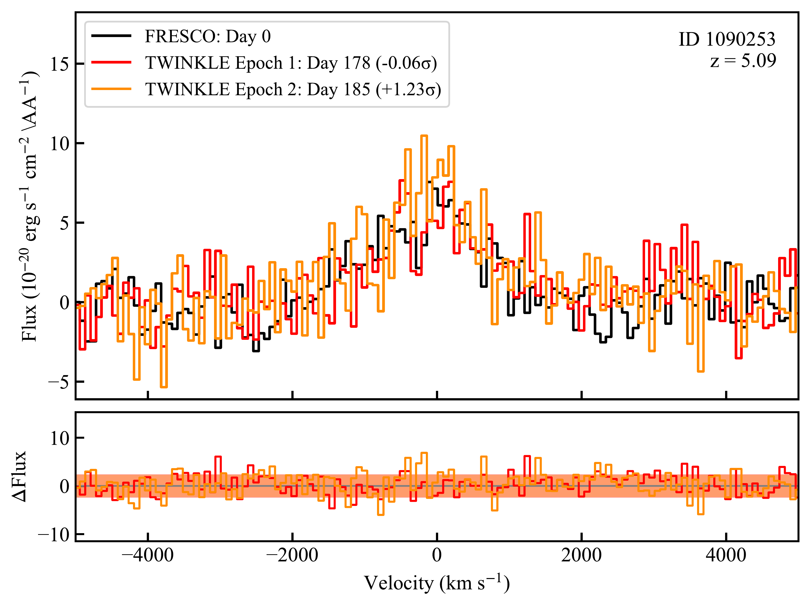
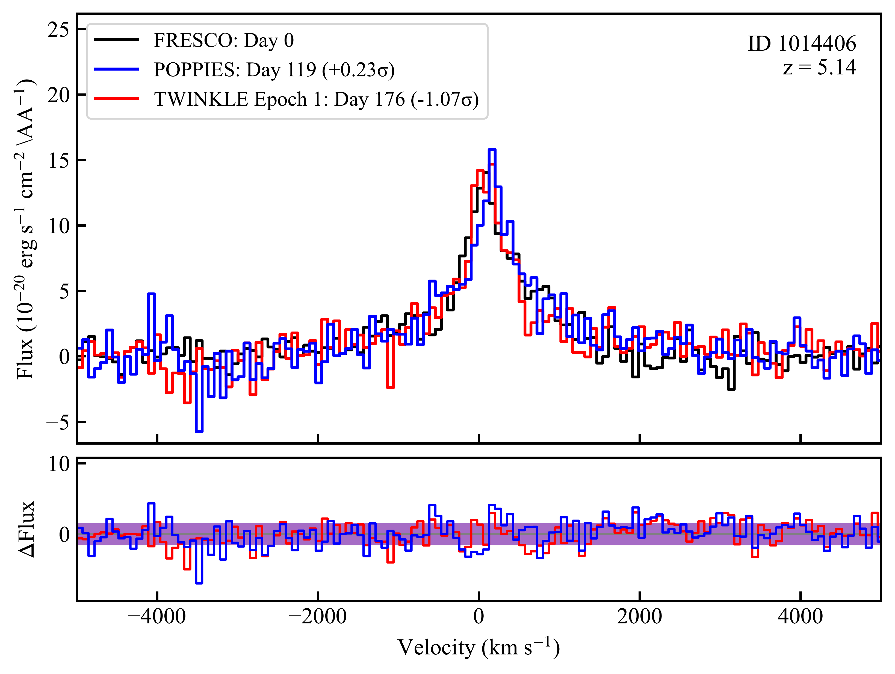
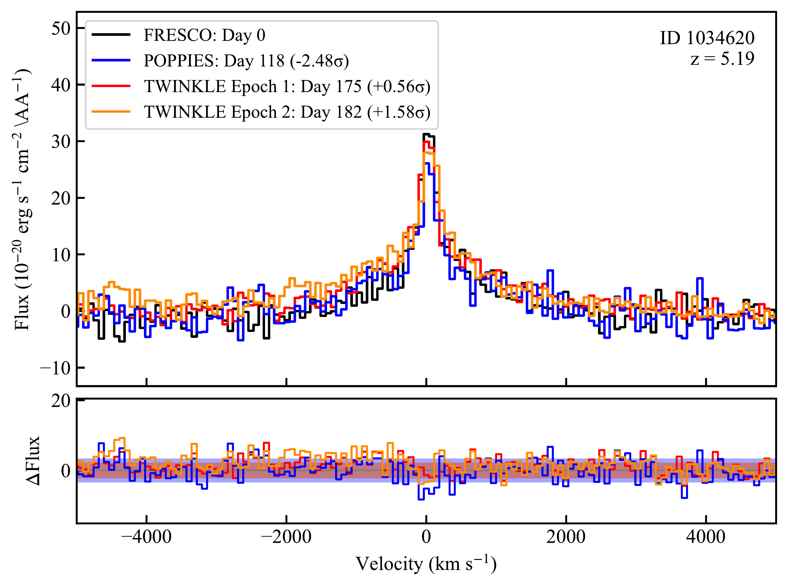
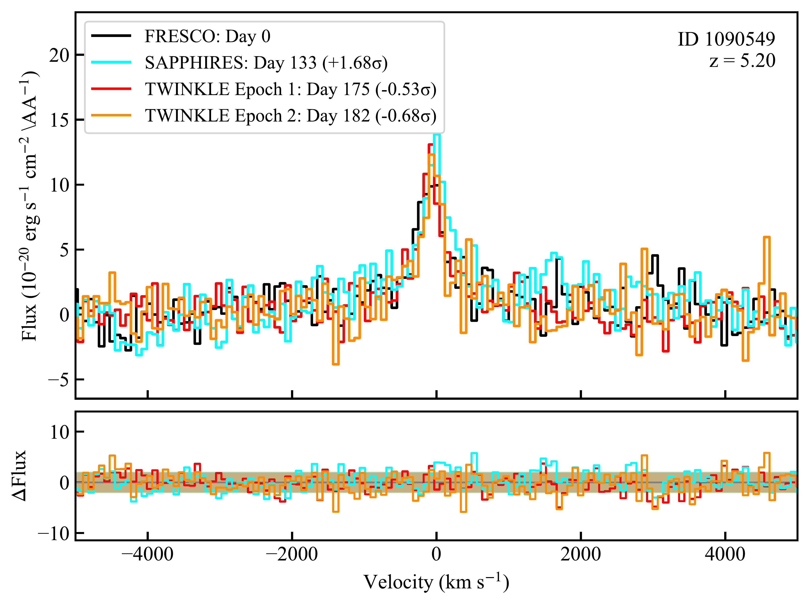
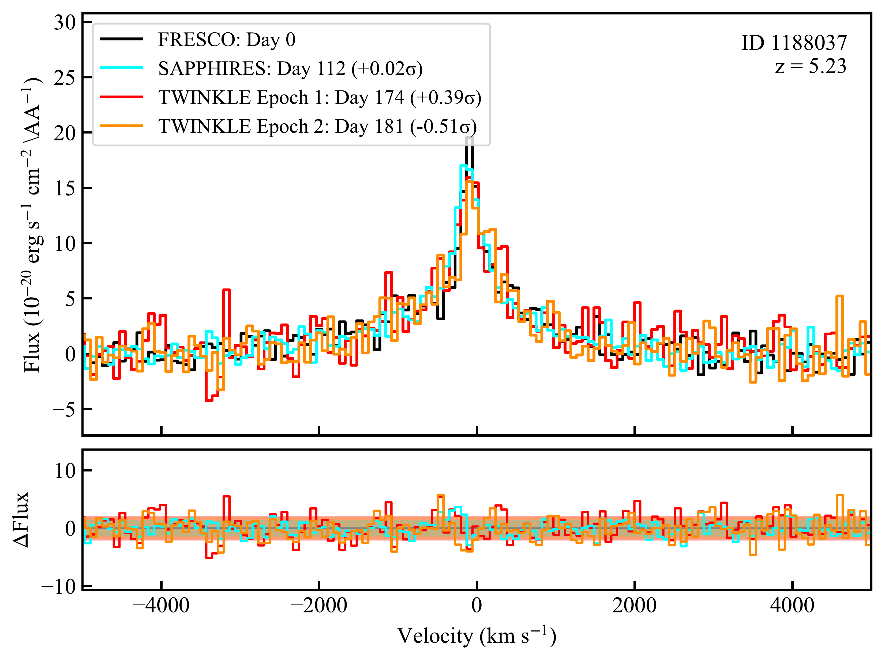
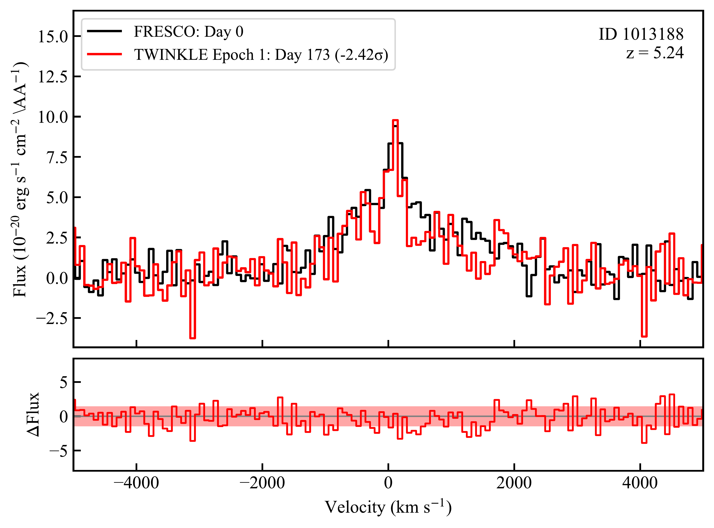
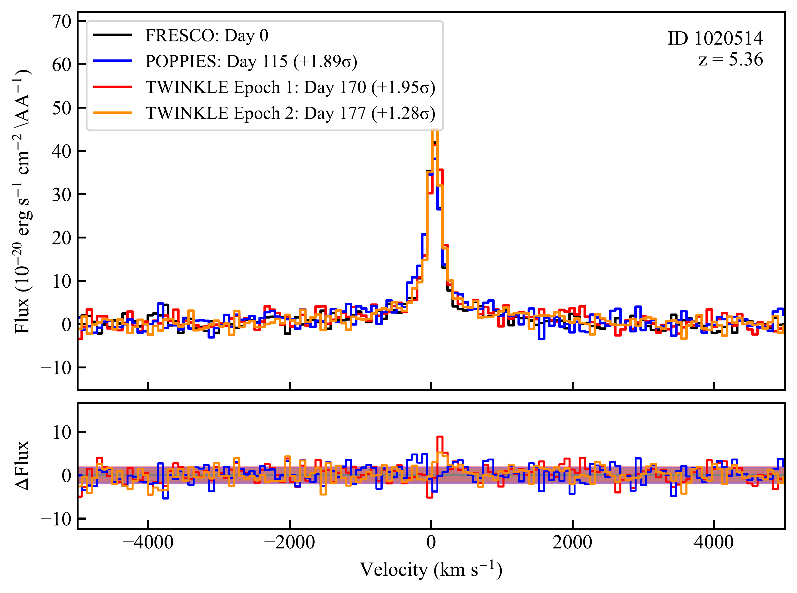
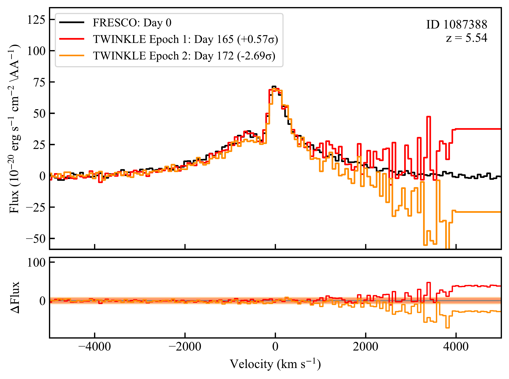
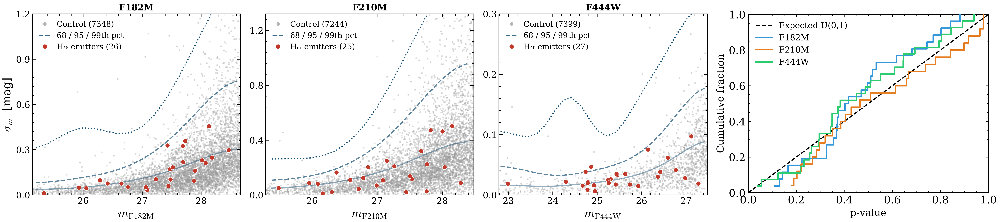

$\newcommand{\ensuremath}{}$
$\newcommand{\xspace}{}$
$\newcommand{\object}[1]{\texttt{#1}}$
$\newcommand{\farcs}{{.}''}$
$\newcommand{\farcm}{{.}'}$
$\newcommand{\arcsec}{''}$
$\newcommand{\arcmin}{'}$
$\newcommand{\ion}[2]{#1#2}$
$\newcommand{\textsc}[1]{\textrm{#1}}$
$\newcommand{\hl}[1]{\textrm{#1}}$
$\newcommand{\footnote}[1]{}$
$\newcommand{\vdag}{(v)^\dagger}$
$\newcommand\aastex{AAS\TeX}$
$\newcommand\latex{La\TeX}$
$\newcommand{\oiiir}{[\textrm{O}~\textsc{iii}] {5007}}$
$\newcommand{\oiiib}{[\textrm{O}~\textsc{iii}]_{\lambda4959}}$
$\newcommand{\civ}{[\textrm{C}~\textsc{iv}]}$
$\newcommand{\civf}{\textrm{C}~\textsc{iv}}$
$\newcommand{\sivf}{\textrm{Si}~\textsc{iv}}$
$\newcommand{\oif}{\textrm{O}~\textsc{i}}$
$\newcommand{\mgiif}{\textrm{Mg}~\textsc{ii}}$
$\newcommand{\ciiif}{\textrm{C}~\textsc{iii}}$
$\newcommand{\ciif}{\textrm{C}~\textsc{ii}}$
$\newcommand{\niiif}{\textrm{N}~\textsc{iii}}$
$\newcommand{\ly}{{\rm Ly\alpha}}$
$\newcommand{\ha}{{\rm H\alpha}}$
$\newcommand{\hb}{{\rm H\beta}}$
$\newcommand{\hg}{{\rm H\gamma}}$
$\newcommand{\hd}{{\rm H\delta}}$
$\newcommand{\pa}{{\rm Pa\alpha}}$
$\newcommand{\pb}{{\rm Pa\beta}}$
$\newcommand{\pg}{{\rm Pa\gamma}}$
$\newcommand{\pd}{{\rm Pa\delta}}$
$\newcommand{\mgii}{Mg \textsc{ii}}$
$\newcommand{\feiif}{\textrm{Fe}~\textsc{ii}}$
$\newcommand{\hst}{{HST}}$
$\newcommand{\jwst}{{JWST}}$
$\newcommand{\spit}{{Spitzer}}$
$\newcommand{\team}{{\tt PIECES}}$
$\newcommand{\area}{0.2~deg^2}$
$\newcommand{\areamin}{777~arcmin^2}$
$\newcommand{\texp}{300}$
$\newcommand{\nfld}{80}$
$\newcommand{\ngal}{4000}$
$\newcommand{\ngallowz}{5\times 10^4}$
$\newcommand{\id}{\textit{SHADE}}$
$\newcommand{\simgt}{ \rlap{\lower 3.5 pt \hbox{\mathchar \sim}} \raise1pt\hbox{{>}} }$
$\newcommand{\simlt}{ \rlap{\lower 3.5 pt \hbox{\mathchar \sim}} \raise1pt\hbox{<} }$
$\newcommand{\Msun}{M_{\odot}}$
$\newcommand{\Mstel}{M_{\ast}}$
$\newcommand{\Muvl}{M_{\textsc{uv}}}$
$\newcommand{\logm}{\log M_*/\Msun}$
$\newcommand{\logZ}{\log Z_*/Z_\odot}$
$\newcommand{\ci}{[\textrm{C}~\textsc{i}]}$
$\newcommand{\cii}{[\textrm{C}~\textsc{ii}]}$
$\newcommand{\ciii}{\textrm{C}~\textsc{iii}]}$
$\newcommand{\oii}{[\textrm{O}~\textsc{ii}]}$
$\newcommand{\oiii}{[\textrm{O}~\textsc{iii}]}$
$\newcommand{\nii}{[\textrm{N}~\textsc{ii}]}$
$\newcommand{\neiii}{[\textrm{Ne}~\textsc{iii}]}$
$\newcommand{\NB}[1]{\textbf{\color{red} #1}}$
$\newcommand{\bcheck}{\textbf{\color{blue} \checkmark}}$
$\newcommand{\gtriangle}{\textcolor{OliveGreen}{\triangle}}$
$\newcommand{\bfb}{\color{blue}}$
$\newcommand{\bfr}{\bf \color{red}}$
$\newcommand{\bfm}{\color{magenta}}$
$\newcommand{\bfg}{\color{green}}$

# How I Wonder What You Are — JWST’s Little Red Dots do not TWINKLE

<mark>Appeared on: 2026-04-15</mark> -  _Submitted to the Astrophysical Journal, comments warmly welcomed!_

Z. Liu, et al. -- incl., <mark>A. d. Graaff</mark>

**Abstract:** Little Red Dots (LRDs) are a population of compact, red sources that have emerged as one of the most puzzling findings of JWST. Variability provides a direct probe of their central engines. Here we present the first joint spectroscopic and photometric time-domain study of LRDs undertaken with the JWST TWINKLE slitless spectroscopy program. Surveying the FRESCO GOODS-North legacy field, TWINKLE monitors a complete, $\ha$ -flux-limited sample of 18 LRDs at $z=3.9 - 6.8$ , achieving a rest-frame baseline of $\sim 140 - 220$ days. We detect no variability in photometry, $\ha$ line flux, or line shape across the sample. If LRDs resembled AGN in reverberation mapping samples --- the foundation for black hole mass calibrations and luminosity scaling relations --- we would expect $>10$ sources to show measurable fluctuations. Observing none implies a $5.9\sigma$ deficit. The non-detections hold across all broad $\ha$ emitters within TWINKLE's field of view -- the 18 V-shaped LRDs as well as 9 non-LRDs. Comparison with simulated light curves disfavors sub-Eddington accretion and is instead consistent with super-Eddington accretion, other mechanisms that suppress variability, or perhaps no AGN whatsoever. If LRDs do harbor black holes, calibrations derived from sub-Eddington systems may not apply, thereby explaining JWST's apparently "overmassive” black holes. These observations provide unique constraints on the physics of one of the most enigmatic populations discovered by JWST.

**Figure 5. -** Multi-epoch H$\alpha$ line profiles of eight grism-selected sources. For each object, the top panel shows the optimally extracted 1D $\ha$ spectrum observed by FRESCO (black) and TWINKLE (red for Epoch 1, orange for Epoch 2), with additional epochs from SAPPHIRES (cyan) and POPPIES (blue) where available. Rest-frame time is measured
relative to the FRESCO observations (February 2023). The bottom panel shows the flux difference spectra
($\Delta F = F_{\rm epoch} - F_{\rm FRESCO}$).
Shaded regions indicate the 1$\sigma$ empirical noise level estimated from line-free spectral sidebands. The integrated variability significance $S$ is labeled for each source as defined in Section \ref{sec:wfss}. (*fig:line_profile*)

**Figure 8. -** F444W light curves of all 27 targets across multiple epochs, with fluxes normalised to the first epoch. For ID 1053757 and ID 1077652, which lack FRESCO coverage, we use the $r = 0.\!"15$ aperture photometry from the JADES catalog $\ci$tep{Robertson26} and divide out the JADES aperture correction to recover the raw aperture flux, ensuring consistency with the direct aperture photometry measured for the remaining sources. The gray shaded region indicates $|\Delta F/F| = 10\%$. All sources are consistent with variability below this level within their measurement uncertainties, however, for the faintest sources the per-source $3\sigma$ imaging sensitivity exceeds $10\%$(Table \ref{tab:sources}), meaning that variability at the $10\%$ level cannot be ruled out for those objects. (*fig:lc*)

**Figure 9. -** _Left three panels:_ RMS magnitude scatter ($\sigma_{\rm m}$) versue JADES aperture ($r = 0.\!"15$) magnitude across three epochs (FRESCO + two TWINKLE visits) for our 27 broad $\ha$ emitters (red point) and ${\sim}7{,}400$ compact control sources ($F(0.\!"2)/F(0.\!"1) < 2.0$) per band (grey). $\sigma_{\rm m}$ represents the sample standard deviation of their magnitude. Dashed curves mark the 68th, 95th, and 99th percentile envelope of the control distribution in a sliding 1-magnitude window. All $\ha$ emitters lie within the 95th percentile envelope, consistent with no detected variability. _Right panel:_ Empirical cumulative distribution of per-source p-values defined as the fraction of magnitude-matched controls with $\sigma_m \geq \sigma_m^{\rm LRD}$. The dashed line shows the expected uniform distribution assuming $\ha$ are drawn from the same population as controls. All three bands are consistent with the null hypothesis, showing no evidence that $\ha$ emitters are more variable than field control sample. (*fig:photometry_rms*)

