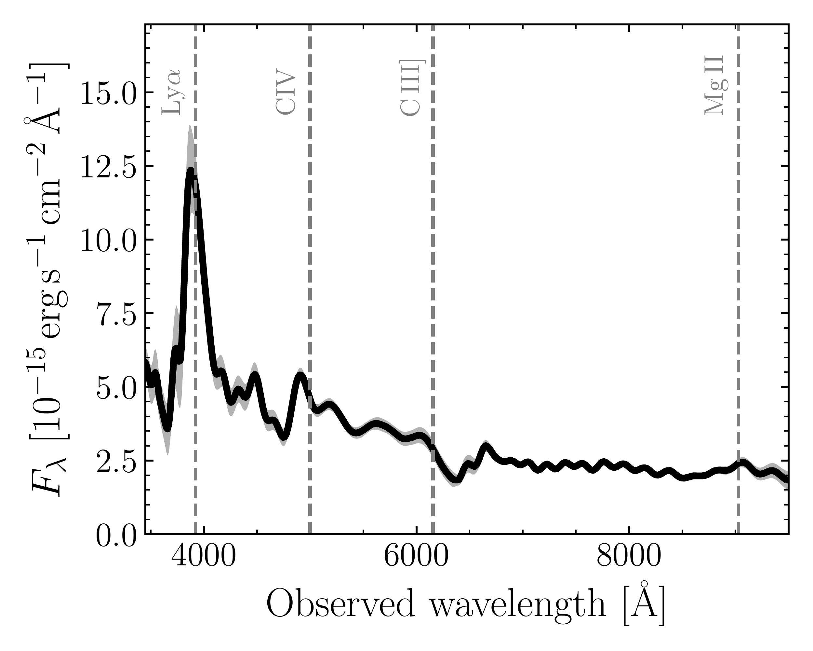
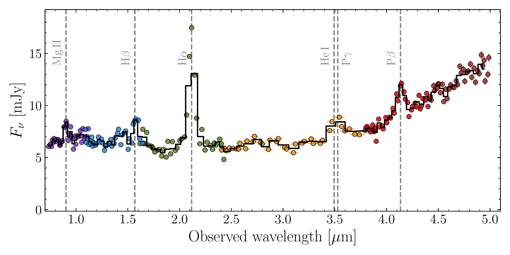
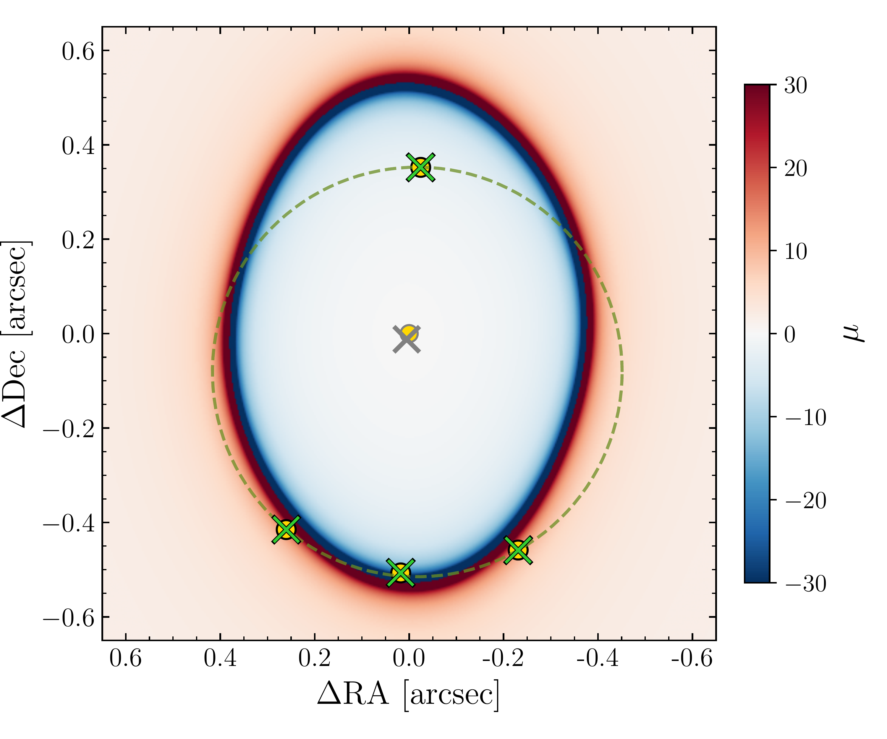
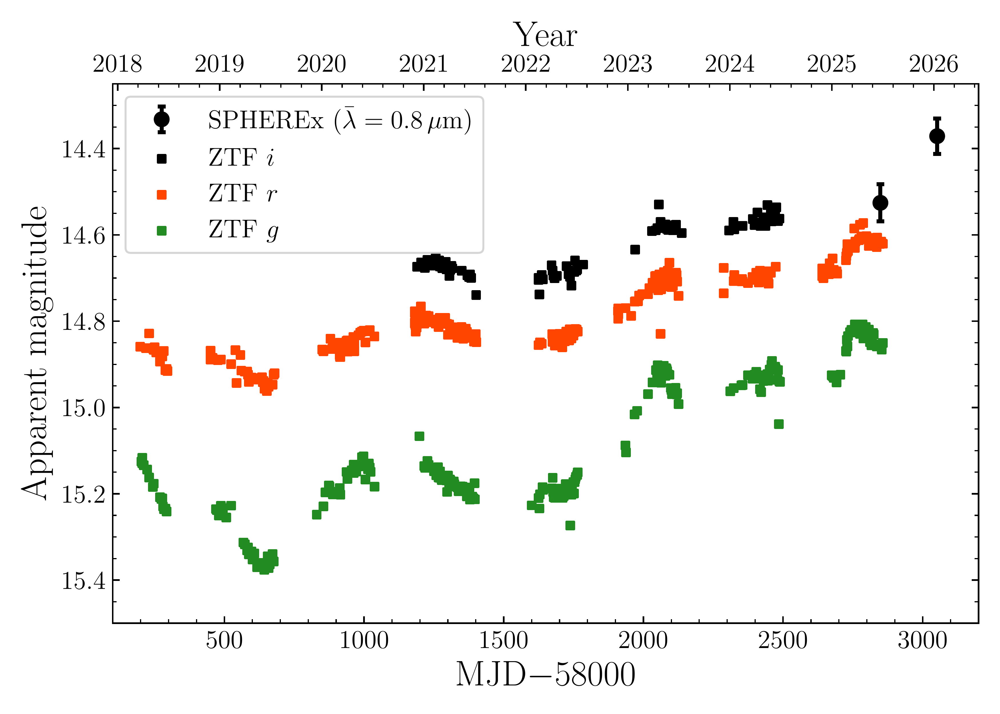

$\newcommand{\ensuremath}{}$
$\newcommand{\xspace}{}$
$\newcommand{\object}[1]{\texttt{#1}}$
$\newcommand{\farcs}{{.}''}$
$\newcommand{\farcm}{{.}'}$
$\newcommand{\arcsec}{''}$
$\newcommand{\arcmin}{'}$
$\newcommand{\ion}[2]{#1#2}$
$\newcommand{\textsc}[1]{\textrm{#1}}$
$\newcommand{\hl}[1]{\textrm{#1}}$
$\newcommand{\footnote}[1]{}$
$\newcommand{\url}[1]{\href{#1}{#1}}$
$\newcommand{\dodoi}[1]{doi:~\href{http://doi.org/#1}{\nolinkurl{#1}}}$
$\newcommand{\doeprint}[1]{\href{http://ascl.net/#1}{\nolinkurl{http://ascl.net/#1}}}$
$\newcommand{\doarXiv}[1]{\href{https://arxiv.org/abs/#1}{\nolinkurl{https://arxiv.org/abs/#1}}}$
$\newcommand{\vdag}{(v)^\dagger}$
$\newcommand\aastex{AAS\TeX}$
$\newcommand\latex{La\TeX}$
$\newcommand{\noop}[1]\begin$
$\newcommand\natexlab{#1}$

# Persephone's Torch: A 15th Magnitude Quadruply-Lensed Quasar From the Couch Discovered with SPHEREx and the LBT$\vspace{-1.7cm}$

<mark>Appeared on: 2026-04-16</mark> -  _6 pages, 4 figures_

F. B. Davies, et al. -- incl., <mark>E. Bañados</mark>, <mark>S. Belladitta</mark>

**Abstract:** $\noindent$ Here we report the spectroscopic and geometric confirmation of an extremely bright ( $i=14.77$ ) and compact (Einstein radius of $\sim0.45"$ ) quadruply-lensed quasar at $z=2.22$ ,J1330 $-$ 0905, which we dub Persephone's Torch. The system had been previously selected as a candidate lensed quasar based on large-area survey data; here we confirm its quasar nature and redshift using public spectrophotometry from the SPHEREx mission, a.k.a. "from the couch". Adaptive optics imaging with LBT/LUCI resolves four images in a "circular kite" configuration. The system is the brightest gravitationally-lensed quasar system ever found. While an elliptical power-law mass distribution plus external shear accurately reproduces the locations of the images and lensing galaxy, and predicts a total magnification of $\sim56$ , the brightnesses of the lensed images present highly anomalous flux ratios. Together with short time delays between images ( $\leq 2$ days), this makes Persephone's Torch a promising candidate for future microlensing studies. Our discovery highlights the potential of SPHEREx full-sky infrared spectrophotometry to uncover extraordinarily bright objects that have otherwise been overlooked.

**Figure 3. -** _Gaia_ XP spectrum (left) and SPHEREx spectrophotometry (right) of J1330$-$0905. Common broad emission line features redshifted to $z=2.22$ are labeled with vertical dashed lines.  (*fig:spec*)

**Figure 1. -** Optimal lens model for the system. The circles display the measured centroids of the four quasar images while green crosses show their corresponding predicted locations; the grey cross shows the position of the lensing galaxy. The color bar indicates the magnification $\mu$. The dashed green circle demonstrates that all four images lie almost exactly on a common circle. (*fig:lens*)

**Figure 2. -** Light curve of J1330$-$0905 from ZTF in $i$-band (black), $r$-band (red), and $g$-band (green). More recent photometry from SPHEREx is binned to match the $i$-band (points with uncertainties). The measurements include all four lensed images. (*fig:ztf*)

