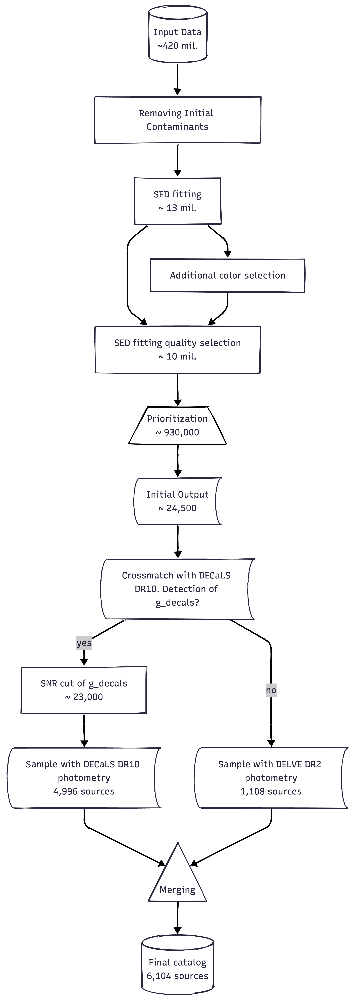
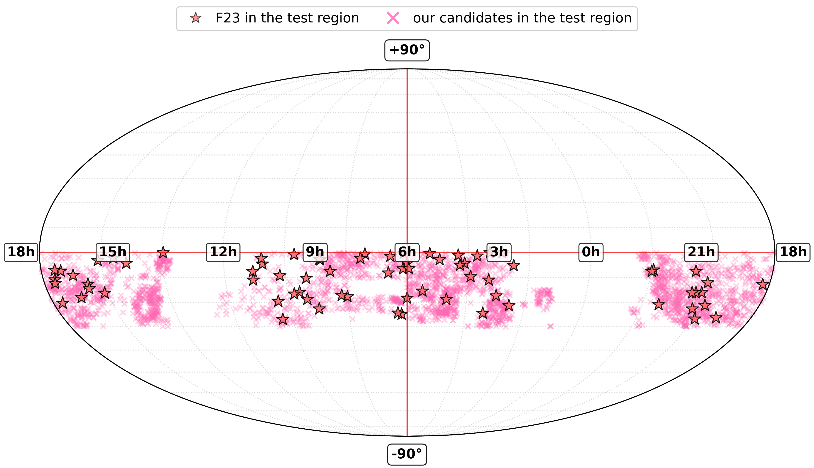
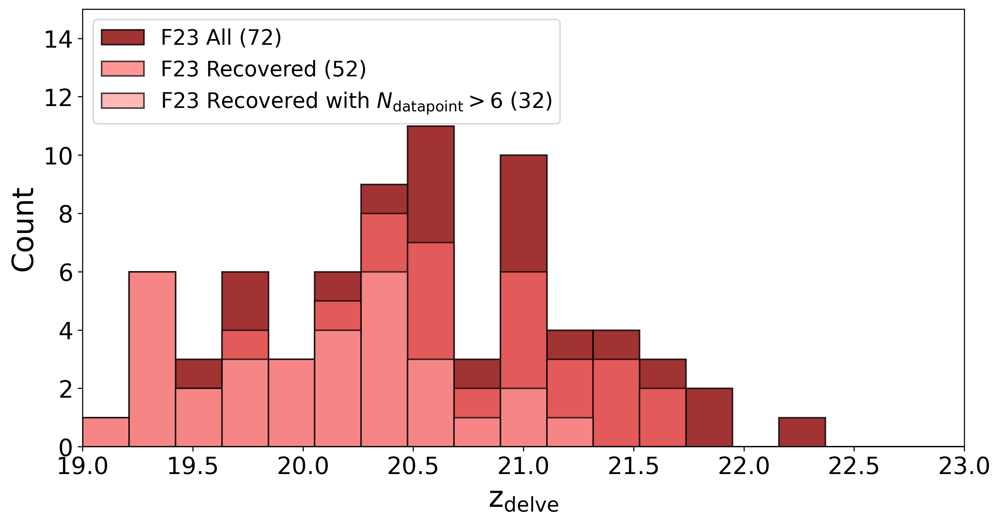
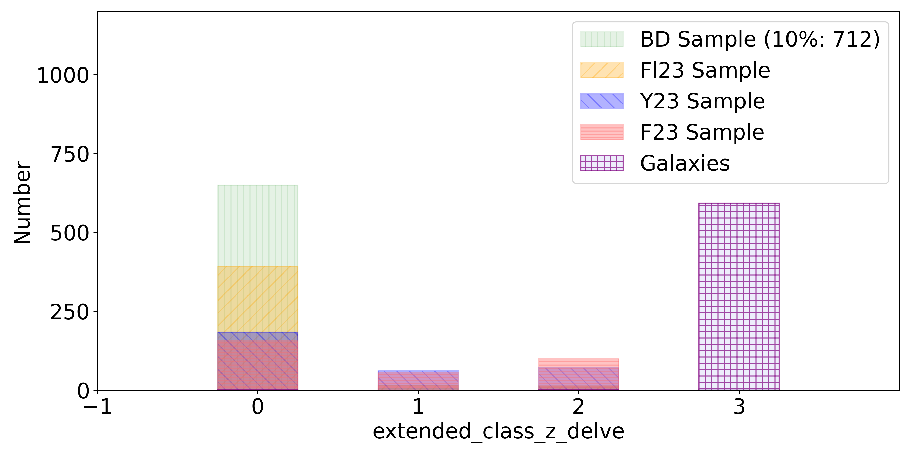

$\newcommand{\ensuremath}{}$
$\newcommand{\xspace}{}$
$\newcommand{\object}[1]{\texttt{#1}}$
$\newcommand{\farcs}{{.}''}$
$\newcommand{\farcm}{{.}'}$
$\newcommand{\arcsec}{''}$
$\newcommand{\arcmin}{'}$
$\newcommand{\ion}[2]{#1#2}$
$\newcommand{\textsc}[1]{\textrm{#1}}$
$\newcommand{\hl}[1]{\textrm{#1}}$
$\newcommand{\footnote}[1]{}$
$\newcommand{\arraystretch}{1.5}$
$\newcommand{\arraystretch}{1.3}$
$\newcommand{\arraystretch}{1.2}$
$\newcommand{\arraystretch}{1.3}$

# 4MOST ChANGES:  Catalog of high-redshift quasar candidates (4.5 < $z$ < 7) selected with SED fitting

<mark>Appeared on: 2026-04-16</mark> -  _12 pages, 11 figures, 4 tables, accepted for publication in Astronomy & Astrophysics (A&A)_

T. Mkrtchyan, et al. -- incl., <mark>S. Belladitta</mark>

**Abstract:** The identification of high-redshift quasars ( $z > 4.5$ ) is critical for studying the early Universe, supermassive black hole growth, and cosmic reionization. Most known high-redshift quasars are located in the northern hemisphere, leaving the southern sky largely unexplored. As part of the 4-meter Multi-Object Spectroscopic Telescope (4MOST) and Chilean AGN/Galaxy Extragalactic Survey (ChANGES) S1604 survey, we aim to create a large catalog of high-redshift quasar candidates in the southern hemisphere using multiwavelength photometry and Spectral Energy Distribution (SED) fitting, with the goal of spectroscopic follow-up with 4MOST. We construct a multi-band photometric catalog by combining optical data from the Dark Energy Camera Local Volume Exploration Survey (DELVE DR2) and Dark Energy Camera Legacy Survey (DECaLS DR10), near-infrared data from the VISTA Hemisphere Survey (VHS DR5) with an additional field of the VISTA Kilo-degree Infrared Galaxy Public Survey (VIKING), mid-infrared data from the Wide-field Infrared Survey Explorer (AllWISE) and optical astrometry from Gaia DR3. After applying morphological and color-based cuts to remove contaminants such as brown dwarfs and red galaxies, we perform a custom-made SED fitting using quasar and brown dwarf templates. Statistical outputs including $\chi^2$ , Bayesian Information Criterion $(BIC)$ , and $F_{\text{test}}$ are used to rank and select candidates. Our final catalog contains 6104 high-redshift quasar candidates within the redshift range of $4.5 < z < 7$ . These sources have detections in 7 or more photometric bands and satisfy our SED-based statistical selection criteria (e.g. $BIC > 0$ and $F_{\text{test}} > 10$ ). Initial spectroscopic validation using the New Technology Telescope (NTT) with the ESO Faint Object Spectrograph and Camera v.2 (EFOSC2) and the Palomar Observatory Hale Telescope with the Next Generation Palomar Spectrograph (NGPS) confirmed 3 high-redshift quasars at $z > 5$ out of 6 observed candidates.

**Figure 1. -** Flowchart of the selection procedure (*lab:flowchart*)

**Figure 9. -** Distribution of sources from the F23 sample and our final catalog within the declination range $-30^{\circ} < \text{Dec} < 0^{\circ}$.
Top panel: Sky distribution of the selected region for our candidates of high-redshift quasars with high-redshift quasars from the F23 sample. Bottom panel: The histogram of $z_{\text{delve}}$ for the F23 sample in the selected region and with respect to the ones recovered after the selection procedures with and without limiting the $N_{\text{datapoint}}$. (*fig:completeness*)

**Figure 2. -** DELVE $extended\_class\_z\_delve$ flag for samples of known high-redshift quasars, randomly selected brown dwarfs from the BD Sample, and galaxies from the literature. The definition and usage of this flag are described in Section \ref{sec:removing_contaminants}. (*fig:data_extz*)

