

$\newcommand{\ensuremath}{}$
$\newcommand{\xspace}{}$
$\newcommand{\object}[1]{\texttt{#1}}$
$\newcommand{\farcs}{{.}''}$
$\newcommand{\farcm}{{.}'}$
$\newcommand{\arcsec}{''}$
$\newcommand{\arcmin}{'}$
$\newcommand{\ion}[2]{#1#2}$
$\newcommand{\textsc}[1]{\textrm{#1}}$
$\newcommand{\hl}[1]{\textrm{#1}}$
$\newcommand{\footnote}[1]{}$
$\newcommand{\detailtexcount}[1]{$
$  \immediate\write18{texcount -merge -sum -q #1.tex output.bbl > #1.wcdetail }$
$  \verbatiminput{#1.wcdetail}$
$}$
$\newcommand{\quickwordcount}[1]{$
$  \immediate\write18{texcount -1 -sum -merge -q #1.tex output.bbl > #1-words.sum }$
$  \input{#1-words.sum} words$
$}$
$\newcommand{\quickcharcount}[1]{$
$  \immediate\write18{texcount -1 -sum -merge -char -q #1.tex output.bbl > #1-chars.sum }$
$  \input{#1-chars.sum} characters (not including spaces)$
$}$
$\newcommand{\vdag}{(v)^\dagger}$
$\newcommand\aastex{AAS\TeX}$
$\newcommand\latex{La\TeX}$
$\newcommand{\magphys}{\hbox{\sc magphys}}$
$\newcommand{\av}{\hbox{A_\mathrm{V}}}$
$\newcommand{\um}{\hbox{\mum}}$
$\newcommand{\fobs}{\hbox{f_{obs}}}$
$\newcommand{\sigmstar}{\hbox{\Sigma_{M_\ast}}}$
$\newcommand{\sigmdust}{\hbox{\Sigma_{M_{d}}}}$
$\newcommand{\sigsfr}{\hbox{\Sigma_\mathrm{SFR}}}$
$\newcommand{\sigcii}{\hbox{\Sigma_{L_\mathrm{[CII]}}}}$
$\newcommand{\ldust}{\hbox{L_\mathrm{dust}}}$
$\newcommand{\tdust}{\hbox{T_\mathrm{dust}}}$
$\newcommand{\mtw}{\hbox{M_{20}}}$
$\newcommand{\Msun}{\mathrm{M}_{\odot}}$

# ALESS--JWST: Dust-driven Morphologies and Hidden Stellar Mass in $z\sim3$ Sub-millimeter Galaxies

<mark>Appeared on: 2026-04-16</mark> -  _Submitted to Astrophysical Journal_

<mark>J. Li</mark>, et al. -- incl., <mark>F. Walter</mark>

**Abstract:** We present JWST/NIRCam and MIRI observations of twelve $z\sim3$ sub-millimeter galaxies (SMGs) from the ALESS survey, combined with high-resolution ( $0.08"-0.16"$ ) ALMA 870 $\um$ imaging, enabling spatially resolved spectral energy distribution fitting (SED) on $\sim$ kiloparsec scales.We find a resolved star-forming main sequence linking the surface densities of star formation rate and stellar mass, suggesting that star formation remains tightly coupled to the local mass distribution even in heavily obscured systems.Our resolved SED analysis reveals a systematic stellar mass bias in integrated fits (median $\sim0.2$ dex offset), even when including rest-frame $\sim2$ $\um$ MIRI imaging. Rather than classical `outshining', this effect is primarily driven by spatially varying dust attenuation, indicating a `dust-obscuration bias' that causes highly obscured stellar mass to be missed.We show that SMG morphologies are strongly wavelength-dependent. At rest-frame optical wavelengths, strong central obscuration produces large stellar-dust spatial offsets and inflated sizes, while at longer wavelengths these effects diminish. The rest-frame $\sim1.5-3 \um$ MIRI imaging is far less affected by dust than NIRCam and reveals compact stellar structures that closely match the 870 $\um$ dust continuum.We find that centrally concentrated dust attenuation drives both the apparent spatial offsets and size variations, demonstrating that dust geometry is the primary driver of the observed structural diversity. Consequently, morphologies inferred from rest-frame wavelengths $\lesssim1.6 \um$ can be significantly biased without longer-wavelength constraints.The intrinsic stellar mass and dust continuum sizes are consistent ( $R_\mathrm{e,870\mu m}/R_\mathrm{e,\ast}=1.0\pm0.4$ ), supporting a picture in which SMGs host compact, heavily obscured star formation that builds dense stellar cores, consistent with their evolution into massive quiescent galaxies.We suggest that such obscured structures and associated biases may also be common among massive star-forming galaxies at $z\gtrsim1$ , implying that these effects are likely to be of broad relevance.

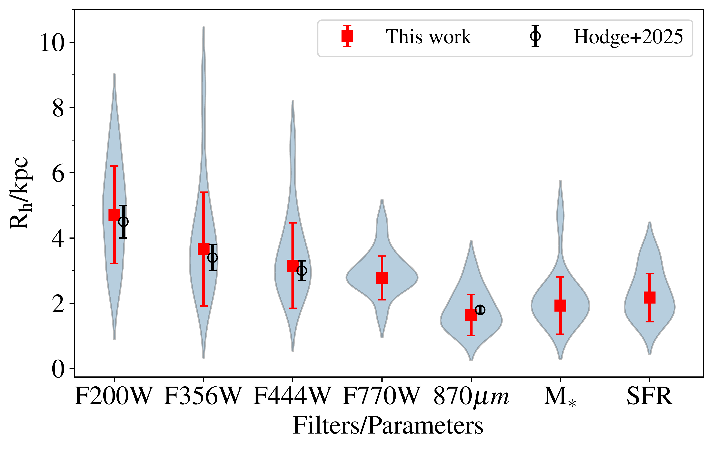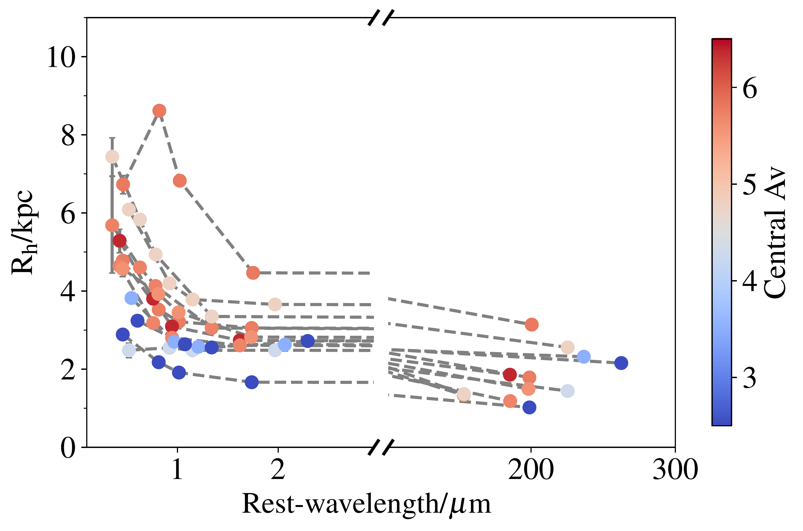

**Figure 9. -** Half-light radii as a function of wavelength. * Left:* distributions of the half-light radii for all ALESS SMGs measured in each JWST band, the ALMA 870$\um$ map, and the stellar mass and SFR maps. Black points show independent measurements from  [Hodge, et. al (2025)](https://ui.adsabs.harvard.edu/abs/2025ApJ...978..165H). * Right:* half-light radius versus rest-frame wavelength for the same galaxies. Points connected by dashed lines correspond to individual galaxies and are colored by central $\av$.
     (*fig:cog*)

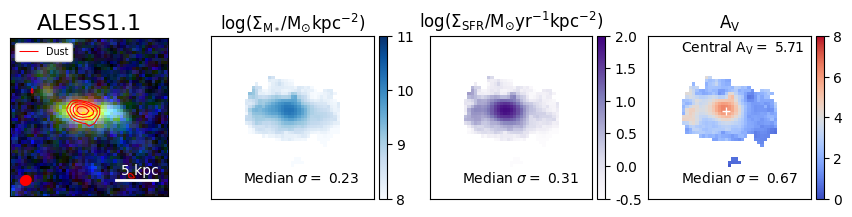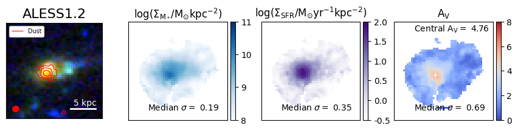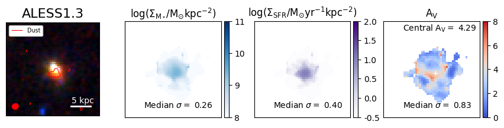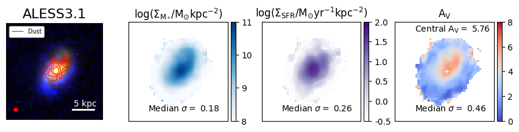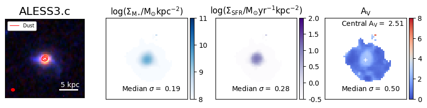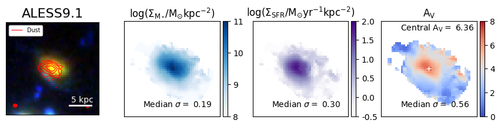

**Figure 4. -** For each source, the left-hand panel shows an RGB composite using JWST F770W, F444W, and F200W, respectively, with superimposed ALMA 870$\um$ contours ($2-24\sigma$). The middle and right-hand panels show maps of stellar mass, SFR, and dust attenuation ($\av$) from our spatially-resolved SED fitting. The 850$\um$ flux peak location is marked with white cross in the right panels, where the median $\av$ within one MIRI PSF-sized aperture is measured (i.e. the `central $\av$'). Median parameter uncertainties are indicated in each panel. (*fig:maps_all*)

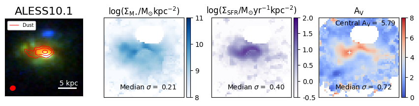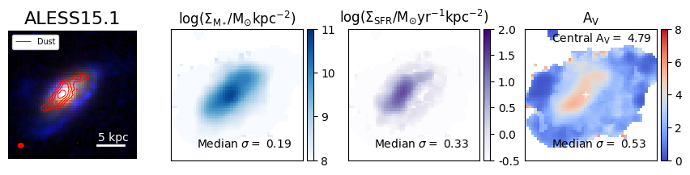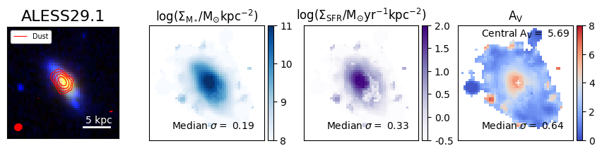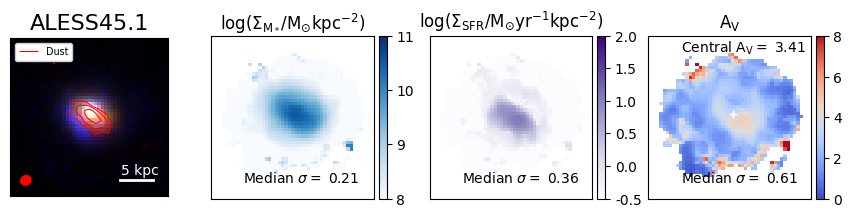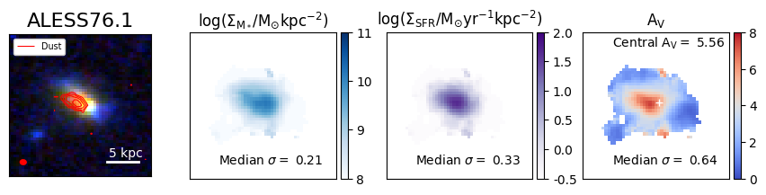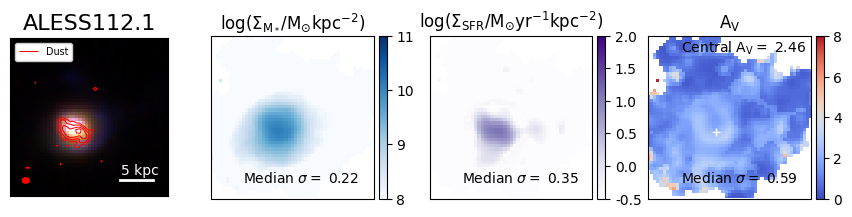

**Figure 5. -** Continued. (*fig:maps_all*)

