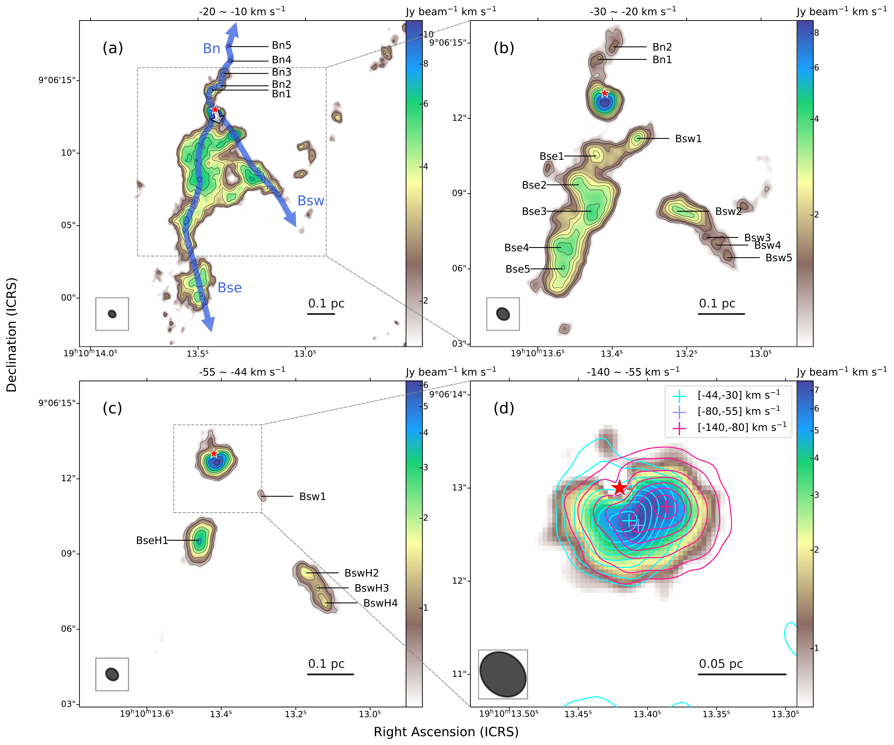
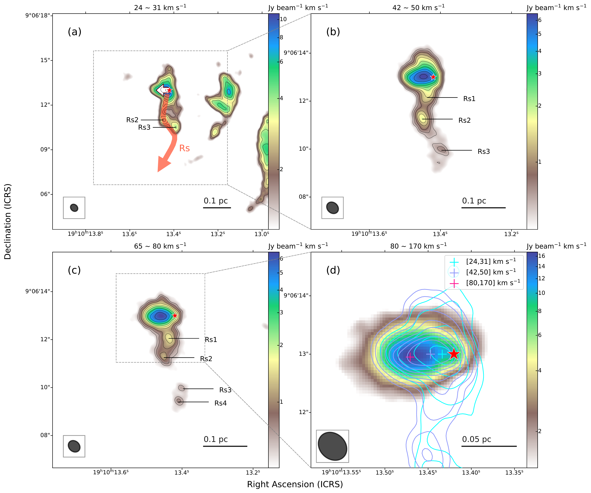
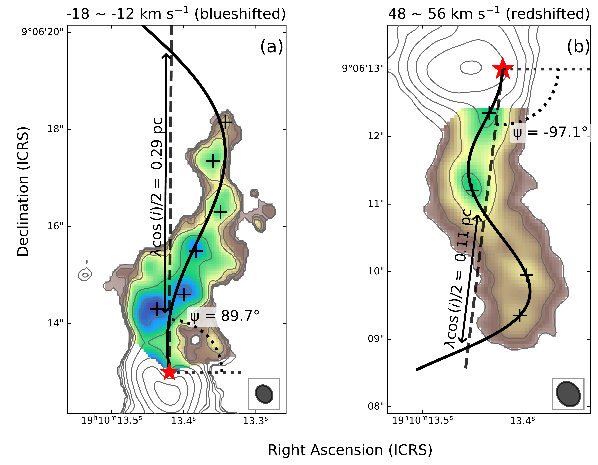

$\newcommand{\ensuremath}{}$
$\newcommand{\xspace}{}$
$\newcommand{\object}[1]{\texttt{#1}}$
$\newcommand{\farcs}{{.}''}$
$\newcommand{\farcm}{{.}'}$
$\newcommand{\arcsec}{''}$
$\newcommand{\arcmin}{'}$
$\newcommand{\ion}[2]{#1#2}$
$\newcommand{\textsc}[1]{\textrm{#1}}$
$\newcommand{\hl}[1]{\textrm{#1}}$
$\newcommand{\footnote}[1]{}$
$\newcommand{\vdag}{(v)^\dagger}$
$\newcommand\aastex{AAS\TeX}$
$\newcommand\latex{La\TeX}$

# The ALMA-QUARKS survey: Multipolar episodic molecular outflow associated with W49N, the most energetic water maser source in the Milky Way

<mark>Appeared on: 2026-04-16</mark> -  _13 pages, 5 figures, resubmitted to AJ after revision per reviewer comments_

Y. Jiao, et al. -- incl., <mark>F. Xu</mark>, <mark>P. Garcia</mark>

**Abstract:** We present a detailed investigation of a multipolar episodic molecular outflow in the mini-starburst region W49N, which hosts the most luminous water maser in the Galaxy. Using high-resolution ( $\sim0\farcs3$ ) Atacama Large Millimeter/submillimeter Array (ALMA) observations of the $\mathrm{^{12}CO}$ emission as part of the ALMA-QUARKS survey, we analyze the morphology and kinematics of the outflow. Our observations reveal four newly identified outflow lobes in addition to the previously known central bipolar jet. These lobes appear more jet-like rather than exhibiting wide opening angles. Based on the $\mathrm{^{12}CO}$ (2--1) and $\mathrm{^{13}CO}$ (2--1) emission, we provide a more reliable estimate of the outflow's physical parameters, confirming it as one of the most energetic outflows in the Galaxy. Notably, these newly discovered lobes exhibit chains of knots, a characteristic signature of episodic ejection. Furthermore, two of the lobes display prominent S-shaped wiggles, suggestive of a precessing jet. The discovery of these features---commonly observed in outflows from low-mass protostars---in such an extreme massive star-forming environment provides compelling evidence that some underlying physical mechanisms for launching outflows are conserved across a wide range of stellar masses.

**Figure 1. -** \em{Moment 0 maps of blueshifted $^{12}CO$ emission in four velocity channels, shown in both color scales and superimposed contours. Panel **(a), (b), (c)** and **(d)** correspond to low-, medium-, high- and extremely high-velocity channels. The levels of black contours are [7, 9, 11, 14, 17, 20, 24, 30, 42, 55] times the rms noise for panel **(a)** and **(b)**, and [7, 10, 15.5, 24, 32, 45, 60, 75] for panel **(c)**, where the rms in each panel is estimated from background regions in the corresponding channel. Beams and the scale bars are shown in the bottom left and right corners, respectively. In panel **(a), (b)** and **(c)**, distinct knots are labeled following "B" for blueshifted + direction + "H" for high-velocity in panel **(c)** + number in order of distance from the central source for a given direction. The red star marks the location of the central protostar, determined from the peak of the continuum emission. Four outflow lobes are illustrated by four blue arrows in panel **(a)**. The short white arrow with a dark blue edge represents the previously studied outflow lobe nearly along the line of sight \citep{2015LiuTie}. Panel **(d)** shows contours and emission peaks (plus signs) of the inner region from diverse channels. The extremely high-velocity component is divided into [-80, -56] and [-140, -80] $\mathrm{km s^{-1}}$ to show the velocity-dependent spatial distribution. Note that the emission peak tends to move outward as velocity increases.
} (*fig:channel_b*)

**Figure 2. -** \em{
Similar to \autoref{fig:channel_b}, here "R" denotes redshifted part.
} (*fig:channel_r*)

**Figure 4. -** \em{Panel **(a):** Wiggle fitting of outflow lobe "Bn". The color scale shows the integrated intensity within the region selected for fitting, overlaid on the full moment 0 contours. The region near the source was removed to avoid contamination from the compact outflow lobe with high inclination angle. The red star represents source G2a, consistent with that in \autoref{fig:channel_b}. The black solid line shows the outflow trajectory, and the dashed line represents the precession axis. The position angle of axis and projected half precession length scale are marked in the figure. Panel **(b):** Wiggle fitting of lobe "Rs".} (*fig:wiggle*)

