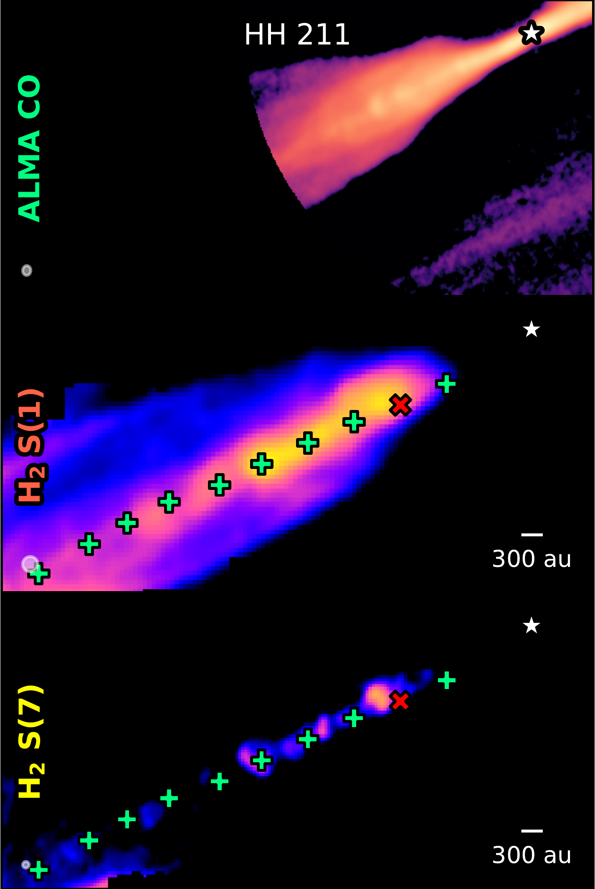
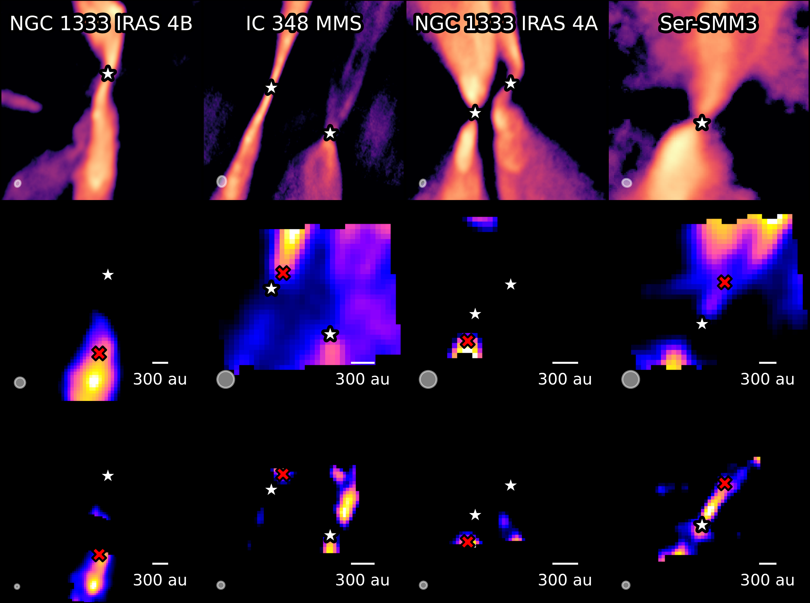
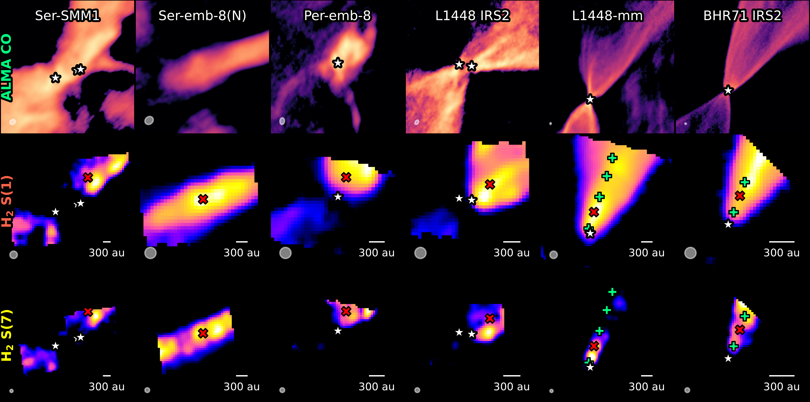
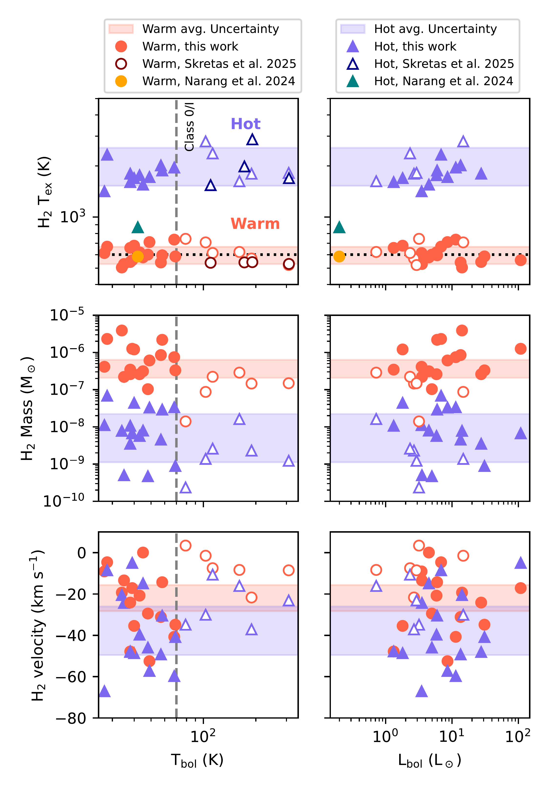
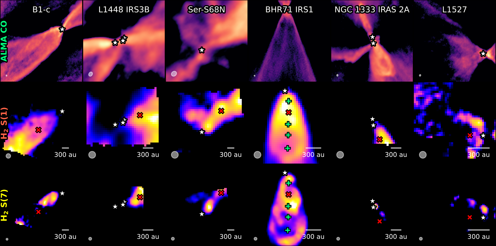
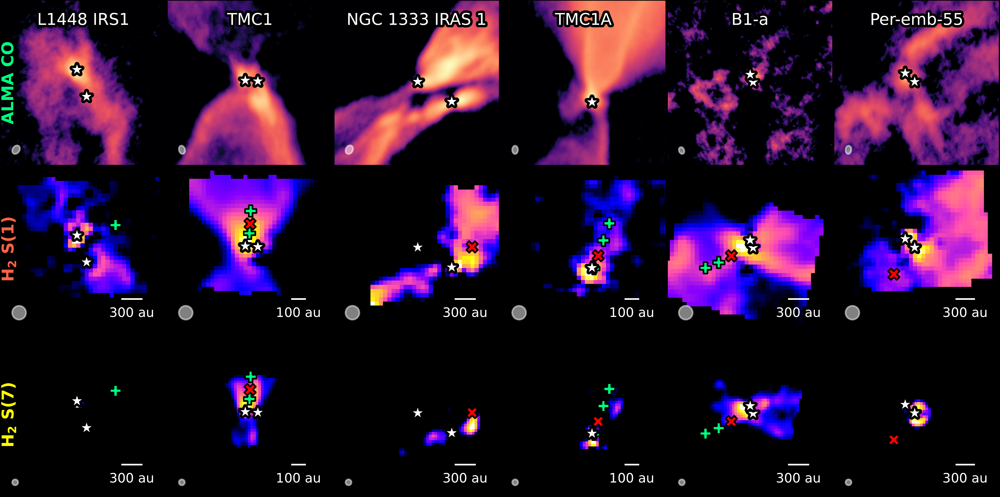

$\newcommand{\ensuremath}{}$
$\newcommand{\xspace}{}$
$\newcommand{\object}[1]{\texttt{#1}}$
$\newcommand{\farcs}{{.}''}$
$\newcommand{\farcm}{{.}'}$
$\newcommand{\arcsec}{''}$
$\newcommand{\arcmin}{'}$
$\newcommand{\ion}[2]{#1#2}$
$\newcommand{\textsc}[1]{\textrm{#1}}$
$\newcommand{\hl}[1]{\textrm{#1}}$
$\newcommand{\footnote}[1]{}$

# JOYS$+$: A JWST/MIRI survey of the evolution of $H_2$ winds and jets from low-mass protostars

<mark>Appeared on: 2026-04-16</mark> -  _18 Pages, 12 figures. Accepted for publication in Astronomy & Astrophysics_

L. Francis, et al. -- incl., <mark>C. Gieser</mark>, <mark>H. Beuther</mark>, <mark>T. Henning</mark>

**Abstract:** The base of protostellar outflows can display both wide-angle, low velocity winds and high-velocity, collimated jets, the magnetocentrifugal launching of which enables accretion onto the protostar. In outflows from the youngest protostars, the majority of the ejected or entrained mass is likely molecular $H_2$ . How the $H_2$ outflow evolves as the central protostar grows and the envelope dissipates is important for understanding the nature of launching mechanism and assembly of the nascent protostar. Using JWST MIRI/MRS observations with an unprecedented spatial resolution down to 0.3 $\arcsec$ towards 13 single and 20 multiple Class 0 and I protostars, we aim to investigate the $H_2$ wind and jet morphology, mass outflow rate, velocity and temperature structure, and the evolution of these properties with protostellar Class. We construct continuum-subtracted maps of the $H_2$ S(1) and S(7) line flux and velocity towards the outflows in our sample, and additionally ALMA sub-mm CO maps. Towards the base of each blue-shifted outflow lobe (typically within 300 au), we extract representative spectra and measure the outflow opening angles from the $H_2$ S(1) line emission. Rotation diagram fitting of the $H_2$ lines is used to determine the column density and temperature, which is combined with measurements of the outflow width and $H_2$ line velocity to measure the mass-loss rates. Low- $J$ ( $J\le4$ ) transitions of $H_2$ largely trace an extended wide-angle, low-velocity (0-20 km s $^{-1}$ ) wind $** s**$ within the contours of the low-velocity ( $< 30$ km s $^{-1}$ ) sub-mm CO emission, while high- $J$ ( $J >5$ ) transitions are associated with shocks and knots. In Class 0 sources with a known high-velocity ( $> 30$ km s $^{-1}$ ) molecular CO or SiO jet, higher $H_2$ velocities are observed along the jet axis. The opening angle of the wind traced by the $H_2$ S(1) line broadens from $\sim20^\circ$ to $\sim90^\circ$ through the Class 0 to Class I stage. The rotation diagrams in the blue-shifted outflow lobes show a clear separation between a warm $\sim 600$ K, and hot, 1500-3000 K component, with no clear sign of evolution in the excitation temperature. The warm component contains two orders of magnitude more mass than the hot component, and the $H_2$ outflow mass-loss rate declines by two orders of magnitude from the Class 0 to Class II stage. A correlation with the bolometric luminosity of the driving source is observed. A factor of 10-1000 mismatch between the warm $H_2$ and cold sub-mm CO outflow rate and momentum flux is also seen, consistent with the presence of cold and likely entrained ( $<150$ K) molecular $H_2$ that can not be detected with JWST/MIRI. The declining warm $H_2$ mass loss rates and increasing opening angles from the Class 0 to I stages, and the absence of $H_2$ jets in the Class I sources, are consistent with the predictions of MHD disk wind models, however, the relatively constant temperatures of the warm and hot components with evolutionary stage may reflect the typical conditions in the outflow shocks rather than temperature stratification of the wind.

**Figure 9. -** Continuum subtracted line maps of our sample ordered by bolometric temperature. First and fourth rows: CO 3-2 or 2-1 emission integrated from $\pm30$ km s$^{-1}$ of the source velocity. Second and fifth rows: integrated $H_2$ S(1) line emission. Third and sixth rows: integrated $H_2$ S(7) emission. The location of the sub-mm peak tracing the protostar driving the outflow is marked by a white star, while the centre of the aperture used for measuring the outflow properties is marked by a red cross. The position of additional apertures used in select sources for comparison of outflow properties with distance are marked by a green plus. The diameter of the apertures is indicated by the scale bar in the lower right. The JWST MIRI/MRS PSF or ALMA beam size is indicated in the lower left. All maps are shown with a logarithmic scaling from 3 times the RMS noise to the maximum intensity of the map. (*fig:H2_moment0_p1*)

**Figure 4. -** Best-fit excitation temperature of the warm (red circles) and hot (blue triangles) components versus bolometric temperature towards each aperture used for outflow mass-loss measurement in our sample. The shaded regions indicate the average uncertainty on each quantity. The $T_\mathrm{bol}=70$ K boundary between Class 0 and I sources is indicated by the dashed line, and Class I sources are plotted as open symbols. (*fig:h2_properties_tbol_lbol*)

**Figure 10. -** As Figure \ref{fig:H2_moment0_p1}, but for the remainder of our sample. (*fig:H2_moment0_p2*)

