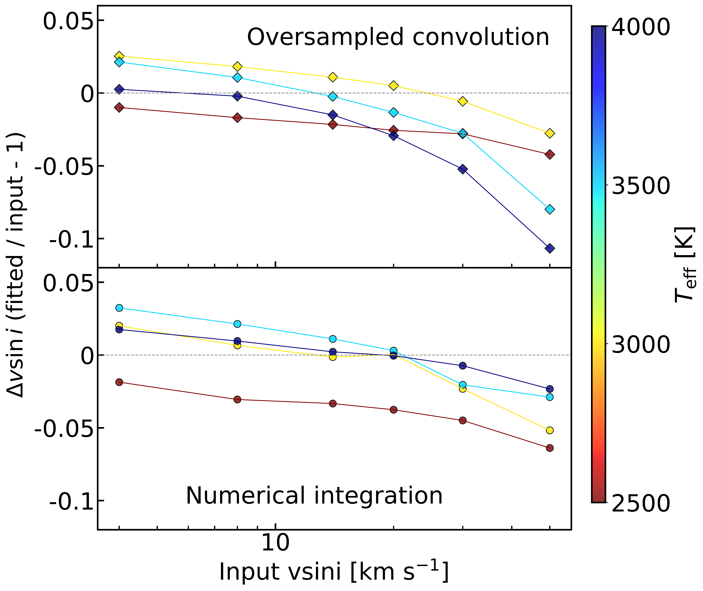
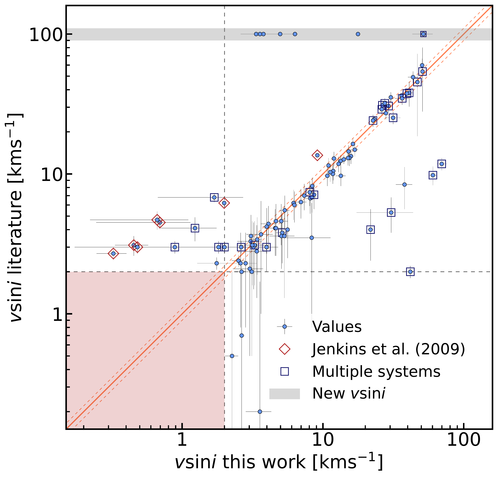
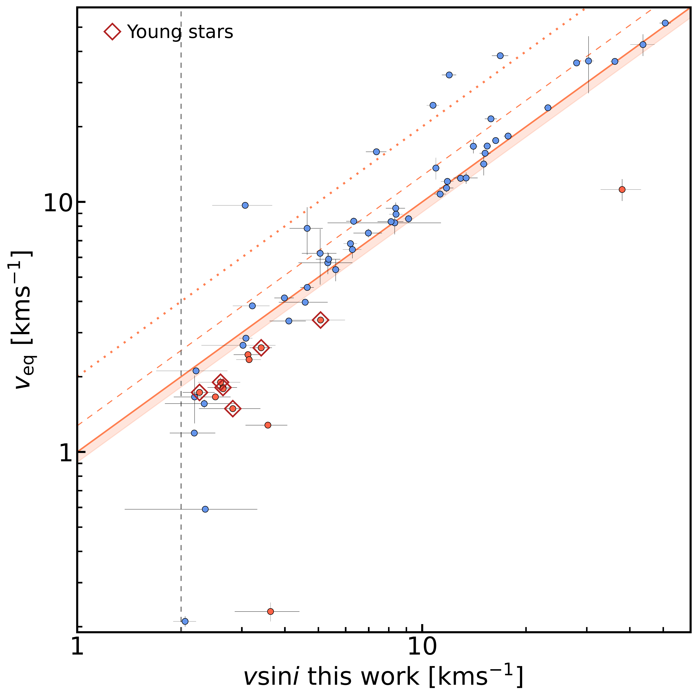

$\newcommand{\ensuremath}{}$
$\newcommand{\xspace}{}$
$\newcommand{\object}[1]{\texttt{#1}}$
$\newcommand{\farcs}{{.}''}$
$\newcommand{\farcm}{{.}'}$
$\newcommand{\arcsec}{''}$
$\newcommand{\arcmin}{'}$
$\newcommand{\ion}[2]{#1#2}$
$\newcommand{\textsc}[1]{\textrm{#1}}$
$\newcommand{\hl}[1]{\textrm{#1}}$
$\newcommand{\footnote}[1]{}$

# The CARMENES search for exoplanets around M dwarfs: A homogeneous catalogue of projected rotational velocities \ accounting for limb-darkening

<mark>Appeared on: 2026-04-20</mark> -  _12 pages, 16 figures, 4 tables. Accepted for publication in A&A_

R. Varas, et al. -- incl., <mark>T. Henning</mark>

**Abstract:** Stellar rotation is closely linked to both age and magnetic activity. Through gyrochronology, it provides a means to estimate stellar ages and trace the evolution of planetary systems, and it is also crucial to constrain and correct stellar activity effects for robust exoplanet detection and characterisation. CARMENES is a dual-channel, high-resolution ( $\mathcal{R} >$ 80000) spectrograph that has been highly successful in detecting exoplanets around M-dwarf stars using the radial-velocity technique, and it also enables precise measurements of the projected rotational velocity ( $v\sin i$ ) from spectral line broadening.   We present an oversampled convolution method incorporating a realistic limb-darkening model to determine $v\sin i$ from CARMENES spectra by comparing observed spectra with that of a template star. The advantages over existing methods in the literature have been assessed using high-resolution synthetic spectra spanning effective temperatures of $2500$ -- $4000$ K and projected rotational velocities of up to $50$ km s $^{-1}$ .   Applied to 392 M dwarfs observed with CARMENES, our method yields $v\sin i$ measurements (or upper limits at $2$ km s $^{-1}$ ) with a median relative uncertainty of 6.8 \% , substantially smaller than the 15.4 \% reported in the literature.   This work provides the largest uniform catalogue of $v\sin i$ measurements for M dwarfs, including significantly updated values for several targets, along with 36 new targets.

**Figure 5. -** Normalized difference between input and fitted $v \sin i$ as a function of input $v \sin i$ and spectra's $T_{\mathrm{eff}}$, for oversampled convolution (top panel) and numerical integration (bottom panel).
 (*fig:vsini_teff*)

**Figure 6. -** $v \sin i$ values obtained in this work using the oversampled convolution method compared with literature measurements. Newly determined $v \sin i$ values not previously available are shown in the shaded area at $v \sin i$(literature) = 100 km s$^{-1}$. The solid line indicates the 1:1 relation, while the dashed lines correspond to a 10 $\%$ deviation. Grey dashed lines and the shaded area mark the 2 km s$^{-1}$ limit of CARMENES. Values inside this region are not plotted.
 (*fig:vsini*)

**Figure 7. -** Values of $v \sin i$ derived from the oversampled convolution method compared to $v_\mathrm{eq}$. The linear 1:$\tfrac{4}{\pi}$ relation (dashed line) represents the expected value of $\sin i$ for an isotropic distribution of inclination angles (see Appendix B of \citeauthor{ruh2024}\citeyear{ruh2024}). The 1:1 relation with a 10 \% margin (solid line and shaded region) and the 1:$\tfrac{1}{2}$ relation (dotted line) correspond to $i = 90^\circ$ and $i=30^\circ$, respectively. The vertical grey dashed line indicates the 2 km s$^{-1}$ threshold, and the diamond markers correspond to young candidates  ([Cort\'es-Contreras, et. al 2024](https://ui.adsabs.harvard.edu/abs/2024A&A...692A.206C)) .
 (*fig:vsini_veq*)

