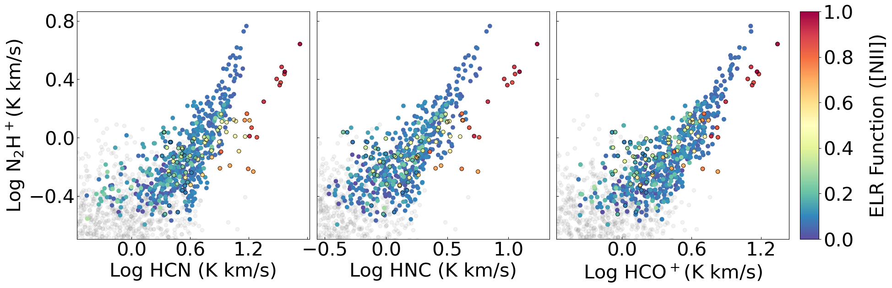
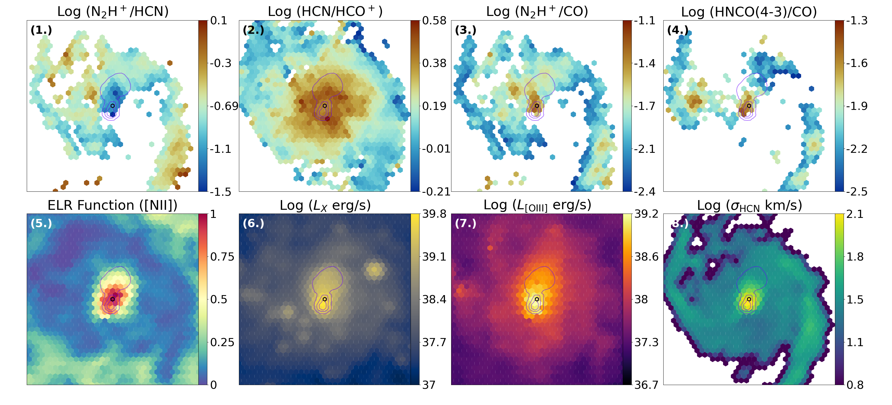
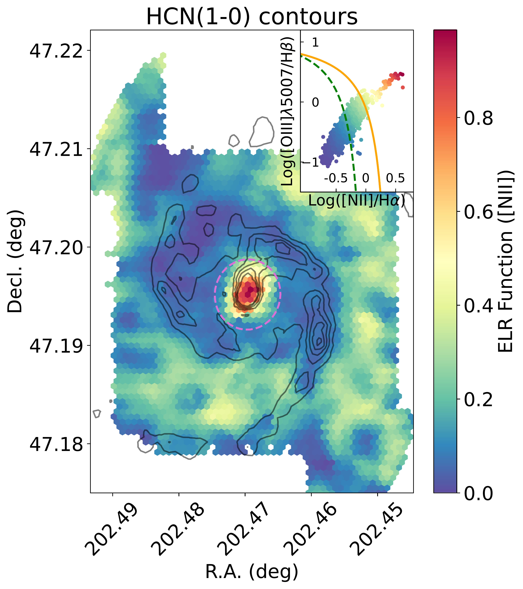

$\newcommand{\ensuremath}{}$
$\newcommand{\xspace}{}$
$\newcommand{\object}[1]{\texttt{#1}}$
$\newcommand{\farcs}{{.}''}$
$\newcommand{\farcm}{{.}'}$
$\newcommand{\arcsec}{''}$
$\newcommand{\arcmin}{'}$
$\newcommand{\ion}[2]{#1#2}$
$\newcommand{\textsc}[1]{\textrm{#1}}$
$\newcommand{\hl}[1]{\textrm{#1}}$
$\newcommand{\footnote}[1]{}$

# Surveying the Whirlpool at Arcseconds with NOEMA (SWAN): IV. Extent of active galactic nucleus feedback on the interstellar medium

<mark>Appeared on: 2026-04-20</mark> -  _16 pages, 9 figures, Accepted for publication in A&A_

M. D. Thorp, et al. -- incl., <mark>E. Schinnerer</mark>

**Abstract:** Active Galactic Nuclei (AGN) are intertwined with galaxy evolution, injecting energy into the interstellar medium (ISM) and possibly regulating star formation as a galaxy evolves. However, the phenomena through which we observe AGN are multiphase and multiscale, which can lead to conflicting results for how significantly and to what extent AGN influence the ISM. M51 is a perfect case study of the boundary between where AGN feedback and star formation feedback dominate the ISM, hosting a low-luminosity type II Seyfert nucleus with a well-defined molecular and ionized outflow. We endeavor to characterize the spatial extent and dominant modes of AGN feedback in M51 utilizing multiple phases of the ISM. Using integral field spectroscopy observations from VENGA of the central 3 kpc, we identified regions dominated by AGN ionization using an emission line ratio (ELR) function. We then combined this information with new observations of the dense molecular ISM in M51 from SWAN, including cloud-scale mapping of HCN(1--0), HNC(1--0), HCO $^+$ (1--0), and $N_2$ H $^+$ (1--0). Both datasets allowed us to achieve $\sim$ 180 pc resolution, allowing for a clear demarcation of where AGN feedback dominates the ISM. We then tested how the ELR compares to other tracers of AGN activity, using both millimeter emission line ratios as well as X-ray observations from Chandra to assess the dominant mode of feedback. If we assume that $N_2$ H $^+$ (1--0) is the best tracer of dense, cold gas in SWAN, then AGN-dominated regions defined by the ELR all have greater emission in (1--0) transitions in HCN, HNC, and HCO $^+$ than would be expected if they traced dense gas alone, implying excitation of these lines from AGN feedback. The ELR is better at selecting these regions compared to molecular tracers of AGN activity, such as HCN(1--0)/HCO $^+$ (1--0), which are heightened for a greater extent in M51. Some of the highest ELR values are also associated with fast shocks evident in the optical, which are concurrent with large  HNCO(4--3)/CO(1--0) values that point to slow shocks near the nucleus. The presence of shocks and heightened $N_2$ H $^+$ (1--0) near the nucleus indicate a potential dense molecular outflow, meaning heightened dense tracer emission could be partly due to larger abundance rather than excitation alone in this region. All tracers of AGN activity point to a "two-stage" feedback scenario, whereby mechanical feedback from the jet-ISM interaction spurs soft X-ray emission that excites molecules such as HCN. Dense gas entrenched in a molecular outflow may also lead to a greater chemical abundance of multiple tracers measured with SWAN, but to a lesser extent than excitation from AGN feedback.

**Figure 5. -** Dense gas relations with $N_2$H$^+$, with alternative dense gas tracers on the $x$ axis, color-coded by the ELR function. Only points with a measurable ELR, which have a S/N greater than three for both lines, are included as colored points. Gray points are the remainder of pixels where the ELR is not measured, and the S/N of one or both emission lines is less than 3. The ELR accurately distinguishes "problem regions" where HCN and HNC no longer function as accurate dense gas tracers. HCO$^+$ is a better dense gas tracer, in agreement with $N_2$H$^+$ up to the most extreme ELR values. Yet even in this case, excluding ELR>0.75 would ensure the most accurate dense gas estimates, assuming $N_2$H$^+$ remains a viable dense gas tracer in the central regions. Pixels within the central 0.5 kpc have a dark border, for spatial reference. (*fig:dense_gas_rel*)

**Figure 8. -** Variety and extent of AGN impact as a function of the chosen indicator. Contours of the 6 cm radio continuum shown for comparison in purple. The pixel that hosts the AGN is circled in black, position provided by [Hagiwara and Edwards (2015)](https://iopscience.iop.org/article/10.1088/0004-637X/815/2/124 https://iopscience.iop.org/article/10.1088/0004-637X/815/2/124/meta). _Top:_(1.) $N_2$H$^+$/HCN ratio, demonstrating where the two dense gas tracers diverge (2.) HCN/HCO$^+$ ratio, traditionally used to distinguish PDRs from XDRs. Generally a ratio value greater than 1 (positive log-scale value) would indicate an XDR, though such values clearly exceed the AGN region here as defined by other indicators. (3.) $N_2$H$^+$/CO, which roughly traces the dense gas fraction, highlighting a potential dense gas outflow near the AGN (4.) HNCO/CO, a shock tracer with large values near the location of the AGN. Within central pixels VENGA resolution struggles to distinguish AGNs from shocks. _Bottom:_(1.) ELR [NII] function, where orange-red points indicate AGN ionization dominates. (2.) X-ray luminosity from _ Chandra_, note the heightened emission both along the radio lobe and particular south of the AGN. (3.) [OIII]5007 luminosity, with a clear ionized outflow extending north along the radio jet. (4.) The width of a Gaussian fit to the HCN emission line, note these values are highest near the AGN and more compact than all other AGN tracers. Future SWAN works will be devoted to investigating this region at higher resolution in more detail. (*fig:extent*)

**Figure 1. -** Map of the ELR [NII] function over the SWAN field of view of M51, with HCN emission line contours shown in black for reference. The BPT diagram used to establish the ELR is shown in the top right, with values ranging from 0-0.25 for star-forming regions as defined by the [Kauffmann, et. al (2003)](https://academic.oup.com/mnras/article-lookup/doi/10.1111/j.1365-2966.2003.07154.x) criteria (dashed green line) and values exceeding 0.5 for AGN regions (above the [Kewley, et. al (2001)](https://iopscience.iop.org/article/10.1086/321545) criteria, orange line). The central 0.5 kpc is shown as a dashed pink line, to demonstrate how simple radial cuts to exclude AGN activity leave out the internal complexity of ionizing sources. (*fig:ELR_BPT*)

