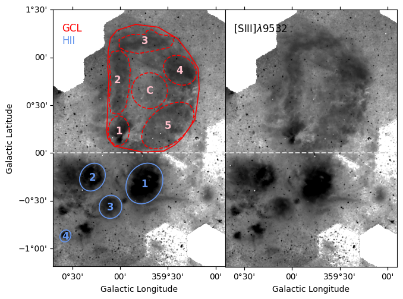
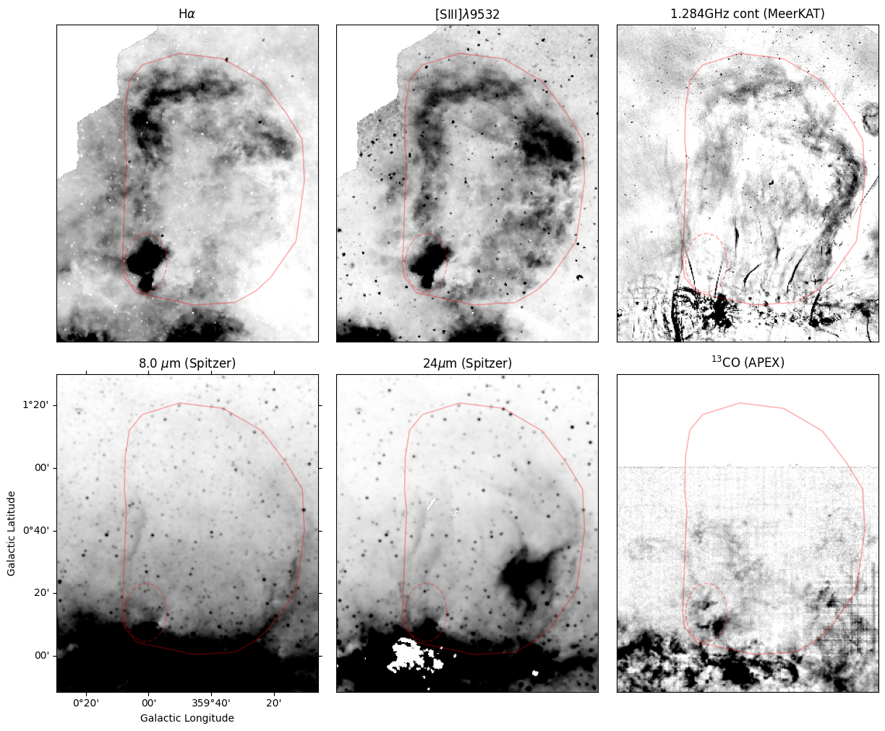
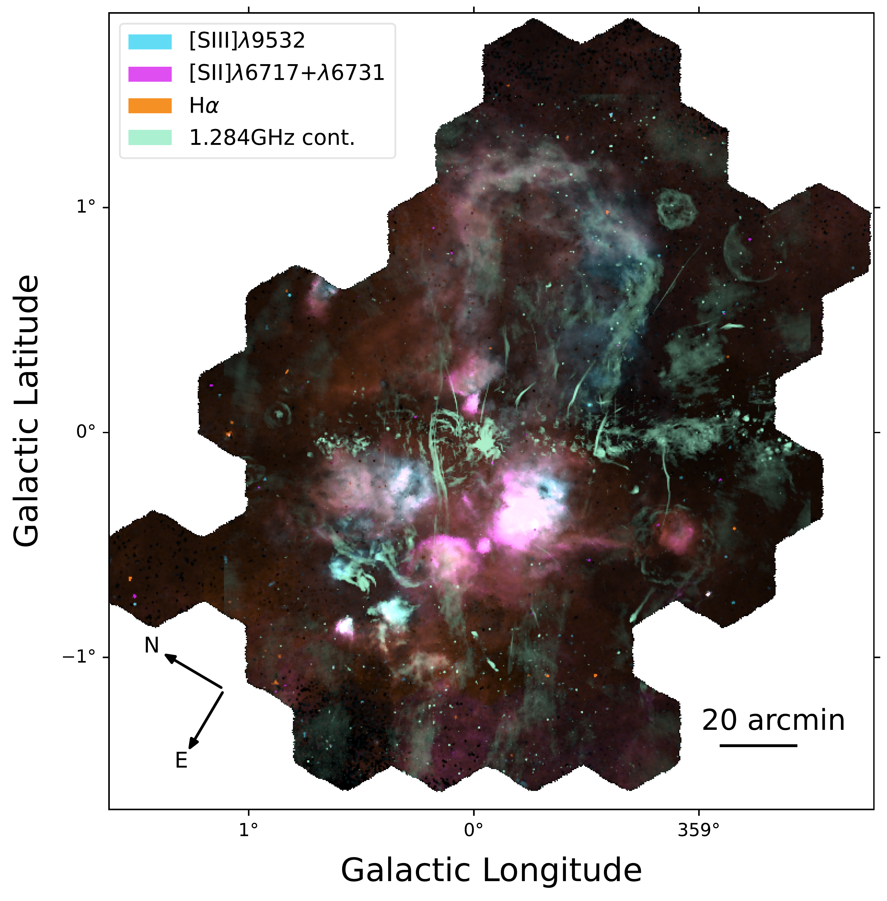

$\newcommand{\ensuremath}{}$
$\newcommand{\xspace}{}$
$\newcommand{\object}[1]{\texttt{#1}}$
$\newcommand{\farcs}{{.}''}$
$\newcommand{\farcm}{{.}'}$
$\newcommand{\arcsec}{''}$
$\newcommand{\arcmin}{'}$
$\newcommand{\ion}[2]{#1#2}$
$\newcommand{\textsc}[1]{\textrm{#1}}$
$\newcommand{\hl}[1]{\textrm{#1}}$
$\newcommand{\footnote}[1]{}$
$\newcommand{\oiii}{[O \textsc{iii}]}$
$\newcommand{\nii}{[N \textsc{ii}]}$
$\newcommand{\sii}{[S \textsc{ii}]}$
$\newcommand{\oi}{[O \textsc{i}]}$
$\newcommand{\niion}{[N \textsc{i}]}$
$\newcommand{\hei}{[He \textsc{i}]}$
$\newcommand{\siii}{[S \textsc{iii}]}$
$\newcommand{\oii}{[O \textsc{ii}]}$
$\newcommand{\neii}{[Ne \textsc{ii}]}$
$\newcommand{\hii}{H \textsc{ii}}$
$\newcommand{\ha}{H\alpha}$
$\newcommand{\hb}{H\beta}$
$\newcommand{\niiauroral}{[N \textsc{ii}]\lambda5755}$
$\newcommand{\doh}{\Delta(O/H)}$
$\newcommand{\sigmaoh}{\sigma(O/H)}$
$\newcommand{\te}{T_{\rm e}}$
$\newcommand{\logten}{log_{10}}$
$\newcommand{\nee}{n_{\rm e}}$
$\newcommand{\kms}{km~s^{-1}}$
$\newcommand{\HD}{\label{HD} Astronomisches Rechen-Institut, Zentrum für Astronomie der Universität Heidelberg, Mönchhofstra\ss e 12-14, D-69120 Heidelberg, Germany}$
$\newcommand{\UT}{\label{UT} McDonald Observatory, The University of Texas at Austin, 1 University Station, Austin, TX 78712-0259, USA}$
$\newcommand{\Carnegie}{\label{Carnegie} Observatories of the Carnegie Institution for Science, 813 Santa Barbara Street, Pasadena, CA 91101, USA}$
$\newcommand{\UChile}{\label{UChile} Departamento de Astronomía, Universidad de Chile, Camino del Observatorio 1515, Las Condes, Santiago, Chile}$
$\newcommand{\UNAMCU}{\label{UNAMCU} Universidad Nacional Autónoma de México, Instituto de Astronomía, AP 70-264, CDMX 04510, México}$
$\newcommand{\APO}{\label{APO} Apache Point Observatory and New Mexico State University, P.O. Box 59, Sunspot, NM 88349-0059, USA}$
$\newcommand{\NYUAD}{\label{NYUAD} New York University Abu Dhabi, P.O. Box 129188, Abu Dhabi, UAE}$
$\newcommand{\Utah}{\label{Utah} Department of Physics and Astronomy, University of Utah, 115 S. 1400 E., Salt LakeCity, UT 84112, USA}$
$\newcommand{\UCatolica}{\label{UCatolica} Instituto de Astronomía, Universidad Católica del Norte, Av. Angamos 0610, Antofagasta, Chile}$
$\newcommand{\UDP}{\label{UDP} Instituto de Estudios Astrofísicos, Facultad de Ingeniería y Ciencias, Universidad DiegoPortales, Av. Ejército Libertador 441, Santiago, Chile}$
$\newcommand{\CITA}{\label{CITA} Canadian Institute for Theoretical Astrophysics (CITA), University of Toronto, 60 St George St, Toronto, ON M5S 3H8, Canada}$
$\newcommand{\MPIA}{\label{MPIA} Max-Planck-Institut für Astronomie, Königstuhl 17, D-69117, Heidelberg, Germany}$
$\newcommand{\STScI}{\label{STScI} Space Telescope Science Institute, 3700 San Martin Drive, Baltimore, MD 21218, USA}$
$\newcommand{\UNAME}{\label{UNAME} Universidad Nacional Autónoma de México, Instituto de Astronomía, AP 106, Ensenada22800, BC, México}$
$\newcommand{\IAC}{\label{IAC} Instituto de Astrofí sica de Canarias, La Laguna, Tenerife, E-38200, Spain}$
$\newcommand{\Firenze}{\label{Firenze} Dipartimento di Fisica e Astronomia, Università degli Studi di Firenze, Via G. Sansone 1, 50019, Sesto F.no (Firenze), Italy}$
$\newcommand{\UCNA}{\label{UCNA} Universidad Católica del Norte, Núcleo UCN en Arqueología Galáctica - Inst. de Astronomía, Av. Angamos 0610, Antofagasta, Chile}$
$\newcommand{\UCNB}{\label{UCNB} Universidad Católica del Norte, Departamento de Ingeniería de Sistemas y Computación, Av. Angamos 0610, Antofagasta, Chile}$
$\newcommand{\NYUCASS}{\label{NYUCASS} Center for Astrophysics and Space Science (CASS), New York University Abu Dhabi, P.O. Box 129188, Abu Dhabi, UAE}$
$\newcommand{\LaSerena}{\label{LaSerena} Department of Astronomy, Universidad de La Serena, Av. Raul Bitran \#1302, La Serena, Chile}$
$\newcommand{\NAOC}{\label{NAOC} Chinese Academy of Sciences South America Center for Astronomy, National Astronomical Observatories, CAS, Beijing 100101, China}$
$\newcommand{\SAIMSU}{\label{SAIMSU} Sternberg Astronomical Institute, Moscow State University, Moscow, 119234, Russia}$
$\newcommand{\UCN}{\label{UCN} Instituto de Astronomía, Universidad Católica del Norte, Av. Angamos 0610, Antofagasta, Chile}$
$\newcommand\hyper@linkstart{##1##2 $
$     }$
$\newcommand\hyper@linkstart{##1##2 $
$     }$
$\newcommand\hyper@linkstart{##1##2 $
$     }$
$\newcommand\hyper@linkstart{##1##2 $
$     }$
$\newcommand\natexlab{#1}$

#    SDSS-V LVM: Verifying what, and where, \ the `Galactic Center' Lobe is   

<mark>Appeared on: 2026-04-21</mark> -  _12 pages, accepted in A&A_

<mark>K. Kreckel</mark>, et al. -- incl., <mark>H.-W. Rix</mark>

**Abstract:** The so-called `Galactic Center' Lobe (GCL) is an extended ( $\sim 1^\circ$ ) radio continuum feature situated above the Galactic Plane, for which the literature contains varying claims about both its nature and location.Using new optical integral field spectroscopic observations from the SDSS-V Local Volume Mapper, we confirm the characterization of the GCL as a foreground photoionized $\hii$ region, not associated with the Galactic center. We present a new analysis of the ionized gas morphology, line ratio diagnostics, and kinematics.From our $\siii$ $\lambda$ 9532 emission line map, which suffers the least extinction, we identify ionized gas emission throughout a closed outer loop, which does not fill the GCL interior. All optical line ratio diagnostics are consistent with photoionization. By comparing the ionized gas reddening from the Balmer decrement with 3D dust maps, we directly constrain the distance to the GCL to $\sim$ 2 kpc. $\nii$ $\lambda$ 6583 line kinematics show a uniform velocity structure across the GCL, further confirming that the entire bubble is one structure.The size and emission line morphology is strongly reminiscent of that seen in the nearby Barnard's Loop, providing a possible analog to explain how this outer shell may be photoionized by a more distant and off-center embedded young cluster.We suggest the acronym GCL be repurposed to instead abbreviate the name `Greatly Confused Loop’.

**Figure 8. -** $\sii$i suffers least from extinction, and provides the most complete and accurate view of the morphology of ionized gas in the direction of the Galactic Center. The direct view of the GCL (right) traces out clearly the full structure of the lobe, as annotated and divided into subregions (left).  The `Integrated' full lobe (solid red line) has further been subdivided into components (red dashed lines) labeled GCL-1 to GCL-5, along with a single smaller region directly in the center (GCL-C). Four bright $\hii$ regions (labeled HII-1 to HII-4) are also selected at b$<$0$^{\circ}$(blue lines).  GCL-1 and HII-1 to HII-4 have tentative designations as $\hii$ regions based on nebulosity in photographic plate surveys \citep{Sh2_1959ApJS....4..257S, RCW_1976A&AS...25...25D}. The Galactic Plane is marked with a horizontal grey dashed line.  (*fig:subregions*)

**Figure 10. -** 
    Direct multi-wavelength comparison of GCL morphology between LVM optical line emission from $\ha$ and $\sii$i(top left, center), MeerKAT 1.284 GHz radio continuum (top right), mid-IR dust emission in the PAH dominated 8.0 $\mu$m (bottom left) and thermal dust 24 $\mu$m (bottom center), and $^{13}$CO molecular gas (bottom right). The morphology of the $\sii$i and radio lobe agrees quite well at high galactic latitudes, and is encased in an outer shell of PAH emission, with warm dust still in the region interior. CO clouds are offset, outside the GCL boundary. The GCL is marked in a solid red line, and the compact and bright GCL-1 is also marked in a red dashed line.
     (*fig:morphology*)

**Figure 7. -** The Galactic Center, as seen combining optical ionized gas and radio continuum emission. 1.284 GHz radio continuum emission imaged by MeerKAT \citep[green;][]{Heywood2022} fills the plane, with narrow filaments extending vertically. LVM cannot directly probe the heavily extincted midplane, but bright line emission is apparent above and below, showing a variety of emission line ratios as traced by $\ha$(orange), $\sii$(pink) and $\sii$i(blue).  Clearly this field produces projections of many objects blended along this complicated line-of-sight. For annotation and labeling of the GCL, see Figure \ref{fig:subregions}. (*fig:overview*)

